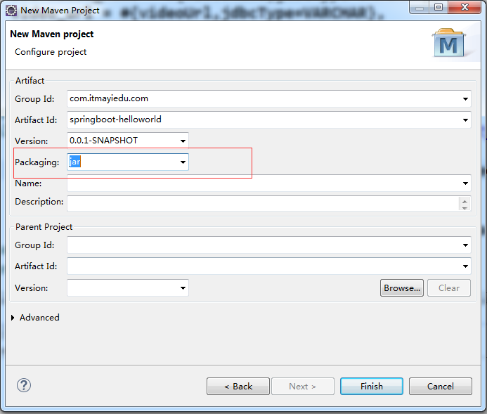
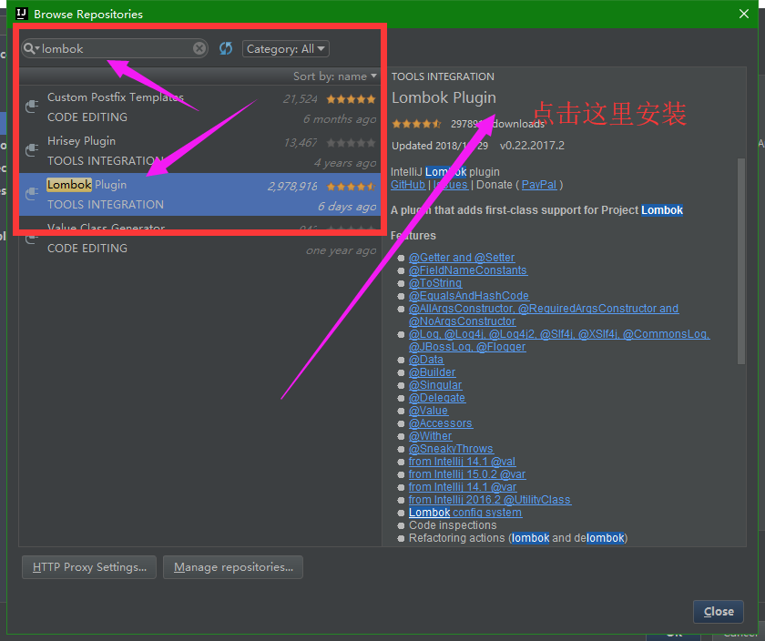

# SpringBoot
## 一、Spring介绍
#### 1.1、SpringBoot简介
>在您第1次接触和学习Spring框架的时候，是否因为其繁杂的配置而退却了？在你第n次使用Spring框架的时候，是否觉得一堆反复黏贴的配置有一些厌烦？那么您就不妨来试试使用Spring Boot来让你更易上手，更简单快捷地构建Spring应用！
Spring Boot让我们的Spring应用变的更轻量化。比如：你可以仅仅依靠一个Java类来运行一个Spring引用。你也可以打包你的应用为jar并通过使用java -jar来运行你的Spring Web应用。
Spring Boot的主要优点：
为所有Spring开发者更快的入门
开箱即用，提供各种默认配置来简化项目配置
内嵌式容器简化Web项目
没有冗余代码生成和XML配置的要求
本章主要目标完成Spring Boot基础项目的构建，并且实现一个简单的Http请求处理，通过这个例子对Spring Boot有一个初步的了解，并体验其结构简单、开发快速的特性。

>SpringBoot 是一个快速开发的框架,能够快速的整合第三方框架，简化XML配置，全部采用注解形式，内置Tomcat容器,帮助开发者能够实现快速开发，SpringBoot的Web组件 默认集成的是SpringMVC框架。
SpringMVC是控制层。


#### 1.2、系统要求：
>Java1.8及以上<br>
Spring Framework 4.1.5及以上<br>
本文采用Java 1.8.0_73、Spring Boot 2.0版本调试通过。<br>

#### 1.3、SpringBoot和SpringMVC区别
>SpringBoot 是一个快速开发的框架,能够快速的整合第三方框架，简化XML配置，全部采用注解形式，内置Tomcat容器,帮助开发者能够实现快速开发，SpringBoot的Web组件 默认集成的是SpringMVC框架。
SpringMVC是控制层。


#### 1.4、SpringBoot和SpringCloud区别
>SpringBoot 是一个快速开发的框架,能够快速的整合第三方框架，简化XML配置，全部采用注解形式，内置Tomcat容器,帮助开发者能够实现快速开发，SpringBoot的Web组件 默认集成的是SpringMVC框架。
SpringMVC是控制层。<br>
SpringCloud依赖与SpringBoot组件，使用SpringMVC编写Http协议接口，同时SpringCloud是一套完整的微服务解决框架。<br>

#### 1.5常见错误
Eclipse 下载SpringBoot2.0以上版本,pom文件报错解决办法<br>
org.apache.maven.archiver.MavenArchiver.getManifest(org.apache.maven.project.MavenProject, org.apache.maven.archiver.MavenArchiveConfiguration)<br>
相关网址: http://bbs.itmayiedu.com/article/1527749194015<br>

## 二、快速入门

#### 2.1、创建一个Maven工程
`名为”springboot-helloworld” 类型为Jar工程项目`

  
#### 2.2、pom文件引入依赖
```xml
    <parent>
		<groupId>org.springframework.boot</groupId>
		<artifactId>spring-boot-starter-parent</artifactId>
		<version>2.0.0.RELEASE</version>
	</parent>
	<dependencies>
		<dependency>
			<groupId>org.springframework.boot</groupId>
			<artifactId>spring-boot-starter-web</artifactId>
		</dependency>
	</dependencies> 
```
`spring-boot-starter-parent作用`
>在pom.xml中引入spring-boot-start-parent,spring官方的解释叫什么stater poms,它可以提供dependency management,也就是说依赖管理，引入以后在申明其它dependency的时候就不需要version了，后面可以看到。

`spring-boot-starter-web作用`
>springweb 核心组件

`spring-boot-maven-plugin作用`
>如果我们要直接Main启动spring，那么以下plugin必须要添加，否则是无法启动的。如果使用maven 的spring-boot:run的话是不需要此配置的。（我在测试的时候，如果不配置下面的plugin也是直接在Main中运行的。）

#### 2.3、编写HelloWorld服务
创建package命名为com.itmayiedu.controller（根据实际情况修改）
创建HelloController类，内容如下

```java
@RestController
@EnableAutoConfiguration
public class HelloController {
	@RequestMapping("/hello")
	public String index() {
		return "Hello World";
	}	
public static void main(String[] args) {
		SpringApplication.run(HelloController.class, args);
	}
}
```
#### 2.4、@RestController
>在上加上RestController 表示修饰该Controller所有的方法返回JSON格式,直接可以编写Restful接口
#### 2.5、@EnableAutoConfiguration
>注解:作用在于让 Spring Boot   根据应用所声明的依赖来对 Spring 框架进行自动配置
这个注解告诉Spring Boot根据添加的jar依赖猜测你想如何配置Spring。由于spring-boot-starter-web添加了Tomcat和Spring MVC，所以auto-configuration将假定你正在开发一个web应用并相应地对Spring进行设置。
#### 2.6 SpringApplication.run(HelloController.class, args);
   标识为启动类
#### 2.7、SpringBoot启动方式1
Springboot默认端口号为8080
```java
@RestController
@EnableAutoConfiguration
public class HelloController {
	@RequestMapping("/hello")
	public String index() {
		return "Hello World";
	}	
public static void main(String[] args) {
		SpringApplication.run(HelloController.class, args);
	}
}
```

`启动主程序，打开浏览器访问http://localhost:8080/index，可以看到页面输出Hello World`

#### 2.8、SpringBoot启动方式2
```java
@ComponentScan(basePackages = "com.itmayiedu.controller")---控制器扫包范围
@ComponentScan(basePackages = "com.itmayiedu.controller")
@EnableAutoConfiguration
public class App {
	public static void main(String[] args) {
		SpringApplication.run(App.class, args);
	}
}
```
#### 2.9、SpringBoot启动方式3
`@SpringBootApplication`

>@SpringBootApplication 被 @Configuration、@EnableAutoConfiguration、@ComponentScan 注解所修饰，换言之 Springboot 提供了统一的注解来替代以上三个注解<br>
扫包范围：在启动类上加上@SpringBootApplication注解,当前包下或者子包下所有的类都可以扫到。


## 三、Web开发
#### 3.1、静态资源访问
>在我们开发Web应用的时候，需要引用大量的js、css、图片等静态资源。<br>
默认配置<br>
Spring Boot默认提供静态资源目录位置需置于classpath下，目录名需符合如下规则：<br>
/static<br>
/public<br>
/resources	<br>
/META-INF/resources<br>
举例：我们可以在src/main/resources/目录下创建static，在该位置放置一个图片文件。启动程序后，尝试访问http://localhost:8080/D.jpg。如能显示图片，配置成功。<br>

#### 3.2、渲染Web页面

>`渲染Web页面`<br>
在之前的示例中，我们都是通过@RestController来处理请求，所以返回的内容为json对象。那么如果需要渲染html页面的时候，要如何实现呢？<br>

>`模板引擎`<br>
在动态HTML实现上Spring Boot依然可以完美胜任，并且提供了多种模板引擎的默认配置支持，所以在推荐的模板引擎下，我们可以很快的上手开发动态网站。<br>
Spring Boot提供了默认配置的模板引擎主要有以下几种：
* Thymeleaf
* FreeMarker
* Velocity
* Groovy
* Mustache
>Spring Boot建议使用这些模板引擎，避免使用JSP，若一定要使用JSP将无法实现Spring Boot的多种特性，具体可见后文：支持JSP的配置<br>
当你使用上述模板引擎中的任何一个，它们默认的模板配置路径为：src/main/resources/templates。当然也可以修改这个路径，具体如何修改，可在后续各模板引擎的配置属性中查询并修改。<br>

#### 3.3、使用Freemarker模板引擎渲染web视图
#### 3.3.1、pom文件引入:
```xml
<!-- 引入freeMarker的依赖包. -->
<dependency>
    <groupId>org.springframework.boot</groupId>
    <artifactId>spring-boot-starter-freemarker</artifactId>
</dependency>
```
#### 3.3.2、后台代码
```
在src/main/resources/创建一个templates文件夹,后缀为*.ftl
	@RequestMapping("/index")
	public String index(Map<String, Object> map) {
	    map.put("name","美丽的天使...");
	   return "index";
}
```

#### 3.3.3、前台代码

```html
<!DOCTYPE html>
<html>
<head lang="en">
<meta charset="UTF-8" />
    <title></title>
</head>
<body>
	  ${name}
</body> 
</html>
```
#### 3.3.4、Freemarker其他用法
```java
@RequestMapping("/freemarkerIndex")
	public String index(Map<String, Object> result) {
		result.put("name", "yushengjun");
		result.put("sex", "0");
		List<String> listResult = new ArrayList<String>();
		listResult.add("zhangsan");
		listResult.add("lisi");
		listResult.add("itmayiedu");
		result.put("listResult", listResult);
		return "index";
	}

<!DOCTYPE html>
<html>
<head lang="en">
<meta charset="UTF-8" />
<title>首页</title>
</head>
<body>
	  ${name}
<#if sex=="1">
            男
      <#elseif sex=="2">
            女
     <#else>
        其他      
	  
	  </#if>	  
	 <#list userlist as user>
	   ${user}
	 </#list>
</body> 
</html>
```

#### 3.3.5、Freemarker配置
新建application.properties文件
```yml
########################################################
###FREEMARKER (FreeMarkerAutoConfiguration)
########################################################
spring.freemarker.allow-request-override=false
spring.freemarker.cache=true
spring.freemarker.check-template-location=true
spring.freemarker.charset=UTF-8
spring.freemarker.content-type=text/html
spring.freemarker.expose-request-attributes=false
spring.freemarker.expose-session-attributes=false
spring.freemarker.expose-spring-macro-helpers=false
#spring.freemarker.prefix=
#spring.freemarker.request-context-attribute=
#spring.freemarker.settings.*=
spring.freemarker.suffix=.ftl
spring.freemarker.template-loader-path=classpath:/templates/
#comma-separated list
#spring.freemarker.view-names= # whitelist of view names that can be resolved
```

#### 3.4、使用JSP渲染Web视图
##### 3.4.1、pom文件引入以下依赖
```xml
    <parent>
		<groupId>org.springframework.boot</groupId>
		<artifactId>spring-boot-starter-parent</artifactId>
		<version>2.0.0.RELEASE</version>
	</parent>
	<dependencies>
		<!-- SpringBoot web 核心组件 -->
		<dependency>
			<groupId>org.springframework.boot</groupId>
			<artifactId>spring-boot-starter-web</artifactId>
		</dependency>
		<dependency>
			<groupId>org.springframework.boot</groupId>
			<artifactId>spring-boot-starter-tomcat</artifactId>
		</dependency>
	<!-- SpringBoot 外部tomcat支持 -->	
	<dependency>
			<groupId>org.apache.tomcat.embed</groupId>
			<artifactId>tomcat-embed-jasper</artifactId>
		</dependency>
	</dependencies>
```

##### 3.4.2、在application.properties创建以下配置
```yml
spring.mvc.view.prefix=/WEB-INF/jsp/
spring.mvc.view.suffix=.jsp
```
##### 3.4.3、后台代码
```java
@Controller
public class IndexController {
	@RequestMapping("/index")
	public String index() {
		return "index";
	}
}
```

>`注意:创建SpringBoot整合JSP，一定要为war类型，否则会找不到页面.`<br>
`不要把JSP页面存放在resources// jsp 不能被访问到`

#### 3.5、全局捕获异常
* @ExceptionHandler 表示拦截异常
    * @ControllerAdvice 是 controller 的一个辅助类，最常用的就是作为全局异常处理的切面类
    * @ControllerAdvice 可以指定扫描范围
    * @ControllerAdvice 约定了几种可行的返回值，如果是直接返回 model 类的话，需要使用 @ResponseBody 进行 json 转换
    * 返回 String，表示跳到某个 view
    * 返回 modelAndView
    * 返回 model + @ResponseBody

```java
@ControllerAdvice
public class GlobalExceptionHandler {
	@ExceptionHandler(RuntimeException.class)
	@ResponseBody
	public Map<String, Object> exceptionHandler() {
		Map<String, Object> map = new HashMap<String, Object>();
		map.put("errorCode", "101");
		map.put("errorMsg", "系統错误!");
		return map;
	}
}
```

## 四、数据访问
#### 4.1、springboot整合使用JdbcTemplate
##### 4.1.1 pom文件引入
```xml
    <parent>
		<groupId>org.springframework.boot</groupId>
		<artifactId>spring-boot-starter-parent</artifactId>
		<version>2.0.0.RELEASE</version>
	</parent>
	<dependencies>
		<!-- jdbcTemplate 依赖 -->
		<dependency>
			<groupId>org.springframework.boot</groupId>
			<artifactId>spring-boot-starter-jdbc</artifactId>
		</dependency>
		<!-- mysql 依赖 -->
		<dependency>
			<groupId>mysql</groupId>
			<artifactId>mysql-connector-java</artifactId>
		</dependency>
		<!-- 测试 -->
		<dependency>
			<groupId>org.springframework.boot</groupId>
			<artifactId>spring-boot-starter-test</artifactId>
			<scope>test</scope>
		</dependency>
		<!-- springboot-web组件 -->
		<dependency>
			<groupId>org.springframework.boot</groupId>
			<artifactId>spring-boot-starter-web</artifactId>
		</dependency>
	</dependencies>
```
##### 4.1.2 application.properties新增配置
```yml
spring.datasource.url=jdbc:mysql://localhost:3306/test
spring.datasource.username=root
spring.datasource.password=root
spring.datasource.driver-class-name=com.mysql.jdbc.Driver
```

##### 4.1.3 UserService类
```java
@Service
public class UserServiceImpl implements UserService {
	@Autowired
	private JdbcTemplate jdbcTemplate;
	public void createUser(String name, Integer age) {
		jdbcTemplate.update("insert into users values(null,?,?);", name, age);
	}
}
```
##### 4.1.4 App类
```java
//@ComponentScan(basePackages = { "com.itmayiedu.controller", "com.itmayiedu.service" })
//@EnableAutoConfiguration
@SpringBootApplication
public class App {
	public static void main(String[] args) {
		SpringApplication.run(App.class, args);
	}

}
```
`注意: spring-boot-starter-parent要在1.5以上`
#### 4.2、springboot整合使用mybatis
##### 4.2.1、pom文件引入
```xml
    <parent>
		<groupId>org.springframework.boot</groupId>
		<artifactId>spring-boot-starter-parent</artifactId>
		<version>2.0.0.RELEASE</version>
	</parent>
	<dependencies>
		<dependency>
			<groupId>org.springframework.boot</groupId>
			<artifactId>spring-boot-starter</artifactId>
		</dependency>
		<!-- 测试 -->
		<dependency>
			<groupId>org.springframework.boot</groupId>
			<artifactId>spring-boot-starter-test</artifactId>
			<scope>test</scope>
		</dependency>
		<dependency>
			<groupId>org.mybatis.spring.boot</groupId>
			<artifactId>mybatis-spring-boot-starter</artifactId>
			<version>1.1.1</version>
		</dependency>
		<!-- mysql 依赖 -->
		<dependency>
			<groupId>mysql</groupId>
			<artifactId>mysql-connector-java</artifactId>
		</dependency>
		<!-- springboot-web组件 -->
		<dependency>
			<groupId>org.springframework.boot</groupId>
			<artifactId>spring-boot-starter-web</artifactId>
		</dependency>
	</dependencies>
```


##### 4.2.2、配置文件引入
```yml
spring.datasource.url=jdbc:mysql://localhost:3306/test
spring.datasource.username=root
spring.datasource.password=root
spring.datasource.driver-class-name=com.mysql.jdbc.Driver
```


##### 4.2.3、Mapper代码
```java
public interface UserMapper {
	@Select("SELECT * FROM USERS WHERE NAME = #{name}")
	User findByName(@Param("name") String name);
	@Insert("INSERT INTO USERS(NAME, AGE) VALUES(#{name}, #{age})")
	int insert(@Param("name") String name, @Param("age") Integer age);
}	
```

##### 4.2.4、启动方式
```java
//@ComponentScan(basePackages = { "com.itmayiedu.controller" })
@MapperScan("com.itmayiedu.mapper")
//@EnableAutoConfiguration
@SpringBootApplication
public class MybatisApp {

	public static void main(String[] args) {
		SpringApplication.run(MybatisApp.class, args);
	}

}
```
##### 4.2.5、Mybatis整合分页插件
`pageHelper`

>PageHelper 是一款好用的开源免费的 Mybatis 第三方物理分页插件<br>
物理分页<br>
支持常见的 12 种数据库。Oracle,MySql,MariaDB,SQLite,DB2,PostgreSQL,SqlServer 等<br>
支持多种分页方式<br>
支持常见的 RowBounds(PageRowBounds)，PageHelper.startPage 方法调用，Mapper 接口参数调用<br>

Maven依赖
```xml
 <parent>
		<groupId>org.springframework.boot</groupId>
		<artifactId>spring-boot-starter-parent</artifactId>
		<version>2.0.0.RELEASE</version>
	</parent>
	<dependencies>
		<dependency>
			<groupId>org.projectlombok</groupId>
			<artifactId>lombok</artifactId>
		</dependency>

		<dependency>
			<groupId>org.springframework.boot</groupId>
			<artifactId>spring-boot-starter</artifactId>
		</dependency>
		<!-- 测试 -->
		<dependency>
			<groupId>org.springframework.boot</groupId>
			<artifactId>spring-boot-starter-test</artifactId>
			<scope>test</scope>
		</dependency>
		<dependency>
			<groupId>org.mybatis.spring.boot</groupId>
			<artifactId>mybatis-spring-boot-starter</artifactId>
			<version>1.1.1</version>
		</dependency>
		<!-- mysql 依赖 -->
		<dependency>
			<groupId>mysql</groupId>
			<artifactId>mysql-connector-java</artifactId>
		</dependency>
		<!-- springboot-web组件 -->
		<dependency>
			<groupId>org.springframework.boot</groupId>
			<artifactId>spring-boot-starter-web</artifactId>
		</dependency>
		<!-- springboot 整合 pagehelper -->
		<dependency>
			<groupId>com.github.pagehelper</groupId>
			<artifactId>pagehelper-spring-boot-starter</artifactId>
			<version>1.2.5</version>
		</dependency>
		<dependency>
			<groupId>org.apache.commons</groupId>
			<artifactId>commons-lang3</artifactId>
			<version>3.7</version>
		</dependency>
	</dependencies>
```

配置文件
```yml
spring.datasource.url=jdbc:mysql://localhost:3306/test
spring.datasource.username=root
spring.datasource.password=root
spring.datasource.driver-class-name=com.mysql.jdbc.Driver

logging.level.com.example.demo.dao=DEBUG
pagehelper.helperDialect=mysql
pagehelper.reasonable=true
pagehelper.supportMethodsArguments=true
pagehelper.params=count=countSql
pagehelper.page-size-zero=true
```

Entity层
```java
@Data
public class User {
	private Integer id;
	private String name;
	private Integer age;
}
```

Mapper层
```java
public interface UserMapper {
	@Select("SELECT * FROM USERS ")
	List<User> findUserList();
}
```

Service层
```java
@Service
public class UserService {
	@Autowired
	private UserMapper userMapper;

	/**
	 * page 当前页数<br>
	 * size 当前展示的数据<br>
	 * 
	 * @param page
	 * @param size
	 * @return
	 */
	public PageInfo<User> findUserList(int page, int size) {
		// 开启分页插件,放在查询语句上面
		PageHelper.startPage(page, size);
		List<User> listUser = userMapper.findUserList();
		// 封装分页之后的数据
		PageInfo<User> pageInfoUser = new PageInfo<User>(listUser);
		return pageInfoUser;
	}

}
```
Controller层

```java
@RestController
public class IndexController {
	@Autowired
	private UserService userService;

	@RequestMapping("/findUserList")
	public PageInfo<User> findUserList(int page, int size) {
		return userService.findUserList(page, size);
	}

}

启动项目
@MapperScan("com.itmayiedu.mapper")
@SpringBootApplication
public class PageHelper {

	public static void main(String[] args) {
		SpringApplication.run(PageHelper.class, args);
	}

}
```

#### 4.3、springboot整合使用springjpa
##### 4.3.1 pom文件引入依赖
```xml
    <parent>
		<groupId>org.springframework.boot</groupId>
		<artifactId>spring-boot-starter-parent</artifactId>
		<version>2.0.0.RELEASE</version>
	</parent>
	<dependencies>
		<dependency>
			<groupId>org.springframework.boot</groupId>
			<artifactId>spring-boot-starter-data-jpa</artifactId>
		</dependency>
		<dependency>
			<groupId>mysql</groupId>
			<artifactId>mysql-connector-java</artifactId>
		</dependency>
		<dependency>
			<groupId>org.springframework.boot</groupId>
			<artifactId>spring-boot-starter-web</artifactId>
		</dependency>
	</dependencies>
```

##### 4.3.2 创建User实体类
```java
@Entity(name = "users")
public class UserEntity {
	@Id
	@GeneratedValue(strategy = GenerationType.IDENTITY)
	private Integer id;
	@Column(name = "name")
	private String name;
	@Column(name = "age")
	private Integer age;
}
```
##### 4.3.3 创建UserDao
```java
public interface UserDao extends JpaRepository<User, Integer> {
}
```

##### 4.3.3 创建IndexController
```java
@RestController
public class IndexController {
	@Autowired
	private UserDao userDao;

	@RequestMapping("/jpaFindUser")
	public Object jpaIndex(User user) {
		Optional<User> userOptional = userDao.findById(user.getId());
		User reusltUser = userOptional.get();
		return reusltUser == null ? "没有查询到数据" : reusltUser;
	}

}
```
##### 4.3.4 启动项目
```java
@SpringBootApplication
public class JpaApp {

	public static void main(String[] args) {
		SpringApplication.run(JpaApp.class, args);
	}
}
```

#### 4.4、springboot整合多数据源
>同学们思考下，你们在项目中有使用到多数据源吗？<br>
原理使用根据包名，加载不同的数据源

##### 4.4.1配置文件中新增两个数据源
```yml
###datasource1
spring.datasource.test1.driver-class-name = com.mysql.jdbc.Driver
spring.datasource.test1.jdbc-url = jdbc:mysql://localhost:3306/test01?useUnicode=true&characterEncoding=utf-8
spring.datasource.test1.username = root
spring.datasource.test1.password = root
###datasource2
spring.datasource.test2.driver-class-name = com.mysql.jdbc.Driver
spring.datasource.test2.jdbc-url = jdbc:mysql://localhost:3306/test02?useUnicode=true&characterEncoding=utf-8
spring.datasource.test2.username = root
spring.datasource.test2.password = root
```

##### 4.4.2配置文件中新增两个数据源
```java
//DataSource01
@Configuration // 注册到springboot容器中
@MapperScan(basePackages = "com.itmayiedu.test01", sqlSessionFactoryRef = "test1SqlSessionFactory")
public class DataSource1Config {

	/**
	 * 
	 * @methodDesc: 功能描述:(配置test1数据库)
	 * @author: bright
	 * @param: @return
	 * @createTime:2017年9月17日 下午3:16:44
	 * @returnType:@return DataSource
	 */
	@Bean(name = "test1DataSource")
	@ConfigurationProperties(prefix = "spring.datasource.test1")
	@Primary
	public DataSource testDataSource() {
		return DataSourceBuilder.create().build();
	}

	/**
	 * 
	 * @methodDesc: 功能描述:(test1 sql会话工厂)
	 * @author: bright
	 * @param: @param
	 *             dataSource
	 * @param: @return
	 * @param: @throws
	 *             Exception
	 * @createTime:2017年9月17日 下午3:17:08
	 * @returnType:@param dataSource
	 * @returnType:@return
	 * @returnType:@throws Exception SqlSessionFactory
	 */
	@Bean(name = "test1SqlSessionFactory")
	@Primary
	public SqlSessionFactory testSqlSessionFactory(@Qualifier("test1DataSource") DataSource dataSource)
			throws Exception {
		SqlSessionFactoryBean bean = new SqlSessionFactoryBean();
		bean.setDataSource(dataSource);
		// bean.setMapperLocations(
		// new
		// PathMatchingResourcePatternResolver().getResources("classpath:mybatis/mapper/test1/*.xml"));
		return bean.getObject();
	}

	/**
	 * 
	 * @methodDesc: 功能描述:(test1 事物管理)
	 * @author: bright
	 * @param: @param
	 *             dataSource
	 * @param: @return
	 * @param: @throws
	 *             Exception
	 * @createTime:2017年9月17日 下午3:17:08
	 * @returnType:@param dataSource
	 * @returnType:@return
	 * @returnType:@throws Exception SqlSessionFactory
	 */
	@Bean(name = "test1TransactionManager")
	@Primary
	public DataSourceTransactionManager testTransactionManager(@Qualifier("test1DataSource") DataSource dataSource) {
		return new DataSourceTransactionManager(dataSource);
	}

	@Bean(name = "test1SqlSessionTemplate")
	@Primary
	public SqlSessionTemplate testSqlSessionTemplate(
			@Qualifier("test1SqlSessionFactory") SqlSessionFactory sqlSessionFactory) throws Exception {
		return new SqlSessionTemplate(sqlSessionFactory);
	}

}


//DataSource2
@Configuration // 注册到springboot容器中
@MapperScan(basePackages = "com.itmayiedu.test02", sqlSessionFactoryRef = "test2SqlSessionFactory")
public class DataSource2Config {

	/**
	 * 
	 * @methodDesc: 功能描述:(配置test2数据库)
	 * @author: bright
	 * @param: @return
	 * @createTime:2017年9月17日 下午3:16:44
	 * @returnType:@return DataSource
	 */
	@Bean(name = "test2DataSource")
	@ConfigurationProperties(prefix = "spring.datasource.test2")
	public DataSource testDataSource() {
		return DataSourceBuilder.create().build();
	}

	/**
	 * 
	 * @methodDesc: 功能描述:(test2 sql会话工厂)
	 * @author: bright
	 * @param: @param
	 *             dataSource
	 * @param: @return
	 * @param: @throws
	 *             Exception
	 * @createTime:2017年9月17日 下午3:17:08
	 * @returnType:@param dataSource
	 * @returnType:@return
	 * @returnType:@throws Exception SqlSessionFactory
	 */
	@Bean(name = "test2SqlSessionFactory")
	public SqlSessionFactory testSqlSessionFactory(@Qualifier("test2DataSource") DataSource dataSource)
			throws Exception {
		SqlSessionFactoryBean bean = new SqlSessionFactoryBean();
		bean.setDataSource(dataSource);
		// bean.setMapperLocations(
		// new
		// PathMatchingResourcePatternResolver().getResources("classpath:mybatis/mapper/test2/*.xml"));
		return bean.getObject();
	}

	/**
	 * 
	 * @methodDesc: 功能描述:(test2 事物管理)
	 * @author: bright
	 * @param: @param
	 *             dataSource
	 * @param: @return
	 * @param: @throws
	 *             Exception
	 * @createTime:2017年9月17日 下午3:17:08
	 * @returnType:@param dataSource
	 * @returnType:@return
	 * @returnType:@throws Exception SqlSessionFactory
	 */
	@Bean(name = "test2TransactionManager")
	public DataSourceTransactionManager testTransactionManager(@Qualifier("test2DataSource") DataSource dataSource) {
		return new DataSourceTransactionManager(dataSource);
	}

	@Bean(name = "test2SqlSessionTemplate")
	public SqlSessionTemplate testSqlSessionTemplate(
			@Qualifier("test2SqlSessionFactory") SqlSessionFactory sqlSessionFactory) throws Exception {
		return new SqlSessionTemplate(sqlSessionFactory);
	}

}
```

##### 4.4.2创建分包Mapper 
```java
public interface User1Mapper {
	@Insert("insert into users values(null,#{name},#{age});")
	public int addUser(@Param("name") String name, @Param("age") Integer age);
}
```	
##### 4.4.3 多数据源事务注意事项
>在多数据源的情况下，使用@Transactional注解时，应该指定事务管理者<br>
@Transactional(transactionManager = "test2TransactionManager")
##### 4.4.5启动项目
```java
@SpringBootApplication
@MapperScan(basePackages = { "com.itmayiedu.mapper" })
public class App {
	public static void main(String[] args) {
		SpringApplication.run(App.class, args);
	}
}
```

`No qualifying bean of type [javax.sql.DataSource] is defined: expected single matching bean but found 2: test1DataSource,test2DataSource加上@Primary即可。`


`There was an unexpected error (type=Internal Server Error, status=500).`
`No qualifying bean of type 'org.springframework.transaction.PlatformTransactionManager' available: expected single matching bean but found 2: test1TransactionManager,``test2TransactionManager`

 指定事务管理器


>Springboot1.5的时候 没有默认指向数据源 会报错<br>
Springboot2.0的时候 不报错

## 五、事物管理
##### 5.1.1SpringBoot整合事物管理
 >Springboot默认集成事物,只主要在方法上加上@Transactional即可
##### 5.1.2SpringBoot分布式事物管理
>使用springboot+jta+atomikos 分布式事物管理<br>
Atomikos 是一个为Java平台提供增值服务的并且开源类事务管理器。

##### 5.1.2.1 新增jta-atomikos依赖
```xml
<dependency>
	<groupId>org.springframework.boot</groupId>
	<artifactId>spring-boot-starter-jta-atomikos</artifactId>
</dependency>
```
##### 5.1.2.2新增配置文件信息
#### Mysql 1
```yml
mysql.datasource.test1.url = jdbc:mysql://localhost:3306/test01?useUnicode=true&characterEncoding=utf-8
mysql.datasource.test1.username = root
mysql.datasource.test1.password = root

mysql.datasource.test1.minPoolSize = 3
mysql.datasource.test1.maxPoolSize = 25
mysql.datasource.test1.maxLifetime = 20000
mysql.datasource.test1.borrowConnectionTimeout = 30
mysql.datasource.test1.loginTimeout = 30
mysql.datasource.test1.maintenanceInterval = 60
mysql.datasource.test1.maxIdleTime = 60
```


#### Mysql 2
```yml
mysql.datasource.test2.url =jdbc:mysql://localhost:3306/test02?useUnicode=true&characterEncoding=utf-8
mysql.datasource.test2.username =root
mysql.datasource.test2.password =root

mysql.datasource.test2.minPoolSize = 3
mysql.datasource.test2.maxPoolSize = 25
mysql.datasource.test2.maxLifetime = 20000
mysql.datasource.test2.borrowConnectionTimeout = 30
mysql.datasource.test2.loginTimeout = 30
mysql.datasource.test2.maintenanceInterval = 60
mysql.datasource.test2.maxIdleTime = 60
```

##### 5.1.2.3 读取配置文件信息
```java
@Data
@ConfigurationProperties(prefix = "mysql.datasource.test1")
public class DBConfig1 {

	private String url;
	private String username;
	private String password;
	private int minPoolSize;
	private int maxPoolSize;
	private int maxLifetime;
	private int borrowConnectionTimeout;
	private int loginTimeout;
	private int maintenanceInterval;
	private int maxIdleTime;
	private String testQuery;
}
```
```java
@Data
@ConfigurationProperties(prefix = "mysql.datasource.test2")
public class DBConfig2 {

	private String url;
	private String username;
	private String password;
	private int minPoolSize;
	private int maxPoolSize;
	private int maxLifetime;
	private int borrowConnectionTimeout;
	private int loginTimeout;
	private int maintenanceInterval;
	private int maxIdleTime;
	private String testQuery;
}
```


##### 5.1.2.4 创建多数据源
```java
@Configuration
// basePackages 最好分开配置 如果放在同一个文件夹可能会报错
@MapperScan(basePackages = "com.itmayiedu.test01", sqlSessionTemplateRef = "testSqlSessionTemplate")
public class MyBatisConfig1 {

	// 配置数据源
	@Primary
	@Bean(name = "testDataSource")
	public DataSource testDataSource(DBConfig1 testConfig) throws SQLException {
		MysqlXADataSource mysqlXaDataSource = new MysqlXADataSource();
		mysqlXaDataSource.setUrl(testConfig.getUrl());
		mysqlXaDataSource.setPinGlobalTxToPhysicalConnection(true);
		mysqlXaDataSource.setPassword(testConfig.getPassword());
		mysqlXaDataSource.setUser(testConfig.getUsername());
		mysqlXaDataSource.setPinGlobalTxToPhysicalConnection(true);

		AtomikosDataSourceBean xaDataSource = new AtomikosDataSourceBean();
		xaDataSource.setXaDataSource(mysqlXaDataSource);
		xaDataSource.setUniqueResourceName("testDataSource");

		xaDataSource.setMinPoolSize(testConfig.getMinPoolSize());
		xaDataSource.setMaxPoolSize(testConfig.getMaxPoolSize());
		xaDataSource.setMaxLifetime(testConfig.getMaxLifetime());
		xaDataSource.setBorrowConnectionTimeout(testConfig.getBorrowConnectionTimeout());
		xaDataSource.setLoginTimeout(testConfig.getLoginTimeout());
		xaDataSource.setMaintenanceInterval(testConfig.getMaintenanceInterval());
		xaDataSource.setMaxIdleTime(testConfig.getMaxIdleTime());
		xaDataSource.setTestQuery(testConfig.getTestQuery());
		return xaDataSource;
	}

	@Primary
	@Bean(name = "testSqlSessionFactory")
	public SqlSessionFactory testSqlSessionFactory(@Qualifier("testDataSource") DataSource dataSource)
			throws Exception {
		SqlSessionFactoryBean bean = new SqlSessionFactoryBean();
		bean.setDataSource(dataSource);
		return bean.getObject();
	}

	@Primary
	@Bean(name = "testSqlSessionTemplate")
	public SqlSessionTemplate testSqlSessionTemplate(
			@Qualifier("testSqlSessionFactory") SqlSessionFactory sqlSessionFactory) throws Exception {
		return new SqlSessionTemplate(sqlSessionFactory);
	}
}
```
```java
@Configuration
@MapperScan(basePackages = "com.itmayiedu.test02", sqlSessionTemplateRef = "test2SqlSessionTemplate")
public class MyBatisConfig2 {

	// 配置数据源
	@Bean(name = "test2DataSource")
	public DataSource testDataSource(DBConfig2 testConfig) throws SQLException {
		MysqlXADataSource mysqlXaDataSource = new MysqlXADataSource();
		mysqlXaDataSource.setUrl(testConfig.getUrl());
		mysqlXaDataSource.setPinGlobalTxToPhysicalConnection(true);
		mysqlXaDataSource.setPassword(testConfig.getPassword());
		mysqlXaDataSource.setUser(testConfig.getUsername());
		mysqlXaDataSource.setPinGlobalTxToPhysicalConnection(true);

		AtomikosDataSourceBean xaDataSource = new AtomikosDataSourceBean();
		xaDataSource.setXaDataSource(mysqlXaDataSource);
		xaDataSource.setUniqueResourceName("test2DataSource");

		xaDataSource.setMinPoolSize(testConfig.getMinPoolSize());
		xaDataSource.setMaxPoolSize(testConfig.getMaxPoolSize());
		xaDataSource.setMaxLifetime(testConfig.getMaxLifetime());
		xaDataSource.setBorrowConnectionTimeout(testConfig.getBorrowConnectionTimeout());
		xaDataSource.setLoginTimeout(testConfig.getLoginTimeout());
		xaDataSource.setMaintenanceInterval(testConfig.getMaintenanceInterval());
		xaDataSource.setMaxIdleTime(testConfig.getMaxIdleTime());
		xaDataSource.setTestQuery(testConfig.getTestQuery());
		return xaDataSource;
	}

	@Bean(name = "test2SqlSessionFactory")
	public SqlSessionFactory testSqlSessionFactory(@Qualifier("test2DataSource") DataSource dataSource)
			throws Exception {
		SqlSessionFactoryBean bean = new SqlSessionFactoryBean();
		bean.setDataSource(dataSource);
		return bean.getObject();
	}

	@Bean(name = "test2SqlSessionTemplate")
	public SqlSessionTemplate testSqlSessionTemplate(
			@Qualifier("test2SqlSessionFactory") SqlSessionFactory sqlSessionFactory) throws Exception {
		return new SqlSessionTemplate(sqlSessionFactory);
	}
}
```

##### 5.1.2.4 启动加载配置
`@EnableConfigurationProperties(value = { DBConfig1.class, DBConfig2.class })`


## 六、日志管理
#### 6.1使用log4j记录日志
显示sql语句com.bdqn.dao是包

  
##### 6.1.2新建log4j配置文件
文件名称log4j.properties
```yml
#log4j.rootLogger=CONSOLE,info,error,DEBUG
log4j.rootLogger=info,error,CONSOLE,DEBUG
log4j.appender.CONSOLE=org.apache.log4j.ConsoleAppender     
log4j.appender.CONSOLE.layout=org.apache.log4j.PatternLayout     
log4j.appender.CONSOLE.layout.ConversionPattern=%d{yyyy-MM-dd-HH-mm} [%t] [%c] [%p] - %m%n     
log4j.logger.info=info
log4j.appender.info=org.apache.log4j.DailyRollingFileAppender
log4j.appender.info.layout=org.apache.log4j.PatternLayout     
log4j.appender.info.layout.ConversionPattern=%d{yyyy-MM-dd-HH-mm} [%t] [%c] [%p] - %m%n  
log4j.appender.info.datePattern='.'yyyy-MM-dd
log4j.appender.info.Threshold = info   
log4j.appender.info.append=true   
#log4j.appender.info.File=/home/admin/pms-api-services/logs/info/api_services_info
log4j.appender.info.File=/Users/dddd/Documents/testspace/pms-api-services/logs/info/api_services_info
log4j.logger.error=error  
log4j.appender.error=org.apache.log4j.DailyRollingFileAppender
log4j.appender.error.layout=org.apache.log4j.PatternLayout     
log4j.appender.error.layout.ConversionPattern=%d{yyyy-MM-dd-HH-mm} [%t] [%c] [%p] - %m%n  
log4j.appender.error.datePattern='.'yyyy-MM-dd
log4j.appender.error.Threshold = error   
log4j.appender.error.append=true   
#log4j.appender.error.File=/home/admin/pms-api-services/logs/error/api_services_error
log4j.appender.error.File=/Users/dddd/Documents/testspace/pms-api-services/logs/error/api_services_error
log4j.logger.DEBUG=DEBUG
log4j.appender.DEBUG=org.apache.log4j.DailyRollingFileAppender
log4j.appender.DEBUG.layout=org.apache.log4j.PatternLayout     
log4j.appender.DEBUG.layout.ConversionPattern=%d{yyyy-MM-dd-HH-mm} [%t] [%c] [%p] - %m%n  
log4j.appender.DEBUG.datePattern='.'yyyy-MM-dd
log4j.appender.DEBUG.Threshold = DEBUG   
log4j.appender.DEBUG.append=true   
#log4j.appender.DEBUG.File=/home/admin/pms-api-services/logs/debug/api_services_debug
log4j.appender.DEBUG.File=/Users/dddd/Documents/testspace/pms-api-services/logs/debug/api_services_debug
```

log4j代码
`private static final Logger logger = LoggerFactory.getLogger(IndexController.class);`

Maven依赖
```xml
<parent>
		<groupId>org.springframework.boot</groupId>
		<artifactId>spring-boot-starter-parent</artifactId>
		<version>2.0.0.RELEASE</version>
	</parent>
	<dependencies>
		<!-- SpringBoot 核心组件 -->
		<dependency>
			<groupId>org.springframework.boot</groupId>
			<artifactId>spring-boot-starter-web</artifactId>
		</dependency>
		<dependency>
			<groupId>org.springframework.boot</groupId>
			<artifactId>spring-boot-starter-tomcat</artifactId>
		</dependency>
		<dependency>
			<groupId>org.apache.tomcat.embed</groupId>
			<artifactId>tomcat-embed-jasper</artifactId>
		</dependency>
		<!-- spring boot start -->
		<dependency>
			<groupId>org.springframework.boot</groupId>
			<artifactId>spring-boot-starter</artifactId>
			<exclusions>
				<!-- 排除自带的logback依赖 -->
				<exclusion>
					<groupId>org.springframework.boot</groupId>
					<artifactId>spring-boot-starter-logging</artifactId>
				</exclusion>
			</exclusions>
		</dependency>

		<!-- springboot-log4j -->
		<dependency>
			<groupId>org.springframework.boot</groupId>
			<artifactId>spring-boot-starter-log4j</artifactId>
			<version>1.3.8.RELEASE</version>
		</dependency>
	</dependencies>
```
#### 6.2使用AOP统一处理Web请求日志
##### 6.2.1POM文件新增依赖
```xml
	<dependency>
			<groupId>org.springframework.boot</groupId>
			<artifactId>spring-boot-starter-aop</artifactId>
	</dependency>
```
##### 6.2.2POM文件新增依赖
```java
@Aspect
@Component
public class WebLogAspect {

	private static final Logger logger = LoggerFactory.getLogger(WebLogAspect.class);

	@Pointcut("execution(public * com.itmayiedu.controller.*.*(..))")
	public void webLog() {
	}

	@Before("webLog()")
	public void doBefore(JoinPoint joinPoint) throws Throwable {
		// 接收到请求，记录请求内容
		ServletRequestAttributes attributes = (ServletRequestAttributes) RequestContextHolder.getRequestAttributes();
		HttpServletRequest request = attributes.getRequest();
		// 记录下请求内容
		logger.info("URL : " + request.getRequestURL().toString());
		logger.info("HTTP_METHOD : " + request.getMethod());
		logger.info("IP : " + request.getRemoteAddr());
		Enumeration<String> enu = request.getParameterNames();
		while (enu.hasMoreElements()) {
			String name = (String) enu.nextElement();
			logger.info("name:{},value:{}", name, request.getParameter(name));
		}
	}

	@AfterReturning(returning = "ret", pointcut = "webLog()")
	public void doAfterReturning(Object ret) throws Throwable {
		// 处理完请求，返回内容
		logger.info("RESPONSE : " + ret);
	}
}
```
#### 6.3Spring Boot集成lombok让代码更简洁
##### 6.3.1idea需要安装lombok插件
  


##### 6.3.2添加lombok依赖
<dependency>
	<groupId>org.projectlombok</groupId>
	<artifactId>lombok</artifactId>
</dependency>

##### 6.3.3实体类演示
```java
@Slf4j
@Data
public class UserEntity {
	// @Getter
	// @Setter
	private String userName;
	// @Getter
	// @Setter
	private Integer age;

	@Override
	public String toString() {
		return "UserEntity [userName=" + userName + ", age=" + age + "]";
	}

	public static void main(String[] args) {
		UserEntity userEntity = new UserEntity();
		userEntity.setUserName("zhangsan");
		userEntity.setAge(20);
		System.out.println(userEntity.toString());
		log.info("####我是日志##########");
	}

}
```
##### 6.3.2其他特性
* @Data 标签，生成getter/setter toString()等方法 
* @NonNull : 让你不在担忧并且爱上NullPointerException 
* @CleanUp : 自动资源管理：不用再在finally中添加资源的close方法 
* @Setter/@Getter : 自动生成set和get方法 
* @ToString : 自动生成toString方法 
* @EqualsAndHashcode : 从对象的字段中生成hashCode和equals的实现 
* @NoArgsConstructor/@RequiredArgsConstructor/@AllArgsConstructor 
* 自动生成构造方法 
* @Data : 自动生成set/get方法，toString方法，equals方法，hashCode方法，不带参数的构造方法 
* @Value : 用于注解final类 
* @Builder : 产生复杂的构建器api类
* @SneakyThrows : 异常处理（谨慎使用） 
* @Synchronized : 同步方法安全的转化 
* @Getter(lazy=true) : 
* @Log : 支持各种logger对象，使用时用对应的注解，如：@Log4
`按照插件请参考: http://bbs.itmayiedu.com/article/1527769518449`
## 七、缓存支持
#### 7.1注解配置与EhCache使用
##### 7.1.1 pom文件引入
```xml
<dependency>
<groupId>org.springframework.boot</groupId>
<artifactId>spring-boot-starter-cache</artifactId>
</dependency>
```
#### 7.1.2新建ehcache.xml 文件
```xml
<?xml version="1.0" encoding="UTF-8"?>
<ehcache xmlns:xsi="http://www.w3.org/2001/XMLSchema-instance"
	xsi:noNamespaceSchemaLocation="http://ehcache.org/ehcache.xsd"
	updateCheck="false">
	<diskStore path="java.io.tmpdir/Tmp_EhCache" />

	<!-- 默认配置 -->
	<defaultCache maxElementsInMemory="5000" eternal="false"
		timeToIdleSeconds="120" timeToLiveSeconds="120"
		memoryStoreEvictionPolicy="LRU" overflowToDisk="false" />

	<cache name="baseCache" maxElementsInMemory="10000" maxElementsOnDisk="100000" />

</ehcache>
```

配置信息介绍<br>
> 1.<br>
> 2.       name:缓存名称。<br>
> 3.       maxElementsInMemory：缓存最大个数。<br>
> 4.       eternal:对象是否永久有效，一但设置了，timeout将不起作用。<br>
> 5.       timeToIdleSeconds：设置对象在失效前的允许闲置时间（单位：秒）。仅当eternal=false对象不是永久有效时使用，可选属性，默认值是0，也就是可闲置时间无穷大。<br> 
> 6.       timeToLiveSeconds：设置对象在失效前允许存活时间（单位：秒）。最大时间介于创建时间和失效时间之间。仅当eternal=false对象不是永久有效时使用，默认是0.，也就是对象存活时间无穷大。<br>
> 7.       overflowToDisk：当内存中对象数量达到maxElementsInMemory时，Ehcache将会对象写到磁盘中。<br>
> 8.       diskSpoolBufferSizeMB：这个参数设置DiskStore（磁盘缓存）的缓存区大小。默认是30MB。每个Cache都应该有自己的一个缓冲区。<br>
> 9.       maxElementsOnDisk：硬盘最大缓存个数。<br>
> 10.       diskPersistent：是否缓存虚拟机重启期数据 Whether the disk store persists between restarts of the Virtual Machine. The default value is false.  <br>
> 11.       diskExpiryThreadIntervalSeconds：磁盘失效线程运行时间间隔，默认是120秒。<br>
> 12.       memoryStoreEvictionPolicy：当达到maxElementsInMemory限制时，Ehcache将会根据指定的策略去清理内存。默认策略是LRU（最近最少使用）。你可以设置为FIFO（先进先出）或是LFU（较少使用）
> 13.       clearOnFlush：内存数量最大时是否清除。<br>
> 14.    --> 


##### 7.1.3代码使用Cacheable
```java
@CacheConfig(cacheNames = "baseCache")
public interface UserMapper {
	@Select("select * from users where name=#{name}")
	@Cacheable
	UserEntity findName(@Param("name") String name);
}
```
##### 7.1.4清除缓存
```java
@Autowired
private CacheManager cacheManager;
@RequestMapping("/remoKey")
public void remoKey() {
	cacheManager.getCache("baseCache").clear();
}
```

##### 7.1.5 启动加入缓存
@EnableCaching // 开启缓存注解
使用Redis做集中式缓存
导入依赖：(redis有五种类型(string,set,list,hash,zset))
```xml
<dependency>
<groupId>org.springframework.boot</groupId>
<artifactId>spring-boot-starter-data-redis</artifactId>
</dependency>
<dependency>
    <groupId>commons-lang</groupId>
    <artifactId>commons-lang</artifactId>
    <version>2.6</version>
</dependency>
```
application.properties配置文件:
```yml
spring.redis.database=0
spring.redis.host=localhost
spring.redis.port=6379
spring.redis.password=123456
spring.redis.pool.max-idle=8
spring.redis.pool.min-idle=0
spring.redis.pool.max-active=8
spring.redis.pool.max-wait=1
spring.redis.timeout=5000
```
service层:
```java
package com.bdqn.service;
@Service
public class redisService {
    @Autowired
    private StringRedisTemplate stringRedisTemplate;


    public void setString(String key, String value) {
        this.setObject(key, value, null);
    }

    public void setList(String key, List<String> str) {
        this.setList(key, str);
    }

    public void setString(String key, String value, Long time) {
        this.setObject(key, value, time);
    }

    public void setList(String key, List<String> str, Long time) {
        this.setList(key, str, time);
    }

    public void setObject(String key, Object value, Long time) {
        if (StringUtils.isEmpty(key) || value == null) {
            return;
        }
        //判断类型存放String类型
        if (value instanceof String) {
            String str = (String) value;
            stringRedisTemplate.opsForValue().set(key, str);
            //有效期 TimeUnit.SECONDS为秒
            if (time != null) {
                stringRedisTemplate.opsForValue().set(key, str, time, TimeUnit.SECONDS);
            }
            return;
        }
        //存放list类型
        if (value instanceof List) {
            List<String> list = (List<String>) value;
            for (String s : list) {
                stringRedisTemplate.opsForList().leftPush(key, s);
                //有效期 TimeUnit.SECONDS为秒
                if (time != null) {
                    stringRedisTemplate.opsForList().rightPopAndLeftPush(key, s, time, TimeUnit.SECONDS);
                }
            }
            return;
        }
    }

    public Object getKey(String key) {
        return stringRedisTemplate.opsForValue().get(key);
    }
}
```
Controller层:
```java
package com.bdqn.controller;
@RestController
public class IndexController {
    @Resource
    private redisService redisService;

    @RequestMapping("/index")
    public String stringKey(String key, String value) {
        redisService.setString(key, value);
        return "success";
    }

    @RequestMapping("/getkey")
    public Object getKey(String key) {
        return redisService.getKey(key);
    }

    @RequestMapping("/list")
    public String getList(String key) {
        List<String> list = new ArrayList<String>();
        list.add("123");
        list.add("456");
        redisService.setList(key, list);
        return "success";
    }
}
```

## 八、热部署
#### 8.1 什么是热部署
>所谓的热部署：比如项目的热部署，就是在应用程序在不停止的情况下，实现新的部署
#### 8.2 项目演示案例
```java
@RestController
@Slf4j
public class IndexController {
	@Value("${itmayiedu}")
	private String itmayieduName;

	@RequestMapping("/index")
	public String index() {
		String result = "springboot2.0 V1.0";
		log.info("result:{}", result);
		return result + itmayieduName;
	}

}
```
#### 8.3 热部署原理
>spring-boot-devtools 是一个为开发者服务的一个模块，其中最重要的功能就是自动应用代码更改到最新的App上面去。原理是在发现代码有更改之后，重新启动应用，但是速度比手动停止后再启动还要更快，更快指的不是节省出来的手工操作的时间。  
其深层原理是使用了两个ClassLoader，一个Classloader加载那些不会改变的类（第三方Jar包），另一个ClassLoader加载会更改的类，称为  restart ClassLoader  
,这样在有代码更改的时候，原来的restart ClassLoader 被丢弃，重新创建一个restart ClassLoader，由于需要加载的类相比较少，所以实现了较快的重启时间（5秒以内）  
#### 8.4 Devtools依赖
```xml
		<dependency>
			<groupId>org.springframework.boot</groupId>
			<artifactId>spring-boot-devtools</artifactId>
			<optional>true</optional>
			<scope>true</scope>
		</dependency>
```
#### 8.5 Devtools原理
* 1. devtools会监听classpath下的文件变动，并且会立即重启应用（发生在保存时机），注意：因为其采用的虚拟机机制，该项重启是很快的。  
* 2. devtools可以实现页面热部署（即页面修改后会立即生效，这个可以直接在application.properties文件中配置spring.thymeleaf.cache=false来实现(这里注意不同的模板配置不一样)  


## 九、监控管理
>Actuator监控应用
Actuator是spring boot的一个附加功能,可帮助你在应用程序生产环境时监视和管理应用程序。可以使用HTTP的各种请求来监管,审计,收集应用的运行情况.特别对于微服务管理十分有意义.缺点：没有可视化界面。

Maven依赖
```xml
<parent>
		<groupId>org.springframework.boot</groupId>
		<artifactId>spring-boot-starter-parent</artifactId>
		<version>2.0.0.RELEASE</version>
	</parent>
	<dependencies>
		<dependency>
			<groupId>org.springframework.boot</groupId>
			<artifactId>spring-boot-starter-web</artifactId>
		</dependency>
		<dependency>
			<groupId>org.springframework.boot</groupId>
			<artifactId>spring-boot-starter-actuator</artifactId>
		</dependency>

	</dependencies>
```
Mysql测试依赖信息
```xml
<dependency>
			<groupId>org.mybatis.spring.boot</groupId>
			<artifactId>mybatis-spring-boot-starter</artifactId>
			<version>1.1.1</version>
		</dependency>
		<!-- mysql 依赖 -->
		<dependency>
			<groupId>mysql</groupId>
			<artifactId>mysql-connector-java</artifactId>
		</dependency>
```

YML配置
###通过下面的配置启用所有的监控端点，默认情况下，这些端点是禁用的；
```yml
management:
  endpoints:
    web:
      exposure:
        include: "*"
spring:
  profiles:
    active: prod
  datasource:
    driver-class-name: com.mysql.jdbc.Driver
    url: jdbc:mysql://127.0.0.1:3306/test
    username: root
    password: root
itmayiedu: 
   name: bright
```
  

#### Actuator访问路径
通过actuator/+端点名就可以获取相应的信息。

>路径	作用<br>
/actuator/beans	显示应用程序中所有Spring bean的完整列表。<br>
/actuator/configprops	显示所有配置信息。<br>
/actuator/env	陈列所有的环境变量。<br>
/actuator/mappings	显示所有@RequestMapping的url整理列表。<br>
/actuator/health	显示应用程序运行状况信息 up表示成功 down失败<br>
/actuator/info	查看自定义应用信息<br>

演示案例:
/actuator/info 配置文件新增
info:
  xiyanit: bright
  addres: www.xiyankt.com


#### Admin-UI分布式微服务监控中心
>Admin-UI基于actuator实现能够返回界面展示监控信息
#### Admin-UI-Server 
Maven依赖
```xml
	<parent>
		<groupId>org.springframework.boot</groupId>
		<artifactId>spring-boot-starter-parent</artifactId>
		<version>2.0.0.RELEASE</version>
	</parent>
	<dependencies>
		<dependency>
			<groupId>de.codecentric</groupId>
			<artifactId>spring-boot-admin-starter-server</artifactId>
			<version>2.0.0</version>
		</dependency>
		<dependency>
			<groupId>org.springframework.boot</groupId>
			<artifactId>spring-boot-starter-webflux</artifactId>
		</dependency>
		<!-- Spring Boot Actuator对外暴露应用的监控信息，Jolokia提供使用HTTP接口获取JSON格式 的数据 -->
		<dependency>
			<groupId>org.jolokia</groupId>
			<artifactId>jolokia-core</artifactId>
		</dependency>
		<dependency>
			<groupId>org.springframework.boot</groupId>
			<artifactId>spring-boot-starter-actuator</artifactId>
		</dependency>
		<dependency>
			<groupId>com.googlecode.json-simple</groupId>
			<artifactId>json-simple</artifactId>
			<version>1.1</version>
		</dependency>
	</dependencies>
```
application.yml配置文件
```yml
spring:
  application:
    name: spring-boot-admin-server
```
启动方式
```java
@Configuration
@EnableAutoConfiguration
@EnableAdminServer
public class AdminServerApplication {

	public static void main(String[] args) {
		SpringApplication.run(AdminServerApplication.class, args);
	}
}

```
Admin-UI-Client 
Maven依赖
```xml
	<parent>
		<groupId>org.springframework.boot</groupId>
		<artifactId>spring-boot-starter-parent</artifactId>
		<version>2.0.0.RELEASE</version>
	</parent>
	<dependencies>
		<dependency>
			<groupId>de.codecentric</groupId>
			<artifactId>spring-boot-admin-starter-client</artifactId>
			<version>2.0.0</version>
		</dependency>
		<dependency>
			<groupId>org.springframework.boot</groupId>
			<artifactId>spring-boot-starter-actuator</artifactId>
		</dependency>
		<dependency>
			<groupId>org.jolokia</groupId>
			<artifactId>jolokia-core</artifactId>
		</dependency>
		<dependency>
			<groupId>com.googlecode.json-simple</groupId>
			<artifactId>json-simple</artifactId>
			<version>1.1</version>
		</dependency>
		<dependency>
			<groupId>org.springframework.boot</groupId>
			<artifactId>spring-boot-starter-web</artifactId>
		</dependency>
	</dependencies>
```
YML配置
```yml
spring:
  boot:
    admin:
      client:
        url: http://localhost:8080
server:
  port: 8081
  
management:
  endpoints:
    web:
      exposure:
        include: "*"
  endpoint:
    health:
      show-details: ALWAYS
```
启动类、
```java
@SpringBootApplication
public class AppClinet {

	public static void main(String[] args) {
		SpringApplication.run(AppClinet.class, args);
	}

}
```
  
## 十、性能优化
>组件自动扫描带来的问题
默认情况下，我们会使用 @SpringBootApplication 注解来自动获取应用的配置信息，但这样也会给应用带来一些副作用。使用这个注解后，会触发自动配置（ auto-configuration ）和 组件扫描 （ component scanning ），这跟使用 @Configuration、@EnableAutoConfiguration 和 @ComponentScan 三个注解的作用是一样的。这样做给开发带来方便的同时，也会有三方面的影响：
* 1、会导致项目启动时间变长。当启动一个大的应用程序,或将做大量的集成测试启动应用程序时，影响会特别明显。
* 2、会加载一些不需要的多余的实例（beans）。
* 3、会增加 CPU 消耗。
>针对以上三个情况，我们可以移除 @SpringBootApplication 和 @ComponentScan 两个注解来禁用组件自动扫描，然后在我们需要的 bean 上进行显式配置：
```java
//// 移除 @SpringBootApplication and @ComponentScan, 用 @EnableAutoConfiguration 来替代
//@SpringBootApplication
@Configuration
@EnableAutoConfiguration
public class App01 {

	public static void main(String[] args) {
		SpringApplication.run(App01.class, args);
	}

}
```
`以@SpringBootApplication 启动时间8.56秒`
#### 将Servlet容器变成Undertow
>默认情况下，Spring Boot 使用 Tomcat 来作为内嵌的 Servlet 容器<br>
可以将 Web 服务器切换到 Undertow 来提高应用性能。Undertow 是一个采用 Java 开发的灵活的高性能 Web 服务器，提供包括阻塞和基于 NIO 的非堵塞机制。Undertow 是红帽公司的开源产品，是 Wildfly 默认的 Web 服务器。首先，从依赖信息里移除 Tomcat 配置：<br>
```xml
<dependency>
			<groupId>org.springframework.boot</groupId>
			<artifactId>spring-boot-starter-web</artifactId>
			<exclusions>
				<exclusion>
					<groupId>org.springframework.boot</groupId>
					<artifactId>spring-boot-starter-tomcat</artifactId>
				</exclusion>
			</exclusions>
		</dependency>
```
然后添加 Undertow：
```xml
<dependency>
	<groupId>org.springframework.boot</groupId>
	<artifactId>spring-boot-starter-undertow</artifactId>
</dependency>
```
SpringBoot JVM参数调优<br>
这个根据服务器的内存大小，来设置堆参数。<br>
-Xms :设置Java堆栈的初始化大小<br>
-Xmx :设置最大的java堆大小<br>
实例参数-XX:+PrintGCDetails -Xmx32M -Xms1M<br>
本地项目调优<br>
  

外部运行调优
`java -server -Xms32m -Xmx32m  -jar springboot_v2.jar`

|  服务器名称   | 第一次运行 |第二次运行|第三次运行|平均值|
|  ----  | ----  |----|----|----|
| Tomcat  | 4773 |5194|5334.7|5100|
| Undertow  | 6666 |6373|6451|6496|


## 十一、2.0版本新特性
#### 以Java 8 为基准
Spring Boot 2.0 要求Java 版本必须8以上， Java 6 和 7 不再支持。
#### 内嵌容器包结构调整
>为了支持reactive使用场景，内嵌的容器包结构被重构了的幅度有点大。EmbeddedServletContainer被重命名为WebServer，并且org.springframework.boot.context.embedded 包被重定向到了org.springframework.boot.web.embedded包下。举个例子，如果你要使用TomcatEmbeddedServletContainerFactory回调接口来自定义内嵌Tomcat容器，你现在应该使用TomcatServletWebServerFactory。
#### Servlet-specific 的server properties调整
大量的Servlet专属的server.* properties被移到了server.servlet下：

|  Old property   | New property |
|  ----  | ----  |
| server.context-parameters.*  | server.servlet.context-parameters.* |
|server.context-path	|server.servlet.context-path|
|server.jsp.class-name	|server.servlet.jsp.class-name|
|server.jsp.init-parameters.*	|server.servlet.jsp.init-parameters.*|
|server.jsp.registered	|server.servlet.jsp.registered|
|server.servlet-path	|server.servlet.path|

由此可以看出一些端倪，那就是server不再是只有servlet了，还有其他的要加入。
#### Actuator 默认映射
>ctuator的端点（endpoint）现在默认映射到/application，比如，/info 端点现在就是在/application/info。但你可以使用management.context-path来覆盖此默认值。

#### Spring Loaded不再支持
>由于Spring Loaded项目已被移到了attic了，所以不再支持Spring Loaded了。现在建议你去使用Devtools。Spring Loaded不再支持了。
#### 支持Quartz Scheduler
>Spring Boot 2 针对Quartz调度器提供了支持。你可以加入spring-boot-starter-quartz starter来启用。而且支持基于内存和基于jdbc两种存储。
#### OAuth 2.0 支持
>Spring Security OAuth 项目中的功能将会迁移到Spring Security中。将会OAuth 2.0。
#### 支持Spring WebFlux

>WebFlux 模块的名称是 spring-webflux，名称中的 Flux 来源于 Reactor 中的类 Flux。该模块中包含了对反应式 HTTP、服务器推送事件和 WebSocket 的客户端和服务器端的支持。对于开发人员来说，比较重要的是服务器端的开发，这也是本文的重点。在服务器端，WebFlux 支持两种不同的编程模型：第一种是 Spring MVC 中使用的基于 Java 注解的方式；第二种是基于 Java 8 的 lambda 表达式的函数式编程模型。这两种编程模型只是在代码编写方式上存在不同。它们运行在同样的反应式底层架构之上，因此在运行时是相同的。WebFlux 需要底层提供运行时的支持，WebFlux 可以运行在支持 Servlet 3.1 非阻塞 IO API 的 Servlet 容器上，或是其他异步运行时环境，如 Netty 和 Undertow。
#### 版本要求
###### Jetty
要求Jetty最低版本为9.4。

###### Tomcat
要求Tomcat最低版本为8.5。

###### Hibernate
要求Hibernate最低版本为5.2。

###### Gradle
要求Gradle最低版本为3.4。

###### SendGrid
SendGrid最低支持版本是3.2。为了支持这次升级，username和password已经被干掉了。因为API key现在是唯一支持的认证方式。


## 十二、其他内容
#### 12.1、使用@Scheduled创建定时任务
在Spring Boot的主类中加入@EnableScheduling注解，启用定时任务的配置
```java
@Component
public class ScheduledTasks {
    private static final SimpleDateFormat dateFormat = new SimpleDateFormat("HH:mm:ss");
    @Scheduled(fixedRate = 5000)
    public void reportCurrentTime() {
        System.out.println("现在时间：" + dateFormat.format(new Date()));
    }
}
```

#### 12.2、使用@Async实现异步调用
启动加上@EnableAsync ,需要执行异步方法上加入	@Async
在方法上加上@Async之后 底层使用多线程技术

#### 8.2.1、Maven依赖
```yml
<parent>
		<groupId>org.springframework.boot</groupId>
		<artifactId>spring-boot-starter-parent</artifactId>
		<version>2.0.0.RELEASE</version>
	</parent>
	<dependencies>
		<dependency>
			<groupId>org.springframework.boot</groupId>
			<artifactId>spring-boot-starter-web</artifactId>
		</dependency>
		<dependency>
			<groupId>org.projectlombok</groupId>
			<artifactId>lombok</artifactId>
		</dependency>
	</dependencies>
```
#### 8.2.2、演示代码
```java
@RestController
@Slf4j
public class IndexController {

	@Autowired
	private UserService userService;

	@RequestMapping("/index")
	public String index() {
		log.info("##01##");
		userService.userThread();
		log.info("##04##");
		return "success";
	}

}
```
```java
@Service
@Slf4j
public class UserService {

	@Async // 类似与开启线程执行..
	public void userThread() {
		log.info("##02##");
		try {
			Thread.sleep(5 * 1000);
		} catch (Exception e) {
			// TODO: handle exception
		}
		log.info("##03##");

		// new Thread(new Runnable() {
		// public void run() {
		// log.info("##02##");
		// try {
		// Thread.sleep(5 * 1000);
		// } catch (Exception e) {
		// // TODO: handle exception
		// }
		// log.info("##03##");
		// }
		// }).start();
	}

}

```
```java
@EnableAsync // 开启异步注解
@SpringBootApplication
public class App {

	public static void main(String[] args) {
		SpringApplication.run(App.class, args);
	}

}

```
#### 12.3、自定义参数
配置文件值
`name=bright`
配置文件值
```java
	@Value("${name}")
	private String name;
@ResponseBody
	@RequestMapping("/getValue")
	public String getValue() {
		return name;
	}
```
#### 12.4、多环境配置
```yml
spring.profiles.active=pre

application-dev.properties：开发环境
application-test.properties：测试环境
application-prod.properties：生产环境
application-pre.properties：预生产环境
```
#### 12.5、修改端口号
```yml
server.port=8888 
server.context-path=/itmayiedu
```
#### 12.6、SpringBoot yml 使用
>SpringBoot 默认读取 application.yml|properties<br>
YML 比properties配置文件更加节约 简约（结构）<br>
创建application.yml<br>
```yml
server:
  port:  8090
  context-path: /itmayiedu
```
#### 12.7、SpringBoot整合拦截器
#### 拦截器
创建拦截器
创建模拟登录拦截器，验证请求是否有token参数
```java
@Slf4j
@Component
public class LoginIntercept implements HandlerInterceptor {

	public boolean preHandle(HttpServletRequest request, HttpServletResponse response, Object handler)
			throws Exception {
		log.info("开始拦截登录请求....");
		String token = request.getParameter("token");
		if (StringUtils.isEmpty(token)) {
			response.getWriter().println("not found token");
			return false;
		}
		return true;
	}

}
```
注册拦截器
```java
@Configuration
public class WebAppConfig {
	@Autowired
	private LoginIntercept loginIntercept;

	@Bean
	public WebMvcConfigurer WebMvcConfigurer() {
		return new WebMvcConfigurer() {
			public void addInterceptors(InterceptorRegistry registry) {
				registry.addInterceptor(loginIntercept).addPathPatterns("/*");
			};
		};
	}

}
```
#### 拦截器与过滤器区别
拦截器是AOP( Aspect-Oriented Programming)的一种实现，底层通过动态代理模式完成。
* （1）拦截器是基于java的反射机制的，而过滤器是基于函数回调。
* （2）拦截器不依赖于servlet容器，而过滤器依赖于servlet容器。
* （3）拦截器只能对Controller请求起作用，而过滤器则可以对几乎所有的请求起作用。
* （4）在Controller的生命周期中，拦截器可以多次被调用，而过滤器只能在容器初始化时被调用一次。

过滤器应用场景:设置编码字符、过滤铭感字符<br>
拦截器应用场景:拦截未登陆用户、审计日志（）<br>
#### 12.8、发布打包
Jar类型打包方式
* 1.使用mvn clean  package  打包
* 2.使用java –jar 包名   运行

war类型打包方式
* 1.使用mvn clean  package   打包
* 2.使用java –jar 包名   运行
  
外部Tomcat运行
* 1.使用mvn clean  package 打包
* 2.2.0将war包 放入到tomcat webapps下运行即可。

`注意:springboot2.0内置tomcat8.5.25，建议使用外部Tomcat9.0版本运行即可,否则报错版本不兼容。`


打包常见错误
如果报错没有主清单,在pom文件中新增
第一种方式
```xml
	<build>
		<plugins>
			<plugin>
				<groupId>org.apache.maven.plugins</groupId>
				<artifactId>maven-compiler-plugin</artifactId>
				<configuration>
					<source>1.8</source>
					<target>1.8</target>
				</configuration>
			</plugin>
			<plugin>
				<groupId>org.springframework.boot</groupId>
				<artifactId>spring-boot-maven-plugin</artifactId>
				<configuration>
					<maimClass>com.itmayiedu.app.App</maimClass>
				</configuration>
				<executions>
					<execution>
						<goals>
							<goal>repackage</goal>
						</goals>
					</execution>
				</executions>
			</plugin>
		</plugins>
	</build>
    ```

第二种方式
```xml
<build>
    <plugins>
        <plugin>
            <groupId>org.springframework.boot</groupId>
            <artifactId>spring-boot-maven-plugin</artifactId>
        </plugin>
    </plugins>
</build>
```


`Java jar 执行的时候报错 ' 不是内部或外部命令 说明 jdk环境没有安装`
