#### SpringCloud中文翻译：https://springcloud.cc/spring-cloud-dalston.html

## 网站架构演变过程
#### 传统架构<br>
  >传统的SSH架构，分为三层架构 web控制层、业务逻辑层、数据库访问层。<br>
  传统架构也就是单点应用，就是大家在刚开始初学JavaEE技术的时候SSH架构或者SSM架构，业务没有进行拆分，都写同一个项目工程里面，一般是适合于个人或者是小团队开发。<br>
  这种架构模式，一旦有一个模块导致服务不可用，可能会影响整个项目。<br>

#### 分布式架构<br>
  >分布式架构基于传统架构演变过来，将传统的单体项目以项目模块进行拆分，拆分为会员项目、订单项目、支付项目、优惠券项目等，从而降低耦合度，这种项目架构模式慢慢开始适合于互联网公司规模人数开发。
SOA架构

>SOA架构代表面向与服务架构，俗称服务化，通俗的理解为面向与业务逻辑层开发，将共同的业务逻辑抽取出来形成一个服务，提供给其他服务接口进行调用，服务与服务之间调用使用rpc远程技术。   


#### SOA架构特点:

* 1.SOA架构中通常使用XML方式实现通讯，在高并发情况下XML比较冗余会带来极大的影响，所以最后微服务架构中采用JSON替代xml方式
* 2.SOA架构的底层实现通过WebService和ESB（xml与中间件混合物），Web Service技术是SOA服务化的一种实现方式，WebService底层采用soap协议进行通讯，soap协议就是Http或者是Https通道传输XML数据实现的协议。

#### 微服务架构

#### 微服务架构产生的原因

微服务架构基于SOA架构演变过来的
在传统的WebService架构中有如下问题:
* 1.依赖中心化服务发现机制
* 2.使用Soap通讯协议，通常使用XML格式来序列化通讯数据，xml格式非常喜欢重，比较占宽带传输。
* 3.服务化管理和治理设施不完善

#### 漫谈微服务架构
#### 什么是微服务
>微服务架是从SOA架构演变过来，比SOA架构粒度会更加精细，让专业的人去做专业的事情（专注），目的提高效率，每个服务于服务之间互不影响，微服务架构中，每个服务必须独立部署，互不影响，微服务架构更加体现轻巧、轻量级，是适合于互联网公司敏捷开发。
#### 微服务架构特征

>微服务架构倡导应用程序设计程多个独立、可配置、可运行和可微服务的子服务。
服务与服务通讯协议采用Http协议，使用restful风格API形式来进行通讯，数据交换格式轻量级json格式通讯，整个传输过程中，采用二进制，所以http协议可以跨语言平台，并且可以和其他不同的语言进行相互的通讯，所以很多开放平台都采用http协议接口。

#### 微服务架构如何拆分
* 1.微服务把每一个职责单一功能存放在独立的服务中
* 2.每个服务运行在单独的进程中
* 3.每个服务有自己独立数据库存储、实际上有自己独立的缓存、数据库、消息队列等资源。

#### 微服务架构与SOA架构区别 
* 1.微服务架构基于 SOA架构 演变过来，继承 SOA架构的优点，在微服务架构中去除 SOA 架构中的 ESB 消息总线，采用 http+json（restful）进行传输。
* 2.微服务架构比 SOA 架构粒度会更加精细，让专业的人去做专业的事情（专注），目的提高效率，每个服务于服务之间互不影响，微服务架构中，每个服务必须独立部署，微服务架构更加轻巧，轻量级。
* 3.SOA 架构中可能数据库存储会发生共享，微服务强调独每个服务都是单独数据库，保证每个服务于服务之间互不影响。
* 4.项目体现特征微服务架构比 SOA 架构更加适合与互联网公司敏捷开发、快速迭代版本，因为粒度非常精细。


## SpringCloud微服务框架

#### 为什么选择SpringCloud
>因为SpringCloud出现,对微服务技术提供了非常大的帮助，因为SpringCloud 提供了一套完整的微服务解决方案，不像其他框架只是解决了微服务中某个问题。

>服务治理: 阿里巴巴开源的Dubbo和当当网在其基础上扩展的Dubbox、Eureka、Apache 的Consul等
分布式配置中心: 百度的disconf、Netfix的Archaius、360的QConf、SpringCloud、携程的阿波罗等。
分布式任务:xxl-job、elastic-job、springcloud的task等。
服务跟踪:京东的hyra、springcloud的sleuth等

#### SpringCloud简介

>SpringCloud是基于SpringBoot基础之上开发的微服务框架，SpringCloud是一套目前非常完整的微服务解决方案框架，其内容包含服务治理、注册中心、配置管理、断路器、智能路由、微代理、控制总线、全局锁、分布式会话等。

>SpringCloud包含众多的子项目<br>
SpringCloud config 分布式配置中心<br>
SpringCloud netflix 核心组件<br>
Eureka:服务治理  注册中心<br>
Hystrix:服务保护框架<br>
Ribbon:客户端负载均衡器<br>
Feign：基于ribbon和hystrix的声明式服务调用组件<br>
Zuul: 网关组件,提供智能路由、访问过滤等功能。<br>

  

## 服务治理SpringCloud Eureka


#### 什么是服务治理
>在传统rpc远程调用中，服务与服务依赖关系，管理比较复杂，所以需要使用服务治理，管理服务与服务之间依赖关系，可以实现服务调用、负载均衡、容错等，实现服务发现与注册。
#### 服务注册与发现
?在服务注册与发现中，有一个注册中心，当服务器启动的时候，会把当前自己服务器的信息 比如 服务地址通讯地址等以别名方式注册到注册中心上。<br>
另一方（消费者|服务提供者），以该别名的方式去注册中心上获取到实际的服务通讯地址，让后在实现本地rpc调用远程。<br>
搭建注册中心<br>
常用注册中心框架<br>
注册中心环境搭建<br>
Maven依赖信息  
```xml
<parent>
		<groupId>org.springframework.boot</groupId>
		<artifactId>spring-boot-starter-parent</artifactId>
		<version>2.0.1.RELEASE</version>
	</parent>
	<!-- 管理依赖 -->
	<dependencyManagement>
		<dependencies>
			<dependency>
				<groupId>org.springframework.cloud</groupId>
				<artifactId>spring-cloud-dependencies</artifactId>
				<version>Finchley.M7</version>
				<type>pom</type>
				<scope>import</scope>
			</dependency>
		</dependencies>
	</dependencyManagement>
	<dependencies>
		<!--SpringCloud eureka-server -->
		<dependency>
			<groupId>org.springframework.cloud</groupId>
			<artifactId>spring-cloud-starter-netflix-eureka-server</artifactId>
		</dependency>
 <!-- 一定要加谷歌的依赖而且一定要对于版本不然会一直报错2.0.1.RELEASE必须是14.0.1 -->
		<!-- https://mvnrepository.com/artifact/com.google.guava/guava -->
		<dependency>
			<groupId>com.google.guava</groupId>
			<artifactId>guava</artifactId>
			<version>22.0</version>
		</dependency>
<!-- https://mvnrepository.com/artifact/com.fasterxml.jackson.core/jackson-core -->
		<dependency>
			<groupId>com.fasterxml.jackson.core</groupId>
			<artifactId>jackson-core</artifactId>
			<version>2.8.1</version>
		</dependency>
	</dependencies>
	<!-- 注意： 这里必须要添加， 否者各种依赖有问题 -->
	<repositories>
		<repository>
			<id>spring-milestones</id>
			<name>Spring Milestones</name>
			<url>https://repo.spring.io/libs-milestone</url>
			<snapshots>
				<enabled>false</enabled>
			</snapshots>
		</repository>
	</repositories>
```
application.yml
```yml
###服务端口号
server:
  port: 8100
###eureka 基本信息配置
eureka:
  instance:
    ###注册到eurekaip地址
    hostname: 127.0.0.1
  client:
    serviceUrl:
      defaultZone: http://${eureka.instance.hostname}:${server.port}/eureka/
###因为自己是为注册中心，不需要自己注册自己
    register-with-eureka: false
###因为自己是为注册中心，不需要检索服务
    fetch-registry: false
```
启动Eureka服务
```java
@EnableEurekaServer
@SpringBootApplication
public class AppEureka {

	public static void main(String[] args) {
		SpringApplication.run(AppEureka.class, args);
	}

}
```
`@EnableEurekaServer作用:开启eurekaServer`

  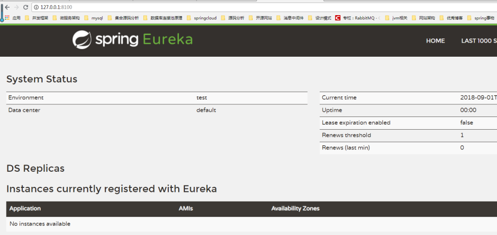
#### 注册服务提供者
`项目案例：实现会员服务（提供者）springcloud-2.0-member调用订单服务(消费者)springcloud-2.0-order` 

Maven依赖信息
```xml
	<parent>
		<groupId>org.springframework.boot</groupId>
		<artifactId>spring-boot-starter-parent</artifactId>
		<version>2.0.1.RELEASE</version>
	</parent>
	<!-- 管理依赖 -->
	<dependencyManagement>
		<dependencies>
			<dependency>
				<groupId>org.springframework.cloud</groupId>
				<artifactId>spring-cloud-dependencies</artifactId>
				<version>Finchley.M7</version>
				<type>pom</type>
				<scope>import</scope>
			</dependency>
		</dependencies>
	</dependencyManagement>
	<dependencies>
		<!-- SpringBoot整合Web组件 -->
		<dependency>
			<groupId>org.springframework.boot</groupId>
			<artifactId>spring-boot-starter-web</artifactId>
		</dependency>
		<!-- SpringBoot整合eureka客户端 -->
		<dependency>
			<groupId>org.springframework.cloud</groupId>
			<artifactId>spring-cloud-starter-netflix-eureka-client</artifactId>
		</dependency>
<!-- 一定要加谷歌的依赖而且一定要对于版本不然会一直报错2.0.1.RELEASE必须是14.0.1 -->
		<!-- https://mvnrepository.com/artifact/com.google.guava/guava -->
		<dependency>
			<groupId>com.google.guava</groupId>
			<artifactId>guava</artifactId>
			<version>22.0</version>
		</dependency>
<!-- https://mvnrepository.com/artifact/com.fasterxml.jackson.core/jackson-core -->
		<dependency>
			<groupId>com.fasterxml.jackson.core</groupId>
			<artifactId>jackson-core</artifactId>
			<version>2.8.1</version>
		</dependency>

	</dependencies>
	<!-- 注意： 这里必须要添加， 否者各种依赖有问题 -->
	<repositories>
		<repository>
			<id>spring-milestones</id>
			<name>Spring Milestones</name>
			<url>https://repo.spring.io/libs-milestone</url>
			<snapshots>
				<enabled>false</enabled>
			</snapshots>
		</repository>
	</repositories>
```
application.yml
```yml
###服务启动端口号
server:
  port: 8000
###服务名称(服务注册到eureka名称)  
spring:
    application:
        name: app-itmayiedu-member
###服务注册到eureka地址
eureka:
  client:
    service-url:
           defaultZone: http://localhost:8100/eureka

           
###因为该应用为注册中心，不会注册自己
    register-with-eureka: true
###是否需要从eureka上获取注册信息
    fetch-registry: true
```


服务接口
```java
@RestController
public class MemberController {

	@RequestMapping("/getMember")
	public String getMember() {
		return "this is getMember";
	}
}
```

启动会员服务
```java
@SpringBootApplication
@EnableEurekaClient
public class AppMember {

	public static void main(String[] args) {
		SpringApplication.run(AppMember.class, args);
	}

}

  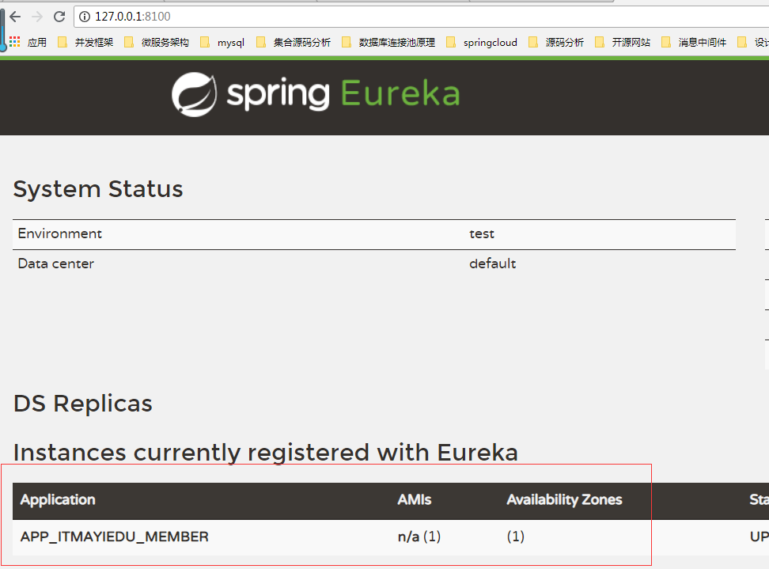

可以看到会员服务成功注册到eureka服务上


#### 服务消费者  

Maven依赖信息
```xml
<parent>
		<groupId>org.springframework.boot</groupId>
		<artifactId>spring-boot-starter-parent</artifactId>
		<version>2.0.1.RELEASE</version>
	</parent>
	<!-- 管理依赖 -->
	<dependencyManagement>
		<dependencies>
			<dependency>
				<groupId>org.springframework.cloud</groupId>
				<artifactId>spring-cloud-dependencies</artifactId>
				<version>Finchley.M7</version>
				<type>pom</type>
				<scope>import</scope>
			</dependency>
		</dependencies>
	</dependencyManagement>
	<dependencies>
		<!-- SpringBoot整合Web组件 -->
		<dependency>
			<groupId>org.springframework.boot</groupId>
			<artifactId>spring-boot-starter-web</artifactId>
		</dependency>
		<!-- SpringBoot整合eureka客户端 -->
		<dependency>
			<groupId>org.springframework.cloud</groupId>
			<artifactId>spring-cloud-starter-netflix-eureka-client</artifactId>
		</dependency>
<!-- 一定要加谷歌的依赖而且一定要对于版本不然会一直报错2.0.1.RELEASE必须是14.0.1 -->
		<!-- https://mvnrepository.com/artifact/com.google.guava/guava -->
		<dependency>
			<groupId>com.google.guava</groupId>
			<artifactId>guava</artifactId>
			<version>22.0</version>
		</dependency>
<!-- https://mvnrepository.com/artifact/com.fasterxml.jackson.core/jackson-core -->
		<dependency>
			<groupId>com.fasterxml.jackson.core</groupId>
			<artifactId>jackson-core</artifactId>
			<version>2.8.1</version>
		</dependency>

	</dependencies>
	<!-- 注意： 这里必须要添加， 否者各种依赖有问题 -->
	<repositories>
		<repository>
			<id>spring-milestones</id>
			<name>Spring Milestones</name>
			<url>https://repo.spring.io/libs-milestone</url>
			<snapshots>
				<enabled>false</enabled>
			</snapshots>
		</repository>
	</repositories>
```
Application.yml配置
```yml
###服务启动端口号
server:
  port: 8001
###服务名称(服务注册到eureka名称)  
spring:
    application:
        name: app-itmayiedu-order
###服务注册到eureka地址
eureka:
  client:
    service-url:
           defaultZone: http://localhost:8100/eureka

           
###因为该应用为注册中心，不会注册自己
    register-with-eureka: true
###是否需要从eureka上获取注册信息
    fetch-registry: true
```
使用rest方式调用服务
```java
@RestController
public class OrderController {
	@Autowired
	private RestTemplate restTemplate;

	@RequestMapping("/getorder")
	public String getOrder() {
		// order 使用rpc 远程调用技术 调用 会员服务
		String memberUrl = "http://app-itmayiedu-member/getMember";
		String result = restTemplate.getForObject(memberUrl, String.class);
		System.out.println("会员服务调用订单服务,result:" + result);
		return result;
	}

}

```

```java
启动消费者服务
@SpringBootApplication
@EnableEurekaClient
public class AppOrder {

	public static void main(String[] args) {
		SpringApplication.run(AppOrder.class, args);
	}

	@Bean
	@LoadBalanced
	RestTemplate restTemplate() {
		return new RestTemplate();
	}

}
```

`@LoadBalanced就能让这个RestTemplate在请求时拥有客户端负载均衡的能力`


#### 高可用注册中心

>在微服务中，注册中心非常核心，可以实现服务治理，如果一旦注册出现故障的时候，可能会导致整个微服务无法访问，在这时候就需要对注册中心实现高可用集群模式。

#### Eureka高可用原理
>默认情况下Eureka是让服务注册中心，不注册自己

```
###因为该应用为注册中心，不会注册自己
    register-with-eureka: true
###不需要去注册中心上检索服务
    fetch-registry: true
```

>Eureka高可用实际上将自己作为服务向其他服务注册中心注册自己，这样就可以形成一组相互注册的服务注册中心，从而实现服务清单的互相同步，达到高可用效果。


#### Eureka集群环境搭建

Eureka01配置
```yml
###服务端口号
server:
  port: 8100
###eureka 基本信息配置
spring: 
 application: 
  name: eureka-server
eureka:
  instance:
    ###注册到eurekaip地址
    hostname: 127.0.0.1
  client:
    serviceUrl:
      defaultZone: http://127.0.0.1:8200/eureka/
###因为自己是为注册中心，不需要自己注册自己
    register-with-eureka: true
###因为自己是为注册中心，不需要检索服务
    fetch-registry: true
```
Eureka02配置
```yml
###服务端口号
server:
  port: 8200
###eureka 基本信息配置
spring: 
 application: 
  name: eureka-server
eureka:
  instance:
    ###注册到eurekaip地址
    hostname: 127.0.0.1
  client:
    serviceUrl:
      defaultZone: http://127.0.0.1:8100/eureka/
###因为自己是为注册中心，不需要自己注册自己
    register-with-eureka: true
###因为自己是为注册中心，不需要检索服务
    fetch-registry: true
```

客户端集成Eureka集群
```yml
server:
  port: 8000
spring:
  application:
    name: app-itmayiedu-member
#eureka:
#  client:
#    service-url:
#      defaultZone: http://localhost:8100/eureka
###集群地址
eureka:
  client:
    service-url:
           defaultZone: http://localhost:8100/eureka,http://localhost:8200/eureka    
    register-with-eureka: true
    fetch-registry: true

```

Maven配置
```xml
	<parent>
		<groupId>org.springframework.boot</groupId>
		<artifactId>spring-boot-starter-parent</artifactId>
		<version>2.0.1.RELEASE</version>
	</parent>
	<!-- 管理依赖 -->
	<dependencyManagement>
		<dependencies>
			<dependency>
				<groupId>org.springframework.cloud</groupId>
				<artifactId>spring-cloud-dependencies</artifactId>
				<version>Finchley.M7</version>
				<type>pom</type>
				<scope>import</scope>
			</dependency>
		</dependencies>
	</dependencyManagement>
	<dependencies>
		<!--SpringCloud eureka-server -->
		<dependency>
			<groupId>org.springframework.cloud</groupId>
			<artifactId>spring-cloud-starter-netflix-eureka-server</artifactId>
		</dependency>
    <!-- 一定要加谷歌的依赖而且一定要对于版本不然会一直报错2.0.1.RELEASE必须是14.0.1 -->
		<!-- https://mvnrepository.com/artifact/com.google.guava/guava -->
		<dependency>
			<groupId>com.google.guava</groupId>
			<artifactId>guava</artifactId>
			<version>22.0</version>
		</dependency>
<!-- https://mvnrepository.com/artifact/com.fasterxml.jackson.core/jackson-core -->
		<dependency>
			<groupId>com.fasterxml.jackson.core</groupId>
			<artifactId>jackson-core</artifactId>
			<version>2.8.1</version>
		</dependency>

	</dependencies>
	<!-- 注意： 这里必须要添加， 否者各种依赖有问题 -->
	<repositories>
		<repository>
			<id>spring-milestones</id>
			<name>Spring Milestones</name>
			<url>https://repo.spring.io/libs-milestone</url>
			<snapshots>
				<enabled>false</enabled>
			</snapshots>
		</repository>
	</repositories>
```
#### Eureka详解

#### 服务消费者模式

#### 获取服务
>消费者启动的时候，使用服务别名，会发送一个rest请求到服务注册中心获取对应的服务信息，让后会缓存到本地jvm客户端中，同时客户端每隔30秒从服务器上更新一次。
可以通过 fetch-inte vall-seconds=30参数进行修以通过eureka.client .registry该参数默认值为30， 单位为秒。


#### 服务下线
    >在系统运行过程中必然会面临关闭或重启服务的某个实例的情况，在服务关闭期有我们自然不希望客户端会继续调用关闭了的实例。所以在客户端程序中，当服务实例过正常的关闭操作时，它会触发一个服务下线的REST请求给Eureka Server, 告诉服务日中心:“我要下线了”。服务端在接收到请求之后，将该服务状态置为下线(DOWN)，井该下线事件传播出去。

#### 服务注册模式
 ###### 失效剔除
 >有些时候，我们的服务实例并不一定会正常下线，可能由于内存溢出、网络故障气因使得服务不能正常工作，而服务注册中心并未收到“服务下线”的请求。为了从服务表中将这些无法提供服务的实例剔除，Eureka Server 在启动的时候会创建一个定时任多默认每隔一一段时间(默认为60秒)将当前清单中超时(默认为90秒)没有续约的服务除出去
  ###### 自我保护
 
>默认情况下,EurekaClient会定时向EurekaServer端发送心跳，如果EurekaServer在一定时间内没有收到EurekaClient发送的心跳，便会把该实例从注册服务列表中剔除（默认是90秒）,但是在短时间内丢失大量的实例心跳，这时候EurekaServer会开启自我保护机制，Eureka不会踢出该服务。

 ###### 产生的原因:

>在开发测试时，需要频繁地重启微服务实例，但是我们很少会把eureka server一起重启（因为在开发过程中不会修改eureka注册中心），当一分钟内收到的心跳数大量减少时，会触发该保护机制。可以在eureka管理界面看到Renews threshold和Renews(last min)，当后者（最后一分钟收到的心跳数）小于前者（心跳阈值）的时候，触发保护机制，会出现红色的警告：

`EMERGENCY!EUREKA MAY BE INCORRECTLY CLAIMING INSTANCES ARE UP WHEN THEY'RE NOT.RENEWALS ARE LESSER THAN THRESHOLD AND HENCE THE INSTANCES ARE NOT BEGING EXPIRED JUST TO BE SAFE.`

>从警告中可以看到，eureka认为虽然收不到实例的心跳，但它认为实例还是健康的，eureka会保护这些实例，不会把它们从注册表中删掉。
该保护机制的目的是避免网络连接故障，在发生网络故障时，微服务和注册中心之间无法正常通信，但服务本身是健康的，不应该注销该服务，如果eureka因网络故障而把微服务误删了，那即使网络恢复了，该微服务也不会重新注册到eureka server了，因为只有在微服务启动的时候才会发起注册请求，后面只会发送心跳和服务列表请求，这样的话，该实例虽然是运行着，但永远不会被其它服务所感知。所以，eureka server在短时间内丢失过多的客户端心跳时，会进入自我保护模式，该模式下，eureka会保护注册表中的信息，不在注销任何微服务，当网络故障恢复后，eureka会自动退出保护模式。自我保护模式可以让集群更加健壮。
但是我们在开发测试阶段，需要频繁地重启发布，如果触发了保护机制，则旧的服务实例没有被删除，这时请求有可能跑到旧的实例中，而该实例已经关闭了，这就导致请求错误，影响开发测试。所以，在开发测试阶段，我们可以把自我保护模式关闭，只需在eureka server配置文件中加上如下配置即可：<br>
>但在生产环境，不会频繁重启，所以，一定要把自我保护机制打开，否则网络一旦终端，就无法恢复。
当然关于自我保护还有很多个性化配置，这里不详细说明。

注意考虑网络不可达情况下：调用接口幂等、重试、补偿等。


#### 关闭服务保护
#### Eureka服务器端配置
```yml
###服务端口号
server:
  port: 8100
##定义服务名称
spring:
  application:
    name: app-itmayiedu-eureka
eureka:
  instance:
    ###注册中心ip地址
    hostname: 127.0.0.1
  client:
    serviceUrl:
    ##注册地址
      defaultZone: http://${eureka.instance.hostname}:8100/eureka/
    ####因为自己是注册中心，是否需要将自己注册给自己的注册中心（集群的时候是需要是为true）
    register-with-eureka: false
    ###因为自己是注册中心， 不需要去检索服务信息
    fetch-registry: false
  server:
    # 测试时关闭自我保护机制，保证不可用服务及时踢出
    enable-self-preservation: false
    eviction-interval-timer-in-ms: 2000
```

核心配置<br>
  server:<br>
    # 测试时关闭自我保护机制，保证不可用服务及时踢出<br>
    enable-self-preservation: false<br>
    ##剔除失效服务间隔<br>
    eviction-interval-timer-in-ms: 2000<br>

Eureka客户端配置
```yml
###订单服务的端口号
server:
  port: 8001
###服务别名----服务注册到注册中心名称 
spring:
  application:
    name: app-itmayiedu-order
eureka:
  client:
    service-url:
    ##### 当前会员服务注册到eureka服务地址
#      defaultZone: http://localhost:8100/eureka,http://localhost:9100/eureka
       defaultZone: http://localhost:8100/eureka
    ### 需要将我的服务注册到eureka上
    register-with-eureka: true
    ####需要检索服务
    fetch-registry: true
    registry-fetch-interval-seconds: 30
# 心跳检测检测与续约时间
# 测试时将值设置设置小些，保证服务关闭后注册中心能及时踢出服务
  instance:
###Eureka客户端向服务端发送心跳的时间间隔，单位为秒（客户端告诉服务端自己会按照该规则）  
    lease-renewal-interval-in-seconds: 1
####Eureka服务端在收到最后一次心跳之后等待的时间上限，单位为秒，超过则剔除（客户端告诉服务端按照此规则等待自己）
    lease-expiration-duration-in-seconds: 2    
```
核心配置

#### 心跳检测检测与续约时间
#### 测试时将值设置设置小些，保证服务关闭后注册中心能及时踢出服务
  instance:<br>
###Eureka客户端向服务端发送心跳的时间间隔，单位为秒（客户端告诉服务端自己会按照该规则）  <br>
    lease-renewal-interval-in-seconds: 1<br>
####Eureka服务端在收到最后一次心跳之后等待的时间上限，单位为秒，超过则剔除（客户端告诉服务端按照此规则等待自己）<br>
    lease-expiration-duration-in-seconds: 2    <br>

#### 使用Eureka闭源了闭源了怎么办？
>Eureka闭源了，可以使用其他的注册代替：Consul、Zookeeper


#### 使用Consul来替换Eureka


#### Consul简介

>Consul 是一套开源的分布式服务发现和配置管理系统，由 HashiCorp 公司用 Go 语言开发。
它具有很多优点。包括： 基于 raft 协议，比较简洁； 支持健康检查, 同时支持 HTTP 和 DNS 协议 支持跨数据中心的 WAN 集群 提供图形界面 跨平台，支持 Linux、Mac、Windows
Consul 整合SpringCloud 学习网站:https://springcloud.cc/spring-cloud-consul.html
Consul下载地址https://www.consul.io/downloads.html
Consul环境搭建
官方下载地址下载window版，解压得到一个可执行文件。 
设置环境变量，让我们直接在cmd里可直接使用consul使命。在path后面添加consul所在目录例如D:\soft\consul_1.1.0_windows_amd64 

Consul客户端

  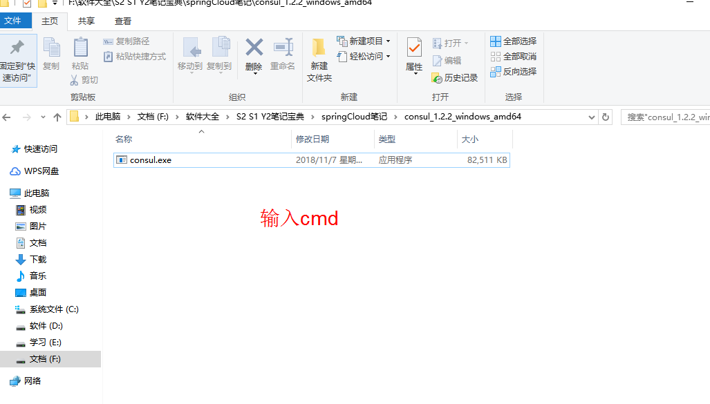

启动consul命令
```
consul agent -dev -ui -node=cy
```
  

测试访问地址:http://localhost:8500 
  

Maven依赖信息(提供者和消费者都是这一个依赖，和zookeeper一样的)
```xml
<parent>
		<groupId>org.springframework.boot</groupId>
		<artifactId>spring-boot-starter-parent</artifactId>
		<version>2.0.1.RELEASE</version>
	</parent>
	<!-- 管理依赖 -->
	<dependencyManagement>
		<dependencies>
			<dependency>
				<groupId>org.springframework.cloud</groupId>
				<artifactId>spring-cloud-dependencies</artifactId>
				<version>Finchley.M7</version>
				<type>pom</type>
				<scope>import</scope>
			</dependency>
		</dependencies>
	</dependencyManagement>
	<dependencies>
		<!-- SpringBoot整合Web组件 -->
		<dependency>
			<groupId>org.springframework.boot</groupId>
			<artifactId>spring-boot-starter-web</artifactId>
		</dependency>
		<!--SpringCloud consul-server -->
		<dependency>
			<groupId>org.springframework.cloud</groupId>
			<artifactId>spring-cloud-starter-consul-discovery</artifactId>
		</dependency>
        <!-- 一定要加谷歌的依赖而且一定要对于版本不然会一直报错2.0.1.RELEASE必须是14.0.1 -->
		<!-- https://mvnrepository.com/artifact/com.google.guava/guava -->
		<dependency>
			<groupId>com.google.guava</groupId>
			<artifactId>guava</artifactId>
			<version>22.0</version>
		</dependency>
<!-- https://mvnrepository.com/artifact/com.fasterxml.jackson.core/jackson-core -->
		<dependency>
			<groupId>com.fasterxml.jackson.core</groupId>
			<artifactId>jackson-core</artifactId>
			<version>2.8.1</version>
		</dependency>
	</dependencies>
	<!-- 注意： 这里必须要添加， 否者各种依赖有问题 -->
	<repositories>
		<repository>
			<id>spring-milestones</id>
			<name>Spring Milestones</name>
			<url>https://repo.spring.io/libs-milestone</url>
			<snapshots>
				<enabled>false</enabled>
			</snapshots>
		</repository>
	</repositories>

```

客户端配置文件（mumber会员提供端）
```yml
###eureka 服务端口号
server:
  port: 8502
spring:
  application:
    name: consul-member
####consul注册中心地址
  cloud:
    consul:
    #consul的地址
      host: 127.0.0.1
      #consul的端口
      port: 8500
      discovery:
        #指定当前项目通过什么端口才能进行访问到,localhost://127.0.0.1:8502/getMember这个才能访问到这个项目,
        #所以要把这个地址带到consul注册中心,方便好调用 ,也可以不指定hostname默认是127.0.0.1
        service-name: service-producer
```

启动之后访问consul

```java
@SpringBootApplication
@EnableDiscoveryClient
public class AppMember {
	public static void main(String[] args) {
		SpringApplication.run(AppMember.class, args);
	}
}
```
  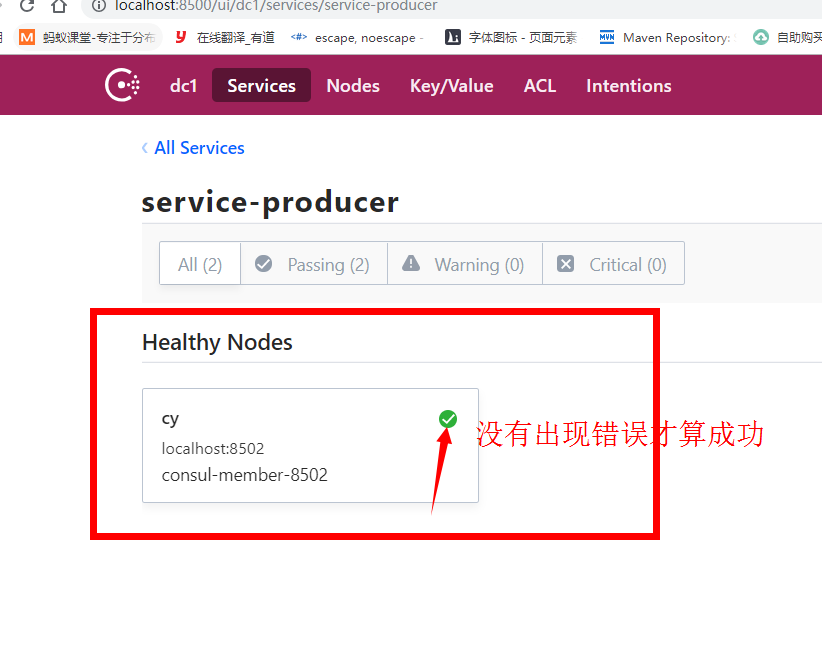

客户端配置文件（order订单消费端）

```yml
###eureka 服务端口号
server:
  port: 8503
spring:
  application:
    name: consul-order
####consul注册中心地址
  cloud:
    consul:
      host: 127.0.0.1
      port: 8500
      discovery:
       #设置不需要注册到 consul 中
        register: false
      
```

DiscoveryClient用法<br>
discoveryClient接口  可以获取注册中心上的实例信息。<br>
@EnableDiscoveryClient 开启其他注册中心 比如consul、zookeeper如果这个订单不需要注测到consul就不需要写EnableDiscoveryClient注解，如果要注入就需要写上<br>
```java
@SpringBootApplication
public class AppMember {
	public static void main(String[] args) {
		SpringApplication.run(AppMember.class, args);
	}
}
```

获取注册中心上信息你可以测试一下（也就是说获取注册中心的服务信息）
```java
@RequestMapping("/getServiceUrl")
	public List<String> getServiceUrl() {
//通过服务名获取服务信息
		List<ServiceInstance> list = discoveryClient.getInstances("zk-member");
		List<String> services = new ArrayList<>();
		for (ServiceInstance serviceInstance : list) {
			if (serviceInstance != null) {
				services.add(serviceInstance.getUri().toString());
			}
		}
		return services;
	}
```
  

###### @EnableDiscoveryClient 与@EnableEurekaClient区别

* 1，@EnableDiscoveryClient注解是基于spring-cloud-commons依赖，并且在classpath中实现； 适合于consul、zookeeper注册中心
* 2，@EnableEurekaClient注解是基于spring-cloud-netflix依赖，只能为eureka作用；

```java
@RestController
public class OrderApiController {

	@Autowired
	private LoadBalancerClient loadBalancerClient;
	@Autowired
	private DiscoveryClient discoveryClient;

	/**
	 * 获取所有服务
	 */
	@RequestMapping("/services")
	public Object services() {
		return discoveryClient.getInstances("service-producer");
	}

	/**
	 * 从所有服务中选择一个服务（轮询）
	 */
	@RequestMapping("/discover")
	public Object discover() {
		return loadBalancerClient.choose("service-producer").getUri().toString();
	}

	@RequestMapping("/call")
	public String call() {
		ServiceInstance serviceInstance = loadBalancerClient.choose("service-producer");
		System.out.println("服务地址：" + serviceInstance.getUri());
		System.out.println("服务名称：" + serviceInstance.getServiceId());

		String callServiceResult = new RestTemplate().getForObject(serviceInstance.getUri().toString() + "/getMember",
				String.class);
		System.out.println(callServiceResult);
		return callServiceResult;
	}
}

```

#### 使用Zookeeper来替换Eureka

 #### Zookeeper简介
>Zookeeper是一个分布式协调工具，可以实现服务注册与发现、注册中心、消息中间件、分布式配置中心等。
 环境搭建<br>
  启动zk服务器端<br>
   
  Maven依赖信息<br>
```xml
	<parent>
		<groupId>org.springframework.boot</groupId>
		<artifactId>spring-boot-starter-parent</artifactId>
		<version>2.0.1.RELEASE</version>
	</parent>
	<!-- 管理依赖 -->
	<dependencyManagement>
		<dependencies>
			<dependency>
				<groupId>org.springframework.cloud</groupId>
				<artifactId>spring-cloud-dependencies</artifactId>
				<version>Finchley.M7</version>
				<type>pom</type>
				<scope>import</scope>
			</dependency>
		</dependencies>
	</dependencyManagement>
	<dependencies>
		<!-- SpringBoot整合Web组件 -->
		<dependency>
			<groupId>org.springframework.boot</groupId>
			<artifactId>spring-boot-starter-web</artifactId>
		</dependency>
		<!-- SpringBoot整合eureka客户端 -->
		<dependency>
			<groupId>org.springframework.cloud</groupId>
			<artifactId>spring-cloud-starter-zookeeper-discovery</artifactId>
		</dependency>
      <!-- 一定要加谷歌的依赖而且一定要对于版本不然会一直报错2.0.1.RELEASE必须是14.0.1 -->
		<!-- https://mvnrepository.com/artifact/com.google.guava/guava -->
		<dependency>
			<groupId>com.google.guava</groupId>
			<artifactId>guava</artifactId>
			<version>22.0</version>
		</dependency>
<!-- https://mvnrepository.com/artifact/com.fasterxml.jackson.core/jackson-core -->
		<dependency>
			<groupId>com.fasterxml.jackson.core</groupId>
			<artifactId>jackson-core</artifactId>
			<version>2.8.1</version>
		</dependency>

	</dependencies>
	<!-- 注意： 这里必须要添加， 否者各种依赖有问题 -->
	<repositories>
		<repository>
			<id>spring-milestones</id>
			<name>Spring Milestones</name>
			<url>https://repo.spring.io/libs-milestone</url>
			<snapshots>
				<enabled>false</enabled>
			</snapshots>
		</repository>
	</repositories>
```


 application.yml
会员配置文件
```yml
###订单服务的端口号
server:
  port: 8002
###服务别名----服务注册到注册中心名称 
spring:
  application:
    name: zk-member
  cloud:
    zookeeper:
      connect-string: 127.0.0.1:2181
```
订单配置文件
```yml
###订单服务的端口号
server:
  port: 8003
###服务别名----服务注册到注册中心名称 
spring:
  application:
    name: zk-order
  cloud:
    zookeeper:
      connect-string: 127.0.0.1:2181
```
加上注解

 
>启动zk-member服务和zk-order服务，可以发现在Zk服务器端上有对应的节点信息

  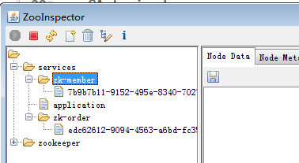

就改下注解，调用方式都使用restTemplate方式调用，负载均衡也是一样的跟eureka一模一样


#### Zookeeper与Eureka区别

>CPA理论:一个分布式系统不可能同时满足C(一致性)、A(可用性)和P(分区容错性)。由于分区容错性在是分布式系统中必须要保证的，因此我们只能在A和C之间进行权衡。在此Zookeeper保证的是CP, 而Eureka则是AP。

## Consistency(一致性), 数据一致更新，所有数据变动都是同步的<br>
Availability(可用性), 好的响应性能<br>
Partition tolerance(分区容忍性) 可靠性<br>


#### Zookeeper是保证CP
>当向注册中心查询服务列表时，我们可以容忍注册中心返回的是几分钟以前的注册信息，但不能接受服务直接down掉不可用。也就是说，服务注册功能对可用性的要求要高于一致性。但是zk会出现这样一种情况，当master节点因为网络故障与其他节点失去联系时，剩余节点会重新进行leader选举。问题在于，选举leader的时间太长，30 ~ 120s, 且选举期间整个zk集群都是不可用的，这就导致在选举期间注册服务瘫痪。在云部署的环境下，因网络问题使得zk集群失去master节点是较大概率会发生的事，虽然服务能够最终恢复，但是漫长的选举时间导致的注册长期不可用是不能容忍的。
#### Eureka是保证AP
>Eureka看明白了这一点，因此在设计时就优先保证可用性。Eureka各个节点都是平等的，几个节点挂掉不会影响正常节点的工作，剩余的节点依然可以提供注册和查询服务。而Eureka的客户端在向某个Eureka注册或时如果发现连接失败，则会自动切换至其它节点，只要有一台Eureka还在，就能保证注册服务可用(保证可用性)，只不过查到的信息可能不是最新的(不保证强一致性)。除此之外，Eureka还有一种自我保护机制，如果在15分钟内超过85%的节点都没有正常的心跳，那么Eureka就认为客户端与注册中心出现了网络故障，此时会出现以下几种情况： 
1. Eureka不再从注册列表中移除因为长时间没收到心跳而应该过期的服务 
2. Eureka仍然能够接受新服务的注册和查询请求，但是不会被同步到其它节点上(即保证当前节点依然可用) 
3. 当网络稳定时，当前实例新的注册信息会被同步到其它节点中
因此， Eureka可以很好的应对因网络故障导致部分节点失去联系的情况，而不会像zookeeper那样使整个注册服务瘫痪。


## 客户端负载均衡器

>在SpringCloud中Ribbon负载均衡客户端，会从eureka注册中心服务器端上获取服务注册信息列表，缓存到本地。
让后在本地实现轮训负载均衡策略。

#### Ribbon与Nginx区别
#### 服务器端负载均衡Nginx
 >nginx是客户端所有请求统一交给nginx，由nginx进行实现负载均衡请求转发，属于服务器端负载均衡。
 既请求有nginx服务器端进行转发。
#### 客户端负载均衡Ribbon
 >Ribbon是从eureka注册中心服务器端上获取服务注册信息列表，缓存到本地，让后在本地实现轮训负载均衡策略。
 既在客户端实现负载均衡。

 #### 应用场景的区别：
>Nginx适合于服务器端实现负载均衡 比如Tomcat ，Ribbon适合与在微服务中RPC远程调用实现本地服务负载均衡，比如Dubbo、SpringCloud中都是采用本地负载均衡。

 #### 使用discoveryClient负载本地负载均衡
```java
@Autowired
	private MemberApifeign memberApifeign;

	@RequestMapping("/feignMember")
	public String feignMember() {
		return memberApifeign.getMember();
	}

	private int requestCount = 1;

	@RequestMapping("/discoveryClient")
	public String discoveryClient() {

		String serviceUrl = getServiceUrl() + "/getMember";
		if (StringUtils.isEmpty(serviceUrl)) {
			return "请求地址为null";
		}
		// 请求地址System.out.println("serviceUrl:" + serv
		iceUrl);
		String result = restTemplate.getForObject(serviceUrl, String.class);
		return result;
	}

	@RequestMapping("/getServiceUrl")
	private String getServiceUrl() {
		List<ServiceInstance> instances = discoveryClient.getInstances("app-itmayiedu-member");
		if (instances == null || instances.size() == 0) {
			return null;
		}
		int size = instances.size();
		int index = requestCount % size;
		requestCount++;
		return instances.get(index).getUri().toString();
	}

 ```


RestTemplate<br>
请求类型<br>
GET请求<br>

#### getForEntity

>getForEntity方法的返回值是一个ResponseEntity<T>，ResponseEntity<T>是Spring对HTTP请求响应的封装，包括了几个重要的元素，如响应码、contentType、contentLength、响应消息体等
```java
@RequestMapping("/getForEntity")
	public ResponseEntity<String> getForEntity() {
		ResponseEntity<String> response = restTemplate.getForEntity("http://app-itmayiedu-member/getMember",
				String.class);
		System.out.println("statusCode:" + response.getStatusCode());
		System.out.println("Body:" + response.getBody());
		return response;
	}
```
`getForEntity`的第一个参数为我要调用的服务的地址，这里我调用了服务提供者提供的/hello接口，注意这里是通过服务名调用而不是服务地址，如果写成服务地址就没法实现客户端负载均衡了。<br>
`getForEntity`第二个参数String.class表示我希望返回的body类型是String拿到返回结果之后，将返回结果遍历打印出来

Get请求传递参数
```java
	@RequestMapping("/getForOrderEntity2")
	public ResponseEntity<String> getForEntity2(String name) {
		Map<String, String> map = new HashMap<String, String>();
		map.put("name", name);
		ResponseEntity<String> response = restTemplate.getForEntity("http://app-itmayiedu-member/getUser?name={name}",
				String.class, map);
		System.out.println("statusCode:" + response.getStatusCode());
		System.out.println("Body:" + response.getBody());
		return response;
	}
```

>可以用一个数字做占位符，最后是一个可变长度的参数，来一一替换前面的占位符<br>
也可以前面使用name={name}这种形式，最后一个参数是一个map，map的key即为前边占位符的名字，map的value为参数值

#### getForObject
>getForObject函数实际上是对getForEntity函数的进一步封装，如果你只关注返回的消息体的内容，对其他信息都不关注，此时可以使用getForObject，举一个简单的例子，如下：
```java
@RequestMapping("/getOrder")
	public String getOrder() {
		// 有两种方式，一种是采用服务别名方式调用，另一种是直接调用 使用别名去注册中心上获取对应的服务调用地址
		String url = "http://app-itmayiedu-member/getMember";
		String result = restTemplate.getForObject(url, String.class);
		System.out.println("订单服务调用会员服务result:" + result);
		return result;
	}
```

POST请求<br>
PostForEntity<br>
postForObject<br>
如果你只关注，返回的消息体，可以直接使用postForObject。用法和getForObject一致<br>
PUT请求<br>
DELETE请求<br>


##### 负载均衡器源码分析
##### 负载均衡器重试机制

## 服务保护机制SpringCloud Hystrix
微服务高可用技术

>大型复杂的分布式系统中，高可用相关的技术架构非常重要。<br>
高可用架构非常重要的一个环节，就是如何将分布式系统中的各个服务打造成高可用的服务，从而足以应对分布式系统环境中的各种各样的问题，，避免整个分布式系统被某个服务的故障给拖垮。<br>
比如：<br>
服务间的调用超时<br>
服务间的调用失败<br>
要解决这些棘手的分布式系统可用性问题，就涉及到了高可用分布式系统中的很多重要的技术，包括：<br>

>资源隔离<br>
限流与过载保护<br>
熔断<br>
优雅降级<br>
容错<br>
超时控制<br>
监控运维<br>


>服务降级、熔断、限流概念<br>
服务学崩效应<br>
服务雪崩效应产生与服务堆积在同一个线程池中，因为所有的请求都是同一个线程池进行处理，这时候如果在高并发情况下，所有的请求全部访问同一个接口，<br>
这时候可能会导致其他服务没有线程进行接受请求，这就是服务雪崩效应效应。<br>

>服务降级<br>
在高并发情况下，防止用户一直等待，使用服务降级方式(直接返回一个友好的提示给客户端，调用fallBack方法)<br>
服务熔断<br>
熔断机制目的为了保护服务，在高并发的情况下，如果请求达到一定极限(可以自己设置阔值)如果流量超出了设置阈值，让后直接拒绝访问，保护当前服务。使用服务降级方式返回一个友好提示，服务熔断和服务降级一起使用<br>

>服务隔离<br>
因为默认情况下，只有一个线程池会维护所有的服务接口，如果大量的请求访问同一个接口，达到tomcat 线程池默认极限，可能会导致其他服务无法访问。<br>
解决服务雪崩效应:使用服务隔离机制(线程池方式和信号量)，使用线程池方式实現隔离的原理:  相当于每个接口(服务)都有自己独立的线程池，因为每个线程池互不影响，这样的话就可以解决服务雪崩效应。<br>
  线程池隔离:<br>
  每个服务接口，都有自己独立的线程池，每个线程池互不影响。<br>
  信号量隔离:<br>
使用一个原子计数器（或信号量）来记录当前有多少个线程在运行，当请求进来时先判断计数器的数值，若超过设置的最大线程个数则拒绝该请求，若不超过则通行，这时候计数器+1，请求返 回成功后计数器-1。<br>

>服务限流<br>
   服务限流就是对接口访问进行限制，常用服务限流算法令牌桶、漏桶。计数器也可以进行粗暴限流实现。<br>


#### Hystrix简单介绍

>Hystrix是国外知名的视频网站Netflix所开源的非常流行的高可用架构框架。Hystrix能够完美的解决分布式系统架构中打造高可用服务面临的一系列技术难题。<br>
Hystrix “豪猪”，具有自我保护的能力。hystrix 通过如下机制来解决雪崩效应问题。<br>
在微服务架构中，我们把每个业务都拆成了单个服务模块，然后当有业务需求时，服务间可互相调用，但是，由于网络原因或者其他一些因素，有可能出现服务不可用的情况，当某个服务出现问题时，其他服务如果继续调用这个服务，就有可能出现线程阻塞，但如果同时有大量的请求，就会造成线程资源被用完，这样就可能会导致服务瘫痪，由于服务间会相互调用，很容易造成蝴蝶效应导致整个系统宕掉。因此，就有人提出来断路器来解决这一问题。 <br>
资源隔离：包括线程池隔离和信号量隔离，限制调用分布式服务的资源使用，某一个调用的服务出现问题不会影响其他服务调用。<br>
降级机制：超时降级、资源不足时(线程或信号量)降级，降级后可以配合降级接口返回托底数据。<br>
融断：当失败率达到阀值自动触发降级(如因网络故障/超时造成的失败率高)，熔断器触发的快速失败会进行快速恢复。<br>
缓存：提供了请求缓存、请求合并实现。<br>


#### Hystrix环境搭建


Maven依赖信息(放到parent下pom文件中)
```xml
	<!-- hystrix断路器 -->
		<dependency>
			<groupId>org.springframework.cloud</groupId>
			<artifactId>spring-cloud-starter-netflix-hystrix</artifactId>
		</dependency>
```

开启Hystrix断路器（在消费者order中配置也就是消费端配置,因为是order调用mumber服务）
```yml
feign:
  hystrix:
enabled: true
```

```java
@SpringBootApplication
@EnableEurekaClient
@EnableFeignClients
//开启Hystrix
@EnableHystrix
public class AppOrder {
	public static void main(String[] args) {
		SpringApplication.run(AppOrder.class, args);
	}
}
```


服务降级处理方法一（在order端设置，也就是消费者配置）

```java
    /**
	 * 测试Feign的超时时间默认是1秒超时
	 */
	@RequestMapping("/orderToMumberUnserInfo")
	// 设置当服务调用为不可用时进行服务降级处理,默认开启了线程池的隔离方式，服务降级，服务熔断fallbackMethod 为需要处理服务降级的方法
	@HystrixCommand(fallbackMethod = "orderToMumberUnserInfoHystrix")
	@Override
	public ResponseBase orderToMumberUnserInfo() {
		return memberServiceFeign.getUserInfo();
	}

	// 服务降级处理方法，当掉不到服务的时候执行这个方法
	@RequestMapping("/orderToMumberUnserInfoHystrix")
	public ResponseBase orderToMumberUnserInfoHystrix() {
		return new ResponseBase(500, "系统出现错误", new Date());
	}
```

  

##### 服务降级处理方法二（推荐使用，使用之前记得注释掉@HystrixCommand）
创建DeptClientServiceFallbackFactory 类

```java
	/**
 * 服务降级类
 * FallbackFactory(中指定MemberServiceFeign接口)
 * @author Administrator
 *
 */
@Component
public class DeptClientServiceFallbackFactory implements FallbackFactory<MemberServiceFeign> {

	@Override
	public MemberServiceFeign create(Throwable arg0) {
		// TODO Auto-generated method stub
		return new MemberServiceFeign() {

			@Override
			public ResponseBase getUserInfo() {
				// TODO Auto-generated method stub
				return null;
			}

			@Override
			public UserEntity getMember(String name) {
				// TODO Auto-generated method stub
				return new UserEntity("出现错误", 500);
			}
		};
	}

}

```

启动类
```java
@SpringBootApplication
@EnableEurekaClient
@EnableFeignClients
//开启Hystrix
@EnableHystrix
public class AppOrder {
	public static void main(String[] args) {
		SpringApplication.run(AppOrder.class, args);
	}
}
```
接口MemberServiceFeign配置
  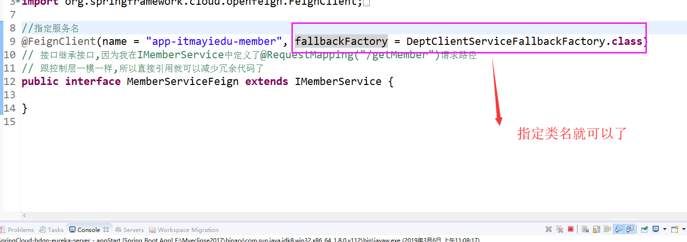

  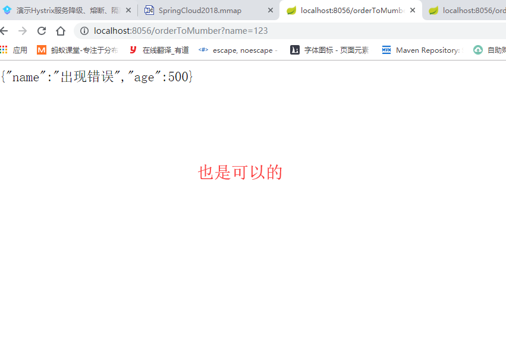

##### 服务降级处理方法三（推荐使用，使用之前记得注释掉@HystrixCommand）
创建DeptClientServiceFallbackFactory 类

```java
	package com.bdqn.api.fallback;

import org.springframework.stereotype.Component;

import com.bdqn.api.Entity.UserEntity;
import com.bdqn.api.feign.MemberServiceFeign;
import com.bdqn.base.BaseApiService;
import com.bdqn.base.ResponseBase;

/**
 * 服务降级方式三
 * 实现MemberServiceFeign接口就可以了BaseApiService 是提示的工具类不需要管
 * @author Administrator
 *
 */
@Component
public class MemberServiceFallback extends BaseApiService implements MemberServiceFeign {

	@Override
	public UserEntity getMember(String name) {
		// TODO Auto-generated method stub
		return null;
	}

	@Override
	public ResponseBase getUserInfo() {
		return setResultError("服务器忙，请稍后重试");
	}
}
```


启动类
```java
@SpringBootApplication
@EnableEurekaClient
@EnableFeignClients
//开启Hystrix
@EnableHystrix
public class AppOrder {
	public static void main(String[] args) {
		SpringApplication.run(AppOrder.class, args);
	}
}
```
接口MemberServiceFeign配置
  

  

Hystrix仪表盘
Turbine集群监控

## 声明式服务调用SpringCloud Feign
#### feign介绍
>Feign客户端是一个web声明式http远程调用工具，提供了接口和注解方式进行调用。


环境搭建
Maven依赖信息
```xml
	 <parent>
		<groupId>org.springframework.boot</groupId>
		<artifactId>spring-boot-starter-parent</artifactId>
		<version>2.0.1.RELEASE</version>
	</parent>
	<!-- 管理依赖 -->
	<dependencyManagement>
		<dependencies>
			<dependency>
				<groupId>org.springframework.cloud</groupId>
				<artifactId>spring-cloud-dependencies</artifactId>
				<version>Finchley.M7</version>
				<type>pom</type>
				<scope>import</scope>
			</dependency>
		</dependencies>
	</dependencyManagement>
	<dependencies>
		<!-- SpringBoot整合Web组件 -->
		<dependency>
			<groupId>org.springframework.boot</groupId>
			<artifactId>spring-boot-starter-web</artifactId>
		</dependency>
		<!-- SpringBoot整合eureka客户端 -->
		<dependency>
			<groupId>org.springframework.cloud</groupId>
			<artifactId>spring-cloud-starter-netflix-eureka-client</artifactId>
		</dependency>
<!-- 一定要加谷歌的依赖而且一定要对于版本不然会一直报错2.0.1.RELEASE必须是14.0.1 -->
		<!-- https://mvnrepository.com/artifact/com.google.guava/guava -->
		<dependency>
			<groupId>com.google.guava</groupId>
			<artifactId>guava</artifactId>
			<version>22.0</version>
		</dependency>
<!-- https://mvnrepository.com/artifact/com.fasterxml.jackson.core/jackson-core -->
		<dependency>
			<groupId>com.fasterxml.jackson.core</groupId>
			<artifactId>jackson-core</artifactId>
			<version>2.8.1</version>
		</dependency>
<!-- Feign依赖 -->
		<dependency>
			<groupId>org.springframework.cloud</groupId>
			<artifactId>spring-cloud-starter-openfeign</artifactId>
		</dependency>
	</dependencies>
	<!-- 注意： 这里必须要添加， 否者各种依赖有问题 -->
	<repositories>
		<repository>
			<id>spring-milestones</id>
			<name>Spring Milestones</name>
			<url>https://repo.spring.io/libs-milestone</url>
			<snapshots>
				<enabled>false</enabled>
			</snapshots>
		</repository>
	</repositories>
```


feign客户端接口(在消费端定义feign接口)
```java
// name 指定服务名称
@FeignClient(name = "app-itmayiedu-member")
public interface MemberApifeign {
// 记得这里的@RequestMapping里面的地址必须跟提供者服务里面方法请求的地址一致,不然访问不到,方法名字可以不一样
	@RequestMapping("/getMember")
	public String getMember();
}
```


feign客户端接口调用(在消费断定义feign的controller进行调用)
```java
	@Autowired
	private MemberApifeign memberApifeign;
	@RequestMapping("/feignMember")
	public String feignMember() {
		return memberApifeign.getMember();
	}
```


项目启动加上@EnableFeignClients
```java
@SpringBootApplication
@EnableEurekaClient
//开启Feign功能
@EnableFeignClients
public class AppOrder {
	public static void main(String[] args) {
		SpringApplication.run(AppOrder.class, args);

		// 如果使用rest方式以别名方式进行调用依赖ribbon负载均衡器 @LoadBalanced
		// @LoadBalanced就能让这个RestTemplate在请求时拥有客户端负载均衡的能力
	}

	// 解决RestTemplate 找不到原因 应该把restTemplate注册SpringBoot容器中 @bean
	@Bean
	@LoadBalanced
	RestTemplate restTemplate() {
		return new RestTemplate();
	}

}
```            

###### feign继承特性

>在使用声明式feign客户端工具的时候，因为书写的方式代码可能会产生重复，可以使用feign客户端集成方式减少代码。

项目目录结构:（看myeclipse的项目结构）

  

创建springcloud-2.0-parent
  Maven依赖信息
 ```xml
<parent>
		<groupId>org.springframework.boot</groupId>
		<artifactId>spring-boot-starter-parent</artifactId>
		<version>2.0.1.RELEASE</version>
	</parent>
	<!-- 管理依赖 -->
	<dependencyManagement>
		<dependencies>
			<dependency>
				<groupId>org.springframework.cloud</groupId>
				<artifactId>spring-cloud-dependencies</artifactId>
				<version>Finchley.M7</version>
				<type>pom</type>
				<scope>import</scope>
			</dependency>
		</dependencies>
	</dependencyManagement>
	<dependencies>
		<!-- SpringBoot整合Web组件 -->
		<dependency>
			<groupId>org.springframework.boot</groupId>
			<artifactId>spring-boot-starter-web</artifactId>
		</dependency>
		<!-- SpringBoot整合eureka客户端 -->
		<dependency>
			<groupId>org.springframework.cloud</groupId>
			<artifactId>spring-cloud-starter-netflix-eureka-client</artifactId>
		</dependency>
		<!-- SpringBoot整合fegnin客户端 -->
		<dependency>
			<groupId>org.springframework.cloud</groupId>
			<artifactId>spring-cloud-starter-openfeign</artifactId>
		</dependency>
		<dependency>
			<groupId>org.projectlombok</groupId>
			<artifactId>lombok</artifactId>
		</dependency>
<!-- 一定要加谷歌的依赖而且一定要对于版本不然会一直报错2.0.1.RELEASE必须是14.0.1 -->
		<!-- https://mvnrepository.com/artifact/com.google.guava/guava -->
		<dependency>
			<groupId>com.google.guava</groupId>
			<artifactId>guava</artifactId>
			<version>22.0</version>
		</dependency>
		<!-- https://mvnrepository.com/artifact/com.fasterxml.jackson.core/jackson-core -->
		<dependency>
			<groupId>com.fasterxml.jackson.core</groupId>
			<artifactId>jackson-core</artifactId>
			<version>2.8.1</version>
		</dependency>
	</dependencies>
	<!-- 注意： 这里必须要添加， 否者各种依赖有问题 -->
	<repositories>
		<repository>
			<id>spring-milestones</id>
			<name>Spring Milestones</name>
			<url>https://repo.spring.io/libs-milestone</url>
			<snapshots>
				<enabled>false</enabled>
			</snapshots>
		</repository>
	</repositories>
```
###### 创建springcloud-2.0-api
###### 创建springcloud-2.0-member-api
###### 创建实体类
```java
@Data
@AllArgsConstructor
@NoArgsConstructor
public class UserEntity {
	private String name;
	private Integer age;
}
```

创建接口
```java
public interface IMemberService {
	/**
	 * 必须在会员的接口加上@RequestParam不然获取不到值
	 */
	// 实体类一般和接口放在一起,放在api中
	@RequestMapping("/getMember")
	public UserEntity getMember(@RequestParam("name") String name);
}
```

  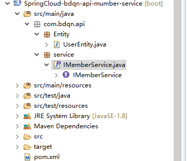


创建springcloud-2.0-order-api
创建接口
```java
public interface IOrderService {
	// 订单服务调用会员服务接口 Feign
	@RequestMapping("/orderToMumber")
	public UserEntity orderToMumber(String name);
}
```

创建springcloud-2.0-member-impl
```java
@RestController
public class MemberService implements IMemberService {
	/**
	 * 必须在会员的接口加上@RequestParam不然获取不到值
	 */
	@Override
	@RequestMapping("/getMember")
	public UserEntity getMember(@RequestParam("name") String name) {
		return new UserEntity(name, 22);
	}
}
```


启动类
```java
@SpringBootApplication
@EnableFeignClients
@EnableEurekaClient
public class appMumber {
	public static void main(String[] args) throws Exception {
		SpringApplication.run(appMumber.class, args);
	}
}
```

`创建springcloud-2.0-order-impl`


application.yml
```yml
###服务启动端口号
server:
  port: 8000
###服务名称(服务注册到eureka名称)  
spring:
    application:
        name: app-itmayiedu-member
###服务注册到eureka地址
eureka:
  client:
    service-url:
           defaultZone: http://localhost:8100/eureka

           
###因为该应用为注册中心，不会注册自己
    register-with-eureka: true
###是否需要从eureka上获取注册信息
    fetch-registry: true
```
 
`创建springcloud-2.0-order`
application.yml
```yml
###服务启动端口号
server:
  port: 8001
###服务名称(服务注册到eureka名称)  
spring:
    application:
        name: app-itmayiedu-order
###服务注册到eureka地址
eureka:
  client:
    service-url:
           defaultZone: http://localhost:8100/eureka

           
###因为该应用为注册中心，不会注册自己
    register-with-eureka: true
###是否需要从eureka上获取注册信息
    fetch-registry: true

```

##### Ribbon配置
##### SpringCloud Feign客户端Http调用工具，默认已经整合了Ribbon负载均衡客户端。
##### feign超时配置
##### 设置会员端延迟1.5秒，feign默认是1秒

  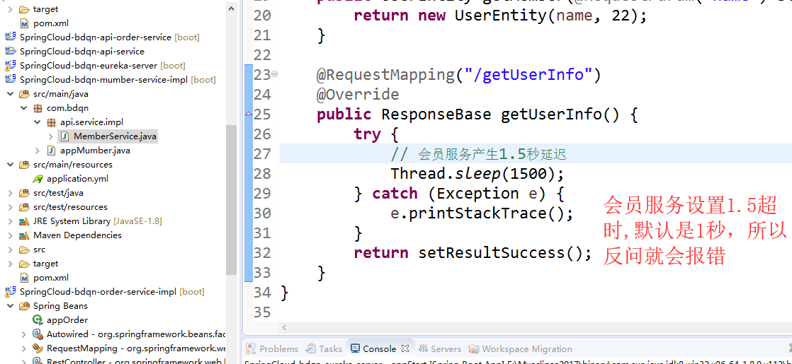

访问就出现超时现象了

  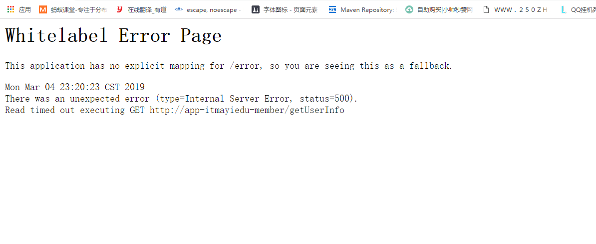

>配置解决Feign客户端超时时间(放到要显示的实现类中,因为是order访问mumber，所以要放到order)
```
###设置feign客户端超时时间
ribbon:
###指的是建立连接所用的时间，适用于网络状况正常的情况下，两端连接所用的时间秒单位。
 ReadTimeout: 5000
###指的是建立连接后从服务器读取到可用资源所用的时间秒单位。 
 ConnectTimeout: 5000

```
  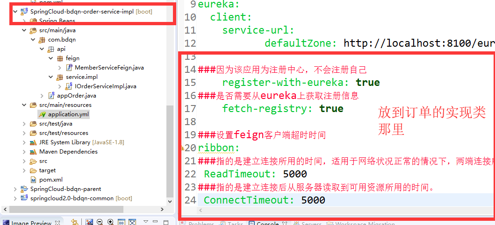

再去访问

  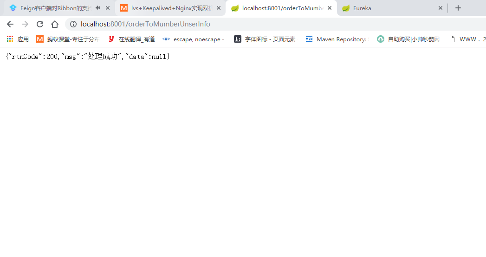

## Api网关服务SrpingCloud Zuul

#### 网关分类
###### 开放Api
>开放api(openApi) 企业需要将自身数据、能力等作为开发平台向外开放，通常会以rest的方式向外提供，最好的例子就是淘宝开放平台、腾讯公司的QQ开发平台、微信开放平台。 Open API开放平台必然涉及到客户应用的接入、API权限的管理、调用次数管理等，必然会有一个统一的入口进行管理，这正是API网关可以发挥作用的时候。

#### 微服务网关

>微服务的概念最早在2012年提出，在Martin Fowler的大力推广下，微服务在2014年后得到了大力发展。 在微服务架构中，有一个组件可以说是必不可少的，那就是微服务网关，微服务网关处理了负载均衡，缓存，路由，访问控制，服务代理，监控，日志等。API网关在微服务架构中正是以微服务网关的身份存在。 


#### API服务管理平台
>上述的微服务架构对企业来说有可能实施上是困难的，企业有很多遗留系统，要全部抽取为微服务器改动太大，对企业来说成本太高。但是由于不同系统间存在大量的API服务互相调用，因此需要对系统间服务调用进行管理，清晰地看到各系统调用关系，对系统间调用进行监控等。 API网关可以解决这些问题，我们可以认为如果没有大规模的实施微服务架构，那么对企业来说微服务网关就是企业的API服务管理平台。

#### 网关设计

#### 开放API接口
>1、对于OpenAPI使用的API网关来说，一般合作伙伴要以应用的形式接入到OpenAPI平台，合作伙伴需要到 OpenAPI平台申请应用。 因此在OpenAPI网关之外，需要有一个面向合作伙伴的使用的平台用于合作伙伴，这就要求OpenAPI网关需要提供API给这个用户平台进行访问。 如下架构:

  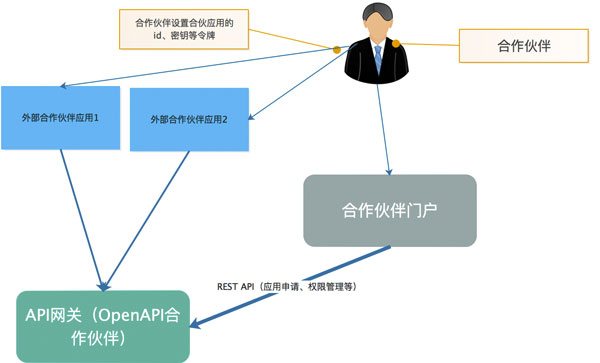
 
>当然如果是在简单的场景下，可能并不需要提供一个面向合作伙伴的门户，只需要由公司的运营人员直接添加合作伙伴应用id/密钥等，这种情况下也就不需要合作伙伴门户子系统。 

#### 内网API接口
>对于内网的API网关，在起到的作用上来说可以认为是微服务网关，也可以认为是内网的API服务治理平台。 当企业将所有的应用使用微服务的架构管理起来，那么API网关就起到了微服务网关的作用。 而当企业只是将系统与系统之间的调用使用rest api的方式进行访问时使用API网关对调用进行管理，那么API网关起到的就是API服务治理的作用。 架构参考如下：

  

>3、对于公司内部公网应用（如APP、公司的网站），如果管理上比较细致，在架构上是可能由独立的API网关来处理这部分内部公网应用，如果想比较简单的处理，也可以是使用面向合作伙伴的API网关。 如果使用独立的API网关，有以下的好处：<br>
面向合作伙伴和面向公司主体业务的优先级不一样，不同的API网关可以做到业务影响的隔离。<br>
内部API使用的管理流程和面向合作伙伴的管理流程可能不一样。<br>
内部的API在功能扩展等方面的需求一般会大于OpenAPI对于功能的要求。<br>
基于以上的分析，如果公司有能力，那么还是建议分开使用合作伙伴OPEN API网关和内部公网应用网关。<br>


#### 网关框架

>Kong kong是基于Nginx+Lua进行二次开发的方案， https://konghq.com/<br>
Netflix Zuul，zuul是spring cloud的一个推荐组件，https://github.com/Netflix/zuul<br>
orange,这个开源程序是国人开发的， http://orange.sumory.com/<br>
####网关作用

>网关的作用，可以实现负载均衡、路由转发、日志、权限控制、监控等。
####网关与过滤器区别

>网关是拦截所有服务器请求进行控制<br>
过滤器拦截某单个服务器请求进行控制

#### Nginx与Zuul的区别
>Nginx是采用服务器负载均衡进行转发<br>
Zuul依赖Ribbon和eureka实现本地负载均衡转发<br>
相对来说Nginx功能比Zuul功能更加强大，能够整合其他语言比如lua脚本实现强大的功能，同时Nginx可以更好的抗高并发，Zuul网关适用于请求过滤和拦截等。<br>


#### Zuul网关
>zuul是spring cloud的一个推荐组件，https://github.com/Netflix/zuul

#### 使用Zuul实现反向代理

#### 环境搭建
Maven依赖信息
```xml
<parent>
		<groupId>org.springframework.boot</groupId>
		<artifactId>spring-boot-starter-parent</artifactId>
		<version>2.0.1.RELEASE</version>
	</parent>
	<!-- 管理依赖 -->
	<dependencyManagement>
		<dependencies>
			<dependency>
				<groupId>org.springframework.cloud</groupId>
				<artifactId>spring-cloud-dependencies</artifactId>
				<version>Finchley.M7</version>
				<type>pom</type>
				<scope>import</scope>
			</dependency>
		</dependencies>
	</dependencyManagement>
	<dependencies>
		<dependency>
			<groupId>org.springframework.cloud</groupId>
			<artifactId>spring-cloud-starter-netflix-zuul</artifactId>
		</dependency>
		<!-- SpringBoot整合eureka客户端 -->
		<dependency>
			<groupId>org.springframework.cloud</groupId>
			<artifactId>spring-cloud-starter-netflix-eureka-client</artifactId>
		</dependency>
<!-- 一定要加谷歌的依赖而且一定要对于版本不然会一直报错2.0.1.RELEASE必须是14.0.1 -->
		<!-- https://mvnrepository.com/artifact/com.google.guava/guava -->
		<dependency>
			<groupId>com.google.guava</groupId>
			<artifactId>guava</artifactId>
			<version>22.0</version>
		</dependency>
<!-- https://mvnrepository.com/artifact/com.fasterxml.jackson.core/jackson-core -->
		<dependency>
			<groupId>com.fasterxml.jackson.core</groupId>
			<artifactId>jackson-core</artifactId>
			<version>2.8.1</version>
		</dependency>
	</dependencies>
	<!-- 注意： 这里必须要添加， 否者各种依赖有问题 -->
	<repositories>
		<repository>
			<id>spring-milestones</id>
			<name>Spring Milestones</name>
			<url>https://repo.spring.io/libs-milestone</url>
			<snapshots>
				<enabled>false</enabled>
			</snapshots>
		</repository>
	</repositories>

```


application.yml
```yml
###注册 中心
eureka:
  client:
    serviceUrl:
      defaultZone: http://localhost:8100/eureka/
server:
  port: 80
###网关名称
spring:
  application:
    name: service-zuul
### 配置网关反向代理    
zuul:
  routes:
   #这个自己定义的可以定义多个，代表网关请求到不同的服务
    api-a:
     ### 以 /api-member/访问转发到会员服务
      #浏览器访问的地址也就是说通过api-member就可以访问到eureka服务上名为app-itmayiedu-member这个服务    
      #localhost:80/api-member/getMumber这样就可以访问到会员服务了
      path: /api-member/**
      serviceId: app-itmayiedu-member
      #这个自己定义的可以定义多个，代表网关请求到不同的服务
    api-b:
        ### 以 /api-order/访问转发到订单服务
        #浏览器访问的地址也就是说通过api-order就可以访问到eureka服务上名为app-itmayiedu-order这个服务    
      #localhost:80/api-order/getOrder这样就可以访问到订单服务了
      path: /api-order/**
      serviceId: app-itmayiedu-order
```

```java
@SpringBootApplication
//开始网关代理
@EnableZuulProxy
@EnableEurekaClient
public class indexController {
	public static void main(String[] args) throws Exception {
		SpringApplication.run(indexController.class, args);
	}
}
```

#### 使用Zuul整合Ribbon

`Zuul 默认开启了 Ribbon本地负载均衡功能。`

#### 使用Zuul过滤器
案例：使用过滤器验证客户端是否有登陆。

```java
@Component
public class TokenFilter extends ZuulFilter {

	public Object run() throws ZuulException {
		// 获取上下文
		RequestContext currentContext = RequestContext.getCurrentContext();
		//获取request对象
		HttpServletRequest request = currentContext.getRequest();
		//获取userToken的数据
		String userToken = request.getParameter("userToken");
		//判断userToken数据是否为空
		if (StringUtils.isEmpty(userToken)) {
			//如果为空就停止往下继续执行currentContext.setSendZuulResponse(false);后面的代码都不会执行
			currentContext.setSendZuulResponse(false);
			//设置返回给页面的状态码
			currentContext.setResponseStatusCode(401);
			//设置返回给页面的提示内容
			currentContext.setResponseBody("userToken is null");
			return null;
		}
		// 否则正常执行业务逻辑.....
		return null;
	}

	// 判断过滤器是否生效
	public boolean shouldFilter() {
		return true;
	}

	// 过滤器的执行顺序。当请求在一个阶段的时候存在多个多个过滤器时，需要根据该方法的返回值依次执行
	public int filterOrder() {
		return 0;
	}

	// 过滤器类型 pre 表示在 请求之前进行拦截
	public String filterType() {
		return "pre";
	}
}
```
访问页面就出现拦截请求了

  


#### 动态网关
>传统方式将路由规则配置在配置文件中，如果路由规则发生了改变，需要重启服务器。这时候我们结合上节课内容整合SpringCloud Config分布式配置中心，实现动态路由规则。
在git上创建一个文件service-zuul-dev.yml
```yml
### 配置网关反向代理    
zuul:
  routes:
    api-a:
     ### 以 /api-member/访问转发到会员服务
      path: /api-member/**
      serviceId: app-itmayiedu-member
    api-b:
        ### 以 /api-order/访问转发到订单服务
      path: /api-order/**
      serviceId: app-itmayiedu-order
```

Maven依赖信息
新增监控中心依赖信息（放springcloud_zuul）
```xml
<!-- actuator监控中心 -->
		<dependency>
			<groupId>org.springframework.boot</groupId>
			<artifactId>spring-boot-starter-actuator</artifactId>
		</dependency>
		<!-- springcloud config 2.0 -->
		<dependency>
			<groupId>org.springframework.cloud</groupId>
			<artifactId>spring-cloud-config-client</artifactId>
		</dependency>
```
application.yml（放springcloud_zuul）

```yml
###服务注册地址
eureka:
  client:
    serviceUrl:
      defaultZone: http://localhost:8100/eureka/
###api网关端口号      
server:
  port: 80
###网关名称  
spring:
  application:
    name: service-zuul
  cloud:
    config:
    ####读取后缀
      profile: dev
      ####读取config-server注册地址
      discovery:
        service-id: config-server
        enabled: true    

###默认服务读取eureka注册服务列表 默认间隔30秒

###开启所有监控中心接口
management:
  endpoints:
    web:
      exposure:
        include: "*"
```

项目启动修改一下

```java
@SpringBootApplication
// 开始网关代理
@EnableZuulProxy
@EnableEurekaClient
public class indexController {
	public static void main(String[] args) throws Exception {
		SpringApplication.run(indexController.class, args);
	}

	// zuul配置能够使用config实现实时更新
	@RefreshScope
	@ConfigurationProperties("zuul")
	public ZuulProperties zuulProperties() {
		return new ZuulProperties();
	}
}
```
启动的服务个数，mumber是集群的

  

  

在postMan工具上输入以下网址手动刷新接口配置
http://127.0.0.1/actuator/refresh

  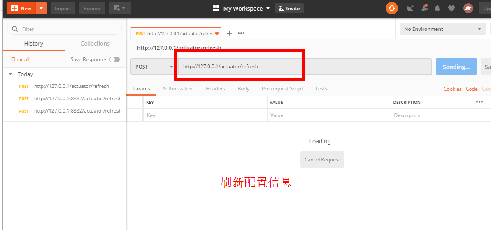

项目目录结构

  

#### 网关集群
>Zuul网关集群使用Nginx反向代理即可，保证每台网关配置数据相同。
```yml
 upstream  backServer{
       #zull第一台网关的地址
	    server 127.0.0.1:81;
      #zull第二台网关的地址
	    server 127.0.0.1:82;
	}
    server {
        listen       80;
        server_name  wg.itmayiedu.com;
       location / {
		    ### 指定上游服务器负载均衡服务器
		    proxy_pass http://backServer/;
            index  index.html index.htm;
        }
}
```

>启动二台网关，改下端口启动一下就可以了。<br>
通过nginx访问实现负载均衡到网关为：http://localhost/api-member/getMumber?userToken=1

## 分布式配置中心SrpingCloud config

#### SpringCloud分布式配置中心

#### Config架构

  

>当一个系统中的配置文件发生改变的时候，我们需要重新启动该服务，才能使得新的配置文件生效，spring cloud config可以实现微服务中的所有系统的配置文件的统一管理，而且还可以实现当配置文件发生变化的时候，系统会自动更新获取新的配置。
#### Git环境搭建
使用码云环境搭建git服务器端  
694475668@qq.com  密码 ********
码云环境地址  	https://gitee.com/bright-boy/technical-notes

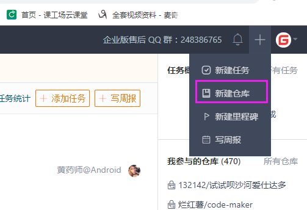

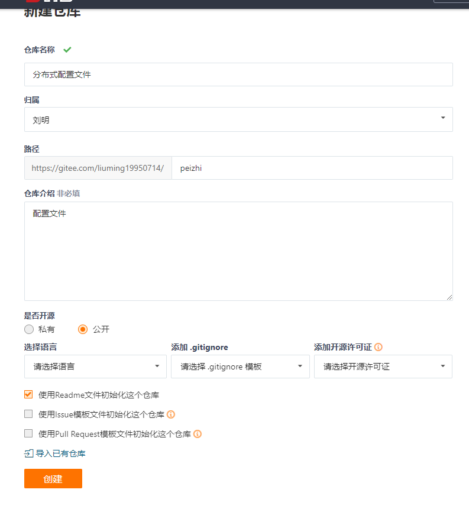


#### 服务端详解
###### 项目名称:springboot2.0-config_server
Maven依赖信息（先开启eureka的server）
```xml
	<parent>
		<groupId>org.springframework.boot</groupId>
		<artifactId>spring-boot-starter-parent</artifactId>
		<version>2.0.1.RELEASE</version>
	</parent>
	<!-- 管理依赖 -->
	<dependencyManagement>
		<dependencies>
			<dependency>
				<groupId>org.springframework.cloud</groupId>
				<artifactId>spring-cloud-dependencies</artifactId>
				<version>Finchley.M7</version>
				<type>pom</type>
				<scope>import</scope>
			</dependency>
		</dependencies>
	</dependencyManagement>
	<dependencies>
		<!--spring-cloud 整合 config-server -->
		<dependency>
			<groupId>org.springframework.cloud</groupId>
			<artifactId>spring-cloud-config-server</artifactId>
		</dependency>
		<!-- SpringBoot整合eureka客户端 -->
		<dependency>
			<groupId>org.springframework.cloud</groupId>
			<artifactId>spring-cloud-starter-netflix-eureka-client</artifactId>
		</dependency>
        <!-- 一定要加谷歌的依赖而且一定要对于版本不然会一直报错2.0.1.RELEASE必须是22.0 -->
		<!-- https://mvnrepository.com/artifact/com.google.guava/guava -->
		<dependency>
			<groupId>com.google.guava</groupId>
			<artifactId>guava</artifactId>
			<version>22.0</version>
		</dependency>
		<!-- https://mvnrepository.com/artifact/com.fasterxml.jackson.core/jackson-core -->
		<dependency>
			<groupId>com.fasterxml.jackson.core</groupId>
			<artifactId>jackson-core</artifactId>
			<version>2.8.1</version>
		</dependency>
	</dependencies>
	<!-- 注意： 这里必须要添加， 否者各种依赖有问题 -->
	<repositories>
		<repository>
			<id>spring-milestones</id>
			<name>Spring Milestones</name>
			<url>https://repo.spring.io/libs-milestone</url>
			<snapshots>
				<enabled>false</enabled>
			</snapshots>
		</repository>
	</repositories>
```


application.yml配置
```yml
###服务注册到eureka地址
eureka:
  client:
    service-url:
           defaultZone: http://localhost:8100/eureka
spring:
  application:
    ####注册中心应用名称
    name: config-server
  cloud:
    config:
      server:
        git:
          ###git环境地址
          uri: https://gitee.com/itmayi/config.git
          ####搜索目录,意思是git上刚刚创建的文件夹的名字
          search-paths:
            - config  
      ####读取分支      
      label: master
####端口号      
server:
  port: 8888
```


项目启动
```java
@EnableConfigServer
@EnableEurekaClient
@SpringBootApplication
public class ConfigServerApplication {
	public static void main(String[] args) {
		SpringApplication.run(ConfigServerApplication.class, args);
	}
}
```
`@EnableConfigServer 开启分布式配置中心服务器端`

在gitte上创建配置文件规范，服务名称-环境.properties

  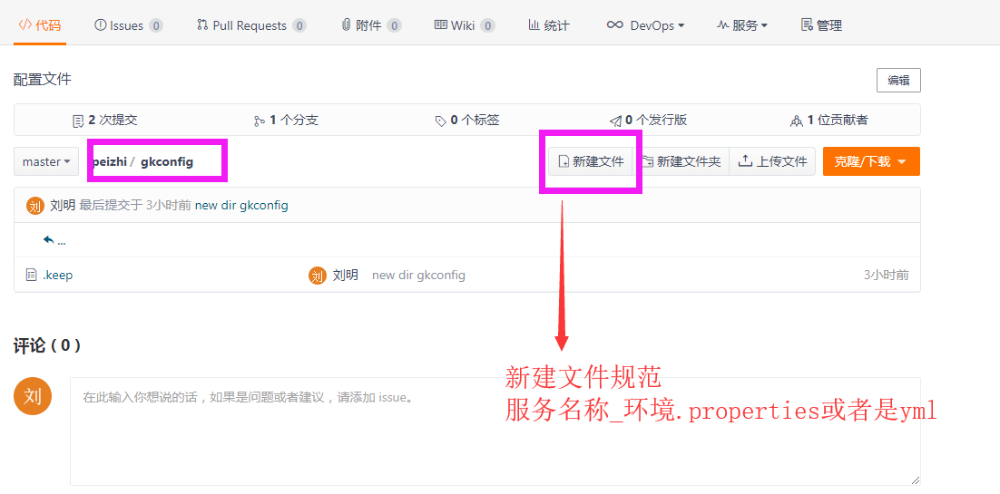

创建好的文件


  

http://127.0.0.1:8888/git上文件的名字
读取配置文件信息 http://127.0.0.1:8888/config-client-dev.properties

  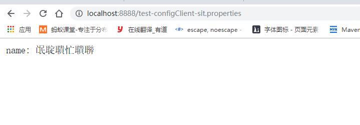

  

#### 客户端详解
项目名称:springboot2.0-config_client

Maven依赖信息
```xml
<parent>
		<groupId>org.springframework.boot</groupId>
		<artifactId>spring-boot-starter-parent</artifactId>
		<version>2.0.1.RELEASE</version>
	</parent>
	<!-- 管理依赖 -->
	<dependencyManagement>
		<dependencies>
			<dependency>
				<groupId>org.springframework.cloud</groupId>
				<artifactId>spring-cloud-dependencies</artifactId>
				<version>Finchley.M7</version>
				<type>pom</type>
				<scope>import</scope>
			</dependency>

		</dependencies>
	</dependencyManagement>
	<dependencies>
		<!-- SpringBoot整合Web组件 -->
		<dependency>
			<groupId>org.springframework.boot</groupId>
			<artifactId>spring-boot-starter-web</artifactId>
		</dependency>
		<dependency>
			<groupId>org.springframework.cloud</groupId>
			<artifactId>spring-cloud-config-client</artifactId>
		</dependency>
		<!-- SpringBoot整合eureka客户端 -->
		<dependency>
			<groupId>org.springframework.cloud</groupId>
			<artifactId>spring-cloud-starter-netflix-eureka-client</artifactId>
		</dependency>
 <!-- 一定要加谷歌的依赖而且一定要对于版本不然会一直报错2.0.1.RELEASE必须是22.0 -->
		<!-- https://mvnrepository.com/artifact/com.google.guava/guava -->
		<dependency>
			<groupId>com.google.guava</groupId>
			<artifactId>guava</artifactId>
			<version>22.0</version>
		</dependency>
		<!-- https://mvnrepository.com/artifact/com.fasterxml.jackson.core/jackson-core -->
		<dependency>
			<groupId>com.fasterxml.jackson.core</groupId>
			<artifactId>jackson-core</artifactId>
			<version>2.8.1</version>
		</dependency>
	</dependencies>
	<!-- 注意： 这里必须要添加， 否者各种依赖有问题 -->
	<repositories>
		<repository>
			<id>spring-milestones</id>
			<name>Spring Milestones</name>
			<url>https://repo.spring.io/libs-milestone</url>
			<snapshots>
				<enabled>false</enabled>
			</snapshots>
		</repository>
	</repositories>
```


bootstrap.yml  (如果出现错误起不来把bootstrap.yml改成application.yml)
```yml
spring:
  application:
    ####注册中心应用名称   这个文件test-configClient-sit.properties服务名称就是为 test-configClient
    name: test-configClient
  cloud:
    config:
    ####读取后缀也就是开发环境
      profile: sit
       discovery:
   ####读取config-server注册地址，也就是springboot2.0-config_server发布到eureta上的服务名字。
        service-id: config-server
        enabled: true
#####    eureka服务注册地址    
eureka:
  client:
    service-url:
           defaultZone: http://localhost:8100/eureka    
server:
  port: 8882
```
  

读取配置文件
```java
@RestController
public class IndexController {
	@Value("${name}")
	private String name;

	@RequestMapping("/name")
	private String name() {
		return name;
	}

}
```


项目启动
```java
@EnableEurekaClient
@SpringBootApplication
public class ConfigServerApplication {
	public static void main(String[] args) {
		SpringApplication.run(ConfigServerApplication.class, args);
	}
}
```

#### 动态刷新数据
>在SpringCloud中有手动刷新配置文件和实时刷新配置文件两种方式。<br>
手动方式采用actuator端点刷新数据（推荐）<br>
实时刷新采用SpringCloud Bus消息总线 （性能不好）<br>


#### actuator端点刷新数据

Maven依赖信息(放到客户端)
```xml
<!-- actuator监控中心 -->
		<dependency>
			<groupId>org.springframework.boot</groupId>
			<artifactId>spring-boot-starter-actuator</artifactId>
		</dependency>
```
#### ootstrap.xml新增
开启监控断点
```yml
#开启所有监控断点 
management:
  endpoints:
    web:
      exposure:
        include: "*"
```
`生效前提`
`在需要刷新的Bean上添加@RefreshScope注解。`
```java
@RestController
//配置更改时，标有@RefreshScope的Bean将得到特殊处理来生效配置
@RefreshScope
public class ConfigClientController {

http://127.0.0.1:8882/actuator/refresh 
	@Value("${itmayieduInfo}")
	private String itmayieduInfo;
}
```
`当配置更改时，标有@RefreshScope的Bean将得到特殊处理来生效配置`
#### 手动刷新接口（推荐使用）
`Post请求手动刷新`
**使用工具postman工具发生post请求**
>http://127.0.0.1:8882/actuator/refresh  启动刷新器 从cofnig server读取<br>

  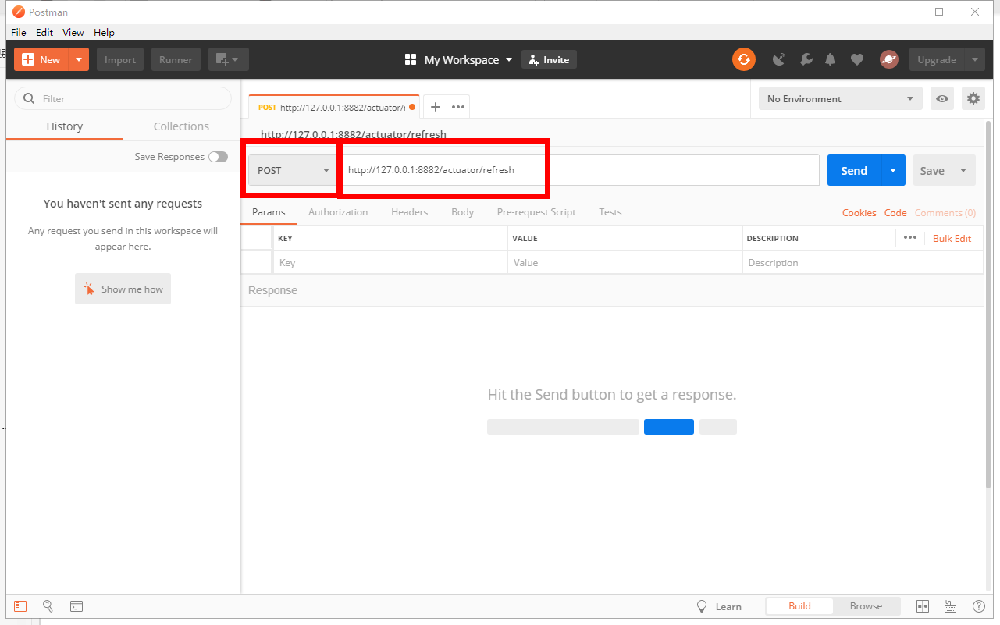

在访问网页就刷新配置文件了


#### 自动刷新接口（消息总线）
三个项目中都加上该依赖信息
Maven依赖
```xml
	<!--核心jar包 -->
		<dependency>
			<groupId>org.springframework.cloud</groupId>
			<artifactId>spring-cloud-starter-bus-amqp</artifactId>
		</dependency>
		<!-- actuator监控中心 -->
		<dependency>
			<groupId>org.springframework.boot</groupId>
			<artifactId>spring-boot-starter-actuator</artifactId>
		</dependency>
```

配置文件
```yml
###开启bus刷新
management:
  endpoints:
    web:
      exposure:
        include: bus-refresh

```

`刷新接口 http://127.0.0.1:8882/actuator/bus-refresh`


## 分布式服务跟踪SpringCloud sleuth


##### 什么是Sleuth
>Spring Cloud Sleuth 主要功能就是在分布式系统中提供追踪解决方案，并且兼容支持了 zipkin，你只需要在pom文件中引入相应的依赖即可。

###### 环境搭建

###### 构建server-zipkin


>在spring Cloud为F版本的时候，已经不需要自己构建Zipkin Server了，只需要下载jar即可，下载地址：<br>
https://dl.bintray.com/openzipkin/maven/io/zipkin/java/zipkin-server/

下载完jar运行即可
`java -jar zipkin-server-2.10.1-exec.jar`

访问端口号:http://127.0.0.1:9411

会员服务

Maven依赖信息
```xml
    <dependency>
            <groupId>org.springframework.cloud</groupId>
            <artifactId>spring-cloud-starter-sleuth</artifactId>
        </dependency>
```

## 什么是消息驱动？
>SpringCloud Stream消息驱动可以简化开发人员对消息中间件的使用复杂度，让系统开发人员更多尽力专注与核心业务逻辑的开发。SpringCloud Stream基于SpringBoot实现，自动配置化的功能可以帮助我们快速上手学习，类似与我们之前学习的orm框架，可以平滑的切换多种不同的数据库。
目前SpringCloud Stream 目前只支持 rabbitMQ和kafka


## 消息驱动原理
###### 绑定器
>通过定义绑定器作为中间层，实现了应用程序与消息中间件细节之间的隔离。通过向应用程序暴露统一的Channel通过，是的应用程序不需要再考虑各种不同的消息中间件的实现。当需要升级消息中间件，或者是更换其他消息中间件产品时，我们需要做的就是更换对应的Binder绑定器而不需要修改任何应用逻辑 。

  

>在该模型图上有如下几个核心概念:<br>
* Source: 当需要发送消息时，我们就需要通过Source，Source将会把我们所要发送的消息(POJO对象)进行序列化（默认转换成JSON格式字符串），然后将这些数据发送到Channel中；
* Sink: 当我们需要监听消息时就需要通过Sink来，Sink负责从消息通道中获取消息，并将消息反序列化成消息对象(POJO对象)，然后交给具体的消息监听处理进行业务处理；
* Channel: 消息通道是Stream的抽象之一。通常我们向消息中间件发送消息或者监听消息时需要指定主题（Topic）／消息队列名称，但这样一旦我们需要变更主题名称的时候需要修改消息发送或者消息监听的代码，但是通过Channel抽象，我们的业务代码只需要对Channel就可以了，具体这个Channel对应的是那个主题，就可以在配置文件中来指定，这样当主题变更的时候我们就不用对代码做任何修改，从而实现了与具体消息中间件的解耦；
* Binder: Stream中另外一个抽象层。通过不同的Binder可以实现与不同消息中间件的整合，比如上面的示例我们所使用的就是针对Kafka的Binder，通过Binder提供统一的消息收发接口，从而使得我们可以根据实际需要部署不同的消息中间件，或者根据实际生产中所部署的消息中间件来调整我们的配置。
。


## Swagger2API接口管理


#### 课题引入
>随着微服务架构体系的发展和应用， 为了前后端能够更好的集成与对接，同时为了项目的方便交付，每个项目都需要提供相应的API文档。

>来源：PC端、微信端、H5端、移动端（安卓和IOS端）

#### 传统的API文档编写存在以下几个痛点：
>对API文档进行更新的时候，需要通知前端开发人员，导致文档更新交流不及时；<br>
API接口返回信息不明确

大公司中肯定会有专门文档服务器对接口文档进行更新。


>缺乏在线接口测试，通常需要使用相应的API测试工具，比如postman、SoapUI等<br>
接口文档太多，不便于管理<br>
为了解决传统API接口文档维护的问题，为了方便进行测试后台Restful接口并实现动态的更新，因而引入Swagger接口工具。<br>

###### Swagger具有以下优点
* 1.功能丰富：支持多种注解，自动生成接口文档界面，支持在界面测试API接口功能；
* 2.及时更新：开发过程中花一点写注释的时间，就可以及时的更新API文档，省心省力；
* 3.整合简单：通过添加pom依赖和简单配置，内嵌于应用中就可同时发布API接口文档界面，不需要部署独立服务。

###### Swagger 2.0 集成配置

###### Maven依赖信息

```xml           
<parent>
		<groupId>org.springframework.boot</groupId>
		<artifactId>spring-boot-starter-parent</artifactId>
		<version>2.0.1.RELEASE</version>
	</parent>
	<!-- 管理依赖 -->
	<dependencyManagement>
		<dependencies>
			<dependency>
				<groupId>org.springframework.cloud</groupId>
				<artifactId>spring-cloud-dependencies</artifactId>
				<version>Finchley.M7</version>
				<type>pom</type>
				<scope>import</scope>
			</dependency>
		</dependencies>
	</dependencyManagement>
	<dependencies>
		<!-- SpringBoot整合Web组件 -->
		<dependency>
			<groupId>org.springframework.boot</groupId>
			<artifactId>spring-boot-starter-web</artifactId>
		</dependency>
		<!-- SpringBoot整合eureka客户端 -->
		<dependency>
			<groupId>org.springframework.cloud</groupId>
			<artifactId>spring-cloud-starter-netflix-eureka-client</artifactId>
		</dependency>
		<!-- swagger2 -->
		<dependency>
			<groupId>io.springfox</groupId>
			<artifactId>springfox-swagger2</artifactId>
			<version>2.9.2</version>
		</dependency>
		<dependency>
			<groupId>io.springfox</groupId>
			<artifactId>springfox-swagger-ui</artifactId>
			<version>2.9.2</version>
		</dependency>
<!-- 一定要加谷歌的依赖而且一定要对于版本不然会一直报错2.0.1.RELEASE必须是14.0.1 -->
		<!-- https://mvnrepository.com/artifact/com.google.guava/guava -->
		<dependency>
			<groupId>com.google.guava</groupId>
			<artifactId>guava</artifactId>
			<version>22.0</version>
		</dependency>
		<dependency>
			<groupId>com.fasterxml.jackson.core</groupId>
			<artifactId>jackson-core</artifactId>
			<version>2.8.1</version>
		</dependency>
	</dependencies>
	<!-- 注意： 这里必须要添加， 否者各种依赖有问题 -->
	<repositories>
		<repository>
			<id>spring-milestones</id>
			<name>Spring Milestones</name>
			<url>https://repo.spring.io/libs-milestone</url>
			<snapshots>
				<enabled>false</enabled>
			</snapshots>
		</repository>
	</repositories>	
```

SwaggerConfig类
```java
@Configuration
@EnableSwagger2
public class SwaggerConfig {

	@Bean
	public Docket createRestApi() {
		return new Docket(DocumentationType.SWAGGER_2).apiInfo(apiInfo()).select()
				// 生产api扫包范围
				.apis(RequestHandlerSelectors.basePackage("com.itmayiedu.api")).paths(PathSelectors.any()).build();
	}
   //创建api文档对象
	private ApiInfo apiInfo() {
		return new ApiInfoBuilder().title("每特教育|蚂蚁课堂 微服务电商系统").description("每特教育|蚂蚁课堂 Java分布式&微服务培训")
				.termsOfServiceUrl("http://www.itmayiedu.com")
				// .contact(contact)
				.version("1.0").build();
	}
}
SwaggerController类
@Api("SwaggerDemo控制器")
@RestController
public class SwaggerController {
	// 接口描述
	@ApiOperation("swagger服务接口")
	@GetMapping("/swaggerIndex")
	//name指定参数名字,value参数的描述信息，required参数不是必须传，dataType参数类型
	@ApiImplicitParam(name = "name", value = "用户信息参数",required=false,dataType="String")
	public String swaggerIndex(String name) {
		System.out.println("swaggerIndex");
		return "swaggerIndex";
	}
}
```


application.yml
```yml
server:
  port: 8060
spring:
    application:
        name: springcloud-swagger
#在默认设置下会自动注册到eureka上面去，所以我们需要禁用它的客户端注册行为
eureka:
  client:
    register-with-eureka: false
    fetch-registry: false
```

启动类
```java
@SpringBootApplication
public class appSwagger {
	public static void main(String[] args) throws Exception {
		SpringApplication.run(appSwagger.class, args);
	}
}
```
项目目录结构

  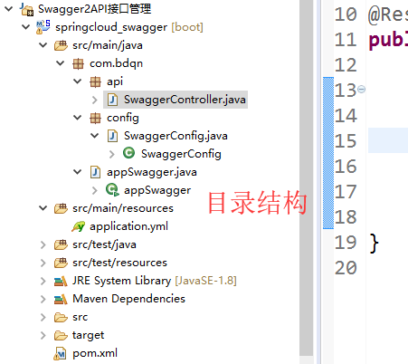

`访问地址:http://localhost:8060/swagger-ui.html`

  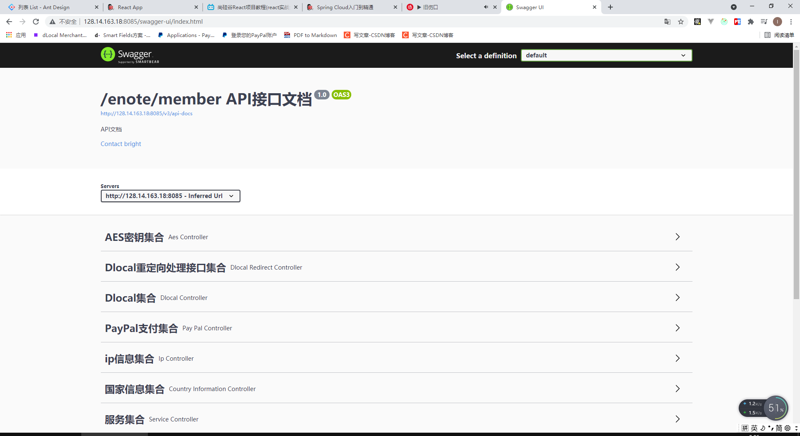

`常见问题com.sun.jersey.api.client.ClientHandlerException: java.net.ConnectException: Connection refused: connect`


  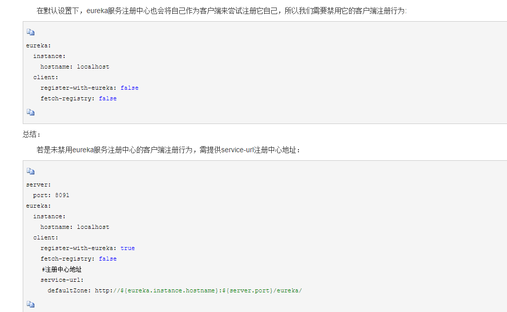

#### Springboot+Zull整合Swagger管理微服务所有API
会员和订单引入Maven依赖
```xml
		<!-- swagger-spring-boot -->
		<dependency>
			<groupId>com.spring4all</groupId>
			<artifactId>swagger-spring-boot-starter</artifactId>
			<version>1.8.0.RELEASE</version>
		</dependency>
```

会员和订单引入application.yml配置
Api接口扫描范围
```yml
swagger:
  base-package: com.itmayeidu.api
```

会员和订单都在启动项上加上这个注解开启生成文档
`@EnableSwagger2Doc`

在ZuulGateway网关启动类那里配置以下信息
```java
@SpringBootApplication
@EnableEurekaClient
@EnableZuulProxy
@EnableSwagger2Doc
public class AppGateWay {

	// @EnableZuulProxy 开启网关代理

	public static void main(String[] args) {
		SpringApplication.run(AppGateWay.class, args);
	}

	// zuul配置能够使用config实现实时更新
	@RefreshScope
	@ConfigurationProperties("zuul")
	public ZuulProperties zuulProperties() {
		return new ZuulProperties();
	}

	// 添加文档来源
	@Component
	@Primary
	class DocumentationConfig implements SwaggerResourcesProvider {
		@Override
		public List<SwaggerResource> get() {
			List resources = new ArrayList<>();
			// app-itmayiedu-order
//第一个参数可以乱写，但是第二个不能乱写，要写网关通过的访问地址/api-member/v2/api-docs
			resources.add(swaggerResource("app-itmayiedu-member", "/api-member/v2/api-docs", "2.0"));
			resources.add(swaggerResource("app-itmayiedu-order", "/api-order/v2/api-docs", "2.0"));
			return resources;
		}

		private SwaggerResource swaggerResource(String name, String location, String version) {
			SwaggerResource swaggerResource = new SwaggerResource();
			swaggerResource.setName(name);
			swaggerResource.setLocation(location);
			swaggerResource.setSwaggerVersion(version);
			return swaggerResource;
		}
	}
}
```

启动后访问

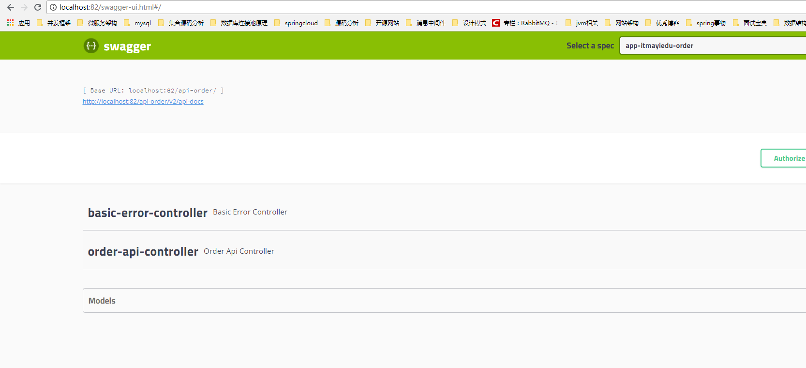

## swagger-ui-layer 自定义Swagger界面  （地址https://github.com/caspar-chen/swagger-ui-layer）


## 自定义Swagger界面第二种

Maven依赖
```xml
<dependency>
    <groupId>com.didispace</groupId>
    <artifactId>swagger-butler-core</artifactId>
    <version>2.0.0</version>
</dependency>
```


SwaggerConfig 类
```java
package com.ratta.config;

import io.swagger.annotations.Api;
import io.swagger.annotations.ApiOperation;
import org.springframework.context.annotation.Bean;
import org.springframework.context.annotation.Configuration;
import org.springframework.web.context.request.async.DeferredResult;

import springfox.documentation.builders.PathSelectors;
import springfox.documentation.builders.RequestHandlerSelectors;
import springfox.documentation.service.ApiInfo;
import springfox.documentation.spi.DocumentationType;
import springfox.documentation.spring.web.plugins.Docket;
import springfox.documentation.swagger2.annotations.EnableSwagger2;

/**
 * Title:程序的奥秘
 * Description:
 * Company:
 *
 * @version :
 * @author: 刘 明
 * @date:Created in 2019年7月22日 下午12:13:19
 */
@Configuration
@EnableSwagger2
public class SwaggerConfig {

    @Bean
    public Docket ProductApi() {
        return new Docket(DocumentationType.SWAGGER_2)
                .apiInfo(productApiInfo())
                .select()
                .apis(RequestHandlerSelectors.basePackage("com.ratta.controller")) //开启扫包范围,不加会扫全部包
                .apis(RequestHandlerSelectors.withClassAnnotation(Api.class))
                .apis(RequestHandlerSelectors.withMethodAnnotation(ApiOperation.class))
                .paths(PathSelectors.any())
                .build();
    }

    private ApiInfo productApiInfo() {
        ApiInfo apiInfo = new ApiInfo("《雷塔智能科技有限公司》数据迁移接口文档",
                "合作双赢",
                "1.0.0",
                "http://127.0.0.1:9595/doc.html",
                "刘明",
                "license",
                "https://supernote.com.cn/");
        return apiInfo;
    }
}
```
启动类加注解

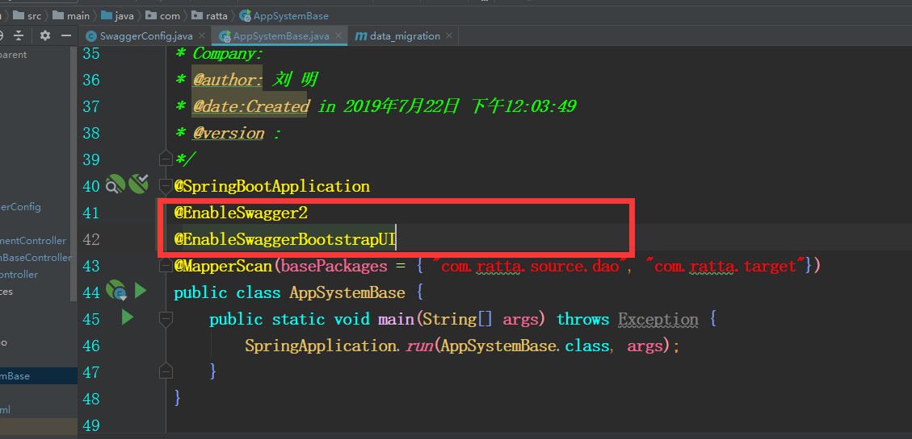

访问地址
http://127.0.0.1:9595/doc.html

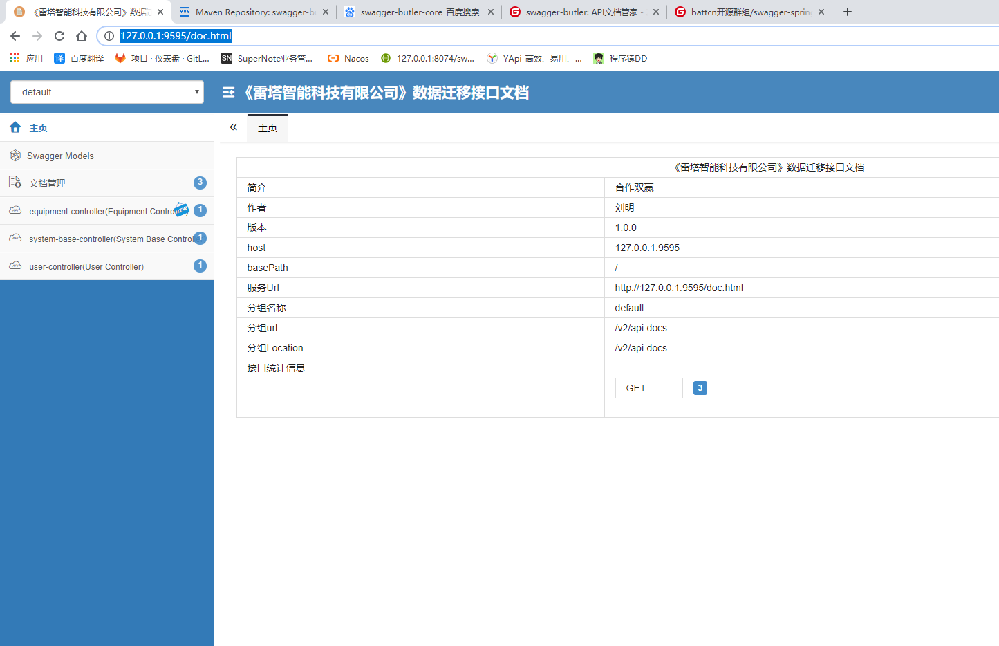

## 消息驱动环境搭建

##### 生产者环境


Maven依赖信息
```xml
	<parent>
		<groupId>org.springframework.boot</groupId>
		<artifactId>spring-boot-starter-parent</artifactId>
		<version>2.0.1.RELEASE</version>
	</parent>
	<dependencies>
		<!-- SpringBoot整合Web组件 -->
		<dependency>
			<groupId>org.springframework.boot</groupId>
			<artifactId>spring-boot-starter-web</artifactId>
		</dependency>
		<dependency>
			<groupId>org.springframework.cloud</groupId>
			<artifactId>spring-cloud-starter-stream-rabbit</artifactId>
			<version>2.0.1.RELEASE</version>
		</dependency>
	</dependencies>
```


application.yml信息

```yml
server:
  port: 9000
spring:
  application:
    name: spingcloud-stream-producer
#  rabbitmq:
#    host: 192.168.174.128
#    port: 5672
#    username: guest
#    password: guest
```

创建管道
```java
// 创建管道接口
public interface SendMessageInterface {

	// 创建一个输出管道，用于发送消息
	@Output("my_msg")
	SubscribableChannel sendMsg();

}
```


发送消息

```java
@RestController
public class SendMsgController {
	@Autowired
	private SendMessageInterface sendMessageInterface;

	@RequestMapping("/sendMsg")
	public String sendMsg() {
		String msg = UUID.randomUUID().toString();
		System.out.println("生产者发送内容msg:" + msg);
		Message build = MessageBuilder.withPayload(msg.getBytes()).build();
		sendMessageInterface.sendMsg().send(build);
		return "success";
	}

}
```

启动服务
```java
@SpringBootApplication
@EnableBinding(SendMessageInterface.class) // 开启绑定
public class AppProducer {

	public static void main(String[] args) {
		SpringApplication.run(AppProducer.class, args);
	}

}
```

消费者环境
Maven
```xml
<parent>
		<groupId>org.springframework.boot</groupId>
		<artifactId>spring-boot-starter-parent</artifactId>
		<version>2.0.1.RELEASE</version>
	</parent>
	<dependencies>
		<!-- SpringBoot整合Web组件 -->
		<dependency>
			<groupId>org.springframework.boot</groupId>
			<artifactId>spring-boot-starter-web</artifactId>
		</dependency>
		<dependency>
			<groupId>org.springframework.cloud</groupId>
			<artifactId>spring-cloud-starter-stream-rabbit</artifactId>
			<version>2.0.1.RELEASE</version>
		</dependency>
	</dependencies>
```

application.yml
```yml
server:
  port: 9001
spring:
  application:
    name: spingcloud-stream-consumer
#  rabbitmq:
#    host: 192.168.174.128
#    port: 5672
#    username: guest
#    password: guest
```


管道中绑定消息
```java
public interface RedMsgInterface {

	// 从管道中获取消息
	@Input("my_msg")
	SubscribableChannel redMsg();
}
```


消费者获取消息
```java
@Component
public class Consumer {

	@StreamListener("my_msg")
	public void listener(String msg) {
		System.out.println("消费者获取生产消息:" + msg);
	}
}
```


启动消费者
```java
@SpringBootApplication
@EnableBinding(RedMsgInterface.class)
public class AppConsumer {

	public static void main(String[] args) {
		SpringApplication.run(AppConsumer.class, args);
	}

}
```


#### 消费组
>在现实的业务场景中，每一个微服务应用为了实现高可用和负载均衡，都会集群部署，按照上面我们启动了两个应用的实例，消息被重复消费了两次。为解决这个问题，Spring Cloud Stream 中提供了消费组，通过配置 spring.cloud.stream.bindings.myInput.group 属性为应用指定一个组名，下面修改下配置文件，
```yml
server:
  port: 8001
spring:
  application:
    name: spring-cloud-stream
#  rabbitmq:
#    host: 192.168.174.128
#    port: 5672
#    username: guest
#    password: guest
  cloud:
    stream:
      bindings:
        mymsg: ###指定 管道名称
          #指定该应用实例属于 stream 消费组
          group: stream
```


修改消费者
```java
@Component
public class Consumer {
	@Value("${server.port}")
	private String serverPort;

	@StreamListener("my_msg")
	public void listener(String msg) {
		System.out.println("消费者获取生产消息:" + msg + ",端口号:" + serverPort);
	}
}
```

更改环境为kafka
Maven依赖
```xml
		<dependency>
			<groupId>org.springframework.cloud</groupId>
			<artifactId>spring-cloud-starter-stream-kafka</artifactId>
			<version>2.0.1.RELEASE</version>
		</dependency>
```

生产者配置
```yml
server:
  port: 9000
spring:
  cloud:
    stream:
      # 设置成使用kafka
      kafka:
        binder:
          # Kafka的服务端列表，默认localhost
          brokers: 192.168.212.174:9092,192.168.212.175:9092,192.168.212.176:9092
          # Kafka服务端连接的ZooKeeper节点列表，默认localhost
          zkNodes: 192.168.212.174:2181,192.168.212.175:2181,192.168.212.176:2181
          minPartitionCount: 1
          autoCreateTopics: true
          autoAddPartitions: true
```


消费者配置
```yml
server:
  port: 8000
spring:
  application:
    name: springcloud_kafka_consumer
  cloud:
     instance-count: 1
     instance-index: 0
     stream:
        kafka:
          binder:
            brokers: 192.168.212.174:9092,192.168.212.175:9092,192.168.212.176:9092
            zk-nodes: 192.168.212.174:2181,192.168.212.175:2181,192.168.212.176:2181
            auto-add-partitions: true
            auto-create-topics: true
            min-partition-count: 1
        bindings:
          input:
            destination: my_msg
            group: s1
            consumer:
              autoCommitOffset: false
              concurrency: 1
              partitioned: false
```

## 常见问题

>引入了SpringCloud2.0依赖信息之后  在启动的时候可能出现一些找不类相关。<br>

 直接把maven仓库删除掉之后，重新下载接口。

