# Vue技术栈(全家桶)

##### 尚硅谷前端研究院

## 第 1 章：Vue核心

### 1. 1 .Vue简介

### 1. 1. 1 .官网

#### [1. 英文官网](https://vuejs.org/)
#### [2. 中文官网](https://cn.vuejs.org/)

### 1. 1. 2 .介绍与描述

>1. 动态构建用户界面的 渐进式 JavaScript框架
2. 作者:尤雨溪
### 1. 1. 3 .Vue的特点

>1. 遵循 MVVM 模式
>2. 编码简洁,体积小,运行效率高,适合移动/PC端开发
>3. 它本身只关注UI,也可以引入其它第三方库开发项目

#### 1. 1. 4 .与其它JS框架的关联


> 1. 借鉴Angular的 模板 和 数据绑定 技术
2. 借鉴React的 组件化 和 虚拟DOM 技术

#### 1. 1. 5 .Vue周边库

>1. vue-cli:vue脚手架
>2. vue-resource
>3. axios
>4. vue-router:路由
>5. vuex:状态管理
>6. element-ui:基于vue的UI组件库(PC端)
>......

### 1. 2 .初识Vue
  
### 1. 3 .模板语法

#### 1. 3. 1 .效果
  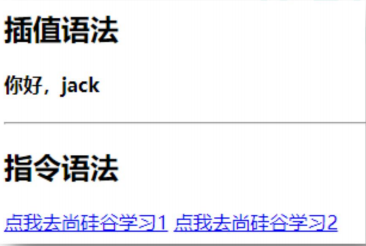
#### 1. 3. 2 .模板的理解

html中包含了一些JS语法代码，语法分为两种，分别为：
>1. 插值语法（双大括号表达式）
2. 指令（以v-开头）

#### 1. 3. 3 .插值语法

>1. 功能:用于解* 
2. 语法:{{xxx}}，xxxx会作为js表达式解析
#### 1. 3. 4 .指令语法

>1. 功能:解析标签属性、解析标签体内容、绑定事件
2. 举例：v-bind:href='xxxx'，xxxx会作为js表达式被解析
3. 说明：Vue中有有很多的指令，此处只是用v-bind举个例子
### 1. 4 .数据绑定

#### 1. 4. 1 .效果
  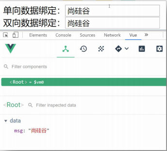

#### 1. 4. 2 .单向数据绑定

>1 .语法：v-bind:href="xxx"或简写为:href <br>
2 .特点：数据只能从data流向页面

#### 1. 4. 3 .双向数据绑定

>1 .语法：v-mode:value="xxx"或简写为v-model="xxx"<br>
2 .特点：数据不仅能从data流向页面，还能从页面流向data
### 1. 5 .MVVM模型

>1 .M：模型(Model)：对应data中的数据<br>
2 .V：视图(View)：模板<br>
3 .VM：视图模型(ViewModel)：Vue实例对象

  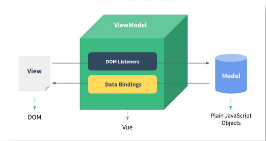

### 1. 6 .事件处理

#### 1. 6. 1 .效果
  
#### 1. 6. 2 .绑定监听

>1 .v-on:xxx="fun"<br>
2 .@xxx="fun"<br>
3 .@xxx="fun(参数)"<br>
4 .默认事件形参:event<br>
5 .隐含属性对象:$event
#### 1. 6. 3 .事件修饰符

>1 ..prevent:阻止事件的默认行为event.preventDefault()<br>
2 ..stop:停止事件冒泡event.stopPropagation()

#### 1. 6. 4 .按键修饰符

>1 .keycode:操作的是某个keycode值的键<br>
2 ..keyName:操作的某个按键名的键(少部分)
### 1. 7 .计算属性与监视

#### 1. 7. 1 .效果
  
#### 1. 7. 2 .计算属性-computed

>1. 要显示的数据不存在，要通过计算得来。
2. 在computed对象中定义计算属性。
3. 在页面中使用{{方法名}}来显示计算的结果。

#### 1. 7. 3 .监视属性-watch

  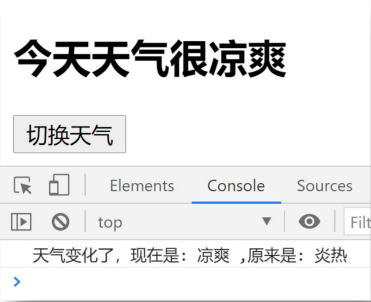

>1. 通过通过vm对象的$watch()或watch配置来监视指定的属性
2. 当属性变化时,回调函数自动调用,在函数内部进行计算

### 1. 8 .class与style绑定

#### 1. 8. 1 .理解

###### 1. 在应用界面中,某个(些)元素的样式是变化的

###### 2. class/style绑定就是专门用来实现动态样式效果的技术

#### 1. 8. 2 .class绑定

>1. :class='xxx'
2. 表达式是字符串:'classA'
3. 表达式是对象:{classA:isA,classB:isB}
4. 表达式是数组:['classA','classB']

#### 1. 8. 3 .style绑定

>1. :style="{color:activeColor,fontSize:fontSize+'px'}"
2. 其中activeColor/fontSize是data属性

### 1. 9 .条件渲染

#### 1. 9. 1 .条件渲染指令

>1. v-if与v-else
2. v-show

#### 1. 9. 2 .比较v-if与v-show

>1. 如果需要频繁切换v-show较好
2. 当条件不成立时,v-if的所有子节点不会解析(项目中使用)

### 1. 10 .列表渲染

#### 1. 10. 1 .效果

  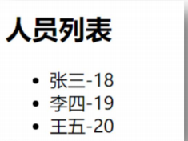

  

  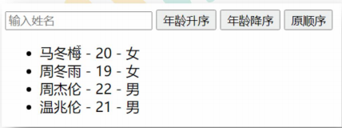

#### 1. 10. 2 .列表显示指令

> 遍历数组:v-for/index <br>
遍历对象:v-for/key

### 1. 11 .收集表单数据
  
### 1. 12 .过滤器

#### 1. 12. 1 .效果
  

#### 1. 12. 2 .理解过滤器

###### 1. 功能:对要显示的数据进行特定格式化后再显示

###### 2. 注意:并没有改变原本的数据,是产生新的对应的数据

### 1. 13 .内置指令与自定义指令

#### 1. 13. 1 .常用内置指令

* 1 .v-text:更新元素的textContent
* 2 .v-html:更新元素的innerHTML
* 3 .v-if:如果为true,当前标签才会输出到页面
* 4 .v-else:如果为false,当前标签才会输出到页面
* 5 .v-show:通过控制display样式来控制显示/隐藏
* 6 .v-for:遍历数组/对象
* 7 .v-on:绑定事件监听,一般简写为@
* 8 .v-bind:绑定解析表达式,可以省略v-bind
* 9 .v-model:双向数据绑定
* 10 .v-cloak:防止闪现,与css配合:[v-cloak]{display:none}


#### 1. 13. 2 .自定义指令

###### 1. 注册全局指令

```
Vue.directive('my-directive',function(el,binding){
el.innerHTML=binding.value.toupperCase()
})
```
**2. 注册局部指令**
```
directives:{
'my-directive':{
bind(el,binding){
el.innerHTML=binding.value.toupperCase()
        }
    }
}
1 ) 使用指令
v-my-directive='xxx'
```

### 1. 14 .Vue实例生命周期

#### 1. 14. 1 .效果
  

#### 1. 14. 2 .生命周期流程图
  
#### 1. 14. 3 .vue生命周期分析

###### 1 ) 初始化显示

> beforeCreate() <br>
> created()<br>
> beforeMount()<br>
> mounted()<br>

###### 2 ) 更新状态:this.xxx=value

> beforeUpdate()<br>
> updated()


###### 3 ) 销毁vue实例:vm.$destory()

>beforeDestory()<br>
destoryed()

#### 1. 14. 4 .常用的生命周期方法

> 1. mounted():发送ajax请求,启动定时器等异步任务<br>
2. beforeDestory():做收尾工作,如:清除定时器

## 第 2 章：Vue组件化编程

### 2. 1 模块与组件、模块化与组件化

#### 2. 1. 1 .模块

>1. 理解:向外提供特定功能的js程序,一般就是一个js文件
2. 为什么: js文件很多很复杂
3. 作用:复用js,简化js的编写,提高js运行效率

#### 2. 1. 2 .组件

>1. 理解:用来实现局部(特定)功能效果的代码集合(html/css/js/image.....)
2. 为什么:一个界面的功能很复杂
3. 作用:复用编码,简化项目编码,提高运行效率

#### 2. 1. 3 .模块化

>当应用中的js都以模块来编写的,那这个应用就是一个模块化的应用。
#### 2. 1. 4 .组件化

###### 当应用中的功能都是多组件的方式来编写的,那这个应用就是一个组件化的应用,。

### 2. 2 .非单文件组件

>1. 模板>
>2. 没有构建过程,无法将ES 6 转>
>3. 不支持>
>4. 真正开发中几乎不用

### 2. 3 .单文件组件

#### 2. 3. 1 .一个.vue文件的组成( 3 个部分)

###### 1. 模板页面

```
<template>
  页面模板
</template>
```

###### 2. JS模块对象

```js
<script>
exportdefault{
    data(){return{}},
    methods:{},
    computed:{},
    components:{}
}
</script>
```

**3. 样式**
```css
<style>
    样式定义
</style>
```

#### 2. 3. 2 .基本使用

>1. 引入组件
>2. 映射成标签
>3. 使用组件标签


## 第 3 章：使用Vue脚手架

### 3. 1 初始化脚手架

#### 3. 1. 1 说明

>1. Vue脚手架是Vue官方提供的标准化开发工具（开发平台）。
2. 最新的版本是 4 .x。
3. 文档:https://cli.vuejs.org/zh/。

### 3. 1. 2 具体步骤

第一步（仅第一次执行）：全局安装@vue/cli。
```
npm install -g @vue/cli
```
第二步： **切换到你要创建项目的目录** ，然后使用命令创建项目
```
vue create xxxx
```
第三步：启动项目
```
npm run serve
```
备注：
1. 如ht出tp现s:/下/re载g缓ist慢ry请.n配pm置.tanopbmao淘.o宝rg镜像：npm config set registry

2. Vue脚手架隐藏了所有webpack相关的配置，若想查看具体的webpakc配置，
请执行：vue inspect > output.js

#### 3. 1. 3 模板项目的结构

##### ├──node_modules

##### ├──public

##### │ ├──favicon.ico:页签图标

##### │ └──index.html:主页面

##### ├──src

##### │ ├──assets:存放静态资源

##### │ │ └──logo.png

##### │ │──component:存放组件

##### │ │ └──HelloWorld.vue

##### │ │──App.vue:汇总所有组件

##### │ │──main.js:入口文件

##### ├──.gitignore:git版本管制忽略的配置

##### ├──babel.config.js:babel的配置文件

##### ├──package.json:应用包配置文件

##### ├──README.md:应用描述文件

##### ├──package-lock.json：包版本控制文件


### 3. 2 ref与props

### ref

###### 1 .作用： 用于给节点打标识

>2 .读取方式： this.$refs.xxxxxx
### props

###### 1. 作用： 用于父组件给子组件传递数据

###### 2. 读取方式一:只指定名称

```
props:['name','age','setName']
3. 读取方式二:指定名称和类型
props:{
    name:String,
    age:Number,
    setNmae:Function
}
4. 读取方式三:指定名称/类型/必要性/默认值
props:{
    name:{type:String,required:true,default:xxx},
}
```
### 3. 3 混入

>1. Vue插件是一个包含install方法的对象
2. 通过install方法给Vue或Vue实例添加方法,定义全局指令等

### 3. 4 插件

>1. Vue插件是一个包含install方法的对象
2. 通过install方法给Vue或Vue实例添加方法,定义全局指令等

### 3. 5 Todo-list案例
  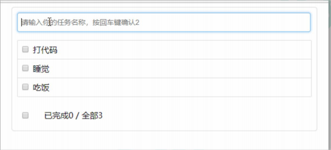
#### 组件化编码流程（通用）

* 1 .实现静态组件：抽取组件，使用组件实现静态页面效果<br>
* 2 .展示动态数据：
    * 2. 1 .数据的类型、名称是什么？
    * 2. 2 .数据保存在哪个组件？
* 3 .交互——从绑定事件监听开始


### 3. 6 Vue中的自定义事件

#### 绑定事件监听
```
<Header @addTodo="addTodo"/> 

或者<Header ref="header"/> 
this.$refs.header.$on('addTodo', this.addTodo)
```
#### 触发事件
```
this.$emit('addTodo', todo)
```
### 3. 7 全局事件总线

#### 3. 7. 1 理解

* 1. Vue原型对象上包含事件处理的方法
    * 1 ) $on(eventName,listener):绑定自定义事件监听
    * 2 ) $emit(eventName,data):分发自定义事件
    * 3 ) $off(eventName):解绑自定义事件监听
    * 4 ) $once(eventName,listener):绑定事件监听,但只能处理一次
* 2. 所有组件实例对象的原型对象的原型对象就是Vue的原型对象
    * 1 ) 所有组件对象都能看到Vue原型对象上的属性和方法
    * 2 ) Vue.prototype.$bus=newVue(),所有的组件对象都能看到$bus这个属性对象
* 3. 全局事件总线
    * 1 ) 包含事件处理相关方法的对象(只有一个)
    * 2 ) 所有的组件都可以得到

#### 3. 7. 2 指定事件总线对象

```
new Vue({ 
    beforeCreate () { // 尽量早的执行挂载全局事件总线对象的操作 Vue.prototype.$globalEventBus = this 
    }, 
    }).$mount('#root')
```
#### 3. 7. 3 绑定事件

```
this.$globalEventBus.$on('deleteTodo', this.deleteTodo)
```

#### 3. 7. 4 分发事件

```
this.$globalEventBus.$emit('deleteTodo', this.index)
```

#### 3. 7. 5 解绑事件

```
this.$globalEventBus.$off('deleteTodo')
```

### 3. 8 消息订阅与发布

#### 3. 8. 1 理解

* 1 .这种方式的思想与全局事件总线很相似
* 2 .它包含以下操作:
    * ( 1 ) 订阅消息--对应绑定事件监听
    * ( 2 ) 发布消息--分发事件
    * ( 3 ) 取消消息订阅--解绑事件监听
* 3 .需要引入一个消息订阅与发布的第三方实现库: **PubSubJS**

#### 3. 8. 2 使用PubSubJS

* 1 .在线文档:https://github.com/mroderick/PubSubJS
* 2 .下载:npminstall-Spubsub-js
* 3 .相关语法
    * ( 1 ) importPubSubfrom'pubsub-js' //引入
    * ( 2 ) PubSub.subscribe(‘msgName’,functon(msgName,data){})
    * ( 3 ) PubSub.publish(‘msgName’,data):发布消息,触发订阅的回调函数调用
    * ( 4 ) PubSub.unsubscribe(token):取消消息的订阅


### 3. 9 过度与动画

#### 3. 9. 1 效果
  
#### 3. 9. 2 vue动画的理解

* 1 .操作css的trasition或animation
* 2 .vue会给目标元素添加/移除特定的class
* 3 .过渡的相关类名：
    * 1 .xxx-enter-active:指定显示的transition
    * 2 .xxx-leave-active:指定隐藏的transition
    * 3 .xxx-enter/xxx-leave-to:指定隐藏时的样式

  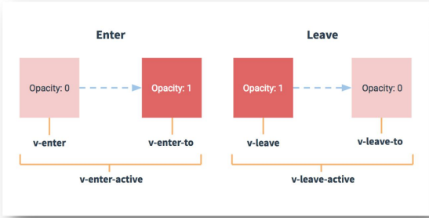

#### 3. 9. 3 基本过渡动画的编码

* 1. 在目标元素外包裹<transitionname="xxx">
* 2. 定义class样式
    * a) 指定过渡样式:transition
    * b) 指定隐藏时的样式:opacity/其它

## 第 4 章：Vue中的ajax

### 4. 1 解决开发环境Ajax跨域问题

###### 使用代理服务器


### 4. 2 github用户搜索案例

### 4. 2. 1 效果
  
### 4. 2. 2 接口地址

>https://api.github.com/search/users?q=xxx

### 4. 3 vue项目中常用的 2 个Ajax库

#### 4. 3. 1 axios

通用的Ajax请求库,官方推荐，使用广泛

#### 4. 3. 2 vue-resource

vue插件库,vue 1 .x使用广泛， **官方已不维护。**


### 4. 4 slot插槽

#### 4. 4. 1 效果

效果一（不使用插槽）：

  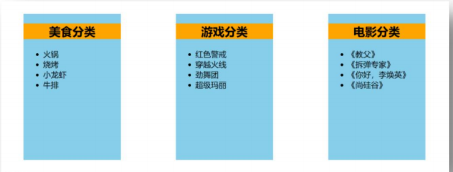

效果二（默认插槽）：

  

效果三（具名插槽）：

  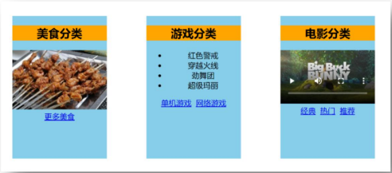

效果三（作用域插槽）：

  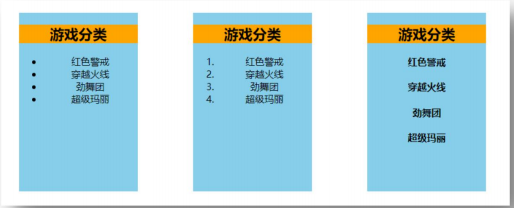

#### 4. 4. 1 理解

###### 父组件向子组件传递带数据的标签，当一个组件有不确定的结构时,就需要使用

slot技术，注意：插槽内容是在父组件中编译后,再传递给子组件的。

#### 4. 4. 2 分类

* 1 .默认插槽
* 2 .命名插槽
* 3 .作用域插槽


## 第 5 章：vuex

### 5. 1 理解vuex

#### 5. 1. 1 vuex是什么

>1. 概念：专门在Vue中实现集中式状态（数据）管理的一个Vue插件，对vue应
用中多个组件的共享状态进行集中式的管理（读/写），也是一种组件间通信的方
式，且适用于任意组件间通信。
2. Github地址:https://github.com/vuejs/vuex

#### 5. 1. 2 什么时候使用Vuex

* 1 .多个组件依赖于同一状态
* 2 .来自不同组件的行为需要变更同一状态

#### 5. 1. 3 案例
  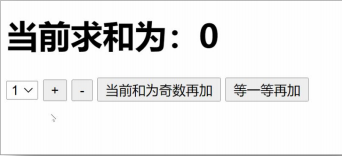

#### 5. 1. 4 Vuex工作原理图
  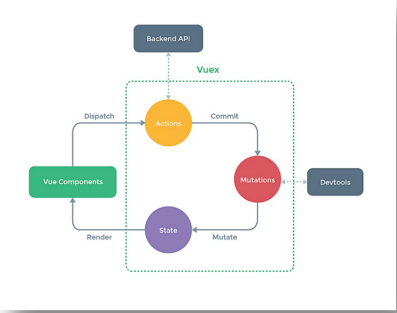
### 5. 2 vuex核心概念和API

### 5. 2. 1 state

* 1 .vuex管理的状态对象
* 2 .它应该是唯一的
* 3 .示例代码：
### 5. 2. 2 actions

* 1 .值为一个对象，包含多个响应用户动作的回调函数
* 2 .通过commit()来触发mutation中函数的调用,间接更新state
* 3 .如何触发actions中的回调？在组件中使用: $store.dispatch('对应的action回调名') 触发
* 4 .可以包含异步代码（定时器,ajax等等）
* 5 .示例代码：
### 5. 2. 3 mutations

* 1 .值是一个对象，包含多个直接更新state的方法
* 2 .谁能调用mutations中的方法？如何调用？在action中使用： commit('对应的mutations方法名') 触发
* 3 .mutations中方法的特点：不能写异步代码、只能单纯的操作state
* 4 .示例代码：
### 5. 2. 4 getters
* 1 .值为一个对象，包含多个用于返回数据的函数
* 2 .如何使用？—— $store.getters.xxx
* 3 .示例代码：


### 5. 2. 5 modules

* 1 .包含多个module
* 2 .一个module是一个store的配置对象
* 3 .与一个组件（包含有共享数据）对应
## 第 6 章：vue-router

### 6. 1 相关理解

#### 6. 1. 1 vue-router的理解

```
vue的一个插件库，专门用来实现SPA应用
```
#### 6. 1. 2 对SPA应用的理解

>1. 单页Web应用（singlepagewebapplication，SPA）。
2. 整个应用只有 一个完整的页面 。
3. 点击页面中的导航链接 不会刷新 页面，只会做页面的 局部更新。
4. 数据需要通过ajax请求获取。

#### 6. 1. 3 路由的理解

###### 1. 什么是路由?

* 1. 一个路由就是一组映射关系（key-value）
    * 2. key为路径,value可能是function或component
    * 2. 路由分类
* 2. 后端路由：
    * 1 ) 理解：value是function,用于处理客户端提交的请求。
    * 2 ) 工作过程：服务器接收到一个请求时,根据 请求路径 找到匹配的 函数来处理请求,返回响应数据。
* 3. 前端路由：
    * 1 ) 理解：value是component，用于展示页面内容。
    * 2 ) 工作过程：当浏览器的路径改变时,对应的组件就会显示。

### 6. 2 基本路由

#### 6. 2. 1 效果
  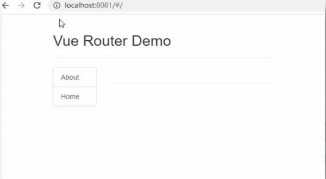
#### 6. 2. 2 总结:编写使用路由的 3 步

* 1. 定义路由组件
* 2. 注册路由
* 3. 使用路由


### 6. 3 嵌套（多级）路由
  
### 6. 4 路由传参

  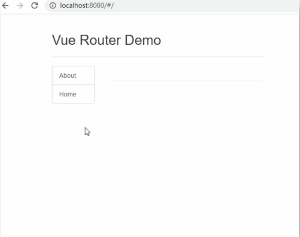
### 6. 5 编程式路由导航
  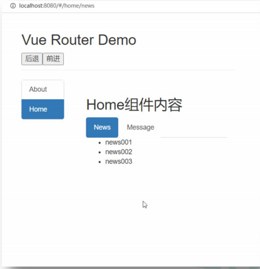
##### 相关API：

>1. this.$router.push(path):相当于点击路由链接(可以返回到当前路由界面)
2. this.$router.replace(path):用新路由替换当前路由(不可以返回到当前路由界面)
3. this.$router.back():请求(返回)上一个记录路由
4. this.$router.go(- 1 ):请求(返回)上一个记录路由
5. this.$router.go( 1 ):请求下一个记录路由


## 第 7 章：Vue UI组件库

#### 7. 1 移动端常用UI组件库

>1. Vant https://youzan.github.io/vant
2. CubeUI https://didi.github.io/cube-ui
3. MintUI [http://mint-ui.github.io](http://mint-ui.github.io)

#### 7. 2 PC端常用UI组件库

>1. ElementUI https://element.eleme.cn
2. IViewUI https://www.iviewui.com
3. Ant Design of Vue https://www.antdv.com/


