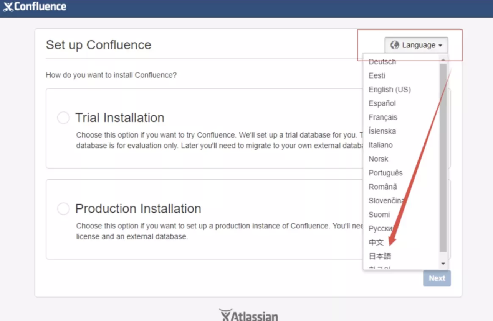
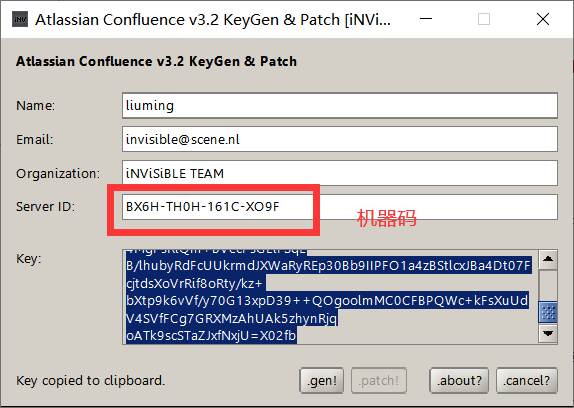

#
# 1. docker下载confluence image 7.2.0并创建和运行该容器
```
docker run --detach --publish 8090:8090 cptactionhank/atlassian-confluence:7.2.0
```

# 2.访问http://ip:8090/ 就可以看到Confluence的初始化和配置页面。
  

# 3. 选择中文->next->选择“产品安装”->跳过插件安装->进入授权码界面 （这时大部分安装文件已经存在，可以开始破解。这里要记下服务器ID，破解时要用到）

  

  > 访问 ip:8090 记录下server id

> //从容器中复制下来

> 复制配置文件:

>sudo docker cp  d45ec455a4f7:/opt/atlassian/confluence/confluence/WEB-INF/lib/atlassian-extras-decoder-v2-3.4.1.jar ./atlassian-extras-2.4.jar

>//下载到本地(可以使用xftp也可以下载)

>sz atlassian-extras-2.4.jar ( 该破解器只认识这个名称)

>//下破解工具 链接: https://pan.baidu.com/s/1i3qJlCGpelNsx6KRIcUniA 提取码: kpax 

>解压后运行confluence_keygen.jar点.path 选择atlassian-extras-2.4.jar 破解成功同目录显示atlassian-extras-2.4.jar.bak

> ① 打开下载的破解工具，运行confluence_keygen.jar <br>
②将记录的server ID填入，Name随便填。<br>
③点击gen, 生成key并记录。<br>
④点击patch，选择刚下传到本地的atlassian-extras-2.4.jar文件进行破解.<br>
OK，破解完成后，将破解后的文件传回服务器（不要关闭破解工具，过会需复制key里面的密钥） <br><br>
  

```
//把atlassian-extras-2.4.jar 文件上传到服务器//然后复制到容器中
sudo docker cp  ./atlassian-extras-2.4.jar d45ec455a4f7:/opt/atlassian/confluence/confluence/WEB-INF/lib/atlassian-extras-decoder-v2-3.4.1.jar //停止重启
```
# 4.重启confluence容器
```
docker restart yourConfluenceContainer
```

# 5.继续访问ip:8090, 拷贝黏贴刚生成的key. 然后next,进入数据库选择。

# 6. 准备创建一个空的数据库confluencedb, 连接mysql. 参考https://www.cnblogs.com/JeremyWYL/p/8302438.html

```
CREATE DATABASE <database-name> CHARACTER SET utf8 COLLATE utf8_bin;
GRANT ALL PRIVILEGES ON <database-name>.* TO '<confluenceuser>'@'localhost' IDENTIFIED BY '<password>';
GRANT ALL PRIVILEGES ON <database-name>.* TO '<confluenceuser>'@'%' IDENTIFIED BY '<password>';
flush privileges;
```

# 7. 数据库url：
```
jdbcd:mysql://<dbserver>:3306/<database-name>?userUnicode=true&characterEncoding=UTF-8
```

# 8.测试成功后就可以了。

mysql的配置文件中设置解决不正确的隔离级别的问题和其他问题。
Confluence设置MySQL数据库报错：必须使用'READ-COMMITTED'作为默认隔离级别。
解决方案：

```
mysql -u root -p123456

SET GLOBAL tx_isolation='READ-COMMITTED';
```