## 1.Git下载地址：https://git-scm.com/
  

## 2.git解决每次拉取代码都需要用户名密码
* 1.执行`git config --global credential.helper store`，在~/.gitconfig目录下会多出一个文件，这里会记录你的密码和帐号；
* 2.再执行git pull 输入一次正确的帐号密码之后就不用再输入了。


## 3.提交项目到github上（通过先下载仓库的目录在到目录下创建文件在上传）
```shell
用户名
git config --global user.name 694475668

邮箱
git config --global user.email 694475668@qq.com

下载github上那个CRM文件库
git clone git@github.com:694475668/CRM.git

进入到下载下来的目录中
cd CRM
在CRM下创建文件或者吧项目移动进来,或者使用git init进行版本库关联

```
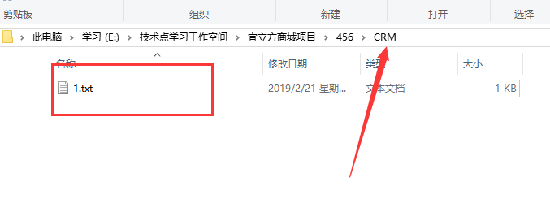

```
把单个文件添加到暂存区通过git status 命令查看没有被追踪的文件使用git add 文件名  来进行追踪
git add *

git status   获取文件的状态有没有被追踪

把暂存区的文件提交到版本库
git commit -m "first commit"

git pull --rebase origin master 

提交到github网站上
git push -u origin master
```


## 4.直接把项目的文件上传到github（直接把项目上传不需要下载仓库的目录）
```shell
在当前文件夹点击右键git bash here 在输入命令git init的意思就是把当前文件夹变成能够被git服务层操作的版本控制空的仓库
git init
把单个文件添加到暂存区通过git status 命令查看没有被追踪的文件使用git add 文件名  来进行追踪
git add *
把暂存区的文件提交到版本库
git status   获取文件的状态有没有被追踪
git commit -m "first commit"
添加仓库地址
git remote add  git@gitee.com:liuming19950714/supernote.git
提交到github网站上
git push -u origin master
```

`换新的仓库地址出现usage: git remote add [<options>] <name> <url> -f, --fetch fetch the remote branches --tags import all tags and associated objects when fetching`

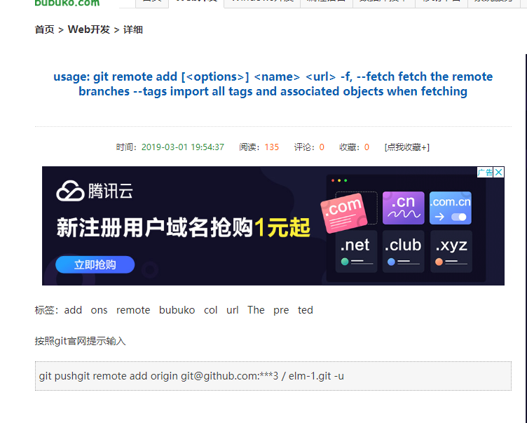

按照git官网提示输入
```shell
1、先输入 git remote rm origin
2、再输入 git remote add origin
3. git pull --rebase origin master   先合并在执行  git push -u origin master
在执行推送就可以了
```
## `5.如何解决failed to push some refs to git`
 
>出现错误的主要原因是github中的README.md文件不在本地代码目录中<br>
可以通过如下命令进行代码合并【注：pull=fetch+merge]<br>
```
git pull --rebase origin master
```
执行上面代码后可以看到本地代码库中多了README.md文件<br>
此时再执行语句 git push -u origin master即可完成代码上传到github<br>


## 6.Eclipse上传项目到github
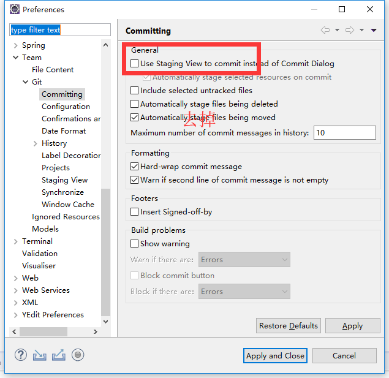

在项目下右键输入命令
在当前文件夹点击右键git bash here 在输入命令git init的意思就是把当前文件夹变成能够被git服务层操作的版本控制空的仓库
```shell
git init
添加仓库地址
git remote add origin git@gitee.com:liuming19950714/springboot.git
```
提交

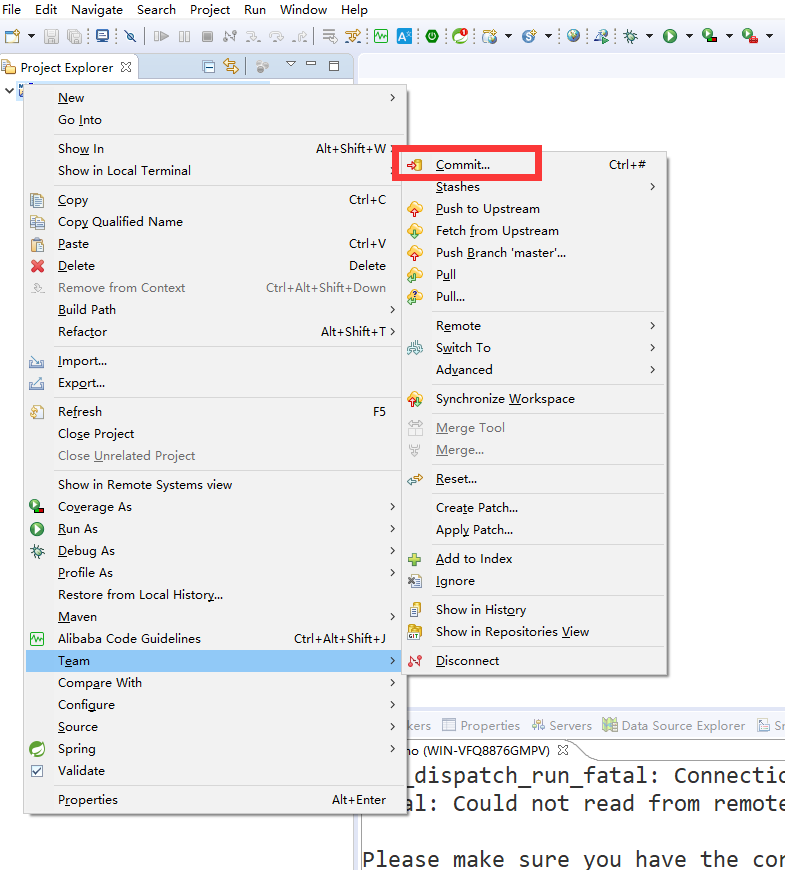

提交并推送记得点第一个

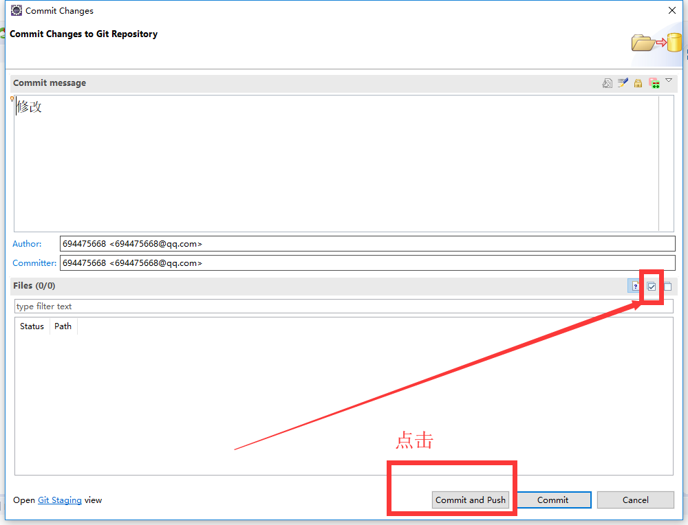

推送到服务器上

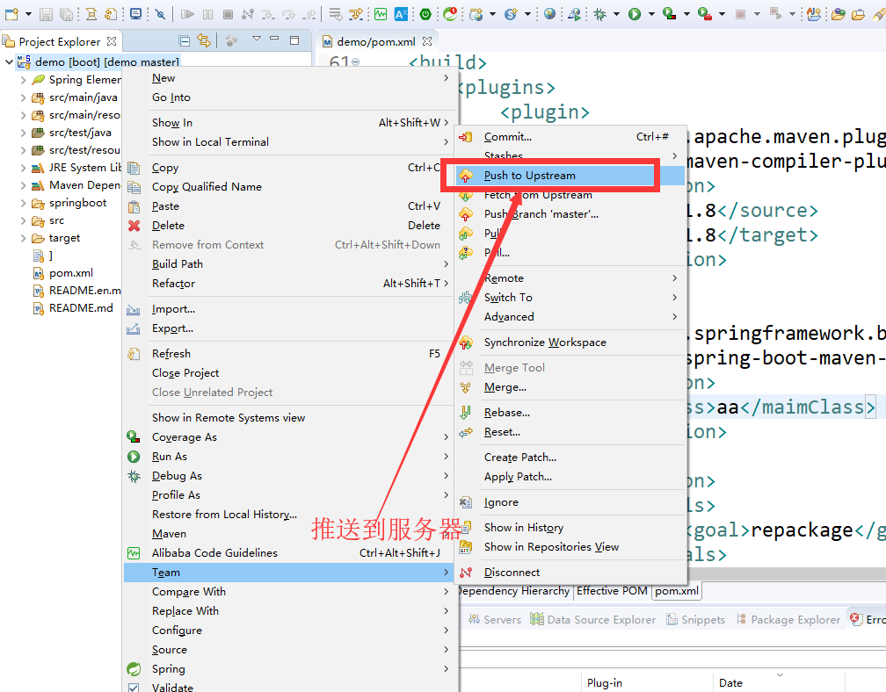

强推
Git错误non-fast-forward后的冲突解决

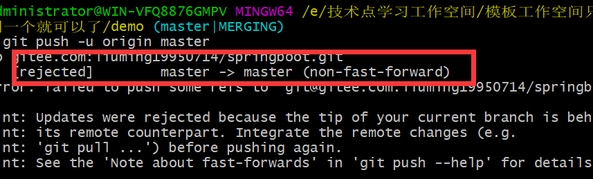

```shell
可以通过以下方式解决
git pull --rebase origin master
执行后可以看到本地代码中多了README.md文件
再次执行git push origin master即可完成代码上传
```

## 7.去除git版本控制
```
find . -name ".git" | xargs rm -Rf
```
## 8.Eclipse下载项目到Eclipse


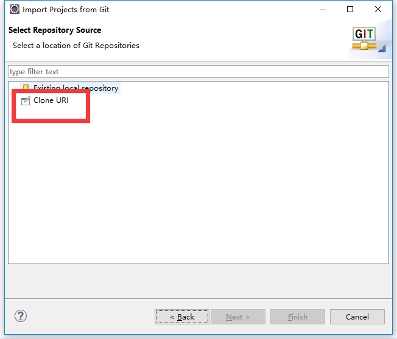

下载代码到本地目录中，在进行导入

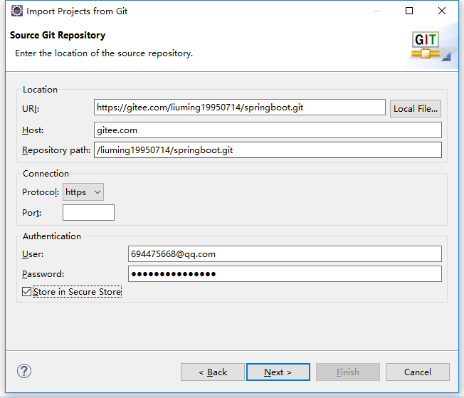

导入


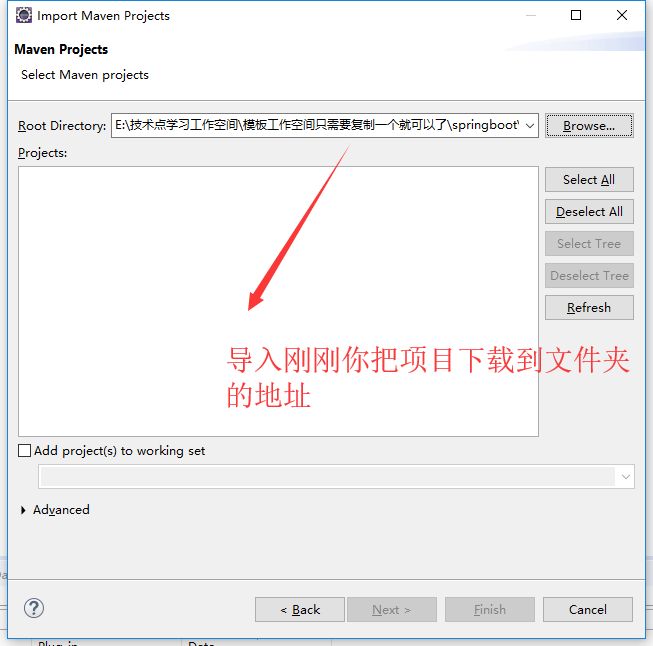

## 9.在使用Git把当前分支合并到master提示“Already up-to-date”，但当前分支和 master 分支代码不同步。
###### 假设当前分支是：dev，主分支是：master。
解决方法：
```shell
git checkout master；
git reset --hard dev;
git push --force origin master
```
## 10.Git命令回退版本
```shell
1、做了部分修改，觉得改错了，回退回修改前的状态：（回退到当前版本的初始状态）
git reset --hard HEAD
2、回退到当前版本的前一个版本
git reset --hard HEAD^
3、回退到当前版本的上上个版本
git reset --hard HEAD^^
4、回退到当前版本之前的100个版本
git reset --hard HEAD~100
```

## 11.Git撤销操作：
```shell
git commit --amend 撤销上一次的提交,并将暂存区的文件重新提交
git checkout -- index.html   撤销文件的修改,意思是把修改的文件撤销为上一次修改之前的
git chackout -- .        撤销文件的修改,意思是把所有修改的文件撤销为上一次修改之前的
git reset head index.html  把暂存区文件撤销到工作区 
```   

## 12.Git分支：
```
git branch     查看所有分支
git branch dev   创建分支
git checkout dev  切换分支
git branch -d dev  删除分支
git checkout -b dev  创建分支并切换到dev  分支
远程仓库：
git remote     查看远程仓库
git remote -v    查看远程地址

命令：git remote remove <远程库名>
实例：git remote remove origen 删除远程库

命令：git remote add <远程库名> <远程库地址>
实例：git remote add origen http://git.oschina.net/lianshou/test.git
网址：https://github.com/login
```

## 13.出现下载远程仓库SSH链接出现以下怎么解决：  


步骤一：解决方法：命令ssh-keygen   生成密钥直接按回车就行：

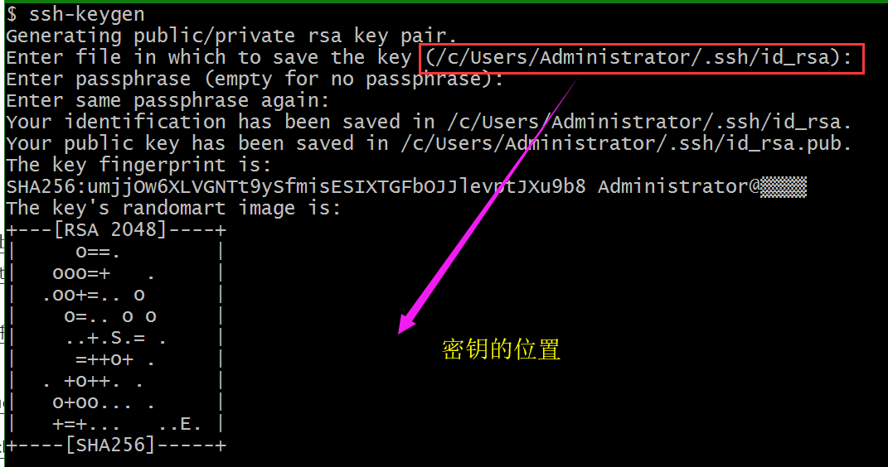

步骤二：在打开C:\Users\Administrator\.ssh当前密钥的位置：

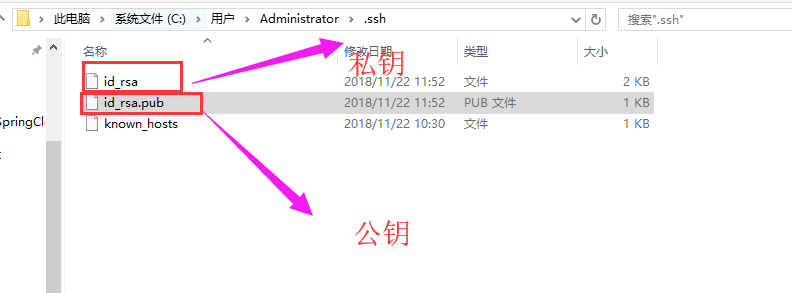

步骤三：打开公钥进行复制里面的文件：

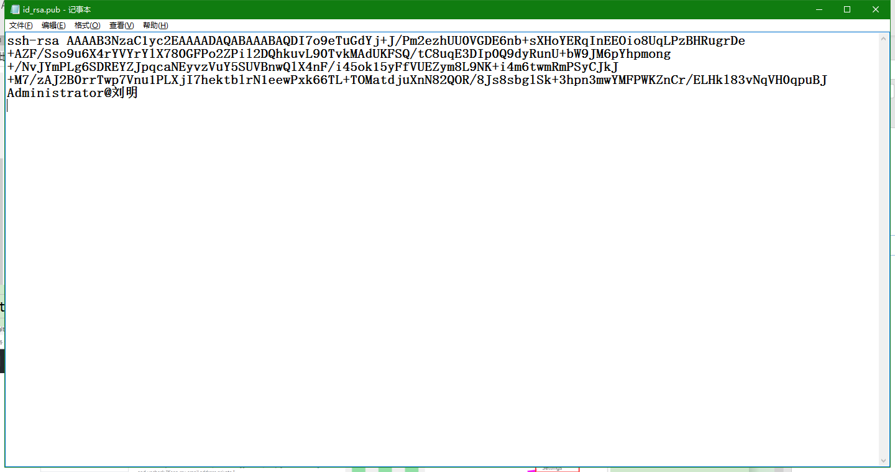

步骤四：点击github官网的settting:

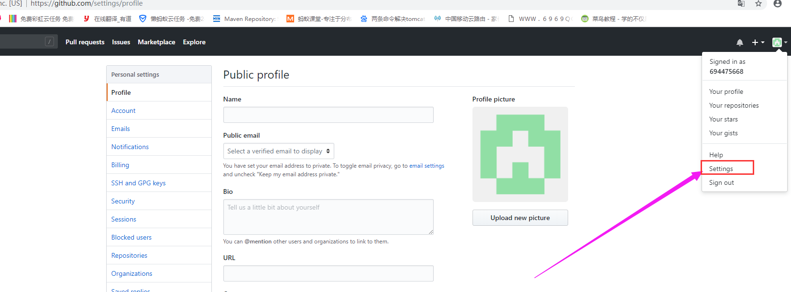

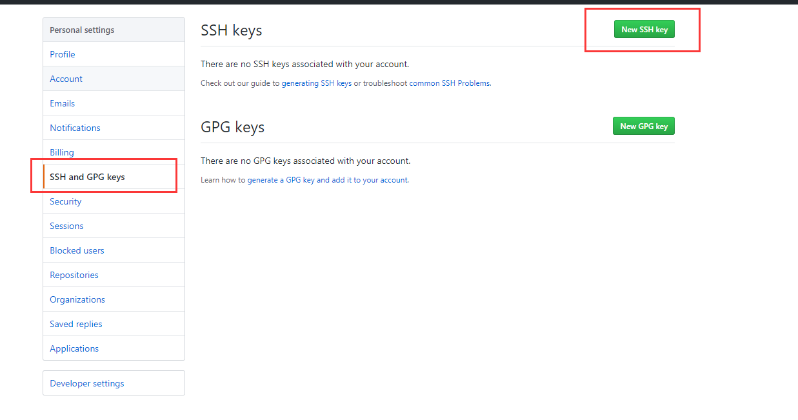

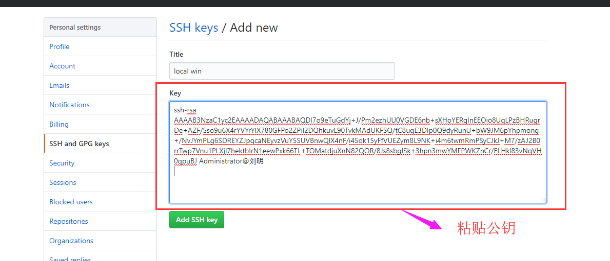

然后在去运行git clone git@gitee.com:liuming19950714/liu_ming.git

