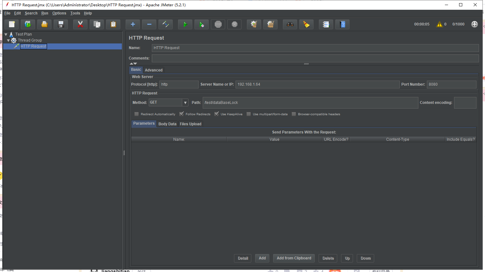

#
# 1、为什么要用分布式锁？
>在一些高并发的场景中，比如秒杀，抢票，抢购这些场景，都存在对核心资源，商品库存的争夺，控制不好，库存数量可能被减少到负数，出现超卖的情况，或者 产生唯一的一个递增ID，由于web应用部署在多个机器上，简单的同步加锁是无法实现的，给数据库加锁的话，对于高并发，1000/s的并发，数据库可能由行锁变成表锁，性能下降会厉害。这个时候就需要用分布式锁了实现分布式锁的方式很多，我们今天就用redis的分布式锁，redisson也是官方比较推荐的。当然我们其实也可以自己用redis的setntx,delete方式自己写一个。

# 2、分布式锁的实现方式
大概有三种：

* 基于关系型数据库（基于mysql数据库的分布式锁）
* 基于缓存（基于redis的redisson实现分布式锁）
* 基于zookeeper（基于zookeeper实现分布式锁）

大部分网站使用的是基于缓存的，有更好的性能，而缓存一般是以集群方式部署，保证了高可用性。

# 3、原理
>在Redisson中，使用key来作为是否上锁的标志，当通过getLock(String key)方法获得相应的锁之后，这个key即作为一个锁存储到Redis集群中，在接下来如果有其他的线程尝试获取名为key的锁时，便会向集群中进行查询，如果能够查到这个锁并发现相应的value的值不为0，则表示已经有其他线程申请了这个锁同时还没有释放，则当前线程进入阻塞，否则由当前线程获取这个锁并将value值加一，如果是可重入锁的话，则当前线程每获得一个自身线程的锁，就将value的值加一，而每释放一个锁则将value值减一，直到减至0，完全释放这个锁。因为底层是基于分布式的Redis集群，所以Redisson实现了分布式的锁机制。

# 4、redis实现分布式锁
### 1、引入Maven依赖
```xml
<dependencies>
        <dependency>
            <groupId>org.springframework.boot</groupId>
            <artifactId>spring-boot-starter</artifactId>
        </dependency>
        <dependency>
            <groupId>org.redisson</groupId>
            <artifactId>redisson-spring-boot-starter</artifactId>
            <version>3.16.7</version>
        </dependency>
        <dependency>
            <groupId>org.springframework.boot</groupId>
            <artifactId>spring-boot-starter-test</artifactId>
            <scope>test</scope>
        </dependency>
        <dependency>
            <groupId>junit</groupId>
            <artifactId>junit</artifactId>
            <version>4.13.1</version>
            <scope>compile</scope>
        </dependency>
        <dependency>
            <groupId>org.springframework.boot</groupId>
            <artifactId>spring-boot-test</artifactId>
            <version>2.6.2</version>
            <scope>compile</scope>
        </dependency>
        <dependency>
            <groupId>org.projectlombok</groupId>
            <artifactId>lombok</artifactId>
            <version>RELEASE</version>
            <scope>compile</scope>
        </dependency>
        <dependency>
            <groupId>org.springframework</groupId>
            <artifactId>spring-test</artifactId>
            <version>5.3.14</version>
            <scope>compile</scope>
        </dependency>
    </dependencies>
```

### 2、yml配置
* 第一种配置方式是创建redisson.yaml文件

application.yml
```yml
spring:
  redis:
    redisson:
      file: classpath:redisson.yaml
```
创建redisson.yaml
```yml
singleServerConfig:
  idleConnectionTimeout: 10000
  connectTimeout: 10000
  timeout: 3000
  retryAttempts: 3
  retryInterval: 1500
  password: null
  subscriptionsPerConnection: 5
  clientName: null
  address: "redis://127.0.0.1:6379"
  subscriptionConnectionMinimumIdleSize: 1
  subscriptionConnectionPoolSize: 50
  connectionMinimumIdleSize: 24
  connectionPoolSize: 64
  database: 0
  dnsMonitoringInterval: 5000
threads: 16
nettyThreads: 32
codec: !<org.redisson.codec.MarshallingCodec> {}
transportMode: "NIO"
```

* 第二种配置方式

application.yml
```yml
spring:
  redis:
   redisson: 
      config: |
        clusterServersConfig:
          idleConnectionTimeout: 10000
          connectTimeout: 10000
          timeout: 3000
          retryAttempts: 3
          retryInterval: 1500
          failedSlaveReconnectionInterval: 3000
          failedSlaveCheckInterval: 60000
          password: null
          subscriptionsPerConnection: 5
          clientName: null
          loadBalancer: !<org.redisson.connection.balancer.RoundRobinLoadBalancer> {}
          subscriptionConnectionMinimumIdleSize: 1
          subscriptionConnectionPoolSize: 50
          slaveConnectionMinimumIdleSize: 24
          slaveConnectionPoolSize: 64
          masterConnectionMinimumIdleSize: 24
          masterConnectionPoolSize: 64
          readMode: "SLAVE"
          subscriptionMode: "SLAVE"
          nodeAddresses:
          - "redis://127.0.0.1:7004"
          - "redis://127.0.0.1:7001"
          - "redis://127.0.0.1:7000"
          scanInterval: 1000
          pingConnectionInterval: 0
          keepAlive: false
          tcpNoDelay: false
        threads: 16
        nettyThreads: 32
        codec: !<org.redisson.codec.MarshallingCodec> {}
        transportMode: "NIO"
```

### [单机，集群，哨兵，主从 文档配置地址](https://github.com/redisson/redisson/wiki/Table-of-Content)

### 可用的 Spring Bean

* RedissonClient
* RedissonRxClient
* RedissonReactiveClient
* RedisTemplate
* ReactiveRedisTemplate


#### 3、测试
```java
@Slf4j
@RunWith(SpringRunner.class)
@SpringBootTest
public class RedissonSpringBootStarterApplicationTests {
    @Resource
    private RedissonClient redissonClient;

    @Test
    public void start() {
        RLock lock = redissonClient.getLock("test");
        try {
            // 等待时间
            long waitTime = 3;
            // 锁有效时间
            long leaseTime = 10;
            // 获取锁
            boolean tryLock = lock.tryLock(waitTime, leaseTime, TimeUnit.SECONDS);
            log.info("tryLock:{}", tryLock);
        } catch (InterruptedException e) {
            e.printStackTrace();
        } finally {
            if(lock.isLocked()) {
                if(lock.isHeldByCurrentThread()){
                    lock.unlock();
                }
            }
        }
    }
}
```

# 5、zookeeper实现分布式锁
### 1、引入Maven依赖
```xml
<dependencies>
       <dependency>
            <groupId>org.springframework.boot</groupId>
            <artifactId>spring-boot-starter</artifactId>
        </dependency>
        <dependency>
            <groupId>org.springframework.boot</groupId>
            <artifactId>spring-boot-starter-test</artifactId>
            <scope>test</scope>
        </dependency>
        <dependency>
            <groupId>junit</groupId>
            <artifactId>junit</artifactId>
            <version>4.13.1</version>
            <scope>compile</scope>
        </dependency>
        <dependency>
            <groupId>org.springframework.boot</groupId>
            <artifactId>spring-boot-test</artifactId>
            <version>2.6.2</version>
            <scope>compile</scope>
        </dependency>
        <dependency>
            <groupId>org.projectlombok</groupId>
            <artifactId>lombok</artifactId>
            <version>RELEASE</version>
            <scope>compile</scope>
        </dependency>
        <dependency>
            <groupId>org.springframework</groupId>
            <artifactId>spring-test</artifactId>
            <version>5.3.14</version>
            <scope>compile</scope>
        </dependency>
        <!-- zookeeper 客户端 -->
        <dependency>
            <groupId>org.apache.curator</groupId>
            <artifactId>curator-framework</artifactId>
            <version>4.3.0</version>
        </dependency>
        <dependency>
            <groupId>org.apache.curator</groupId>
            <artifactId>curator-recipes</artifactId>
            <version>4.3.0</version>
        </dependency>
    </dependencies>
```

### 2、yml配置

application.yml
```yml
zooClientIp: 192.168.1.64:2181
```

#### 3、测试

#### CuratorFrameworkConfig
```java
package com.example.demo;

import org.apache.curator.framework.CuratorFramework;
import org.apache.curator.framework.CuratorFrameworkFactory;
import org.apache.curator.framework.api.CuratorEvent;
import org.apache.curator.framework.api.CuratorEventType;
import org.apache.curator.framework.api.CuratorListener;
import org.apache.curator.retry.ExponentialBackoffRetry;
import org.apache.zookeeper.WatchedEvent;
import org.springframework.beans.factory.annotation.Autowired;
import org.springframework.context.annotation.Bean;
import org.springframework.context.annotation.Configuration;
import org.springframework.core.env.Environment;

/**
 * @DESCRIPTION
 * @Author bright
 * @Date 2021-06-04 15:00
 */
@Configuration
public class CuratorFrameworkConfig {

    @Autowired
    private Environment env;

    @Bean
    public CuratorFramework curatorFramework() {
        // ExponentialBackoffRetry是种重连策略，每次重连的间隔会越来越长,1000毫秒是初始化的间隔时间,3代表尝试重连次数。
        ExponentialBackoffRetry retry = new ExponentialBackoffRetry(1000, 3);
        // 创建client
        CuratorFramework curatorFramework = CuratorFrameworkFactory.newClient(env.getProperty("zooClientIp"), retry);
        // 添加watched 监听器
        curatorFramework.getCuratorListenable().addListener(new MyCuratorListener() {

        });
        curatorFramework.start();
        return curatorFramework;
    }


    public class MyCuratorListener implements CuratorListener {
        @Override
        public void eventReceived(CuratorFramework client, CuratorEvent event) throws Exception {
            CuratorEventType type = event.getType();
            if (type == CuratorEventType.WATCHED) {
                WatchedEvent watchedEvent = event.getWatchedEvent();
                String path = watchedEvent.getPath();
                System.out.println(watchedEvent.getType() + " -- " + path);
                // 重新设置改节点监听
                if (null != path) {
                    client.checkExists().watched().forPath(path);
                }
            }
        }
    }
}
```

#### ZkSpringBootStarterApplicationTest
```java
package com.example.demo;

import lombok.extern.slf4j.Slf4j;
import org.apache.curator.framework.CuratorFramework;
import org.apache.curator.framework.recipes.locks.InterProcessSemaphoreMutex;
import org.junit.Test;
import org.junit.runner.RunWith;
import org.springframework.beans.factory.annotation.Autowired;
import org.springframework.boot.test.context.SpringBootTest;
import org.springframework.test.context.junit4.SpringRunner;

import java.util.UUID;
import java.util.concurrent.TimeUnit;

/**
 * @author bright
 */
@Slf4j
@RunWith(SpringRunner.class)
@SpringBootTest
public class ZkSpringBootStarterApplicationTest {
    @Autowired
    private CuratorFramework curatorFramework;

    private String lockPath = "/lock/test/";

    @Test
    public void start() throws Exception {
        String lockName = lockPath + UUID.randomUUID();
        log.info("============={} 线程访问开始=========lockName:{}", Thread.currentThread().getName(), lockName);
        //TODO 获取分布式锁
        InterProcessSemaphoreMutex lock = new InterProcessSemaphoreMutex(curatorFramework, lockName);
        boolean flag = false;
        try {
            //获取锁资源
            flag = lock.acquire(200, TimeUnit.MILLISECONDS);
            if (flag) {
                log.info("线程:{}，获取到了锁", Thread.currentThread().getName());
                //TODO 获得锁之后可以进行相应的处理  睡一会
                Thread.sleep(500);
                log.info("======获得锁后进行相应的操作======" + Thread.currentThread().getName());
            }
        } catch (Exception e) {
            log.info("错误信息：{}", e.getMessage());
        } finally {
            if (flag) {
                lock.release();
                log.info("=========lockName:{}==============={}释放了锁", lockName, Thread.currentThread().getName());
            }
        }
    }
}
```

# 6、mysql实现分布式锁
>利用主键唯一的特性，如果有多个请求同时提交到数据库的话，数据库会保证只有一个操作可以成功，那么我们就可以认为操作成功的那个线程获得了该方法的锁，当方法执行完毕之后，想要释放锁的话，删除这条数据库记录即可（性能上依赖数据库）。


#### 1.创建表
```sql
CREATE TABLE `data_base_lock` (
  `id` varchar(64) NOT NULL,
  `lock_key` varchar(500) NOT NULL DEFAULT '' COMMENT '锁名称',
  `time_out` int(11) NOT NULL DEFAULT '0' COMMENT '锁存活时间（单位：秒）',
  `remarks` varchar(255) NOT NULL DEFAULT '' COMMENT '备注',
  `update_date` datetime NOT NULL DEFAULT CURRENT_TIMESTAMP COMMENT '最后更新时间',
  `create_date` datetime NOT NULL DEFAULT CURRENT_TIMESTAMP,
  `update_by` varchar(64) NOT NULL DEFAULT '',
  `create_by` varchar(64) NOT NULL DEFAULT '',
  `del_flag` char(1) NOT NULL DEFAULT '0' COMMENT '0正常，1删除',
  PRIMARY KEY (`lock_key`) USING BTREE
) ENGINE=InnoDB DEFAULT CHARSET=utf8 ROW_FORMAT=DYNAMIC COMMENT='数据库分布式锁表';
```

>当我们想要获得锁时，可以插入一条数据：INSERT INTO data_base_lock ( id, lock_key, time_out, create_by, create_date, update_by, update_date, del_flag ) VALUES ( ?, ?, ?, ?, ?, ?, ?, ? ) `注意：在表data_base_lock中，lock_key字段做了唯一性约束，这样如果有多个请求同时提交到数据库的话，数据库可以保证只有一个操作可以成功（其它的会报错：### Cause: java.sql.SQLIntegrityConstraintViolationException: Duplicate entry 'lock-key' for key 'PRIMARY'，那么我们就可以认为操作成功的那个请求获得了锁。`

#### 2.基于数据库乐观锁的分布式锁工具类实现如下

###### xml配置
```xml
        <dependency>
            <groupId>org.projectlombok</groupId>
            <artifactId>lombok</artifactId>
            <version>RELEASE</version>
            <scope>compile</scope>
        </dependency>
        <dependency>
            <groupId>com.baomidou</groupId>
            <artifactId>mybatis-plus-boot-starter</artifactId>
            <version>3.4.3</version>
        </dependency>
        <dependency>
            <groupId>mysql</groupId>
            <artifactId>mysql-connector-java</artifactId>
        </dependency>
        <dependency>
            <groupId>org.springframework.boot</groupId>
            <artifactId>spring-boot-starter-web</artifactId>
        </dependency>
```

###### DataBaseLock
```java
package com.example.demo;

import com.baomidou.mybatisplus.annotation.TableName;
import lombok.Data;

import java.io.Serializable;
import java.util.Date;

/**
 * 数据库分布式锁表
 *
 * @author bright
 * @Date 2020-05-20 18:00
 */
@TableName("data_base_lock")
@Data
public class DataBaseLock implements Serializable {

    private String id;

    /**
     * 锁名称
     */
    private String lockKey;

    /**
     * 锁存活时间（单位：秒）  避免死锁
     */
    private Integer timeOut;


    private String remarks;

    private Date updateDate;

    private String updateBy;

    private Date createDate;

    private String createBy;

    private Integer delFlag;
}
```

###### DataBaseLockMapper
```java
package com.example.demo;

import com.baomidou.mybatisplus.core.mapper.BaseMapper;

/**
 * @DESCRIPTION
 * @Author bright
 * @Date 2020-05-20 18:00
 */
public interface DataBaseLockMapper extends BaseMapper<DataBaseLock> {

}
```

###### DataBaseLockUtil

```java
package com.example.demo;

import com.baomidou.mybatisplus.core.conditions.query.QueryWrapper;
import lombok.extern.slf4j.Slf4j;
import org.springframework.scheduling.annotation.Scheduled;
import org.springframework.stereotype.Component;

import javax.annotation.Resource;
import java.util.Date;
import java.util.List;
import java.util.UUID;
import java.util.stream.Collectors;

/**
 * @DESCRIPTION 基于数据库 乐观锁的 分布式锁
 * 利用主键唯一的特性，如果有多个请求同时提交到数据库的话，
 * 数据库会保证只有一个操作可以成功，那么我们就可以认为操作成功的那个线程获得了该方法的锁，
 * 当方法执行完毕之后，想要释放锁的话，删除这条数据库记录即可。
 * @Author bright
 * @Date 2020-05-20 18:00
 */
@Slf4j
@Component
public class DataBaseLockUtil {

    @Resource
    private DataBaseLockMapper dataBaseLockMapper;

    @Scheduled(cron = "0 10 * * * ?")
    private void checkSynTaskKeyIsExpire() {
        log.info("=========开始检查数据库分布式锁的过期时间=======");
        List<DataBaseLock> taskLocks = dataBaseLockMapper.selectList(null);
        //筛选出过期的key
        List<DataBaseLock> dataBaseLockList = taskLocks.stream().filter(dataBaseLock ->
                System.currentTimeMillis() - dataBaseLock.getUpdateDate().getTime() - dataBaseLock.getTimeOut() * 1000 > 0).collect(Collectors.toList());
        //删除过期的锁
        dataBaseLockList.forEach(dataBaseLock -> {
            dataBaseLockMapper.deleteById(dataBaseLock.getId());
        });
        log.info("=========trs_task_lock 删除{}条 过期的key=======", dataBaseLockList.size());
    }

    /**
     * 获取分布式锁
     * 根据插入语句中的主键冲突，相同主键的多次插入操作，只会有一次成功，成功的就获得分布式锁执行任务的权利
     *
     * @param key     锁名称
     * @param timeOut 锁超时时间
     * @return boolean
     * @date 2020-5-21 8:53
     */
    public boolean tryLock(String key, int timeOut) {
        DataBaseLock dataBaseLock = new DataBaseLock();
        dataBaseLock.setId(UUID.randomUUID().toString());
        dataBaseLock.setLockKey(key);
        dataBaseLock.setTimeOut(timeOut);
        dataBaseLock.setCreateDate(new Date());
        dataBaseLock.setCreateBy(key);
        dataBaseLock.setUpdateDate(new Date());
        dataBaseLock.setUpdateBy(key);
        dataBaseLock.setRemarks(key);
        dataBaseLock.setDelFlag(0);
        int flag = 0;
        try {
            flag = dataBaseLockMapper.insert(dataBaseLock);
        } catch (Exception e) {
            log.info("{} 其他机器已经在执行", key);
            log.info("错误信息：{}", e.toString());
        }
        return flag == 1;
    }

    /**
     * 删除分布式锁
     *
     * @param key 锁名称
     * @return boolean
     * @date 2020-5-21 8:59
     */
    public boolean delLock(String key) {
        int flag = 0;
        try {
            flag = dataBaseLockMapper.delete(new QueryWrapper<DataBaseLock>().eq("lock_key", key));
        } catch (Exception e) {
            log.info("错误信息：{}", e.toString());
        }
        return flag == 1;
    }

    /**
     * 获取锁对象
     *
     * @param key
     * @return
     */
    public DataBaseLock getLock(String key) {
        return dataBaseLockMapper.selectOne(new QueryWrapper<DataBaseLock>().lambda().eq(DataBaseLock::getLockKey, key));
    }
}
```

###### TestController
```java
package com.example.demo;

import com.baomidou.mybatisplus.core.conditions.query.QueryWrapper;
import lombok.extern.slf4j.Slf4j;
import org.springframework.scheduling.annotation.Scheduled;
import org.springframework.stereotype.Component;

import javax.annotation.Resource;
import java.util.Date;
import java.util.List;
import java.util.UUID;
import java.util.stream.Collectors;

/**
 * @DESCRIPTION 基于数据库 乐观锁的 分布式锁
 * 利用主键唯一的特性，如果有多个请求同时提交到数据库的话，
 * 数据库会保证只有一个操作可以成功，那么我们就可以认为操作成功的那个线程获得了该方法的锁，
 * 当方法执行完毕之后，想要释放锁的话，删除这条数据库记录即可。
 * @Author bright
 * @Date 2020-05-20 18:00
 */
@Slf4j
@Component
public class DataBaseLockUtil {

    @Resource
    private DataBaseLockMapper dataBaseLockMapper;

    @Scheduled(cron = "0 10 * * * ?")
    private void checkSynTaskKeyIsExpire() {
        log.info("=========开始检查数据库分布式锁的过期时间=======");
        List<DataBaseLock> taskLocks = dataBaseLockMapper.selectList(null);
        //筛选出过期的key
        List<DataBaseLock> dataBaseLockList = taskLocks.stream().filter(dataBaseLock ->
                System.currentTimeMillis() - dataBaseLock.getUpdateDate().getTime() - dataBaseLock.getTimeOut() * 1000 > 0).collect(Collectors.toList());
        //删除过期的锁
        dataBaseLockList.forEach(dataBaseLock -> {
            dataBaseLockMapper.deleteById(dataBaseLock.getId());
        });
        log.info("=========trs_task_lock 删除{}条 过期的key=======", dataBaseLockList.size());
    }

    /**
     * 获取分布式锁
     * 根据插入语句中的主键冲突，相同主键的多次插入操作，只会有一次成功，成功的就获得分布式锁执行任务的权利
     *
     * @param key     锁名称
     * @param timeOut 锁超时时间
     * @return boolean
     * @date 2020-5-21 8:53
     */
    public boolean tryLock(String key, int timeOut) {
        DataBaseLock dataBaseLock = new DataBaseLock();
        dataBaseLock.setId(UUID.randomUUID().toString());
        dataBaseLock.setLockKey(key);
        dataBaseLock.setTimeOut(timeOut);
        dataBaseLock.setCreateDate(new Date());
        dataBaseLock.setCreateBy(key);
        dataBaseLock.setUpdateDate(new Date());
        dataBaseLock.setUpdateBy(key);
        dataBaseLock.setRemarks(key);
        dataBaseLock.setDelFlag(0);
        int flag = 0;
        try {
            flag = dataBaseLockMapper.insert(dataBaseLock);
        } catch (Exception e) {
            log.info("{} 其他机器已经在执行", key);
            log.info("错误信息：{}", e.toString());
        }
        return flag == 1;
    }

    /**
     * 删除分布式锁
     *
     * @param key 锁名称
     * @return boolean
     * @date 2020-5-21 8:59
     */
    public boolean delLock(String key) {
        int flag = 0;
        try {
            flag = dataBaseLockMapper.delete(new QueryWrapper<DataBaseLock>().eq("lock_key", key));
        } catch (Exception e) {
            log.info("错误信息：{}", e.toString());
        }
        return flag == 1;
    }

    /**
     * 获取锁对象
     *
     * @param key
     * @return
     */
    public DataBaseLock getLock(String key) {
        return dataBaseLockMapper.selectOne(new QueryWrapper<DataBaseLock>().lambda().eq(DataBaseLock::getLockKey, key));
    }
}
```

###### DemoApplication
```java
package com.example;

import org.mybatis.spring.annotation.MapperScan;
import org.mybatis.spring.annotation.MapperScans;
import org.springframework.boot.SpringApplication;
import org.springframework.boot.autoconfigure.SpringBootApplication;
import org.springframework.scheduling.annotation.EnableScheduling;

@MapperScan(basePackages = {"com.example.demo"})
@EnableScheduling
@SpringBootApplication
public class DemoApplication {
    public static void main(String[] args) {
        SpringApplication.run(DemoApplication.class, args);
    }
}
```

使用jmeter测试

  


