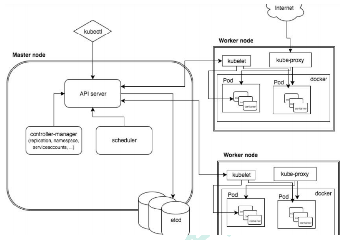

#
# 1、kubernetes 简介
#### kubernetes 基本介绍
> kubernetes，简称 K8s，是用 8 代替 8 个字符“ubernete”而成的缩写。是一个开源 的，用于管理云平台中多个主机上的容器化的应用，Kubernetes 的目标是让部署容器化的 应用简单并且高效（powerful）,Kubernetes 提供了应用部署，规划，更新，维护的一种 机制。传统的应用部署方式是通过插件或脚本来安装应用。这样做的缺点是应用的运行、配 置、管理、所有生存周期将与当前操作系统绑定，这样做并不利于应用的升级更新/回滚等 操作，当然也可以通过创建虚拟机的方式来实现某些功能，但是虚拟机非常重，并不利于 可移植性。 新的方式是通过部署容器方式实现，每个容器之间互相隔离，每个容器有自己的文件 系统 ，容器之间进程不会相互影响，能区分计算资源。相对于虚拟机，容器能快速部署， 由于容器与底层设施、机器文件系统解耦的，所以它能在不同云、不同版本操作系统间进 行迁移。容器占用资源少、部署快，每个应用可以被打包成一个容器镜像，每个应用与容器间 成一对一关系也使容器有更大优势，使用容器可以在 build 或 release 的阶段，为应用创 建容器镜像，因为每个应用不需要与其余的应用堆栈组合，也不依赖于生产环境基础结构， 这使得从研发到测试、生产能提供一致环境。类似地，容器比虚拟机轻量、更“透明”， 这更便于监控和管理。 Kubernetes 是 Google 开源的一个容器编排引擎，它支持自动化部署、大规模可伸缩、 应用容器化管理。在生产环境中部署一个应用程序时，通常要部署该应用的多个实例以便 对应用请求进行负载均衡。 在 Kubernetes 中，我们可以创建多个容器，每个容器里面运行一个应用实例，然后通 过内置的负载均衡策略，实现对这一组应用实例的管理、发现、访问，而这些细节都不需 要运维人员去进行复杂的手工配置和处理。

#### kubernetes 功能和架构
##### 概述
Kubernetes 是一个轻便的和可扩展的开源平台，用于管理容器化应用和服务。通过 Kubernetes 能够进行应用的自动化部署和扩缩容。在 Kubernetes 中，会将组成应用的容 器组合成一个逻辑单元以更易管理和发现。Kubernetes 积累了作为 Google 生产环境运行 工作负载 15 年的经验，并吸收了来自于社区的最佳想法和实践。
##### K8s 功能
* 自动装箱 
   * 基于容器对应用运行环境的资源配置要求自动部署应用容器 
* 自我修复(自愈能力) 
   * 当容器失败时，会对容器进行重启 
   * 当所部署的 Node 节点有问题时，会对容器进行重新部署和重新调度
   * 当容器未通过监控检查时，会关闭此容器直到容器正常运行时，才会对外提供服务
* 水平扩展
   * 通过简单的命令、用户 UI 界面或基于 CPU 等资源使用情况，对应用容器进行规模扩大 或规模剪裁 
* 服务发现 
   * 用户不需使用额外的服务发现机制，就能够基于 Kubernetes 自身能力实现服务发现和 负载均衡 
* 滚动更新 
   * 可以根据应用的变化，对应用容器运行的应用，进行一次性或批量式更新 
* 版本回退 
   * 可以根据应用部署情况，对应用容器运行的应用，进行历史版本即时回退 
* 密钥和配置管理 
   * 在不需要重新构建镜像的情况下，可以部署和更新密钥和应用配置，类似热部署。 
* 存储编排 
   * 自动实现存储系统挂载及应用，特别对有状态应用实现数据持久化非常重要 存储系统可以来自于本地目录、网络存储(NFS、Gluster、Ceph 等)、公共云存储服务 
* 批处理 
   * 提供一次性任务，定时任务；满足批量数据处理和分析的场景

#### 应用部署架构分类
* (1) 无中心节点架构 
   * GlusterFS 
* (2) 有中心节点架构 
   * HDFS K8S

#### k8s 集群架构


#### k8s 集群架构节点角色功能
* Master Node
   * k8s 集群控制节点，对集群进行调度管理，接受集群外用户去集群操作请求； Master Node 由 API Server、Scheduler、ClusterState Store（ETCD 数据库）和 Controller MangerServer 所组成
* Worker Node
   * 集群工作节点，运行用户业务应用容器； Worker Node 包含 kubelet、kube proxy 和 ContainerRuntime


# 2、kubernetes 集群搭建(kubeadm 方式)
#### 前置知识点
#### 目前生产部署 Kubernetes 集群主要有两种方式：
* （1）kubeadm 
   * Kubeadm 是一个 K8s 部署工具，提供 kubeadm init 和 kubeadm join，用于快速部 署 Kubernetes 集群。 
   * 官方地址：https://kubernetes.io/docs/reference/setup-tools/kubeadm/kubeadm/ 
* （2）二进制包 
   * 从 github 下载发行版的二进制包，手动部署每个组件，组成 Kubernetes 集群。 
   * Kubeadm 降低部署门槛，但屏蔽了很多细节，遇到问题很难排查。如果想更容易可 控，推荐使用二进制包部署 Kubernetes 集群，虽然手动部署麻烦点，期间可以学习很 多工作原理，也利于后期维护。

#### kubeadm 部署方式介绍
* kubeadm 是官方社区推出的一个用于快速部署 kubernetes 集群的工具，这个工具能通 过两条指令完成一个 kubernetes 集群的部署： 
* 第一、创建一个 Master 节点 kubeadm init 
* 第二， 将 Node 节点加入到当前集群中 $ kubeadm join <Master 节点的 IP 和端口 >
#### 安装要求
在开始之前，部署 Kubernetes 集群机器需要满足以下几个条件：
- 一台或多台机器，操作系统 CentOS7.x-86_x64 
- 硬件配置：2GB 或更多 RAM，2 个 CPU 或更多 CPU，硬盘 30GB 或更多 
- 集群中所有机器之间网络互通 
- 可以访问外网，需要拉取镜像 
- 禁止 swap 分

#### 最终目标
* （1） 在所有节点上安装 Docker 和 kubeadm 
* （2）部署 Kubernetes Master 
* （3）部署容器网络插件 
* （4）部署 Kubernetes Node，将节点加入 Kubernetes 集群中 
* （5）部署 Dashboard Web 页面，可视化查看 Kubernetes 资源

#### 准备环境


配置环境需要组件我整理了

链接：http://pan.baidu.com/s/124SrYHRqK6AevApON-OO4w

提取码：ivdl
```shell
k8s-master 192.168.181.128

k8s-node1 192.168.181.129

```
#### 修改主机名
k8s-master:
```shell
hostnamectl set-hostname k8s-master
```

k8s-node1:
```shell
hostnamectl set-hostname k8s-node1
```
`以下都是二台服务器同时操作请按图片操作打开键盘模式`


#### 防火墙关闭
```shell
systemctl stop firewalld
systemctl disable firewalld
```

#### 关闭selinux
```shell
setenforce 0 # 临时关闭
sed -i 's/SELINUX=enforcing/SELINUX=disabled/g' /etc/selinux/config # 永久关闭
```
#### 关闭swap
```shell
swapoff -a # 临时关闭；关闭swap主要是为了性能考虑
sed -ri 's/.*swap.*/#&/' /etc/fstab
```
`free # 可以通过这个命令查看swap是否关闭了 `


#### 添加主机名与IP对应的关系 
`vim /etc/hosts`

```shell
192.168.181.128 k8s-master
192.168.181.129 k8s-node-1
```

#### 时间同步
```shell
yum install ntpdate -y
ntpdate time.windows.com
```
#### 将桥接的IPv4流量传递到iptables的链
```shell
cat > /etc/sysctl.d/k8s.conf << EOF
net.bridge.bridge-nf-call-ip6tables = 1
net.bridge.bridge-nf-call-iptables = 1
EOF
```

```shell
sysctl --system
```
#### 安装Docker
```shell
wget https://mirrors.aliyun.com/docker-ce/linux/centos/docker-ce.repo -O/etc/yum.repos.d/docker-ce.repo
```
```shell
yum -y install docker-ce
```
```shell
systemctl enable docker #设置开机启动
```
```shell
systemctl start docker #启动docker
```
#### 添加阿里云YUM软件源 
```shell
cat > /etc/docker/daemon.json << EOF
{
  "registry-mirrors": ["http://goieqwi4.mirror.aliyuncs.com"]
}
EOF
```
```shell
cat > /etc/yum.repos.d/kubernetes.repo << EOF
[kubernetes]
name=Kubernetes
baseurl=http://mirrors.aliyun.com/kubernetes/yum/repos/kubernetes-el7-x86_64
enabled=1
gpgcheck=0
repo_gpgcheck=0
gpgkey=http://mirrors.aliyun.com/kubernetes/yum/doc/yum-key.gpg http://mirrors.aliyun.com/kubernetes/yum/doc/rpm-package-key.gpg
EOF
```
```shell
#重启docker
systemctl restart docker
```
#### 安装kubeadm，kubelet和kubectl
> kubelet # 运行在 Cluster 所有节点上，负责启动 Pod 和容器

>kubeadm # 用于初始化 Cluster

>kubectl # 是 Kubernetes 命令行工具。通过 kubectl 可以部署和管理应用，查看各种资源，创建、删除和更新各种组件

```shell
# 这里安装最新的v1.20.1
yum install kubelet kubeadm kubectl -y
# 此时，还不能启动kubelet，因为此时配置还不能，现在仅仅可以设置开机自启动
systemctl enable kubelet
```
#### 部署Kubernetes Master（只在master上操作）
`初始化kubeadm（只需要修改apiserver-advertise-address及kubernetes-version）`
```shell
kubeadm init \
--apiserver-advertise-address=192.168.181.128 \
--image-repository registry.aliyuncs.com/google_containers \
--kubernetes-version v1.20.1 \
--service-cidr=10.1.0.0/16 \
--pod-network-cidr=10.244.0.0/16
```
>–image-repository string： 这个用于指定从什么位置来拉取镜像（1.13版本才有的），默认值是k8s.gcr.io，我们将其指定为国内镜像地址：registry.aliyuncs.com/google_containers

> –kubernetes-version string： 指定kubenets版本号，默认值是stable-1，会导致从http://dl.k8s.io/release/stable-1.txt下载最新的版本号，我们可以将其指定为固定版本（v1.15.1）来跳过网络请求。

> –apiserver-advertise-address 指明用 Master 的哪个 interface 与 Cluster 的其他节点通信。如果 Master 有多个 interface，建议明确指定，如果不指定，kubeadm 会自动选择有默认网关的 interface。

> –pod-network-cidr 指定 Pod 网络的范围。Kubernetes支持多种网络方案，而且不同网络方案对 –pod-network-cidr有自己的要求，这里设置为10.244.0.0/16是因为我们将使用 flannel 网络方案，必须设置成这个 CIDR。

`等待初始化成功后会有提示信息，红色框内的命令是需要后续执行的`

```shell
mkdir -p $HOME/.kube
sudo cp -i /etc/kubernetes/admin.conf $HOME/.kube/config
sudo chown $(id -u):$(id -g) $HOME/.kube/config
```
#### 安装Pod网络插件（CNI）（只在master上操作）
```shell
#可以通过这种命令一键执行，如果远程不可以下载，可以用如下我已经下载好的配置文件
kubectl apply -f http://raw.githubusercontent.com/coreos/flannel/master/Documentation/kube-flannel.yml
```
```shell
kubectl apply -f kube-flannel.yml
```

这是我的配置文件，可以复制好上传到服务器直接执行上面语句
```YML
---
apiVersion: policy/v1beta1
kind: PodSecurityPolicy
metadata:
  name: psp.flannel.unprivileged
  annotations:
    seccomp.security.alpha.kubernetes.io/allowedProfileNames: docker/default
    seccomp.security.alpha.kubernetes.io/defaultProfileName: docker/default
    apparmor.security.beta.kubernetes.io/allowedProfileNames: runtime/default
    apparmor.security.beta.kubernetes.io/defaultProfileName: runtime/default
spec:
  privileged: false
  volumes:
    - configMap
    - secret
    - emptyDir
    - hostPath
  allowedHostPaths:
    - pathPrefix: "/etc/cni/net.d"
    - pathPrefix: "/etc/kube-flannel"
    - pathPrefix: "/run/flannel"
  readOnlyRootFilesystem: false
  # Users and groups
  runAsUser:
    rule: RunAsAny
  supplementalGroups:
    rule: RunAsAny
  fsGroup:
    rule: RunAsAny
  # Privilege Escalation
  allowPrivilegeEscalation: false
  defaultAllowPrivilegeEscalation: false
  # Capabilities
  allowedCapabilities: ['NET_ADMIN']
  defaultAddCapabilities: []
  requiredDropCapabilities: []
  # Host namespaces
  hostPID: false
  hostIPC: false
  hostNetwork: true
  hostPorts:
  - min: 0
    max: 65535
  # SELinux
  seLinux:
    # SELinux is unused in CaaSP
    rule: 'RunAsAny'
---
kind: ClusterRole
apiVersion: rbac.authorization.k8s.io/v1beta1
metadata:
  name: flannel
rules:
  - apiGroups: ['extensions']
    resources: ['podsecuritypolicies']
    verbs: ['use']
    resourceNames: ['psp.flannel.unprivileged']
  - apiGroups:
      - ""
    resources:
      - pods
    verbs:
      - get
  - apiGroups:
      - ""
    resources:
      - nodes
    verbs:
      - list
      - watch
  - apiGroups:
      - ""
    resources:
      - nodes/status
    verbs:
      - patch
---
kind: ClusterRoleBinding
apiVersion: rbac.authorization.k8s.io/v1beta1
metadata:
  name: flannel
roleRef:
  apiGroup: rbac.authorization.k8s.io
  kind: ClusterRole
  name: flannel
subjects:
- kind: ServiceAccount
  name: flannel
  namespace: kube-system
---
apiVersion: v1
kind: ServiceAccount
metadata:
  name: flannel
  namespace: kube-system
---
kind: ConfigMap
apiVersion: v1
metadata:
  name: kube-flannel-cfg
  namespace: kube-system
  labels:
    tier: node
    app: flannel
data:
  cni-conf.json: |
    {
      "name": "cbr0",
      "cniVersion": "0.3.1",
      "plugins": [
        {
          "type": "flannel",
          "delegate": {
            "hairpinMode": true,
            "isDefaultGateway": true
          }
        },
        {
          "type": "portmap",
          "capabilities": {
            "portMappings": true
          }
        }
      ]
    }
  net-conf.json: |
    {
      "Network": "10.244.0.0/16",
      "Backend": {
        "Type": "vxlan"
      }
    }
---
apiVersion: apps/v1
kind: DaemonSet
metadata:
  name: kube-flannel-ds-amd64
  namespace: kube-system
  labels:
    tier: node
    app: flannel
spec:
  selector:
    matchLabels:
      app: flannel
  template:
    metadata:
      labels:
        tier: node
        app: flannel
    spec:
      affinity:
        nodeAffinity:
          requiredDuringSchedulingIgnoredDuringExecution:
            nodeSelectorTerms:
              - matchExpressions:
                  - key: beta.kubernetes.io/os
                    operator: In
                    values:
                      - linux
                  - key: beta.kubernetes.io/arch
                    operator: In
                    values:
                      - amd64
      hostNetwork: true
      tolerations:
      - operator: Exists
        effect: NoSchedule
      serviceAccountName: flannel
      initContainers:
      - name: install-cni
        image: quay.io/coreos/flannel:v0.11.0-amd64
        command:
        - cp
        args:
        - -f
        - /etc/kube-flannel/cni-conf.json
        - /etc/cni/net.d/10-flannel.conflist
        volumeMounts:
        - name: cni
          mountPath: /etc/cni/net.d
        - name: flannel-cfg
          mountPath: /etc/kube-flannel/
      containers:
      - name: kube-flannel
        image: quay.io/coreos/flannel:v0.11.0-amd64
        command:
        - /opt/bin/flanneld
        args:
        - --ip-masq
        - --kube-subnet-mgr
        resources:
          requests:
            cpu: "100m"
            memory: "50Mi"
          limits:
            cpu: "100m"
            memory: "50Mi"
        securityContext:
          privileged: false
          capabilities:
            add: ["NET_ADMIN"]
        env:
        - name: POD_NAME
          valueFrom:
            fieldRef:
              fieldPath: metadata.name
        - name: POD_NAMESPACE
          valueFrom:
            fieldRef:
              fieldPath: metadata.namespace
        volumeMounts:
        - name: run
          mountPath: /run/flannel
        - name: flannel-cfg
          mountPath: /etc/kube-flannel/
      volumes:
        - name: run
          hostPath:
            path: /run/flannel
        - name: cni
          hostPath:
            path: /etc/cni/net.d
        - name: flannel-cfg
          configMap:
            name: kube-flannel-cfg
---
apiVersion: apps/v1
kind: DaemonSet
metadata:
  name: kube-flannel-ds-arm64
  namespace: kube-system
  labels:
    tier: node
    app: flannel
spec:
  selector:
    matchLabels:
      app: flannel
  template:
    metadata:
      labels:
        tier: node
        app: flannel
    spec:
      affinity:
        nodeAffinity:
          requiredDuringSchedulingIgnoredDuringExecution:
            nodeSelectorTerms:
              - matchExpressions:
                  - key: beta.kubernetes.io/os
                    operator: In
                    values:
                      - linux
                  - key: beta.kubernetes.io/arch
                    operator: In
                    values:
                      - arm64
      hostNetwork: true
      tolerations:
      - operator: Exists
        effect: NoSchedule
      serviceAccountName: flannel
      initContainers:
      - name: install-cni
        image: quay.io/coreos/flannel:v0.11.0-arm64
        command:
        - cp
        args:
        - -f
        - /etc/kube-flannel/cni-conf.json
        - /etc/cni/net.d/10-flannel.conflist
        volumeMounts:
        - name: cni
          mountPath: /etc/cni/net.d
        - name: flannel-cfg
          mountPath: /etc/kube-flannel/
      containers:
      - name: kube-flannel
        image: quay.io/coreos/flannel:v0.11.0-arm64
        command:
        - /opt/bin/flanneld
        args:
        - --ip-masq
        - --kube-subnet-mgr
        resources:
          requests:
            cpu: "100m"
            memory: "50Mi"
          limits:
            cpu: "100m"
            memory: "50Mi"
        securityContext:
          privileged: false
          capabilities:
             add: ["NET_ADMIN"]
        env:
        - name: POD_NAME
          valueFrom:
            fieldRef:
              fieldPath: metadata.name
        - name: POD_NAMESPACE
          valueFrom:
            fieldRef:
              fieldPath: metadata.namespace
        volumeMounts:
        - name: run
          mountPath: /run/flannel
        - name: flannel-cfg
          mountPath: /etc/kube-flannel/
      volumes:
        - name: run
          hostPath:
            path: /run/flannel
        - name: cni
          hostPath:
            path: /etc/cni/net.d
        - name: flannel-cfg
          configMap:
            name: kube-flannel-cfg
---
apiVersion: apps/v1
kind: DaemonSet
metadata:
  name: kube-flannel-ds-arm
  namespace: kube-system
  labels:
    tier: node
    app: flannel
spec:
  selector:
    matchLabels:
      app: flannel
  template:
    metadata:
      labels:
        tier: node
        app: flannel
    spec:
      affinity:
        nodeAffinity:
          requiredDuringSchedulingIgnoredDuringExecution:
            nodeSelectorTerms:
              - matchExpressions:
                  - key: beta.kubernetes.io/os
                    operator: In
                    values:
                      - linux
                  - key: beta.kubernetes.io/arch
                    operator: In
                    values:
                      - arm
      hostNetwork: true
      tolerations:
      - operator: Exists
        effect: NoSchedule
      serviceAccountName: flannel
      initContainers:
      - name: install-cni
        image: quay.io/coreos/flannel:v0.11.0-arm
        command:
        - cp
        args:
        - -f
        - /etc/kube-flannel/cni-conf.json
        - /etc/cni/net.d/10-flannel.conflist
        volumeMounts:
        - name: cni
          mountPath: /etc/cni/net.d
        - name: flannel-cfg
          mountPath: /etc/kube-flannel/
      containers:
      - name: kube-flannel
        image: quay.io/coreos/flannel:v0.11.0-arm
        command:
        - /opt/bin/flanneld
        args:
        - --ip-masq
        - --kube-subnet-mgr
        resources:
          requests:
            cpu: "100m"
            memory: "50Mi"
          limits:
            cpu: "100m"
            memory: "50Mi"
        securityContext:
          privileged: false
          capabilities:
             add: ["NET_ADMIN"]
        env:
        - name: POD_NAME
          valueFrom:
            fieldRef:
              fieldPath: metadata.name
        - name: POD_NAMESPACE
          valueFrom:
            fieldRef:
              fieldPath: metadata.namespace
        volumeMounts:
        - name: run
          mountPath: /run/flannel
        - name: flannel-cfg
          mountPath: /etc/kube-flannel/
      volumes:
        - name: run
          hostPath:
            path: /run/flannel
        - name: cni
          hostPath:
            path: /etc/cni/net.d
        - name: flannel-cfg
          configMap:
            name: kube-flannel-cfg
---
apiVersion: apps/v1
kind: DaemonSet
metadata:
  name: kube-flannel-ds-ppc64le
  namespace: kube-system
  labels:
    tier: node
    app: flannel
spec:
  selector:
    matchLabels:
      app: flannel
  template:
    metadata:
      labels:
        tier: node
        app: flannel
    spec:
      affinity:
        nodeAffinity:
          requiredDuringSchedulingIgnoredDuringExecution:
            nodeSelectorTerms:
              - matchExpressions:
                  - key: beta.kubernetes.io/os
                    operator: In
                    values:
                      - linux
                  - key: beta.kubernetes.io/arch
                    operator: In
                    values:
                      - ppc64le
      hostNetwork: true
      tolerations:
      - operator: Exists
        effect: NoSchedule
      serviceAccountName: flannel
      initContainers:
      - name: install-cni
        image: quay.io/coreos/flannel:v0.11.0-ppc64le
        command:
        - cp
        args:
        - -f
        - /etc/kube-flannel/cni-conf.json
        - /etc/cni/net.d/10-flannel.conflist
        volumeMounts:
        - name: cni
          mountPath: /etc/cni/net.d
        - name: flannel-cfg
          mountPath: /etc/kube-flannel/
      containers:
      - name: kube-flannel
        image: quay.io/coreos/flannel:v0.11.0-ppc64le
        command:
        - /opt/bin/flanneld
        args:
        - --ip-masq
        - --kube-subnet-mgr
        resources:
          requests:
            cpu: "100m"
            memory: "50Mi"
          limits:
            cpu: "100m"
            memory: "50Mi"
        securityContext:
          privileged: false
          capabilities:
             add: ["NET_ADMIN"]
        env:
        - name: POD_NAME
          valueFrom:
            fieldRef:
              fieldPath: metadata.name
        - name: POD_NAMESPACE
          valueFrom:
            fieldRef:
              fieldPath: metadata.namespace
        volumeMounts:
        - name: run
          mountPath: /run/flannel
        - name: flannel-cfg
          mountPath: /etc/kube-flannel/
      volumes:
        - name: run
          hostPath:
            path: /run/flannel
        - name: cni
          hostPath:
            path: /etc/cni/net.d
        - name: flannel-cfg
          configMap:
            name: kube-flannel-cfg
---
apiVersion: apps/v1
kind: DaemonSet
metadata:
  name: kube-flannel-ds-s390x
  namespace: kube-system
  labels:
    tier: node
    app: flannel
spec:
  selector:
    matchLabels:
      app: flannel
  template:
    metadata:
      labels:
        tier: node
        app: flannel
    spec:
      affinity:
        nodeAffinity:
          requiredDuringSchedulingIgnoredDuringExecution:
            nodeSelectorTerms:
              - matchExpressions:
                  - key: beta.kubernetes.io/os
                    operator: In
                    values:
                      - linux
                  - key: beta.kubernetes.io/arch
                    operator: In
                    values:
                      - s390x
      hostNetwork: true
      tolerations:
      - operator: Exists
        effect: NoSchedule
      serviceAccountName: flannel
      initContainers:
      - name: install-cni
        image: quay.io/coreos/flannel:v0.11.0-s390x
        command:
        - cp
        args:
        - -f
        - /etc/kube-flannel/cni-conf.json
        - /etc/cni/net.d/10-flannel.conflist
        volumeMounts:
        - name: cni
          mountPath: /etc/cni/net.d
        - name: flannel-cfg
          mountPath: /etc/kube-flannel/
      containers:
      - name: kube-flannel
        image: quay.io/coreos/flannel:v0.11.0-s390x
        command:
        - /opt/bin/flanneld
        args:
        - --ip-masq
        - --kube-subnet-mgr
        resources:
          requests:
            cpu: "100m"
            memory: "50Mi"
          limits:
            cpu: "100m"
            memory: "50Mi"
        securityContext:
          privileged: false
          capabilities:
             add: ["NET_ADMIN"]
        env:
        - name: POD_NAME
          valueFrom:
            fieldRef:
              fieldPath: metadata.name
        - name: POD_NAMESPACE
          valueFrom:
            fieldRef:
              fieldPath: metadata.namespace
        volumeMounts:
        - name: run
          mountPath: /run/flannel
        - name: flannel-cfg
          mountPath: /etc/kube-flannel/
      volumes:
        - name: run
          hostPath:
            path: /run/flannel
        - name: cni
          hostPath:
            path: /etc/cni/net.d
        - name: flannel-cfg
          configMap:
            name: kube-flannel-cfg
```
#### Node节点加入集群（只在node上操作）
向集群添加新节点，执行在kubeadm init输出的kubeadm join命令
```shell
kubeadm join 10.238.211.9:6443 --token iz96vy.f5ukew9geeome5is \
--discovery-token-ca-cert-hash sha256:72b689426bfc34512294c29b39ea3b2af3a94e39f62c4434f3a49f16d51a1382
```
```shell
kubectl get nodes
```


```shell
kubectl get pods -n kube-system    #查看运行时容器pod （一个pod里面运行了多个docker容器）
```

#### 集群测试
```shell
kubectl create deployment nginx --image=nginx

kubectl expose deployment nginx --port=80 --type=NodePort

kubectl get pod,svc

访问地址：http://NodeIP:Port
```
# 3、DashBoard和KubeSphere监控平台任选，我这里选择DashBoard部署方式
> Dashboard 是基于网页的 Kubernetes 用户界面。您可以使用 Dashboard 将容器应用部署到 Kubernetes 集群中，也可以对容器应用排错，还能管理集群资源。您可以使用 Dashboard 获取运行在集群中的应用的概览信息，也可以创建或者修改 Kubernetes 资源（如 Deployment，Job，DaemonSet 等等）。例如，您可以对 Deployment 实现弹性伸缩、发起滚动升级、重启 Pod 或者使用向导创建新的应用。
#### 获取并修改Yaml文件
项目地址 http://github.com/kubernetes/dashboard/releases
我下载的是最新的V2.1.0，之前使用网上大神说的V1.8.3出现各种神奇问题，还会报404，后来又看了一篇文章，发现是版本问题

下载dashboard-2.1.0.tar.gz
找到配置文件
```
dashboard/v2.0.0-beta8/aio/deploy/recommended.yaml
```
修改service通过NodePort方式访问K8S Dashboard
```yml
---

kind: Service
apiVersion: v1
metadata:
  labels:
    k8s-app: kubernetes-dashboard
  name: kubernetes-dashboard
  namespace: kubernetes-dashboard
spec:
  type: NodePort #新加此行
  ports:
    - port: 443
      targetPort: 8443
      nodePort: 31080 #新加此行
  selector:
    k8s-app: kubernetes-dashboard

---
```
#### 应用配置文件 (耐心等待一会)
```shell
kubectl apply -f recommended.yaml
```
查看一下pod是否成功，注意命名空间是在kubernetes-dashboard下面；
```
kubectl get pod -n kubernetes-dashboard
```


#### 访问 http:ip:31080
`注：通过http是不行的需要http`

创建service account并绑定默认cluster-admin管理员集群角色：【依次执行】
```shell
kubectl create serviceaccount dashboard-admin -n kube-system
kubectl create clusterrolebinding dashboard-admin --clusterrole=cluster-admin --serviceaccount=kube-system:dashboard-admin
```
获取Token
```
kubectl describe secrets -n kube-system $(kubectl -n kube-system get secret | awk '/dashboard-admin/{print $1}')
```

#### 登录dashboard

# 4、部署Metrics-Server服务
在新版的K8S中，系统资源的采集均使用Metrics-Server服务，可以通过Metrics-Server服务采集节点和Pod的内存、磁盘、CPU和网络的使用率等信息。
#### 下载并解压Metrics-Server
```shell
http://github.com/kubernetes-sigs/metrics-server/archive/v0.3.6.tar.gz
```
#### 修改Metrics-Server配置文件
```
vim metrics-server-0.3.6/deploy/1.8+/metrics-server-deployment.yaml
```
这是我的配置文件
```yml
---
apiVersion: v1
kind: ServiceAccount
metadata:
  name: metrics-server
  namespace: kube-system
---
apiVersion: apps/v1
kind: Deployment
metadata:
  name: metrics-server
  namespace: kube-system
  labels:
    k8s-app: metrics-server
spec:
  selector:
    matchLabels:
      k8s-app: metrics-server
  template:
    metadata:
      name: metrics-server
      labels:
        k8s-app: metrics-server
    spec:
      serviceAccountName: metrics-server
      volumes:
      # mount in tmp so we can safely use from-scratch images and/or read-only containers
      - name: tmp-dir
        emptyDir: {}
      containers:
      - name: metrics-server
        # 修改image 和 imagePullPolicy
        image: registry.aliyuncs.com/google_containers/metrics-server-amd64:v0.3.6
        imagePullPolicy: IfNotPresent
        # 新增command配置
        command:
        - /metrics-server
        - --kubelet-insecure-tls
        - --kubelet-preferred-address-types=InternalDNS,InternalIP,ExternalDNS,ExternalIP,Hostname
        volumeMounts:
        - name: tmp-dir
          mountPath: /tmp
        # 新增resources配置
        resources:
          limits:
            cpu: 300m
            memory: 200Mi
          requests:
            cpu: 200m
            memory: 100Mi
```
#### 应用配置文件
```shell
cd metrics-server-0.3.6/deploy/1.8+
kubectl apply -f .
```
#### 安装完Metrics-Server之后，查看node信息
```
kubectl top node
```


#### 再次登录DashBoard
各种炫酷图表就可以显示啦~大功告成

#### K8S命令自动补全
```
yum install bash-completion -y
```
```
source /usr/share/bash-completion/bash_completion
```
```
source <(kubectl completion bash)
```
#### 推荐二个自动生成YML文件的地址
#### http://k8syaml.com/

#### http://www.kubebiz.com/ `（推荐安装什么都有）`


# 5、kubernetes 集群搭建(二进制方式)

#### 1.修改主机名

k8s-master:

```bash
hostnamectl set-hostname m1
```

k8s-node1:

```bash
hostnamectl set-hostname n1
```

以下都是二台服务器同时操作请按图片操作打开键盘模式


#### 2.防火墙关闭

```bash
systemctl stop firewalld
systemctl disable firewalld
```


#### 3.关闭selinux

```bash
setenforce 0 # 临时关闭
sed -i 's/SELINUX=enforcing/SELINUX=disabled/g' /etc/selinux/config # 永久关闭
```

#### 4.关闭swap

```bash
swapoff -a # 临时关闭；关闭swap主要是为了性能考虑
sed -ri 's/.*swap.*/#&/' /etc/fstab
free # 可以通过这个命令查看swap是否关闭了 
```


时间同步

```bash
yum install ntpdate -y
ntpdate time.windows.com
```

#### 5.将桥接的IPv4流量传递到iptables的链

```bash
cat > /etc/sysctl.d/k8s.conf << EOF
net.bridge.bridge-nf-call-ip6tables = 1
net.bridge.bridge-nf-call-iptables = 1
EOF
```

```bash
sysctl --system
```

#### 6.添加主机名与IP对应的关系 ( master上操作 )

```bash
vim /etc/hosts
```

```bash
192.168.181.128 k8s-master
192.168.181.129 k8s-node-1
```

#### 7.准备 cfssl 证书生成工具 ( master上操作 )

cfssl 是一个开源的证书管理工具，使用 json 文件生成证书，相比 openssl 更方便使用。 找任意一台服务器操作，这里用 Master 节点

```bash
wget https://pkg.cfssl.org/R1.2/cfssl_linux-amd64
wget https://pkg.cfssl.org/R1.2/cfssljson_linux-amd64
wget https://pkg.cfssl.org/R1.2/cfssl-certinfo_linux-amd64
chmod +x cfssl_linux-amd64 cfssljson_linux-amd64 cfssl-certinfo_linux-amd64
mv cfssl_linux-amd64 /usr/local/bin/cfssl
mv cfssljson_linux-amd64 /usr/local/bin/cfssljson
mv cfssl-certinfo_linux-amd64 /usr/bin/cfssl-certinfo
chmod +x /usr/bin/cfssl*
```

#### 7.1生成 Etcd 证书 （1）自签证书颁发机构（CA） 创建工作目录：

```bash
mkdir -p ~/TLS/{etcd,k8s}

cd TLS/etcd
```

#### 7.2自签 CA

```bash
cat > ca-config.json << EOF
{
  "signing": {
    "default": {
      "expiry": "87600h"
    },
    "profiles": {
      "www": {
         "expiry": "87600h",
         "usages": [
            "signing",
            "key encipherment",
            "server auth",
            "client auth"
        ]
      }
    }
  }
}
EOF
```

```bash
cat > ca-csr.json << EOF
{
    "CN": "etcd CA",
    "key": {
        "algo": "rsa",
        "size": 2048
    },
    "names": [
        {
            "C": "CN",
            "L": "Beijing",
            "ST": "Beijing"
        }
    ]
}
EOF
```

#### 7.3生成证书：

```bash
cfssl gencert -initca ca-csr.json | cfssljson -bare ca -

ls *pem
```

#### 7.4使用自签 CA 签发 Etcd HTTPS 证书 创建证书申请文件：(修改对应的master和node的IP地址)

```bash
cat > server-csr.json << EOF
{
    "CN": "etcd",
    "hosts": [
    "192.168.31.71",
    "192.168.31.72",
    "192.168.31.73"
    ],
    "key": {
        "algo": "rsa",
        "size": 2048
    },
    "names": [
        {
            "C": "CN",
            "L": "BeiJing",
            "ST": "BeiJing"
        }
    ]
}
EOF
```

#### 7.5注：上述文件 hosts 字段中 IP 为所有 etcd 节点的集群内部通信 IP，一个都不能少！为了 方便后期扩容可以多写几个预留的 IP。 生成证书：

```bash
cfssl gencert -ca=ca.pem -ca-key=ca-key.pem -config=ca-config.json -profile=www server-csr.json | cfssljson -bare server ls server*pem
```

#### 8.从 Github 下载二进制文件 下载地址：

```bash
https://github.com/etcd-io/etcd/releases
```

git下载太慢，我下载保持在了百度云

链接：https://pan.baidu.com/s/1xGbuTDcWy6wmbqLvMxWsRQ
提取码：ob9k
复制这段内容后打开百度网盘手机App，操作更方便哦


#### 9.部署 Etcd 集群 以下在节点 1 上操作，为简化操作，待会将节点 1 生成的所有文件拷贝到节点 2 和节点 3

（1）创建工作目录并解压二进制包

```bash
mkdir /opt/etcd/{bin,cfg,ssl} -p
tar zxvf etcd-v3.4.14-linux-amd64.tar.gz
mv etcd-v3.4.14-linux-amd64/{etcd,etcdctl} /opt/etcd/bin/
```

#### 10.创建etcd.conf （修改对应的master的ip地址）

```bash
cat > /opt/etcd/cfg/etcd.conf << EOF
#[Member]
ETCD_NAME="etcd-1"
ETCD_DATA_DIR="/var/lib/etcd/default.etcd"
ETCD_LISTEN_PEER_URLS="https://192.168.31.71:2380"
ETCD_LISTEN_CLIENT_URLS="https://192.168.31.71:2379"
#[Clustering]
ETCD_INITIAL_ADVERTISE_PEER_URLS="https://192.168.31.71:2380"
ETCD_ADVERTISE_CLIENT_URLS="https://192.168.31.71:2379"
ETCD_INITIAL_CLUSTER="etcd-1=https://192.168.31.71:2380,etcd-2=https://192.168.31.72:2380,etcd-3=https://192.168.31.73:2380"
ETCD_INITIAL_CLUSTER_TOKEN="etcd-cluster"
ETCD_INITIAL_CLUSTER_STATE="new"
EOF
```

ETCD_NAME：节点名称，集群中唯一 
ETCD_DATA_DIR：数据目录 
ETCD_LISTEN_PEER_URLS：集群通信监听地址 
ETCD_LISTEN_CLIENT_URLS：客户端访问监听地址 
ETCD_INITIAL_ADVERTISE_PEER_URLS：集群通告地址 
ETCD_ADVERTISE_CLIENT_URLS：客户端通告地址 
ETCD_INITIAL_CLUSTER：集群节点地址 
ETCD_INITIAL_CLUSTER_TOKEN：集群 Token 
ETCD_INITIAL_CLUSTER_STATE：加入集群的当前状态，new 是新集群，existing 表示加入 已有集群

#### 11.创建etcd.service

```bash
cat > /usr/lib/systemd/system/etcd.service << EOF
[Unit]
Description=Etcd Server
After=network.target
After=network-online.target
Wants=network-online.target
[Service]
Type=notify
EnvironmentFile=/opt/etcd/cfg/etcd.conf
ExecStart=/opt/etcd/bin/etcd \
--cert-file=/opt/etcd/ssl/server.pem \
--key-file=/opt/etcd/ssl/server-key.pem \
--peer-cert-file=/opt/etcd/ssl/server.pem \
--peer-key-file=/opt/etcd/ssl/server-key.pem \
--trusted-ca-file=/opt/etcd/ssl/ca.pem \
--peer-trusted-ca-file=/opt/etcd/ssl/ca.pem \
--logger=zap
Restart=on-failure
LimitNOFILE=65536
[Install]
WantedBy=multi-user.target
EOF
```

#### 12.拷贝刚才生成的证书 把刚才生成的证书拷贝到配置文件中的路径：

```bash
cp ~/TLS/etcd/ca*pem ~/TLS/etcd/server*pem /opt/etcd/ssl/
```

#### 13.启动并设置开机启动

```bash
systemctl daemon-reload
systemctl start etcd  #启动后会卡住因为需要和node节点一起执行改命令
systemctl enable etcd
```

#### 14.将上面节点 1 所有生成的文件拷贝到节点 2 和节点 3

```bash
scp -r /opt/etcd/ root@192.168.31.72:/opt/

scp /usr/lib/systemd/system/etcd.service root@192.168.31.72:/usr/lib/systemd/system/

scp -r /opt/etcd/ root@192.168.31.73:/opt/

scp /usr/lib/systemd/system/etcd.service root@192.168.31.73:/usr/lib/systemd/system/
```

#### 15.然后在节点 2 和节点 3 分别修改 etcd.conf 配置文件中的节点名称和当前服务器 IP：

#[Member] ETCD_NAME="etcd-1" # 修改此处，节点 2 改为 `etcd-2`，节点 3 改为 `etcd-3`

```bash
vi /opt/etcd/cfg/etcd.conf
```


#### 16.最后启动 etcd 并设置开机启动，同上。

```bash
systemctl daemon-reload

systemctl start etcd

systemctl enable etcd
```

需要二边一起执行


#### 17.查看集群状态

```bash
/opt/etcd/bin/etcdctl --cacert=/opt/etcd/ssl/ca.pem --cert=/opt/etcd/ssl/server.pem --key=/opt/etcd/ssl/server-key.pem --endpoints="https://192.168.248.202:2379,https://192.168.248.220:2379,https://192.168.248.224:2379" endpoint status --write-out=table
```


#### 18.安装docker 以下在所有节点操作。这里采用二进制安装，用 yum 安装也一样 （多台节点安装可以采用键盘工具）

下载地址：https://download.docker.com/linux/static/stable/x86_64/docker-20.10.3.tgz

百度云下载地址  

链接：https://pan.baidu.com/s/1HcdeAAakAIMpDBSbN1ABQg
提取码：w93r
复制这段内容后打开百度网盘手机App，操作更方便哦

```bash
tar zxvf docker-20.10.3.tgz 
mv docker/* /usr/bin
```

#### 19.systemd 管理 docker

```bash
cat > /usr/lib/systemd/system/docker.service << EOF
[Unit]
Description=Docker Application Container Engine
Documentation=https://docs.docker.com
After=network-online.target firewalld.service
Wants=network-online.target
[Service]
Type=notify
ExecStart=/usr/bin/dockerd
ExecReload=/bin/kill -s HUP $MAINPID
LimitNOFILE=infinity
LimitNPROC=infinity
LimitCORE=infinity
TimeoutStartSec=0
Delegate=yes
KillMode=process
Restart=on-failure
StartLimitBurst=3
StartLimitInterval=60s
[Install]
WantedBy=multi-user.target
EOF
```

#### 20.配置阿里云加速

```bash
mkdir /etc/docker
cat > /etc/docker/daemon.json << EOF
{
  "registry-mirrors": ["https://b9pmyelo.mirror.aliyuncs.com"]
}
EOF
```

#### 21.启动并设置开机启动

```bash
systemctl daemon-reload

systemctl start docker

systemctl enable docker
```
#### 22.查询docker是否成功安装

```bash
docker -v
```


#### 23.部署 Master Node

###### 23.1 生成 kube-apiserver 证书 （1）自签证书颁发机构（CA）


```bash
cd TLS/k8s
```


```bash
cat > ca-config.json << EOF
{
  "signing": {
    "default": {
      "expiry": "87600h"
    },
    "profiles": {
      "kubernetes": {
         "expiry": "87600h",
         "usages": [
            "signing",
            "key encipherment",
            "server auth",
            "client auth"
        ]
      }
    }
  }
}
EOF
```

```bash
cat > ca-csr.json << EOF
{
    "CN": "kubernetes",
    "key": {
        "algo": "rsa",
        "size": 2048
    },
    "names": [
        {
            "C": "CN",
            "L": "Beijing",
            "ST": "Beijing",
            "O": "k8s",
            "OU": "System"
        }
    ]
}
EOF
```

###### 23.2生成证书

```bash
cfssl gencert -initca ca-csr.json | cfssljson -bare ca -
ls *pem
```

###### 23.3使用自签 CA 签发 kube-apiserver HTTPS 证书 创建证书申请文件：

```bash
cat > server-csr.json << EOF
{
    "CN": "kubernetes",
    "hosts": [
      "10.0.0.1",
      "127.0.0.1",
      "192.168.1.71",
      "192.168.1.72",
      "192.168.1.73",
      "192.168.1.74",
      "192.168.1.81",
      "192.168.1.82",
      "192.168.1.88",
      "kubernetes",
      "kubernetes.default",
      "kubernetes.default.svc",
      "kubernetes.default.svc.cluster",
      "kubernetes.default.svc.cluster.local"
    ],
    "key": {
        "algo": "rsa",
        "size": 2048
    },
    "names": [
        {
            "C": "CN",
            "L": "BeiJing",
            "ST": "BeiJing",
            "O": "k8s",
            "OU": "System"
        }
    ]
}
EOF
```

###### 23.4生成证书：

```bash
cfssl gencert -ca=ca.pem -ca-key=ca-key.pem -config=ca-config.json -profile=kubernetes server-csr.json | cfssljson -bare server

ls server*pem
```

#### 24.从 Github 下载二进制文件

```bash
https://github.com/kubernetes/kubernetes/blob/master/CHANGELOG/CHANGELOG- 1.20.1.md#v1183
```


git下载太慢我保存在了百度云

链接：https://pan.baidu.com/s/1mQPZCxjCnjFxvorkQo9zcA
提取码：ue5n
复制这段内容后打开百度网盘手机App，操作更方便哦

#### 25.解压二进制包

```bash
mkdir -p /opt/kubernetes/{bin,cfg,ssl,logs}
tar zxvf kubernetes-server-linux-amd64.tar.gz
cd kubernetes/server/bin
cp kube-apiserver kube-scheduler kube-controller-manager /opt/kubernetes/bin
cp kubectl /usr/bin/
```

#### 26.部署 kube-apiserver

```bash
cat > /opt/kubernetes/cfg/kube-apiserver.conf << EOF
KUBE_APISERVER_OPTS="--logtostderr=false \\
--v=2 \\
--log-dir=/opt/kubernetes/logs \\
--etcd-servers=https://192.168.1.71:2379,https://192.168.1.72:2379,https://192.168.1.73:2379 \\
--bind-address=192.168.1.71 \\
--secure-port=6443 \\
--advertise-address=192.168.1.71 \\
--allow-privileged=true \\
--service-cluster-ip-range=10.0.0.0/24 \\
--enable-admission-plugins=NamespaceLifecycle,LimitRanger,ServiceAccount,ResourceQuota,NodeRestriction \\
--authorization-mode=RBAC,Node \\
--enable-bootstrap-token-auth=true \\
--token-auth-file=/opt/kubernetes/cfg/token.csv \\
--service-node-port-range=30000-32767 \\
--kubelet-client-certificate=/opt/kubernetes/ssl/server.pem \\
--kubelet-client-key=/opt/kubernetes/ssl/server-key.pem \\
--tls-cert-file=/opt/kubernetes/ssl/server.pem  \\
--tls-private-key-file=/opt/kubernetes/ssl/server-key.pem \\
--client-ca-file=/opt/kubernetes/ssl/ca.pem \\
--service-account-key-file=/opt/kubernetes/ssl/ca-key.pem \\
--etcd-cafile=/opt/etcd/ssl/ca.pem \\
--etcd-certfile=/opt/etcd/ssl/server.pem \\
--etcd-keyfile=/opt/etcd/ssl/server-key.pem \\
--audit-log-maxage=30 \\
--audit-log-maxbackup=3 \\
--audit-log-maxsize=100 \\
--audit-log-path=/opt/kubernetes/logs/k8s-audit.log"
EOF
```

注：上面两个\ \ 第一个是转义符，第二个是换行符，使用转义符是为了使用 EOF 保留换 行符。
–logtostderr：启用日志
—v：日志等级
–log-dir：日志目录
–etcd-servers：etcd 集群地址
–bind-address：监听地址
–secure-port：https 安全端口
–advertise-address：集群通告地址
–allow-privileged：启用授权
–service-cluster-ip-range：Service 虚拟 IP 地址段
–enable-admission-plugins：准入控制模块
–authorization-mode：认证授权，启用 RBAC 授权和节点自管理
–enable-bootstrap-token-auth：启用 TLS bootstrap 机制
–token-auth-file：bootstrap token 文件
–service-node-port-range：Service nodeport 类型默认分配端口范围
–kubelet-client-xxx：apiserver 访问 kubelet 客户端证书
–tls-xxx-file：apiserver https 证书
–etcd-xxxfile：连接 Etcd 集群证书
–audit-log-xxx：审计日志

#### 27.把刚才生成的证书拷贝到配置文件中的路径：

```bash
cp ~/TLS/k8s/ca*pem ~/TLS/k8s/server*pem /opt/kubernetes/ssl/
```

#### 28.创建上述配置文件中 token 文件

```bash
cat > /opt/kubernetes/cfg/token.csv << EOF
c47ffb939f5ca36231d9e3121a252940,kubelet-bootstrap,10001,"system:node-bootstrapper"
EOF
```

格式：token，用户名，UID，用户组 token 也可自行生成替换： 

```bash
head -c 16 /dev/urandom | od -An -t x | tr -d ' '
```

#### 29.systemd 管理 apiserver

```bash
cat > /usr/lib/systemd/system/kube-apiserver.service << EOF
[Unit]
Description=Kubernetes API Server
Documentation=https://github.com/kubernetes/kubernetes
[Service]
EnvironmentFile=/opt/kubernetes/cfg/kube-apiserver.conf
ExecStart=/opt/kubernetes/bin/kube-apiserver \$KUBE_APISERVER_OPTS
Restart=on-failure
[Install]
WantedBy=multi-user.target
EOF
```

#### 30.启动并设置开机启动

```bash
systemctl daemon-reload
systemctl start kube-apiserver
systemctl enable kube-apiserver
systemctl status kube-apiserver 
```

#### 31.授权 kubelet-bootstrap 用户允许请求证书

```bash
kubectl create clusterrolebinding kubelet-bootstrap \
--clusterrole=system:node-bootstrapper \
--user=kubelet-bootstrap
```

#### 32.部署 kube-controller-manager

```bash
cat > /opt/kubernetes/cfg/kube-controller-manager.conf << EOF
KUBE_CONTROLLER_MANAGER_OPTS="--logtostderr=false \\
--v=2 \\
--log-dir=/opt/kubernetes/logs \\
--leader-elect=true \\
--master=127.0.0.1:8080 \\
--bind-address=127.0.0.1 \\
--allocate-node-cidrs=true \\
--cluster-cidr=10.244.0.0/16 \\
--service-cluster-ip-range=10.0.0.0/24 \\
--cluster-signing-cert-file=/opt/kubernetes/ssl/ca.pem \\
--cluster-signing-key-file=/opt/kubernetes/ssl/ca-key.pem  \\
--root-ca-file=/opt/kubernetes/ssl/ca.pem \\
--service-account-private-key-file=/opt/kubernetes/ssl/ca-key.pem \\
--experimental-cluster-signing-duration=87600h0m0s"
EOF
```

–master：通过本地非安全本地端口 8080 连接 apiserver。

–leader-elect：当该组件启动多个时，自动选举（HA）

–cluster-signing-cert-file/–cluster-signing-key-file：自动为 kubelet 颁发证书

的 CA，与 apiserver 保持一致


#### 33.systemd 管理 controller-manager

```bash
cat > /usr/lib/systemd/system/kube-controller-manager.service << EOF
[Unit]
Description=Kubernetes Controller Manager
Documentation=https://github.com/kubernetes/kubernetes
[Service]
EnvironmentFile=/opt/kubernetes/cfg/kube-controller-manager.conf
ExecStart=/opt/kubernetes/bin/kube-controller-manager \$KUBE_CONTROLLER_MANAGER_OPTS
Restart=on-failure
[Install]
WantedBy=multi-user.target
EOF
```

#### 34. 启动并设置开机启动

```bash
systemctl daemon-reload
systemctl start kube-controller-manager
systemctl enable kube-controller-manager
systemctl status kube-controller-manager
```

#### 35.部署 kube-scheduler

```bash
cat > /opt/kubernetes/cfg/kube-scheduler.conf << EOF
KUBE_SCHEDULER_OPTS="--logtostderr=false \
--v=2 \
--log-dir=/opt/kubernetes/logs \
--leader-elect \
--master=127.0.0.1:8080 \
--bind-address=127.0.0.1"
EOF
```

–master：通过本地非安全本地端口 8080 连接 apiserver。

–leader-elect：当该组件启动多个时，自动选举（HA） 

```bash
cat > /usr/lib/systemd/system/kube-scheduler.service << EOF
[Unit]
Description=Kubernetes Scheduler
Documentation=https://github.com/kubernetes/kubernetes
[Service]
EnvironmentFile=/opt/kubernetes/cfg/kube-scheduler.conf
ExecStart=/opt/kubernetes/bin/kube-scheduler \$KUBE_SCHEDULER_OPTS
Restart=on-failure
[Install]
WantedBy=multi-user.target
EOF
```

#### 36.启动并设置开机启动

```bash
systemctl daemon-reload
systemctl start kube-scheduler
systemctl enable kube-scheduler
systemctl status kube-scheduler
```

#### 37.查看集群状态

所有组件都已经启动成功，通过 kubectl 工具查看当前集群组件状态：

```bash
kubectl get cs
```


#### 38.部署node节点

```bash
mkdir -p /opt/kubernetes/{bin,cfg,ssl,logs}
tar zxvf kubernetes-server-linux-amd64.tar.gz
cd kubernetes/server/bin

cp kubelet kube-proxy /opt/kubernetes/bin

cp kubectl /usr/bin/
```

```bash
cat > /opt/kubernetes/cfg/kubelet.conf << EOF
KUBELET_OPTS="--logtostderr=false \\
--v=2 \\
--log-dir=/opt/kubernetes/logs \\
--hostname-override=m1 \\
--network-plugin=cni \\
--kubeconfig=/opt/kubernetes/cfg/kubelet.kubeconfig \\
--bootstrap-kubeconfig=/opt/kubernetes/cfg/bootstrap.kubeconfig \\
--config=/opt/kubernetes/cfg/kubelet-config.yml \\
--cert-dir=/opt/kubernetes/ssl \\
--pod-infra-container-image=lizhenliang/pause-amd64:3.0"
EOF
```

–hostname-override：显示名称，集群中唯一
–network-plugin：启用CNI
–kubeconfig：空路径，会自动生成，后面用于连接apiserver
–bootstrap-kubeconfig：首次启动向apiserver申请证书
–config：配置参数文件
–cert-dir：kubelet证书生成目录
–pod-infra-container-image：管理Pod网络容器的镜像

```bash
cat > /opt/kubernetes/cfg/kubelet-config.yml << EOF
kind: KubeletConfiguration
apiVersion: kubelet.config.k8s.io/v1beta1
address: 0.0.0.0
port: 10250
readOnlyPort: 10255
cgroupDriver: cgroupfs
clusterDNS:
- 10.0.0.2
clusterDomain: cluster.local 
failSwapOn: false
authentication:
  anonymous:
    enabled: false
  webhook:
    cacheTTL: 2m0s
    enabled: true
  x509:
    clientCAFile: /opt/kubernetes/ssl/ca.pem 
authorization:
  mode: Webhook
  webhook:
    cacheAuthorizedTTL: 5m0s
    cacheUnauthorizedTTL: 30s
evictionHard:
  imagefs.available: 15%
  memory.available: 100Mi
  nodefs.available: 10%
  nodefs.inodesFree: 5%
maxOpenFiles: 1000000
maxPods: 110
EOF
```

#### 39.将master一些配置文件拷贝到node节点上

```bash
scp -r /opt/kubernetes/ssl root@192.168.181.134:/opt/kubernetes
```

#### 40.生成bootstrap.kubeconfig文件

```bash
KUBE_APISERVER="https://192.168.1.71:6443" # apiserver IP:PORT
TOKEN="c47ffb939f5ca36231d9e3121a252940" # 与token.csv里保持一致
```

#### 生成 kubelet bootstrap kubeconfig 配置文件

```bash
kubectl config set-cluster kubernetes \
  --certificate-authority=/opt/kubernetes/ssl/ca.pem \
  --embed-certs=true \
  --server=${KUBE_APISERVER} \
  --kubeconfig=bootstrap.kubeconfig
kubectl config set-credentials "kubelet-bootstrap" \
  --token=${TOKEN} \
  --kubeconfig=bootstrap.kubeconfig
kubectl config set-context default \
  --cluster=kubernetes \
  --user="kubelet-bootstrap" \
  --kubeconfig=bootstrap.kubeconfig
kubectl config use-context default --kubeconfig=bootstrap.kubeconfig


mv bootstrap.kubeconfig /opt/kubernetes/cfg
```

#### 41.systemd管理kubelet

```bash
cat > /usr/lib/systemd/system/kubelet.service << EOF
[Unit]
Description=Kubernetes Kubelet
After=docker.service
[Service]
EnvironmentFile=/opt/kubernetes/cfg/kubelet.conf
ExecStart=/opt/kubernetes/bin/kubelet \$KUBELET_OPTS
Restart=on-failure
LimitNOFILE=65536
[Install]
WantedBy=multi-user.target
EOF
```

#### 42.启动并设置开机启动

```bash
systemctl daemon-reload

systemctl start kubelet

systemctl enable kubelet
```

#### 43.批准kubelet证书申请并加入集群(Master操作)

```bash
# 查看kubelet证书请求
kubectl get csr
NAME                                                   AGE    SIGNERNAME                                    REQUESTOR           CONDITION
node-csr-uCEGPOIiDdlLODKts8J658HrFq9CZ--K6M4G7bjhk8A   6m3s   kubernetes.io/kube-apiserver-client-kubelet   kubelet-bootstrap   Pending

# 批准申请
kubectl certificate approve node-csr-uCEGPOIiDdlLODKts8J658HrFq9CZ--K6M4G7bjhk8A

# 查看节点
kubectl get node
```


注：由于网络插件还没有部署，节点会没有准备就绪 NotReady

#### 44、部署kube-proxy

```bash
cat > /opt/kubernetes/cfg/kube-proxy.conf << EOF
KUBE_PROXY_OPTS="--logtostderr=false \\
--v=2 \\
--log-dir=/opt/kubernetes/logs \\
--config=/opt/kubernetes/cfg/kube-proxy-config.yml"
EOF
```

```bash
cat > /opt/kubernetes/cfg/kube-proxy-config.yml << EOF
kind: KubeProxyConfiguration
apiVersion: kubeproxy.config.k8s.io/v1alpha1
bindAddress: 0.0.0.0
metricsBindAddress: 0.0.0.0:10249
clientConnection:
  kubeconfig: /opt/kubernetes/cfg/kube-proxy.kubeconfig
hostnameOverride: m1
clusterCIDR: 10.0.0.0/24
EOF
```

#### 45.生成kube-proxy.kubeconfig文件(master生成在传到node)

```bash
# 切换工作目录
cd TLS/k8s
```

```bash
# 创建证书请求文件
cat > kube-proxy-csr.json << EOF
{
  "CN": "system:kube-proxy",
  "hosts": [],
  "key": {
    "algo": "rsa",
    "size": 2048
  },
  "names": [
    {
      "C": "CN",
      "L": "BeiJing",
      "ST": "BeiJing",
      "O": "k8s",
      "OU": "System"
    }
  ]
}
EOF
```

```bash
# 生成证书
cfssl gencert -ca=ca.pem -ca-key=ca-key.pem -config=ca-config.json -profile=kubernetes kube-proxy-csr.json | cfssljson -bare kube-proxy
```

```bash
scp -r /root/TLS/k8s root@192.168.181.134:/opt/TLS/
```

#### 46.生成kubeconfig文件

```bash
KUBE_APISERVER="https://192.168.1.71:6443"
```

```bash
kubectl config set-cluster kubernetes \
  --certificate-authority=/opt/kubernetes/ssl/ca.pem \
  --embed-certs=true \
  --server=${KUBE_APISERVER} \
  --kubeconfig=kube-proxy.kubeconfig
kubectl config set-credentials kube-proxy \
  --client-certificate=./kube-proxy.pem \
  --client-key=./kube-proxy-key.pem \
  --embed-certs=true \
  --kubeconfig=kube-proxy.kubeconfig
kubectl config set-context default \
  --cluster=kubernetes \
  --user=kube-proxy \
  --kubeconfig=kube-proxy.kubeconfig
kubectl config use-context default --kubeconfig=kube-proxy.kubeconfig


cp kube-proxy.kubeconfig /opt/kubernetes/cfg/
```

#### 47.systemd管理kube-proxy

```bash
cat > /usr/lib/systemd/system/kube-proxy.service << EOF
[Unit]
Description=Kubernetes Proxy
After=network.target
[Service]
EnvironmentFile=/opt/kubernetes/cfg/kube-proxy.conf
ExecStart=/opt/kubernetes/bin/kube-proxy \$KUBE_PROXY_OPTS
Restart=on-failure
LimitNOFILE=65536
[Install]
WantedBy=multi-user.target
EOF
```

#### 48.启动并设置开机启动

```bash
systemctl daemon-reload

systemctl start kube-proxy

systemctl enable kube-proxy

systemctl status kube-proxy
```

#### 49.部署CNI网络

```bash
下载地址：https://github.com/containernetworking/plugins/releases/download/v0.8.6/cni-plugins-linux-amd64-v0.8.6.tgz
```

node节点操作

```bash
mkdir /opt/cni/bin
tar zxvf cni-plugins-linux-amd64-v0.8.6.tgz -C /opt/cni/bin
```

master节点操作

链接：https://pan.baidu.com/s/1abu6OwzAgcRdpbEpPPpDnw
提取码：hvf3

```bash
kubectl apply -f kube-flannel.yml
```


# 6、kubernetes 集群 YAML 文件详解
#### YAML 文件概述
k8s 集群中对资源管理和资源对象编排部署都可以通过声明样式（YAML）文件来解决，也 就是可以把需要对资源对象操作编辑到 YAML 格式文件中，我们把这种文件叫做资源清单文 件，通过 kubectl 命令直接使用资源清单文件就可以实现对大量的资源对象进行编排部署 了。
#### YAML 文件书写格式
* YAML ：仍是一种标记语言。为了强调这种语言以数据做为中心，而不是以标记语言为重点。 
* YAML 是一个可读性高，用来表达数据序列的格式。
#### YAML 基本语法
* 使用空格做为缩进 
* 缩进的空格数目不重要，只要相同层级的元素左侧对齐即可 
* 低版本缩进时不允许使用 Tab 键，只允许使用空格 
* 使用#标识注释，从这个字符一直到行尾，都会被解释器忽略
#### YAML 支持的数据结构
* 对象
   * 键值对的集合，又称为映射(mapping) / 哈希（hashes） / 字典（dictionary）


* 数组
   * 一组按次序排列的值，又称为序列（sequence） / 列表 （list）


* 纯量（scalars）
   * 单个的、不可再分的值


#### 资源清单描述方法
在 k8s 中，一般使用 YAML 格式的文件来创建符合我们预期期望的 pod,这样的 YAML 文件称为资源清单。
常用字段


#### 举例说明


# 7、kubernetes 集群命令行工具 kubectl
#### kubectl 概述
kubectl 是 Kubernetes 集群的命令行工具，通过 kubectl 能够对集群本身进行管理，并能 够在集群上进行容器化应用的安装部署。
#### kubectl 命令的语法

* （1）comand：指定要对资源执行的操作，例如 create、get、describe 和 delete 
* （2）TYPE：指定资源类型，资源类型是大小写敏感的，开发者能够以单数、复数和缩略的 形式。
例如：

 
* （3）NAME：指定资源的名称，名称也大小写敏感的。如果省略名称，则会显示所有的资源， 
例如:

 
* （4）flags：指定可选的参数。例如，可用-s 或者–server 参数指定 Kubernetes API server 的地址和端口。

#### kubectl help 获取更多信息
 
 

#### kubectl 子命令使用分类
* （1）基础命令

 
* （2）部署和集群管理命令

 
* （3）故障和调试命令

 
* （4）其他命令

 
# 8、kubernetes 核心技术-Pod
#### Pod 概述
Pod 是 k8s 系统中可以创建和管理的最小单元，是资源对象模型中由用户创建或部署的最 小资源对象模型，也是在 k8s 上运行容器化应用的资源对象，其他的资源对象都是用来支 撑或者扩展 Pod 对象功能的，比如控制器对象是用来管控 Pod 对象的，Service 或者 Ingress 资源对象是用来暴露 Pod 引用对象的，PersistentVolume 资源对象是用来为 Pod 提供存储等等，k8s 不会直接处理容器，而是 Pod，Pod 是由一个或多个 container 组成 Pod 是 Kubernetes 的最重要概念，每一个 Pod 都有一个特殊的被称为”根容器“的 Pause 容器。Pause 容器对应的镜 像属于 Kubernetes 平台的一部分，除了 Pause 容器，每个 Pod 还包含一个或多个紧密相关的用户业务容器


* （1）Pod vs 应用 每个 Pod 都是应用的一个实例，有专用的 IP 
* （2）Pod vs 容器 一个 Pod 可以有多个容器，彼此间共享网络和存储资源，每个 Pod 中有一个 Pause 容器保 存所有的容器状态， 通过管理 pause 容器，达到管理 pod 中所有容器的效果 
* （3）Pod vs 节点 同一个 Pod 中的容器总会被调度到相同 Node 节点，不同节点间 Pod 的通信基于虚拟二层网 络技术实现
* （4）Pod vs Pod 普通的 Pod 和静态 Pod

#### Pod 特性
* （1）资源共享 
   * 一个 Pod 里的多个容器可以共享存储和网络，可以看作一个逻辑的主机。共享的如 namespace,cgroups 或者其他的隔离资源。 
   * 多个容器共享同一 network namespace，由此在一个 Pod 里的多个容器共享 Pod 的 IP 和 端口 namespace，所以一个 Pod 内的多个容器之间可以通过 localhost 来进行通信,所需要 注意的是不同容器要注意不要有端口冲突即可。不同的 Pod 有不同的 IP,不同 Pod 内的多 个容器之前通信，不可以使用 IPC（如果没有特殊指定的话）通信，通常情况下使用 Pod 的 IP 进行通信。 
   * 一个 Pod 里的多个容器可以共享存储卷，这个存储卷会被定义为 Pod 的一部分，并且可 以挂载到该 Pod 里的所有容器的文件系统上。 
* （2）生命周期短暂 
   * Pod 属于生命周期比较短暂的组件，比如，当 Pod 所在节点发生故障，那么该节点上的 Pod 会被调度到其他节点，但需要注意的是，被重新调度的 Pod 是一个全新的 Pod,跟之前的 Pod 没有半毛钱关系
* （3）平坦的网络 
   * K8s 集群中的所有 Pod 都在同一个共享网络地址空间中，也就是说每个 Pod 都可以通过其 他 Pod 的 IP 地址来实现访问。

#### Pod 定义


#### Pod 的分类
##### Pod 有两种类型
* （1）普通 Pod 普通 Pod 一旦被创建，就会被放入到 etcd 中存储，随后会被 Kubernetes Master 调度到某 个具体的 Node 上并进行绑定，随后该 Pod 对应的 Node 上的 kubelet 进程实例化成一组相 关的 Docker 容器并启动起来。在默认情 况下，当 Pod 里某个容器停止时，Kubernetes 会 自动检测到这个问题并且重新启动这个 Pod 里某所有容器， 如果 Pod 所在的 Node 宕机， 则会将这个 Node 上的所有 Pod 重新调度到其它节点上。 
* （2）静态 Pod 静态 Pod 是由 kubelet 进行管理的仅存在于特定 Node 上的 Pod,它们不能通过 API Server 进行管理，无法与 ReplicationController、Deployment 或 DaemonSet 进行关联，并且 kubelet 也无法对它们进行健康检查。

#### Pod 生命周期和重启策略
* （1）Pod 的状态


* （2）Pod 重启策略
Pod 的重启策略包括 Always、OnFailure 和 Never，默认值是 Always


* （3）常见状态转换


#### Pod 资源配置
每个 Pod 都可以对其能使用的服务器上的计算资源设置限额，Kubernetes 中可以设置限额 的计算资源有 CPU 与 Memory 两种，其中 CPU 的资源单位为 CPU 数量,是一个绝对值而非相 对值。Memory 配额也是一个绝对值，它的单 位是内存字节数。 

Kubernetes 里，一个计算资源进行配额限定需要设定以下两个参数： Requests 该资源最 小申请数量，系统必须满足要求 Limits 该资源最大允许使用的量，不能突破，当容器试 图使用超过这个量的资源时，可能会被 Kubernetes Kill 并重启


#### kubernetes 核心技术-Label
Label 概述
Label 是 Kubernetes 系统中另一个核心概念。一个 Label 是一个 key=value 的键值对，其 中 key 与 value 由用户自己指 定。Label 可以附加到各种资源对象上，如 Node、Pod、 Service、RC，一个资源对象可以定义任意数量的 Label， 同一个 Label 也可以被添加到 任意数量的资源对象上，Label 通常在资源对象定义时确定，也可以在对象创建后动态 添 加或删除。 Label 的最常见的用法是使用 metadata.labels 字段，来为对象添加 Label，通过 spec.selector 来引用对象

# 9、kubernetes 核心技术-Controller 控制器
#### Replication Controller
Replication Controller(RC)是 Kubernetes 系统中核心概念之一，当我们定义了一个 RC 并提交到 Kubernetes 集群中以后，Master 节点上的 Controller Manager 组件就得到通知， 定期检查系统中存活的 Pod,并确保目标 Pod 实例的数量刚好等于 RC 的预期值，如果有过 多或过少的 Pod 运行，系统就会停掉或创建一些 Pod.此外我们也可以通过修改 RC 的副本 数量，来实现 Pod 的动态缩放功能。
```shell
kubectl scale rc nginx --replicas=5
```
由于 Replication Controller 与 Kubernetes 代码中的模块 Replication Controller 同名， 所以在 Kubernetes v1.2 时， 它就升级成了另外一个新的概念 Replica Sets,官方解释为 下一代的 RC，它与 RC 区别是:Replica Sets 支援基于集合的 Label selector,而 RC 只支 持基于等式的 Label Selector。我们很少单独使用 Replica Set,它主要被 Deployment 这 个更高层面的资源对象所使用，从而形成一整套 Pod 创建、删除、更新的编排机制。最好 不要越过 RC 直接创建 Pod， 因为 Replication Controller 会通过 RC 管理 Pod 副本，实 现自动创建、补足、替换、删除 Pod 副本，这样就能提高应用的容灾能力，减少由于节点 崩溃等意外状况造成的损失。即使应用程序只有一个 Pod 副本，也强烈建议使用 RC 来 定 义 Pod
#### Replica Set
ReplicaSet 跟 ReplicationController 没有本质的不同，只是名字不一样，并且 ReplicaSet 支持集合式的 selector（ReplicationController 仅支持等式）。 Kubernetes 官方强烈建议避免直接使用 ReplicaSet，而应该通过 Deployment 来创建 RS 和 Pod。由于 ReplicaSet 是 ReplicationController 的代替物，因此用法基本相同，唯一的 区别在于 ReplicaSet 支持集合式的 selector。
#### Deployment
Deployment 是 Kubenetes v1.2 引入的新概念，引入的目的是为了更好的解决 Pod 的编排 问题，Deployment 内部使用了 Replica Set 来实现。Deployment 的定义与 Replica Set 的 定义很类似，除了 API 声明与 Kind 类型有所区别：
#### Horizontal Pod Autoscaler
Horizontal Pod Autoscal(Pod 横向扩容 简称 HPA)与 RC、Deployment 一样，也属于一种 Kubernetes 资源对象。通过追踪分析 RC 控制的所有目标 Pod 的负载变化情况，来确定是 否需要针对性地调整目标 Pod 的副本数，这是 HPA 的 实现原理。 Kubernetes 对 Pod 扩容与缩容提供了手动和自动两种模式，手动模式通过 kubectl scale 命令对一个 Deployment/RC 进行 Pod 副本数量的设置。自动模式则需要用户根据某个性能 指标或者自定义业务指标，并指定 Pod 副本数量的范围，系统将自动在这个范围内根据性 能指标的变化进行调整。
* （1）手动扩容和缩容

```
kubectl scale deployment frontend --replicas 1
```

* （2）自动扩容和缩容

HPA 控制器基本 Master 的 kube-controller-manager 服务启动参数 --horizontal-pod- autoscaler-sync-period 定义的时长(默认值为 30s),周期性地监测 Pod 的 CPU 使用率， 并在满足条件时对 RC 或 Deployment 中的 Pod 副 本数量进行调整，以符合用户定义的平均 Pod CPU 使用率。


# 10、kubernetes 核心技术-Volume
#### Volume 概述
Volume 是 Pod 中能够被多个容器访问的共享目录。Kubernetes 的 Volume 定义在 Pod 上， 它被一个 Pod 中的多个容 器挂载到具体的文件目录下。Volume 与 Pod 的生命周期相同， 但与容器的生命周期不相关，当容器终止或重启时，Volume 中的数据也不会丢失。要使用 volume，pod 需要指定 volume 的类型和内容（ 字段），和映射到容器的位置（ 字段）。 Kubernetes 支持多种类型的 Volume,包括：emptyDir、hostPath、gcePersistentDisk、 awsElasticBlockStore、nfs、iscsi、flocker、glusterfs、rbd、cephfs、gitRepo、 secret、persistentVolumeClaim、downwardAPI、azureFileVolume、azureDisk、 vsphereVolume、Quobyte、PortworxVolume、ScaleIO。emptyDirEmptyDir 类型的 volume 创建于 pod 被调度到某个宿主机上的时候，而同一个 pod 内的容器都能读写 EmptyDir 中 的同一个文件。一旦这个 pod 离开了这个宿主机，EmptyDir 中的数据就会被永久删除。所 以目前 EmptyDir 类型的 volume 主要用作临时空间，比如 Web 服务器写日志或者 tmp 文件 需要的临时目录
#### yaml 示例如下
```yml
apiVersion: v1 
kind: Pod 
metadata: 
 name: test-pd 
spec: 
 containers: 
 - image: docker.io/nazarpc/webserver 
   name: test-container
   volumeMounts: 
   - mountPath: /cache 
     name: cache-volume 
 volumes: 
 - name: cache-volume 
   emptyDir: {}
```
#### hostPath
HostPath 属性的 volume 使得对应的容器能够访问当前宿主机上的指定目录。例如，需要 运行一个访问 Docker 系统目录的容器，那么就使用/var/lib/docker 目录作为一个 HostDir 类型的 volume；或者要在一个容器内部运行 CAdvisor，那么就使用/dev/cgroups 目录作为一个 HostDir 类型的 volume。一旦这个 pod 离开了这个宿主机，HostDir 中的数 据虽然不会被永久删除，但数据也不会随 pod 迁移到其他宿主机上。因此，需要 注意的是， 由于各个宿主机上的文件系统结构和内容并不一定完全相同，所以相同 pod 的 HostDir 可 能会在不 同的宿主机上表现出不同的行为。yaml 示例如下：\
```yml
apiVersion: v1 
kind: Pod 
metadata: 
 name: test-pd 
spec: 
 containers: 
 -image: docker.io/nazarpc/webserver 
  name: test-container # 指定在容器中挂接路径 
  volumeMounts: 
  - mountPath: /test-pd 
    name: test-volume # 指定所提供的存储卷 
  volumes: 
  - name: test-volume # 宿主机上的目录 
    hostPath: # directory location on host 
     path: /data
```
#### nfs
NFS 类型 volume。允许一块现有的网络硬盘在同一个 pod 内的容器间共享。yaml 示例如下
```yml
apiVersion: apps/v1 # for versions before 1.9.0 use apps/v1beta2 
kind: Deployment 
metadata: 
 name: redis 
spec: 
 selector: 
  matchLabels:
   app: redis 
   revisionHistoryLimit: 2 
 template: 
  metadata: 
   labels: 
    app: redis 
  spec: 
   containers: # 应用的镜像 
   - image: redis 
     name: redis 
     imagePullPolicy: IfNotPresent # 应用的内部端口 
     ports: 
     - containerPort: 6379 
       name: redis6379 
       env: 
       - name: ALLOW_EMPTY_PASSWORD 
         value: "yes" 
         - name: REDIS_PASSWORD 
           value: "redis" # 持久化挂接位置，在 docker 中 
     volumeMounts: 
     - name: redis-persistent-storage 
       mountPath: /data 
     volumes: # 宿主机上的目录 
     - name: redis-persistent-storage \
       nfs: 
        path: /k8s-nfs/redis/data 
        server: 192.168.126.112
```
# 11、kubernetes 核心技术-PVC 和 PV
#### 基本概念

管理存储是管理计算的一个明显问题。该 PersistentVolume 子系统为用户和管理员提供了 一个 API，用于抽象如何根据消费方式提供存储的详细信息。为此，我们引入了两个新的 API 资源：PersistentVolume 和 PersistentVolumeClaim 

PersistentVolume（PV）是集群中由管理员配置的一段网络存储。 它是集群中的资源，就 像节点是集群资源一样。 PV 是容量插件，如 Volumes，但其生命周期独立于使用 PV 的任 何单个 pod。 此 API 对象捕获存储实现的详细信息，包括 NFS，iSCSI 或特定于云提供程 序的存储系统

PersistentVolumeClaim（PVC）是由用户进行存储的请求。 它类似于 pod。 Pod 消耗节点 资源，PVC 消耗 PV 资源。Pod 可以请求特定级别的资源（CPU 和内存）。声明可以请求特 定的大小和访问模式（例如，可以一次读/写或多次只读）。 

虽然 PersistentVolumeClaims 允许用户使用抽象存储资源，但是 PersistentVolumes 对于 不同的问题，用户通常需要具有不同属性（例如性能）。群集管理员需要能够提供各种 PersistentVolumes 不同的方式，而不仅仅是大小和访问模式，而不会让用户了解这些卷 的实现方式。对于这些需求，有 StorageClass 资源。 

StorageClass 为管理员提供了一种描述他们提供的存储的“类”的方法。 不同的类可能 映射到服务质量级别，或备份策略，或者由群集管理员确定的任意策略。 Kubernetes 本 身对于什么类别代表是不言而喻的。 这个概念有时在其他存储系统中称为“配置文件”。 

PVC 和 PV 是一一对应的。

#### 生命周期
PV 是群集中的资源。PVC 是对这些资源的请求，并且还充当对资源的检查。PV 和 PVC 之间 的相互作用遵循以下生命周期：

###### Provisioning ——-> Binding ——–>Using——>Releasing——>Recycling
供应准备 Provisioning---通过集群外的存储系统或者云平台来提供存储持久化支持。

- 静态提供 Static：集群管理员创建多个 PV。 它们携带可供集群用户使用的真实存储的 详细信息。 它们存在于 Kubernetes API 中，可用于消费

- 动态提供 Dynamic：当管理员创建的静态 PV 都不匹配用户的 PersistentVolumeClaim 时，集群可能会尝试为 PVC 动态配置卷。 此配置基于 StorageClasses：PVC 必须请求一个 类，并且管理员必须已创建并配置该类才能进行动态配置。 要求该类的声明有效地为自己 禁用动态配置。

绑定 Binding---用户创建 pvc 并指定需要的资源和访问模式。在找到可用 pv 之前，pvc 会保持未绑定状态。

使用 Using---用户可在 pod 中像 volume 一样使用 pvc。

释放 Releasing---用户删除 pvc 来回收存储资源，pv 将变成“released”状态。由于还 保留着之前的数据，这些数据需要根据不同的策略来处理，否则这些存储资源无法被其他 pvc 使用。

回收 Recycling---pv 可以设置三种回收策略：保留（Retain），回收（Recycle）和删除 （Delete）。

- 保留策略：允许人工处理保留的数据。 
- 删除策略：将删除 pv 和外部关联的存储资源，需要插件支持。 
- 回收策略：将执行清除操作，之后可以被新的 pvc 使用，需要插件支持

#### PV 类型
```
GCEPersistentDisk 
AWSElasticBlockStore 
AzureFile 
AzureDisk FC (Fibre Channel) 
Flexvolume F
locker 
NFS 
iSCSI 
RBD (Ceph Block Device) 
CephFS 
Cinder (OpenStack block storage) 
Glusterfs 
VsphereVolume 
Quobyte Volumes 
HostPath (Single node testing only – local storage is not supported in any way and WILL NOT WORK in a multi-node cluster) 
Portworx Volumes 
ScaleIO Volumes 
StorageOS
```
#### PV 卷阶段状态
* Available – 资源尚未被 claim 使用 
* Bound – 卷已经被绑定到 claim 了 
* Released – claim 被删除，卷处于释放状态，但未被集群回收。 
* Failed – 卷自动回收失败

#### 演示：创建 PV
* （1）第一步：编写 yaml 文件，并创建 pv 

创建 5 个 pv，存储大小各不相同，是否可读也不相同

```yml
apiVersion: v1 
kind: PersistentVolume 
metadata: 
 name: pv001 
 labels: 
  name: pv001 
spec: 
 nfs:
  path: /data/volumes/v1 
  server: nfs 
 accessModes: ["ReadWriteMany","ReadWriteOnce"] 
 capacity: 
  storage: 2Gi 
---
apiVersion: v1 
kind: PersistentVolume 
metadata: 
 name: pv002 
 labels: 
  name: pv002 
spec: 
 nfs:
  path: /data/volumes/v2 
  server: nfs 
 accessModes: ["ReadWriteOnce"] 
 capacity: 
  storage: 5Gi 
---
apiVersion: v1
kind: PersistentVolume 
metadata: 
 name: pv003 
 labels: 
  name: pv003 
spec: 
 nfs:
  path: /data/volumes/v3 
  server: nfs 
 accessModes: ["ReadWriteMany","ReadWriteOnce"] 
 capacity: 
  storage: 20Gi 
--- 
apiVersion: v1 
kind: PersistentVolume 
metadata: 
 name: pv004 
 labels: 
  name: pv004 
spec: 
 nfs:
  path: /data/volumes/v4 
  server: nfs 
 accessModes: ["ReadWriteMany","ReadWriteOnce"] 
 capacity: 
  storage: 10Gi 
---
apiVersion: v1 
kind: PersistentVolume
metadata: 
 name: pv005 
 labels: 
  name: pv005 
spec: 
 nfs:
  path: /data/volumes/v5 
  server: nfs 
 accessModes: ["ReadWriteMany","ReadWriteOnce"] 
 capacity: 
  storage: 15Gi
```
* （2）第二步：执行创建命令
```
kubectl apply -f pv-damo.yaml
```


* （3）第三步：查询验证


#### 演示：创建 PVC，绑定 PV
* （1）第一步：编写 yaml 文件，并创建 pvc

创建一个 pvc，需要 6G 存储；所以不会匹配 pv001、pv002、pv003
```yml
apiVersion: v1 
kind: PersistentVolumeClaim 
metadata: 
 name: mypvc 
 namespace: default 
spec: 
 accessModes: ["ReadWriteMany"] 
 resources: 
  requests: 
   storage: 6Gi 
---
apiVersion: v1 
kind: Pod 
metadata: 
 name: vol-pvc 
 namespace: default 
spec: 
 volumes: 
 - name: html 
   persistentVolumeClaim: 
    claimName: mypvc 
 containers: 
 - name: myapp 
   image: ikubernetes/myapp:v1 
   volumeMounts: 
   - name: html 
     mountPath: /usr/share/nginx/html/
```
* （2）第二步：执行命令创建
```
kubectl apply -f vol-pvc-demo.yaml
```

* （3）第三步：查询验证


# 12、kubernetes 核心技术-Secret
* 1、Secret 存在意义 Secret 解决了密码、token、密钥等敏感数据的配置问题，而不需要把这些敏感数据暴露 到镜像或者 Pod Spec 中。Secret 可以以 Volume 或者环境变量的方式使用 
* 2、Secret 有三种类型 • Service Account :用来访问 Kubernetes API,由 Kubernetes 自动创建，并且会自动挂 载到 Pod 的 /run/secrets/kubernetes.io/serviceaccount 目录中 • Opaque : base64 编码格式的 Secret,用来存储密码、密钥等 • kubernetes.io/dockerconfigjson ：用来存储私有 docker registry 的认证信息 
* 3、Service Account

Service Account 用来访问 Kubernetes API,甶 Kubernetes 自动创建，并且会自动挂载到 Pod 的/run/secrets/kubernetes.io/serviceaccount 目录中

#### Opaque Secret
* （1）创建说明：Opaque 类型的数据是一个 map 类型，要求 value 是 base64 编码格式

```
$ echo -n "admin" | base64 
YWRtaW4= 

$ echo -n "1f2d1e2e67df" | base64 
MWYyZDFlMmU2N2Rm:
```

* （2）secrets.yml

```yml
apiVersion: v1
kind: Secret
metadata:
  name: mysecret
type: Opaque
data:
  username: YWRtaW4=
  password: MWYyZDFlMmU2N2Rm
```

* （3）使用方式 将 Secret 挂载到 Volume 中

```yml
apiVersion: v1 
kind: Pod 
metadata: 
 labels: 
  name: seret-test 
 name: seret-test 
spec: 
 volumes: 
 - name: secrets 
   secret: 
    secretName: mysecret 
 containers: 
 - image: hub.atguigu.com/library/myapp:v1 
   name: db 
   volumeMounts: 
   - name: secrets 
     mountPath: 
      readOnly: true
```

将 Secret 导出到环境变量中

```yml
apiVersion: extensions/v1beta1 
kind: Deployment 
metadata: 
 name: pod-deployment 
spec: 
 replicas: 2
 template: 
  metadata: 
   labels: 
    app: pod-deployment 
  spec: 
   containers: 
   - name: pod-1 
     image: hub.atguigu.com/library/myapp:v1 
     ports: 
     - containerPort: 80 
       env: 
       - name: TEST_USER 
         valueFrom: 
          secretKeyRef: 
           name: mysecret 
key: username
```
#### kubernetes.io/dockerconfigjson
使用 Kuberctl 创建 docker registry 认证的 secret
```shell
kubectl create secret docker-registry myregistrykey --docker- server=DOCKER_REGISTRY_SERVER -- docker-username=DOCKER_USER --docker- password=DOCKER_PASSWORD --docker-email=DOCKER_EMAIL secret "myregistrykey"
```
在创建 Pod 的时候，通过 imagePullSecrets 来引用刚创建的'myregistrykey
```yml
apiVersion: v1 
kind: Pod 
metadata: 
 name: foo 
spec: 
 containers: 
 - name: foo 
   image: roc/awangyang:v1 
   imagePullSecrets: 
    -name: myregistrykey
```
# 13、kubernetes 核心技术-configMap
#### ConfigMap 概述
ConfigMap 功能在 Kubernetes1.2 版本中引入，许多应用程序会从配置文件、命令行参数 或环境变量中读取配 置信息。ConfigMap AP 丨给我们提供了向容器中注入配置信息的机 制，ConfigMap 可以被用来保存单个属性，也 可以用来保存整个配置文件或者 JSON 二进 制大对象
#### ConfigMap 的创建
* （1）使用目录创建
```yml
ls docs/user-guide/configmap/kubectl/
```
```yml
cat docs/user-guide/configmap/kubectl/game.properties
```
```yml
cat docs/user-guide/configmap/kubectl/ui.properties
```
```yml
kubectl create configmap game-config --from-file=docs/user- guide/configmap/kubectl
```
-from-file 指定在目录下的所有文件都会被用在 ConfigMap 里面创建一个键值对，键的名 字就是文件名，值就 是文件的内容

#### 使用文件创建
只要指定为一个文件就可以从单个文件中创建 ConfigMap
```shell
kubectl create configmap game-config-2 --from-file=docs/user- guide/configmap/kubectl/game.properties
```

```shell
kubectl get configmaps game-config-2 -o yaml
```

-from-file 这个参数可以使用多次，你可以使用两次分別指定上个实例中的那两个配置文 件，效果就跟指定整个 目录是一样的

#### 使用字面值创建
使用文字值创建，利用-from-literal 参数传递配置信息，该参数可以使用多次，格式如 下
```shell
kubectl create configmap special-config --from-literal=special.how=very -- from-literal=special.type=charm
kubectl get configmaps special-config -o yaml
```
#### Pod 中使用 ConfigMap


通过数据卷插件使用 ConfigMap


在数据卷里面使用这个 ConfigMap,有不同的选项。最基本的就是将文件填入数据卷，在这 个文件中，键就是文 件名，键值就是文件内容


ConfigMap 的热更新


```
kubectl exec 'kubectl get pods -l run=my-nginx -o=name|cut -d "/" -f2' cat /etc/config/log_level
```
修改 ConfigMap

```
kubectl edit configmap log-config
```

修改 log_level 的值为 DEBUG 等待大概 10 秒钟时间，再次查看环境变量的值
```
kubectl exec 'kubectl get pods -l run=my-nginx -o=name|cut -d "/" -f2' cat /tmp/log_level DEBUG
```
#### ConfigMap 更新后滚动更新 Pod
更新 ConfigMap 目前并不会触发相关 Pod 的滚动更新，可以通过修改 pod annotations 的 方式强制触发滚动更新

```
kubectl patch deployment my-nginx --patch '{"spec": {"template": {"metadata": {"annotations": {"version/config": "20190411" }}}}}'
```
这个例子里我们在.spec.template.metadata.annotations 中添加 version/config ,每次 通过修改 version/config 来触发滚动更新 更新 ConfigMap 后： 
* 使用该 ConfigMap 挂载的 Env 不会同步更新 
* 使用该 ConfigMap 挂载的 Volume 中的数据需要一段时间（实测大概 10 秒）才能同步更新

# 14、kubernetes 核心技术-Namespace
###### Namespace 概述
Namespace 在很多情况下用于实现多用户的资源隔离，通过将集群内部的资源对象分配到 不同的 Namespace 中， 形成逻辑上的分组，便于不同的分组在共享使用整个集群的资源同 时还能被分别管理。Kubernetes 集群在启动后，会创建一个名为"default"的 Namespace， 如果不特别指明 Namespace,则用户创建的 Pod，RC，Service 都将 被系统 创建到这个默 认的名为 default 的 Namespace 中。

###### Namespace 创建
```yml
apiVersion: v1 
kind: Namespace 
metadata: 
 name: development 
---
apiVersion: v1 
kind: Pod 
metadata: 
 name: busybox 
 namespace: development 
spec: 
 containers:
 - image: busybox 
   command: 
   - sleep 
   - -"3600" 
   name: busybox
```
###### Namespace 查看
```
kubectl get pods --namespace=development
```

# 15、kubernetes 核心技术-Service
###### Service 概述
Service 是 Kubernetes 最核心概念，通过创建 Service,可以为一组具有相同功能的容器应 用提供一个统一的入口地 址，并且将请求负载分发到后端的各个容器应用上。
###### Service 的定义
* （1）yaml 格式的 Service 定义文件

```yml
apiVersion: v1 
kind: Service 
matadata: 
 name: string 
 namespace: string 
 labels: 
  - name: string 
    annotations: 
    - name: string 
spec: 
 selector: [] 
 type: string 
 clusterIP: string 
 sessionAffinity: string 
 ports: 
 - name: string 
   protocol: string 
   port: int 
   targetPort: int 
   nodePort: int 
   status: 
    loadBalancer: 
     ingress: 
      ip: string 
      hostname: string
```


#### Service 的基本用法
* （1）一般来说，对外提供服务的应用程序需要通过某种机制来实现，对于容器应用最简便 的方式就是通过 TCP/IP 机制及 监听 IP 和端口号来实现。创建一个基本功能的 Service

```yml
apiVersion: v1 
kind: ReplicationController 
metadata: 
 name: mywebapp 
spec: 
 replicas: 2 
 template: 
  metadata: 
   name: mywebapp 
   labels: 
    app: mywebapp 
  spec: 
   containers: 
   - name: mywebapp 
     image: tomcat 
     ports: 
     - containerPort: 8080
```
* （2）我们可以通过 kubectl get pods -l app=mywebapp -o yaml | grep podIP 来获取 Pod 的 IP 地址和端口号来访问 Tomcat 服务，但是直接通过 Pod 的 IP 地址和端口访问应用 服务是不可靠的，因为当 Pod 所在的 Node 发生故障时， Pod 将被 kubernetes 重新调度到 另一台 Node，Pod 的地址会发生改变。我们可以通过配置文件来定义 Service，再 通过 kubectl create 来创建，这样可以通过 Service 地址来访问后端的 Pod.

```yml
apiVersion: v1 
kind: Service 
metadata:
 name: mywebAppService 
spec: 
 ports: 
   - port: 8081 
     targetPort: 8080 
 selector: 
   app: mywebapp
```
#### 多端口 Service
有时一个容器应用也可能需要提供多个端口的服务，那么在 Service 的定义中也可以相应 地设置为将多个端口对应 到多个应用服务。

```yml
apiVersion: v1 
kind: Service 
metadata: 
 name: mywebAppService 
spec: 
 ports: 
 - port: 8080 
   targetPort: 8080 
   name: web 
   - port: 8005 
     targetPort: 8005 
     name: management 
selector: 
 app: mywebapp
```

#### 外部服务 Service
在某些特殊环境中，应用系统需要将一个外部数据库作为后端服务进行连接，或将另一个 集群或 Namespace 中的 服务作为服务的后端，这时可以通过创建一个无 Label Selector 的 Service 来实现。
```yml
apiVersion: v1 
kind: Service 
metadata: 
 name: my-service 
spec: 
 ports: 
 - protocol: TCP 
   port: 80 
   targetPort: 80 
---
apiVersion: v1
kind: Endpoints 
metadata: 
 name: my-service 
 subsets: 
 - addresses: 
    IP: 10.254.74.3 
   ports: 
    port: 8080
```
# 16、kubernetes 核心技术-探针
#### 探针类型
K8s 中存在两种类型的探针：liveness probe 和 readiness probe。
#### liveness probe（存活探针）
用于判断容器是否存活，即 Pod 是否为 running 状态，如果 LivenessProbe 探针探测到容 器不健康，则 kubelet 将 kill 掉容器，并根据容器的重启策略是否重启。如果一个容器不 包含 LivenessProbe 探针，则 Kubelet 认为容器的 LivenessProbe 探针的返回值永远成功。 有时应用程序可能因为某些原因（后端服务故障等）导致暂时无法对外提供服务，但应用 软件没有终止，导致 K8S 无法隔离有故障的 pod，调用者可能会访问到有故障的 pod，导致 业务不稳定。K8S 提供 livenessProbe 来检测应用程序是否正常运行，并且对相应状况进 行相应的补救措施。
#### readiness probe（就绪探针）
用于判断容器是否启动完成，即容器的 Ready 是否为 True，可以接收请求，如果 ReadinessProbe 探测失败，则容器的 Ready 将为 False，控制器将此 Pod 的 Endpoint 从对 应的 service 的 Endpoint 列表中移除，从此不再将任何请求调度此 Pod 上，直到下次探测 成功。通过使用 Readiness 探针，Kubernetes 能够等待应用程序完全启动，然后才允许服 务将流量发送到新副本。 

比如使用 tomcat 的应用程序来说，并不是简单地说 tomcat 启动成功就可以对外提供服务 的，还需要等待 spring 容器初始化，数据库连接没连上等等。对于 spring boot 应用，默 认的 actuator 带有/health 接口，可以用来进行启动成功的判断


#### 每类探针都支持三种探测方法：
* （1）exec：通过执行命令来检查服务是否正常，针对复杂检测或无 HTTP 接口的服务，命 令返回值为 0 则表示容器健康。 
* （2）httpGet：通过发送 http 请求检查服务是否正常，返回 200-399 状态码则表明容器健 康。
* （3）tcpSocket：通过容器的 IP 和 Port 执行 TCP 检查，如果能够建立 TCP 连接，则表明 容器健康。

#### 探针探测的结果
* （1）Success：Container 通过了检查。 
* （2）Failure：Container 未通过检查。 
* （3）Unknown：未能执行检查，因此不采取任何措施。

#### Pod 重启策略：
* （1）Always: 总是重启 
* （2）OnFailure: 如果失败就重启 
* （3）Never: 永远不重启

#### 示例
```yml
apiVersion: v1 
kind: Pod 
metadata: 
 name: goproxy 
 labels: 
  app: goproxy
spec: 
 containers: 
 - name: goproxy 
   image: k8s.gcr.io/goproxy:0.1 
   ports: 
   - containerPort: 8080 
     readinessProbe: 
      tcpSocket: 
       port: 8080 
      initialDelaySeconds: 5 
      periodSeconds: 10 
     livenessProbe: 
      tcpSocket: 
       port: 8080 
      initialDelaySeconds: 15 
      periodSeconds: 20
```
探针(Probe)有许多可选字段，可以用来更加精确的控制 Liveness 和 Readiness 两种探针 的行为。这些参数包括： 

initialDelaySeconds：容器启动后第一次执行探测是需要等待多少秒。 

periodSeconds：执行探测的频率。默认是 10 秒，最小 1 秒。 

timeoutSeconds：探测超时时间。默认 1 秒，最小 1 秒。 

successThreshold：探测失败后，最少连续探测成功多少次才被认定为成功。默认是 1。 对于 liveness 必须是 1。最小值是 1。 

failureThreshold：探测成功后，最少连续探测失败多少次才被认定为失败。默认是 3。 最小值是 1。

# 17、kubernetes 核心技术-调度器
###### 概述
一个容器平台的主要功能就是为容器分配运行时所需要的计算，存储和网络资源。容器调 度系统负责选择在最合适的主机上启动容器，并且将它们关联起来。它必须能够自动的处 理容器故障并且能够在更多的主机上自动启动更多的容器来应对更多的应用访问。 

目前三大主流的容器平台 Swarm, Mesos 和 Kubernetes 具有不同的容器调度系统。
1.Swarm 的特点是直接调度 Docker 容器，并且提供和标准 Docker API 一致的 API。 

2.Mesos 针对不同的运行框架采用相对独立的调度系统，其中 Marathon 框架提供了 Docker 容器的原生支持。 

3.Kubernetes 则采用了 Pod 和 Label 这样的概念把容器组合成一个个的互相存在依赖关系 的逻辑单元。相关容器被组合成 Pod 后被共同部署和调度，形成服务（Service）。 

这个是 Kubernetes 和 Swarm，Mesos 的主要区别。 

相对来说，Kubernetes 采用这样的方式简化了集群范围内相关容器被共同调度管理的复杂 性。换一种角度来看，Kubernetes 采用这种方式能够相对容易的支持更强大，更复杂的容 器调度算法

#### k8s 调度工作方式
Kubernetes 调度器作为集群的大脑，在如何提高集群的资源利用率、保证集群中服务的稳 定运行中也会变得越来越重要 

Kubernetes 的资源分为两种属性。 

1.可压缩资源（例如 CPU 循环，Disk I/O 带宽）都是可以被限制和被回收的，对于一个 Pod 来说可以降低这些资源的使用量而不去杀掉 Pod。 

2.不可压缩资源（例如内存、硬盘空间）一般来说不杀掉 Pod 就没法回收。未来 Kubernetes 会加入更多资源，如网络带宽，存储 IOPS 的支持。

#### k8s 调度器
* （1）kube-scheduler 是 kubernetes 系统的核心组件之一，主要负责整个集群资源的调 度功能，根据特定的调度算法和策略，将 Pod 调度到最优的工作节点上面去，从而更加合 理、更加充分的利用集群的资源，这也是选择使用 kubernetes 一个非常重要的理由。如 果一门新的技术不能帮助企业节约成本、提供效率，我相信是很难推进的。 
* （2）调度流程 默认情况下，kube-scheduler 提供的默认调度器能够满足我们绝大多数的要求，之前接触 的示例也基本上用的默认的策略，都可以保证我们的 Pod 可以被分配到资源充足的节点上 运行。但是在实际的线上项目中，可能我们自己会比 kubernetes 更加了解我们自己的应 用，比如我们希望一个 Pod 只能运行在特定的几个节点上，或者这几个节点只能用来运行 特定类型的应用，这就需要我们的调度器能够可控。 

kube-scheduler 是 kubernetes 的调度器，它的主要作用就是根据特定的调度算法和调度 策略将 Pod 调度到合适的 Node 节点上去，是一个独立的二进制程序，启动之后会一直监 听 API Server，获取到 PodSpec.NodeName 为空的 Pod，对每个 Pod 都会创建一个 binding。


调度主要分为以下几个部分： 

首先是预选过程，过滤掉不满足条件的节点，这个过程称为 Predicates 

然后是优选过程，对通过的节点按照优先级排序，称之为 Priorities 

最后从中选择优先级最高的节点，如果中间任何一步骤有错误，就直接返回错误 

Predicates 阶段首先遍历全部节点，过滤掉不满足条件的节点，属于强制性规则，这一阶 段输出的所有满足要求的 Node 将被记录并作为第二阶段的输入，如果所有的节点都不满 足条件，那么 Pod 将会一直处于 Pending 状态，直到有节点满足条件，在这期间调度器 会不断的重试。 

所以我们在部署应用的时候，如果发现有 Pod 一直处于 Pending 状态，那么就是没有满 足调度条件的节点，这个时候可以去检查下节点资源是否可用。 

Priorities 阶段即再次对节点进行筛选，如果有多个节点都满足条件的话，那么系统会按 照节点的优先级(priorites)大小对节点进行排序，最后选择优先级最高的节点来部署 Pod 应用。 

下面是调度过程的简单示意图


###### 更详细的流程是这样的：
首先，客户端通过 API Server 的 REST API 或者 kubectl 工具创建 Pod 资源 

API Server 收到用户请求后，存储相关数据到 etcd 数据库中 

调度器监听 API Server 查看为调度(bind)的 Pod 列表，循环遍历地为每个 Pod 尝试分 配节点，这个分配过程就是我们上面提到的两个阶段：

预选阶段(Predicates)，过滤节点，调度器用一组规则过滤掉不符合要求的 Node 节点， 比如 Pod 设置了资源的 request，那么可用资源比 Pod 需要的资源少的主机显然就会被 过滤掉 

优选阶段(Priorities)，为节点的优先级打分，将上一阶段过滤出来的 Node 列表进行打 分，调度器会考虑一些整体的优化策略，比如把 Deployment 控制的多个 Pod 副本分布到 不同的主机上，使用最低负载的主机等等策略 

经过上面的阶段过滤后选择打分最高的 Node 节点和 Pod 进行 binding 操作，然后将结 果存储到 etcd 中 

最后被选择出来的 Node 节点对应的 kubelet 去执行创建 Pod 的相关操作 

其中 Predicates 过滤有一系列的算法可以使用，我们这里简单列举几个： 

PodFitsResources：节点上剩余的资源是否大于 Pod 请求的资源 

PodFitsHost：如果 Pod 指定了 NodeName，检查节点名称是否和 NodeName 匹配 

PodFitsHostPorts：节点上已经使用的 port 是否和 Pod 申请的 port 冲突 

PodSelectorMatches：过滤掉和 Pod 指定的 label 不匹配的节点 

NoDiskConflict：已经 mount 的 volume 和 Pod 指定的 volume 不冲突，除非它们都是 只读的 

CheckNodeDiskPressure：检查节点磁盘空间是否符合要求 

CheckNodeMemoryPressure：检查节点内存是否够用 

除了这些过滤算法之外，还有一些其他的算法，更多更详细的我们可以查看源码文件： k8s.io/kubernetes/pkg/scheduler/algorithm/predicates/predicates.go。 

而 Priorities 优先级是由一系列键值对组成的，键是该优先级的名称，值是它的权重值， 同样，我们这里给大家列举几个具有代表性的选项： 

LeastRequestedPriority：通过计算 CPU 和内存的使用率来决定权重，使用率越低权重越 高，当然正常肯定也是资源是使用率越低权重越高，能给别的 Pod 运行的可能性就越大 

SelectorSpreadPriority：为了更好的高可用，对同属于一个 Deployment 或者 RC 下面 的多个 Pod 副本，尽量调度到多个不同的节点上，当一个 Pod 被调度的时候，会先去查 找该 Pod 对应的 controller，然后查看该 controller 下面的已存在的 Pod，运行 Pod 越少的节点权重越高 

ImageLocalityPriority：就是如果在某个节点上已经有要使用的镜像节点了，镜像总大小 值越大，权重就越高 

NodeAffinityPriority：这个就是根据节点的亲和性来计算一个权重值，后面我们会详细 讲解亲和性的使用方法

###### 节点调度亲和性
节点亲和性规则：硬亲和性 required 、软亲和性 preferred。

硬亲和性规则不满足时，Pod 会置于 Pending 状态，软亲和性规则不满足时，会选择一个 不匹配的节点。当节点标签改变而不再符合此节点亲和性规则时，不会将 Pod 从该节点移 出，仅对新建的 Pod 对象生效

###### （1）节点硬亲和性 
requiredDuringSchedulingIgnoredDuringExecution 

方式一：Pod 使用 spec.nodeSelector (基于等值关系) 

方式二：Pod 使用 spec.affinity 支持 matchExpressions 属性 (复杂标签选择机制)

```yml
# 调度至 zone = foo 的节点 
kubectllabelnodeskube-node1zone=foo 
apiVersion: v1 
kind: Pod 
metadata: 
 name: with-required-nodeaffinity 
spec: 
 affinity: 
  nodeAffinity: requiredDuringSchedulingIgnoredDuringExecution:# 定义硬亲和性 
   nodeSelectorTerms: 
   - matchExpressions: #集合选择器 
     - {key:zone,operator:In,values:["foo"]} 
 containers: 
 - name: myapp 
   image: ikubernetes/myapp:v1
```
###### （2）节点软亲和性
preferredDuringSchedulingIgnoredDuringExecution \

柔性控制逻辑，当条件不满足时，能接受被编排于其他不符合条件的节点之上 

权重 weight 定义优先级，1-100 值越大优先级越高
```yml
apiVersion: apps/v1 
kind: Deployment
metadata: 
 name: myapp-deploy-with-node-affinity 
spec: 
 replicas: 2 
 selector: 
  matchLabels: 
   app: myapp 
 template: 
  metadata: 
   name: myapp-pod 
   labels: 
    app: myapp 
  spec: 
   affinity: 
    nodeAffinity: 
     preferredDuringSchedulingIgnoredDuringExecution: #节点软亲和性 
     - weight: 60 
       preference: 
        matchExpressions: 
        - {key:zone,operator:In,values:["foo"]} 
     - weight: 30 
       preference: 
        matchExpressions: 
        - {key:ssd,operator:Exists,values:[]} 
   containers: 
   - name: myapp 
     image: ikubernetes/myapp:v1
```
#### Pod 资源亲和调度
Pod 对象间亲和性，将一些 Pod 对象组织在相近的位置(同一节点、机架、区域、地区) 

Pod 对象间反亲和性，将一些 Pod 在运行位置上隔开

* （1）Pod 硬亲和调度 

requiredDuringSchedulingIgnoredDuringExecution 

Pod 亲和性描述一个 Pod 与具有某特征的现存 Pod 运行位置的依赖关系；即需要事先存在 被依赖的 Pod 对象

```yml
apiVersion: v1 
kind: Pod 
metadata: 
 name: with-pod-affinity 
spec: 
 affinity: 
  podAffinity: 
   requiredDuringSchedulingIgnoredDuringExecution: # 硬亲和调度 
   - labelSelector: 
      matchExpressions: #集合选择器 
      - {key:app,operator:In,values:["tomcat"]} # 选择被依赖 Pod 
     # 上面意思是，当前 pod 要跟标签为 app 值为 tomcat 的 pod 在一起 
     topologyKey: kubernetes.io/hostname # 根据挑选出的 Pod 所有节点的 hostname 作为同一位置的判定 
 containers: 
 - name: myapp 
   image: ikubernetes/myapp:v1
```
* （2）Pod 软亲和调度

```yml
apiVersion: apps/v1 
kind: Deployment 
metadata: 
 name:myapp-with-preferred-pod-affinity 
spec: 
 replicas: 3 
 selector: 
  matchLabels: 
   app: myapp 
 template: 
  metadata: 
   name: myapp 
   labels: 
    app: myapp 
  spec: 
   affinity: 
    podAffinity: 
     preferredDuringSchedulingIgnoredDuringExecution: 
     - weight: 80 
       podAffinityTerm: 
        labelSelector: 
         matchExpressions: 
         - {key:app,operator:In,values:["cache"]} 
        topologyKey: zone 
     - weight: 20 
       podAffinityTerm: 
        labelSelector: 
         matchExpressions: 
         - {key:app,operator:In,values:["db"]}
        topologyKey: zone 
   containers: 
   - name: myapp 
     image: ikubernetes/myapp:v1
```
* （3）Pod 反亲和调度 

Pod 反亲和调度用于分散同一类应用，调度至不同的区域、机架或节点等 将 spec.affinity.podAffinity 替换为 spec.affinity.podAntiAffinity 

反亲和调度也分为柔性约束和强制约束

```yml
apiVersion: v1 
kind: Pod 
metadata: 
 name: pod-first 
 labels: 
  app: myapp 
  tier: fronted 
spec: 
 containers: 
 - name: myapp 
   image: ikubernetes/myapp:v1 
---
apiVersion: v1 
kind: Pod 
metadata: 
 name: pod-second 
 labels: 
  app: backend 
  tier: db 
spec:
 containers: 
 - name: busybox 
   image: busybox:latest 
   imagePullPolicy: IfNotPresent 
   command: ["/bin/sh","-c","sleep 3600"] 
 affinity: 
  podAntiAffinity: 
   requiredDuringSchedulingIgnoredDuringExecution: 
   - labelSelector: 
      matchExpressions: 
      - {key:app,operator:In,values:["myapp"]} 
     topologyKey: zone
```
#### 污点和容忍度
污点 taints 是定义在节点上的键值型属性数据，用于让节点拒绝将 Pod 调度运行于其上， 除非 Pod 有接纳节点污点的容忍度容忍度 tolerations 是定义在 Pod 上的键值属性数据， 用于配置可容忍的污点，且调度器将 Pod 调度至其能容忍该节点污点的节点上或没有污点 的节点上


###### 使用 PodToleratesNodeTaints 预选策略和 TaintTolerationPriority 优选函数完成该机 制
节点亲和性使得 Pod 对象被吸引到一类特定的节点 (nodeSelector 和 affinity) 

污点提供让节点排斥特定 Pod 对象的能力

* （1）定义污点和容忍度
污点定义于 nodes.spec.taints 容忍度定义于 pods.spec.tolerations

语法： key=value:effect

* （2）effect 定义排斥等级：
NoSchedule，不能容忍，但仅影响调度过程，已调度上去的 pod 不受影响，仅对新增加的 pod 生效。 

PreferNoSchedule，柔性约束，节点现存 Pod 不受影响，如果实在是没有符合的节点，也 可以调度上来 

NoExecute，不能容忍，当污点变动时，Pod 对象会被驱逐

* （3）在 Pod 上定义容忍度时：

等值比较 容忍度与污点在 key、value、effect 三者完全匹配 

存在性判断 key、effect 完全匹配，value 使用空值 

一个节点可配置多个污点，一个 Pod 也可有多个容忍度

* （4）管理节点的污点

同一个键值数据，effect 不同，也属于不同的污点 

给节点添加污点

```shell
kubectl taint node <node-name><key>=<value>:<effect> 
kubectl taint node node2 node-type=production:NoShedule #举例
```

查看节点污点：

```
kubectl get nodes <nodename> -o go-template={{.spec.taints}}
```

删除节点污点：

```
kubectl taint node <node-name><key>[:<effect>]- 
kubectl patch nodes <node-name> -p '{"spec":{"taints":[]}}' 
kubectl taint node kube-node1 node-type=production:NoSchedule 
kubectl get nodes kube-node1 -o go-template={{.spec.taints}}
```

删除 key 为 node-type，effect 为 NoSchedule 的污点

```
kubectl taint node kube-node1 node-type:NoSchedule-
```

删除 key 为 node-type 的所有污点

```
kubectl taint node kube-node1 node-type-
```

删除所有污点

```
kubectl patch nodes kube-node1 -p '{"spec":{"taints":[]}}'
```

给 Pod 对象容忍度

```
spec.tolerations 字段添加 
tolerationSeconds 用于定义延迟驱逐 Pod 的时长
```

等值判断

```yml
tolerations: 
- key: "key1" 
  operator: "Equal" #判断条件为 Equal 
  value: "value1" 
  effect: "NoExecute" 
  tolerationSeconds: 3600
```

存在性判断

```yml
tolerations: 
- key: "key1" 
  operator: "Exists" #存在性判断，只要污点键存在，就可以匹配 
  effect:"NoExecute" 
  tolerationSeconds:3600 
apiVersion: v1 
kind: Deployment 
metadata: 
 name: myapp-deploy 
 namespace: default 
spec:
 replicas: 3 
 selector: 
  matchLabels: 
   app: myapp 
   release: canary
 template: 
  metadata: 
   labels: 
    app: myapp 
    release: canary 
spec: 
 containers: 
 - name: myapp 
   image: ikubernetes/myapp:v1 
   ports: 
   - name: http 
     containerPort: 80 
   tolerations: 
   - key: "node-type" 
     operator: "Equal" 
     value: "production": 
     effect: "NoExecute" 
     tolerationSeconds: 3600
```

#### 问题节点标识
自动为节点添加污点信息，使用 NoExecute 效用标识，会驱逐现有 Pod 

K8s 核心组件通常都容忍此类污点 

node.kubernetes.io/not-ready 节点进入 NotReady 状态时自动添加 

node.alpha.kubernetes.io/unreachable 节点进入 NotReachable 状态时自动添加 

node.kubernetes.io/out-of-disk 节点进入 OutOfDisk 状态时自动添加 

node.kubernetes.io/memory-pressure 节点内存资源面临压力 

node.kubernetes.io/disk-pressure 节点磁盘面临压力 

node.kubernetes.io/network-unavailable 节点网络不可用 

node.cloudprovider.kubernetes.io/uninitialized kubelet 由外部云环境程序启动时， 自动添加，待到去控制器初始化此节点时再将其删除

#### Pod 优选级和抢占式调度
优选级，Pod 对象的重要程度 

优选级会影响节点上 Pod 的调度顺序和驱逐次序 

一个 Pod 对象无法被调度时，调度器会尝试抢占(驱逐)较低优先级的 Pod 对象，以便可以 调度当前 Pod

#### Pod 优选级和抢占机制默认处于禁用状态
启用：同时为 kube-apiserver、kube-scheduler、kubelet 程序的 --feature-gates 添加 PodPriority=true 

使用：事先创建优先级类别，并在创建 Pod 资源时通过 priorityClassName 属性指定所属 优选级类别


# 18、kubernetes 核心技术-集群安全机制 RBAC
###### 基本概念
RBAC(Role-Based Access Control，基于角色的访问控制)在 k8s v1.5 中引入，在 v1.6 版 本时升级为 Beta 版本，并成为 kubeadm 安装方式下的默认选项，相对于其他访问控制方式， 新的 RBAC 具有如下优势： 
* （1）对集群中的资源和非资源权限均有完整的覆盖 
* （2）整个 RBAC 完全由几个 API 对象完成，同其他 API 对象一样，可以用 kubectl 或 API 进行操作 
* （3）可以在运行时进行调整，无需重启 API Server 要使用 RBAC 授权模式，需要在 API Server 的启动参数中加上--authorization-mode=RBAC

###### RBAC 原理和用法

RBAC 引入了 4 个新的顶级资源对象：Role、ClusterRole、RoleBinding、 ClusterRoleBinding。同其他 API 资源对象一样，用户可以使用 kubectl 或者 API 调用等 方式操作这些资源对象。

角色(Role)

一个角色就是一组权限的集合，这里的权限都是许可形式的，不存在拒绝的规则。在一个 命名空间中，可以用角色来定义一个角色，如果是集群级别的，就需要使用 ClusterRole 了。角色只能对命名空间内的资源进行授权，下面的例子中定义的角色具备读取 Pod 的权 限：

```yml
kind: Role 
apiVersion: rbac.authorization.k8s.io/v1 
metadata: 
 namespace: default 
 name: pod-reader 
rules: 
- apiGroups: [""] # 空字符串表示核心 API 群 
  resource: ["pods"] 
  verbs: ["get", "watch", "list"]
```

rules 中的参数说明： 

- apiGroup：支持的 API 组列表，例如：APIVersion: batch/v1、APIVersion: extensions:v1、apiVersion:apps/v1 等 

resources：支持的资源对象列表，例如：pods、deployments、jobs 等 

verbs：对资源对象的操作方法列表，例如：get、watch、list、delete、 replace 等

#### 集群角色(ClusterRole)
集群角色除了具有和角色一致的命名空间内资源的管理能力，因其集群级别的范围，还可 以用于以下特殊元素的授权。 
- 集群范围的资源，例如 Node 

非资源型的路径，例如/healthz 

包含全部命名空间的资源，例如 pods 

下面的集群角色可以让用户有权访问任意一个或所有命名空间的 secrets：

```yml
kind: ClusterRole 
apiVersion: rbac.authorization.k8s.io/v1 
metadata: 
 # name: secret-reader 
 # ClusterRole 不受限于命名空间，所以省略了 namespace name 的定义 
 rules:
 - apiGroups: [""] 
   resources: ["secrets"] 
   verbs: ["get", "watch", "list"]
```

#### 角色绑定(RoleBinding)和集群角色绑定(ClusterRoleBinding)
角色绑定或集群角色绑定用来把一个角色绑定到一个目标上，绑定目标可以是 User、 Group 或者 Service Account。使用 RoleBinding 为某个命名空间授权， ClusterRoleBinding 为集群范围内授权。 

RoleBinding 可以引用 Role 进行授权，下例中的 RoleBinding 将在 default 命名空间中把 pod-reader 角色授予用户 jane，可以让 jane 用户读取 default 命名空间的 Pod：

```yml
kind: RoleBinding 
apiVersion: rbac.authorization.k8s.io/v1 
metadata: 
 name: read-pods 
 namespace: default 
subjects: 
- kind: User 
  name: jane 
  apiGroup: rbac.authorization.k8s.io 
roleRef: 
 kind: Role 
 name: pod-reader 
 apiGroup: rbac.authorization.k8s.io
```

RoleBinding 也可以引用 ClusterRole，对属于同一命名空间内 ClusterRole 定义的资源主 体进行授权。一种常见的做法是集群管理员为集群范围预先定义好一组角色(ClusterRole)， 然后在多个命名空间中重复使用这些 ClusterRole。 

使用 RoleBinding 绑定集群角色 secret-reader，使 dave 只能读取 development 命名空间 中的 secret：

```yml
kind: RoleBinding 
apiVersion: rbac.authorization.k8s.io/v1
metadata: 
 name: read-secrets 
 namespace: development 
subjects: 
- kind: User 
  name: dave 
  apiGroup: rbac.authorization.k8s.io 
roleRef: 
 kind: ClusterRole 
 name: secret-reader 
 apiGroup: rbac.authorization.k8s.io
```
集群角色绑定中的角色只能是集群角色，用于进行集群级别或者对所有命名空间都生效授 权。允许 manager 组的用户读取任意 namespace 中的 secret

```yml
kind: ClusterRoleBinding 
apiVersion: rbac.authorization.k8s.io/v1 
metadata: 
 name: read-secrets-global 
subjects: 
- kind: Group 
  name: manager 
  apiGroup: rbac.authorization.k8s.io 
roleRef: 
 kind: ClusterRole 
 name: secret-reader 
 apiGroup: rbac.authorization.k8s.io
```
#### 对资源的引用方式
多数资源可以用其名称的字符串来表达，也就是 Endpoint 中的 URL 相对路径，例如 pods。 然后，某些 Kubernetes API 包含下级资源，例如 Pod 的日志(logs)。Pod 日志的 Endpoint 是 GET /api/v1/namespaces/{namespaces}/pods/{name}/log。 

Pod 是一个命名空间内的资源，log 就是一个下级资源。要在一个 RBAC 角色中体现，则需 要用斜线/来分割资源和下级资源。若想授权让某个主体同时能够读取 Pod 和 Pod log，则 可以配置 resources 为一个数组：
```yml
kind: Role 
apiVersion: rbac.authorization.k8s.io/v1 
metadata: 
 namespace: default 
 name: pod-and-pod-logs-reader 
rules: 
- apiGroups: [""] 
  resources: ["pods", "pods/log"] 
  verbs: ["get", "list"]
```
资源还可以通过名字(ResourceName)进行引用。在指定 ResourceName 后，使用 get、 delete、update、patch 动词的请求，就会被限制在这个资源实例范围内。例如下面的声 明让一个主体只能对一个叫 my-configmap 的 configmap 进行 get 和 update 操作：

```yml
kind: Role 
apiVersion: rbac.authorization.k8s.io/v1 
metadata: 
 namespace: default 
 name: configmap-updater 
rules: 
- apiGroups: [""] 
  resources: ["configmap"] 
  resourceNames: ["my-configmap"] 
  verbs: ["update", "get"]
```
#### 常见的角色(Role)示例
###### （1）允许读取核心 API 组中 Pod 的资源：

```yml
rules: 
- apiGroups: [""] 
  resources: ["pods"] 
  verbs: ["get", "list", "watch"]
```

###### （2）允许读写"extensions"和"apps"两个 API 组中的 deployment 资源
```yml
rules: 
- apiGroups: ["extensions", "apps"] 
  resources: ["deployments"] 
  verbs: ["get", "list", "watch", "create", "update", "patch", "delete"]
```

###### （3）允许读写 pods 及读写 jobs
```yml
rules: 
- apiGroups: [""] 
  resources: ["pods"] 
  verbs: ["get", "list", "watch"] 
- apiGroups: ["batch", "extensions"] 
  resources: ["jobs"] 
  verbs: ["get", "list", "watch", "create", "update", "patch", "delete"]
```

###### （4）允许读取一个名为 my-config 的 ConfigMap(必须绑定到一个 RoleBinding 来限制到 一个 namespace

```yml
rules: 
- apiGroups: [""] 
  resources: ["configmaps"] 
  resourceNames: ["my-config"] 
  verbs: ["get"]
```

###### （5）读取核心组的 node 资源(Node 属于集群级别的资源，必须放在 ClusterRole 中，并 使用 ClusterRoleBinding 进行绑定)：
```yml
rules: 
- apiGroups: [""] 
  resources: ["nodes"] 
  verbs: ["get", "list", "watch"]
```

###### （6）允许对非资源端点/healthz 及其所有子路径进行 GET/POST 操作(必须使用 ClusterRole 和 ClusterRoleBinding)：
```yml
rules: 
- nonResourceURLs: ["/healthz", "/healthz/*"] 
  verbs: ["get", "post"]
```

#### 常用的角色绑定

* 用户名 Alice@example.com

```
subjects: 
- kind: User 
  name: "Alice@example.com" 
  apiGroup: rbac.authorization.k8s.io
```

* 组名 frontend-admins

```yml
subjects: 
- kind: Group 
  name: "frontend-admins" 
  apiGroup: rbac.authorization.k8s.io
```

* kube-system 命名空间中的默认 Service Account

```yml
subjects:
- kind: ServiceAccount 
  name: default 
  namespace: kube-system
```

* qa 命名空间中的所有 Service Account

```yml
subjects: 
- kind: Group 
  name: system:serviceaccounts:qa 
  apiGroup: rbac.authorization.k8s.io
```

* 所有 Service Account

```yml
subjects: 
- kind: Group 
  name: system:serviceaccounts 
  apiGroup: rbac.authorization.k8s.io
```

* 所有认证用户

```yml
subjects: 
- kind: Group 
  name: system:authentication a
  piGroup: rbac.authorization.k8s.io
```

* 所有未认证用户

```yml
subjects: 
- kind: Group 
  name: system:unauthentication 
  apiGroup: rbac.authorization.k8s.io
```

* 全部用户

```yml
subjects: 
- kind: Group 
  name: system:authentication 
  apiGroup: rbac.authorization.k8s.io 
- kind: Group 
  name: system:unauthentication 
  apiGroup: rbac.authorization.k8s.io
```

#### 默认的角色和角色绑定
API Server 会创建一套默认的 ClusterRole 和 ClusterRoleBinding 对象，其中很多 是以 system:为前缀的，以表明这些资源属于基础架构，对这些对象的改动可能造成集群 故障。 

所有默认的 ClusterRole 和 RoleBinding 都会用标签 kubernetes.io/bootstrapping=rbac-defaults 进行标记。 

常见的系统角色如下：


有些默认角色不是以 system:为前缀的，这部分角色是针对用户的，其中包含超级用户角 色 cluster-admin，有的用于集群一级的角色 cluster-status，还有针对 namespace 的角 色 admin、edit、view

###### 常见的用户角色如下：


###### 核心 Master 组件角色


#### 授权注意事项：预防提权和授权初始化

RBAC API 拒绝用户利用编辑角色或者角色绑定的方式进行提权。这一限制是在 API 层 面做出的，因此即使 RBAC 没有启用也仍然有效。 用户只能在拥有一个角色的所有权限，且与该角色的生效范围一致的前提下，才能对 角色进行创建和更新。例如用户 user-1 没有列出集群中所有 secret 的权限，就不能创建 具有这一权限的集群角色。要让一个用户能够创建或更新角色，需要以下权限： - 为其授予一个允许创建/更新 Role 或 ClusterRole 资源对象的角色； 为用户授予角色，要覆盖该用户所能控制的所有权限范围。用户如果尝试创建超出 其自身权限的角色或者集群角色，则该 API 调用会被禁止。 如果一个用户的权限包含了一个角色的所有权限，那么就可以为其创建和更新角色绑 定；或者如果被授予了针对某个角色的绑定授权，则也有权完成此操作。 例如：user1 没有列出集群内所有 secret 的权限，就无法为一个具有这样权限的角色 创建集群角色绑定。要使用户能够创建、更新这一角色绑定，则需要有如下做法： - 为其授予一个允许创建和更新角色绑定或者集群角色绑定的角色 为其授予绑定某一角色的权限，有隐式或显式两种方法 - 隐式：让其具有所有该角色的权限 - 显式：让用户授予针对该角色或集群角色绑定操作的权限 让 user-1 有对 user-1-namespace 命名空间中的其他用户授予 admin、edit 及 view 角 色

```yml
apiVersion: rbac.authorization.k8s.io/v1 
kind: ClusterRole 
metadata:
 name: role-grantor 
rules: 
- apiGroups: ["rbac.authorization.k8s.io"] 
  resources: ["rolebindings"] 
  verbs: ["create"] 
- apiGroups: ["rbac.authorization.k8s.io"] 
  resources: ["clusterroles"] 
  verbs: ["bind"] 
  resourceNames: ["admin", "edit", "view"] 
---
apiVersion: rbac.authorization.k8s.io/v1 
kind: RoleBinding 
metadata: 
 name: role-grantor-binding 
 namespace: user-1-namespace 
roleRef: 
 apiGroup: rbac.authorization.k8s.io 
 kind: ClusterRole 
 name: role-grantor 
subjects: 
- apiGroup: rbac.authorization.k8s.io 
  kind: User 
  name: user-1
```
在进行第一个角色和角色绑定时，必须让初始用户具备其尚未被授予的权限，要进行初始 的角色和角色绑定设置，有以下两种方法： - 使用属于 system:masters 组的身份，这一群组默认具有 cluster-admin 这一超级角 色的绑定。如果 API Server 以--insecure-port 参数运行，则客户端通过这个非安全端口进行 接口调用，这一端口没有认证鉴权的限制。

# 19、kubernetes-部署性能监控平台
##### 1、概述 
开源软件 cAdvisor（Container Advisor）用于监控所在节点的容器运行状态，当前已经 被默认集成到 kubelet 组件内，默认使用 tcp 4194 端口。在大规模容器集群，一般使用 Heapster+Influxdb+Grafana 平台实现集群性能数据的采集，存储与展示。 
#### 2、环境准备 
###### 2.1 基础环境 
Kubernetes + heapster + Influxdb + grafana 
###### 2.2 原理


Heapster：集群中各 node 节点的 cAdvisor 的数据采集汇聚系统，通过调用 node 上 kubelet 的 api，再通过 kubelet 调用 cAdvisor 的 api 来采集所在节点上所有容器的性能 数据。Heapster 对性能数据进行聚合，并将结果保存到后端存储系统，heapster 支持多种 后端存储系统，如 memory，Influxdb 等。 Influxdb：分布式时序数据库（每条记录有带有时间戳属性），主要用于实时数据采集， 时间跟踪记录，存储时间图表，原始数据等。Influxdb 提供 rest api 用于数据的存储与 查询。 Grafana：通过 dashboard 将 Influxdb 中的时序数据展现成图表或曲线等形式，便于查看 集群运行状态。 Heapster，Influxdb，Grafana 均以 Pod 的形式启动与运行。

#### 部署 Kubernetes 集群性能监控

###### 准备 images
kubernetes 部署服务时，为避免部署时发生 pull 镜像超时的问题，建议提前将相关镜像 pull 到相关所有节点（以下以 kubenode1 为例），或搭建本地镜像系统。 需要从 gcr.io pull 的镜像，已利用 Docker Hub 的"Create Auto-Build GitHub"功能 （Docker Hub 利用 GitHub 上的 Dockerfile 文件 build 镜像），在个人的 Docker Hub build 成功，可直接 pull 到本地使用

```shell
docker pull netonline/heapster-amd64:v1.5.1
```

```shell
docker pull netonline/heapster-influxdb-amd64:v1.3.3
```

```shell
docker pull netonline/heapster-grafana-amd64:v4.4.3
```

###### 下载 yaml 范本
```shell
# release 下载页：https://github.com/kubernetes/heapster/releases # release 中的 yaml 范本有时较 
https://github.com/kubernetes/heapster/tree/master/deploy/kube-config/influxdb 的 yaml 新，但区别不大
```

```shell
cd /usr/local/src/
wget -O heapster-v1.5.1.tar.gz https://github.com/kubernetes/heapster/archive/v1.5.1.tar.gz
# yaml 范本在 heapster/deploy/kube-config/influxdb 目录，另有 1 个 heapster- rbac.yaml 在 heapster/deploy/kube-config/rbac 目录，两者目录结构同 github
tar -zxvf heapster-v1.5.1.tar.gz -C /usr/local/
mv /usr/local/heapster-1.5.1 /usr/local/heapster
```

###### heapster-rbac.yaml

```shell
# heapster 需要向 kubernetes-master 请求 node 列表，需要设置相应权限； 
# 默认不需要对 heapster-rbac.yaml 修改，将 kubernetes 集群自带的 ClusterRole ： system:heapster 做 ClusterRoleBinding，完成授权 
cd /usr/local/heapster/deploy/kube-config/rbac/ 
cat heapster-rbac.yaml
```

```yml
kind: ClusterRoleBinding 
apiVersion: rbac.authorization.k8s.io/v1beta1 
metadata:
 name: heapster 
roleRef: 
 apiGroup: rbac.authorization.k8s.io 
 kind: ClusterRole 
 name: system:heapster 
subjects: 
- kind: ServiceAccount 
  name: heapster 
  namespace: kube-system
```

#### heapster.yaml

hepster.yaml 由 3 个模块组成：ServiceAccout，Deployment，Service。

1）ServiceAccount

默认不需要修改 ServiceAccount 部分，设置 ServiceAccount 资源，获取 rbac 中定义的权 限。

2）Deployment

```shell
# 修改处：第 23 行，变更镜像名； 
# --source：配置采集源，使用安全端口调用 kubernetes 集群 api； 
# --sink：配置后端存储为 influxdb；地址采用 influxdb 的 service 名，需要集群 dns 正常工作，如果没有配置 dns 服务，可使用 service 的 ClusterIP 地址 
cd /usr/local/heapster/deploy/kube-config/influxdb/ 
sed -i 's|gcr.io/google_containers/heapster- amd64:v1.5.1|netonline/heapster-amd64:v1.5.1|g' heapster.yaml 
cat heapster.yaml 
```


3）Service

默认不需要修改 Service 部分。

#### influxdb.yaml
influxdb.yaml 由 2 个模块组成：Deployment，Service。 

1）Deployment

```shell
# 修改处：第 16 行，变更镜像名； 
sed -i 's|gcr.io/google_containers/heapster- influxdb-amd64:v1.3.3|netonline/heapster-influxdb-amd64:v1.3.3|g' influxdb.yaml
```

2）Service

默认不需要修改 Service 部分，注意 Service 名字的对应即可。

#### grafana.yaml
grafana.yaml 由 2 个模块组成：Deployment，Service。 

1）Deployment


2）Service 

默认不需要修改 Service 部分，注意 Service 名字的对应即可。

#### 验证
启动监控相关服务

```yml
# 将 heapster-rbac.yaml 复制到 influxdb/目录；
cd /usr/local/heapster/deploy/kube-config/influxdb/ 
cp /usr/local/heapster/deploy/kube- config/rbac/heapster-rbac.yaml . 
kubectl create -f .
```


#### 查看相关服务
```yml
# 查看 deployment 与 Pod 运行状态 
kubectl get deploy -n kube-system | grep -E 'heapster|monitoring' 
kubectl get pods -n kube-system | grep -E 'heapster|monitoring'
```


```yml
# 查看 service 运行状态 
kubectl get svc -n kube-system | grep -E 'heapster|monitoring'
```


#### 访问 dashboard
浏览器访问访问 dashboard：https://172.30.200.10:6443/api/v1/namespaces/kube- system/services/https:kubernetes-dashboard:/proxy 注意：Dasheboard 没有配置 hepster 监控平台时，不能展示 node，Pod 资源的 CPU 与内存 等 metric 图形 Node 资源 CPU/内存 metric 图形：


#### 访问 grafana
```
kubectl cluster-info
```


浏览器访问访问 dashboard：https://172.30.200.10:6443/api/v1/namespaces/kube- system/services/monitoring-grafana/proxy 集群节点信息：


# 20、kubernetes 核心技术-Helm

#### Helm 引入
K8S 上的应用对象，都是由特定的资源描述组成，包括 deployment、service 等。都保存 各自文件中或者集中写到一个配置文件。然后 kubectl apply –f 部署。如果应用只由一 个或几个这样的服务组成，上面部署方式足够了。而对于一个复杂的应用，会有很多类似 上面的资源描述文件，例如微服务架构应用，组成应用的服务可能多达十个，几十个。如 果有更新或回滚应用的需求，可能要修改和维护所涉及的大量资源文件，而这种组织和管 理应用的方式就显得力不从心了。且由于缺少对发布过的应用版本管理和控制，使 Kubernetes 上的应用维护和更新等面临诸多的挑战，主要面临以下问题：（1）如何将这 些服务作为一个整体管理 （2）这些资源文件如何高效复用 （3）不支持应用级别的版本 管理

#### Helm 介绍

很方便的将之前打包好的 yaml 文件部署到 kubernetes 上。 Helm 有 3 个重要概念： 

* （1）helm：一个命令行客户端工具，主要用于 Kubernetes 应用 chart 的创建、打包、发 布和管理。 
* （2）Chart：应用描述，一系列用于描述 k8s 资源相关文件的集合。 
* （3）Release：基于 Chart 的部署实体，一个 chart 被 Helm 运行后将会生成对应的一个 release；将在 k8s 中创建出真实运行的资源对象。

#### Helm v3 变化
2019 年 11 月 13 日， Helm 团队发布 Helm v3 的第一个稳定版本。 该版本主要变化如下： 架构变化： 

* 1、最明显的变化是 Tiller 的删除
* 2、Release 名称可以在不同命名空间重用
* 3、支持将 Chart 推送至 Docker 镜像仓库中 
* 4、使用 JSONSchema 验证 chart values 
* 5、其他

#### Helm 客户端
###### 部署 helm 客户端
Helm 客户端下载地址：https://github.com/helm/helm/releases 

解压移动到/usr/bin/目录即可。 

wget https://get.helm.sh/helm-vv3.2.1-linux-amd64.tar.gz 

tar zxvf helm-v3.2.1-linux-amd64.tar.gz 

mv linux-amd64/helm /usr/bin/

###### helm 常用命令
命令|描述
--|:--:
dependency|管理 chart 依赖
get|下载一个 release。可用子命令：all、hooks、manifest、notes、values
history|获取 release 历史
install|安装一个 chart
list|列出 release
package|将 chart 目录打包到 chart 存档文件中
pull|从远程仓库中下载 chart 并解压到本地 # helm pull stable/mysql -- untar
repo|添加，列出，移除，更新和索引 chart 仓库。可用子命令：add、index、 list、remove、update
rollback|从之前版本回滚
search|根据关键字搜索 chart。可用子命令：hub、repo
show|查看 chart 详细信息。可用子命令：all、chart、readme、values
status|显示已命名版本的状态
template|本地呈现模板
uninstall|卸载一个 release
upgrade|更新一个 release
version|查看 helm 客户端版本

#### 配置国内 chart 仓库
* 微软仓库（http://mirror.azure.cn/kubernetes/charts/）这个仓库推荐，基本 上官网有的 chart 这里都有。 
* 阿里云仓库（https://kubernetes.oss-cn-hangzhou.aliyuncs.com/charts ）
* 官方仓库（https://hub.kubeapps.com/charts/incubator）官方 chart 仓库，国 内有点不好使。

###### 添加存储库
```shell
helm repo add stable http://mirror.azure.cn/kubernetes/charts 
helm repo add aliyun https://kubernetes.oss-cn-hangzhou.aliyuncs.com/charts 
helm repo update
```

###### 查看配置的存储库

```shell
helm repo list 
helm search repo stable
```
###### 删除存储库：
```shell
helm repo remove aliyun
```

#### helm 基本使用
主要介绍三个命令： 

* chart install
* hart upgrade 
* chart rollback

#### 使用 chart 部署一个应用
```shell
#查找 chart 
helm search repo weave 
#查看 chrt 信息 
helm show chart stable/mysql 
#安装包 
helm install ui stable/weave-scope 
#查看发布状态 
helm list  
helm status ui
#修改 service Type: NodePort 即可访问 ui
```
#### 安装前自定义 chart 配置选项
自定义选项是因为并不是所有的 chart 都能按照默认配置运行成功，可能会需要一些环境 依赖，例如 PV。 所以我们需要自定义 chart 配置选项，安装过程中有两种方法可以传递配置数据： 
* --values（或-f）：指定带有覆盖的 YAML 文件。这可以多次指定，最右边的文件 优先
* --set：在命令行上指定替代。如果两者都用，--set 优先级高

###### --values 使用，先将修改的变量写到一个文件中

```shell
helm show values stable/mysql
cat config.yaml
```


```shell
helm install db -f config.yaml stable/mysql
kubectl get pods
kubectl run -it db-client --rm --restart=Never --image=mysql:5.7 -- bash
mysql -hdb-mysql -uk8s -p123456
```


###### 命令行替代变量：
```shell
helm install db --set persistence.storageClass="managed-nfs-storage" stable/mysql
```
也可以把 chart 包下载下来查看详情：

```shell
helm pull stable/mysql --untar
```

values yaml 与 set 使用：


###### 该 helm install 命令可以从多个来源安装：
* chart 存储库 
* 本地 chart 存档（helm install foo-0.1.1.tgz） 
* chart 目录（helm install path/to/foo） 
* 完整的 URL（helm install https://example.com/charts/foo-1.2.3.tgz）

###### 构建一个 Helm Chart
```shell
helm create mychart
tree mychart/
```
* Chart.yaml：用于描述这个 Chart 的基本信息，包括名字、描述信息以及版本等。
* values.yaml ：用于存储 templates 目录中模板文件中用到变量的值。 
* Templates： 目录里面存放所有 yaml 模板文件。 
* charts：目录里存放这个 chart 依赖的所有子 chart。 
* NOTES.txt ：用于介绍 Chart 帮助信息， helm install 部署后展示给用户。例如： 如何使用这个 Chart、列出缺省的设置等。 
* _helpers.tpl：放置模板助手的地方，可以在整个 chart 中重复使用

###### 创建 Chart 后，接下来就是将其部署：
```shell
helm install web mychart/
```
也可以打包推送的 charts 仓库共享别人使用。

```
helm package mychart/
```

###### chart 模板
Helm 最核心的就是模板，即模板化的 K8S manifests 文件。 它本质上就是一个 Go 的 template 模板。Helm 在 Go template 模板的基础上，还会增加很 多东西。如一些自定义的元数据信息、扩展的库以及一些类似于编程形式的工作流，例如 条件语句、管道等等。这些东西都会使得我们的模板变得更加丰富。 有了模板，我们怎么把我们的配置融入进去呢？用的就是这个 values 文件。这两部分内容 其实就是 chart 的核心功能。 接下来，部署 nginx 应用，熟悉模板使用

```shell
helm create nginx
vim nginx/Chart.yaml
```


```
vim nginx/values.yaml
```


```
vim nginx/templates/NOTES.txt
vim nginx/templates/deployment.yaml
```

```yml
apiVersion: apps/v1 
kind: Deployment
metadata: 
 labels: 
  app: {{ .Values.label }} 
 name: {{ .Release.Name }} 
spec: 
 replicas: {{ .Values.replicas }} 
 selector: 
  matchLabels: 
   app: {{ .Values.label }} 
 template: 
  metadata: 
   labels: 
    app: {{ .Values.label }} 
  spec: 
   containers: 
   - image: {{ .Values.image }}:{{ .Values.tag }} 
     name: web
```

```
vim nginx/templates/service.yaml
```


```shell
#查看实际的模板被渲染过后的资源文件 
helm get manifest web 
helm install web nginx/ 
helm list 
kubectl get pod
```

这个 deployment 就是一个 Go template 的模板，这里定义的 Release 模板对象属于 Helm 内置的一种对象，是从 values 文件中读取出来的。这样一来，我们可以将需要变化的地方 都定义变量

###### 调试
Helm 也提供了--dry-run --debug 调试参数，帮助你验证模板正确性。在执行 helm install 时候带上这两个参数就可以把对应的 values 值和渲染的资源清单打印出来，而不 会真正的去部署一个 release。 比如我们来调试上面创建的 chart 包：

```
helm install web --dry-run nginx/
```

###### 内置对象
刚刚我们使用 {{.Release.Name}}将 release 的名称插入到模板中。这里的 Release 就 是 Helm 的内置对象，下面是一些常用的内置对象：


###### Values
Values 对象是为 Chart 模板提供值，这个对象的值有 4 个来源： 
* chart 包中的 values.yaml 文件 
* 父 chart 包的 values.yaml 文件 
* 通过 helm install 或者 helm upgrade 的 -f 或者 --values 参数传入的自定 义的 yaml 文件 
* 通过 --set 参数传入的值 chart 的 values.yaml 提供的值可以被用户提供的 values 文件覆盖，而该文件同样可以 被 --set 提供的参数所覆盖。

```
helm upgrade web --set replicas=5 nginx/
helm history web
kubectl get pod
```

###### 升级、回滚和删除
发布新版本的 chart 时，或者当您要更改发布的配置时，可以使用该 helm upgrade 命令。
```shell
helm upgrade --set imageTag=1.17 web nginx
helm upgrade -f values.yaml web nginx
```

如果在发布后没有达到预期的效果，则可以使用 helm rollback 回滚到之前的版本。 例如将应用回滚到第一个版本：
```shell
helm rollback web 1
```

卸载发行版，请使用以下 helm uninstall 命令：
```shell
helm uninstall web
```

查看历史版本配置信息
```shell
helm get all --revision 1 web
```

###### 管道与函数
前面讲的模块，其实就是将值传给模板引擎进行渲染，模板引擎还支持对拿到数据进行二 次处理。
例如从.Values 中读取的值变成字符串，可以使用 quote 函数实现：
```shell
vi templates/deployment.yaml
helm install --dry-run web ../mychart/
```

另外还会经常使用一个 default 函数，该函数允许在模板中指定默认值，以防止该值被忽 略掉。 例如忘记定义，执行 helm install 会因为缺少字段无法创建资源，这时就可以定义一个 默认值


###### 流程控制
流程控制是为模板提供了一种能力，满足更复杂的数据逻辑处理。 Helm 模板语言提供以下流程控制语句： 
* if/else 条件块 
* with 指定范围 
* range 循环块

###### if
if/else 块是用于在模板中有条件地包含文本块的方法，条件块的基本结构如下：
```
{{ if PIPELINE }} 
# Do something 
{{ elseif OTHER PIPELINE }} 
# Do something 
else {{ else }} 
# Default case 
{{ end }}
```

示例

```
cat templates/deployment.yaml
```

```
...
template: 
 metadata: 
  labels:
  app: nginx 
{{ if eq .Values.devops "k8s" }} 
devops: 123 
{{ else }}
devops: 456 
{{ end }}
```

在上面条件语句使用了 eq 运算符判断是否相等，除此之外，还支持 ne、 lt、 gt、 and、 or 等运算符。
注意数据类型。 通过模板引擎来渲染一下，会得到如下结果：

```
helm install --dry-run web ../mychart/
```


###### range
在 Helm 模板语言中，使用 range 关键字来进行循环操作。 我们在 values.yaml 文件中添加上一个变量列表：

```
cat values.yaml
```


###### with


###### 变量


###### 命名模板


###### 开发自己的 chart
1、先创建模板 

2、修改 Chart.yaml，Values.yaml，添加常用的变量 

3、 在 templates 目录下创建部署镜像所需要的 yaml 文件，并变量引用 yaml 里经常变动 的字段

# 21、kubernetes 高可用集群搭建

#### 概述
Kubernetes 作为容器集群系统，通过健康检查+重启策略实现了 Pod 故障自我修复能力， 通过调度算法实现将 Pod 分布式部署，监控其预期副本数，并根据 Node 失效状态自动在正 常 Node 启动 Pod，实现了应用层的高可用性。 

针对 Kubernetes 集群，高可用性还应包含以下两个层面的考虑：Etcd 数据库的高可用性 和 Kubernetes Master 组件的高可用性。 而 Etcd 我们已经采用 3 个节点组建集群实现高 可用，本节将对 Master 节点高可用进行说明和实施。 

Master 节点扮演着总控中心的角色，通过不断与工作节点上的 Kubelet 和 kube-proxy 进 行通信来维护整个集群的健康工作状态。如果 Master 节点故障，将无法使用 kubectl 工具 或者 API 任何集群管理。 

Master 节点主要有三个服务 kube-apiserver、kube-controller-mansger 和 kube- scheduler，其中 kube-controller-mansger 和 kube-scheduler 组件自身通过选择机制已 经实现了高可用，所以 Master 高可用主要针对 kube-apiserver 组件，而该组件是以 HTTP API 提供服务，因此对他高可用与 Web 服务器类似，增加负载均衡器对其负载均衡即可， 并且可水平扩容。

###### 多 Master 架构图：


</p><h2>部署方式</h2><blockquote><p><font size="3">（1）minikube<br>minikube可以在本地运行Kubernetes的工具，minikube可以在个人计算机（包括Windows，macOS和Linux PC）上运行一个单节点Kubernetes集群，以便您可以试用Kubernetes或进行日常开发工作；<br>http://kubernetes.io/docs/tutorials/hello-minikube/<br>（2）kind<br>Kind和minikube类似的工具，让你在本地计算机上运行Kubernetes，此工具需要安装并配置Docker；<br>http://kind.sigs.k8s.io/<br>（3）kubeadm<br>Kubeadm是一个K8s部署工具，提供kubeadm init 和 kubeadm join两个操作命令，可以快速部署一个Kubernetes集群；<br>官方地址：<br>http://kubernetes.io/docs/reference/setup-tools/kubeadm/kubeadm/<br>http://kubernetes.io/docs/setup/production-environment/tools/kubeadm/install-kubeadm/<br>（4）二进制包<br>从Github下载发行版的二进制包，手动部署安装每个组件，组成Kubernetes集群，步骤比较繁琐，但是能让你对各个组件有更清晰的认识；<br>（5）yum安装<br>通过yum安装Kubernetes的每个组件，组成Kubernetes集群，不过yum源里面的k8s版本已经比较老了，所以这种方式用得也比较少了；<br>（6）第三方工具<br>有一些大神封装了一些工具，利用这些工具进行k8s环境的安装；<br>（7）花钱购买<br>直接购买类似阿里云这样的公有云平台k8s，一键搞定；</font></p></blockquote><h1>一、K8S集群搭建（v1.20.1&nbsp; kubeadm部署方式）</h1><p><font size="3">Kubernetes（简称K8S）是开源的容器集群管理系统，可以实现容器集群的自动化部署、自动扩缩容、维护等功能。它既是一款容器编排工具，也是全新的基于容器技术的分布式架构领先方案。在Docker技术的基础上，为容器化的应用提供部署运行、资源调度、服务发现和动态伸缩等功能，提高了大规模容器集群管理的便捷性。</font><br><br></p><h2>1.安装要求</h2><p><font size="3">一台或多台机器，操作系统 CentOS7.x-86_x64<br>硬件配置：2GB或更多RAM，2个CPU或更多CPU，硬盘30GB或更多<br>集群中所有机器之间网络互通<br>可以访问外网，需要拉取镜像<br>禁止swap分区</font></p><p><br></p><p><font size="3">配置环境需要组件我整理了</font></p><p><font size="3">链接：http://pan.baidu.com/s/124SrYHRqK6AevApON-OO4w<br>提取码：ivdl<br>复制这段内容后打开百度网盘手机App，操作更方便哦</font></p><h2>2.环境</h2>

```
master1 192.168.18.128
master2 192.168.18.129
node1 192.168.18.130
node2 192.168.18.131
k8s-vip 192.168.18.132 #虚拟ip
```
</code></pre><p><br></p><h2>3.修改主机名</h2><p><br><font size="3">master1:&nbsp;&nbsp;192.168.18.128</font><br><br></p><pre><code>hostnamectl set-hostname master1</code></pre><p><br></p><p><font size="3">master2:&nbsp;&nbsp;192.168.18.129</font><br><br></p><pre><code>hostnamectl set-hostname master2</code></pre><p><br></p><p><font size="3">node1:&nbsp;&nbsp;192.168.18.130</font><br><br></p><pre><code>hostnamectl set-hostname node1</code></pre><p><br></p><p><font size="3">node2:&nbsp;&nbsp;192.168.18.131</font><br><br></p><pre><code>hostnamectl set-hostname node2</code></pre><p><br></p><p><font color="#f9963b" size="5">设置完重启服务器</font></p><p><font size="4" color="#f9963b"><br></font></p><p><b><font color="#f9963b" size="4">以下都是四台服务器同时操作请按图片操作打开键盘模式</font></b></p><p><b><br></b></p><h2>4.防火墙关闭</h2><pre><code>systemctl stop firewalld
systemctl disable firewalld</code></pre><p><br></p><h2>5.关闭selinux</h2><pre><code>sed -i 's/SELINUX=enforcing/SELINUX=disabled/g' /etc/selinux/config # 永久关闭<br></code><code>setenforce 0 # 临时关闭<br></code></pre><p><br></p><h2>6.关闭swap</h2><pre><code>swapoff -a # 临时关闭；关闭swap主要是为了性能考虑
sed -ri 's/.*swap.*/#&amp;/' /etc/fstab</code></pre><p>free # 可以通过这个命令查看swap是否关闭了&nbsp;<br></p><p><br></p><h2>7.添加主机名与IP对应的关系</h2><p><br></p><pre type="Bash"><code>cat &gt;&gt; /etc/hosts &lt;&lt; EOF
<span class="hljs-number">192.168.18.132</span>    master.k8s.io    k8s-vip
<span class="hljs-number">192.168.18.128</span>    master01.k8s.io  master<span class="hljs-number">1</span>
<span class="hljs-number">192.168.18.129</span>    master02.k8s.io  master<span class="hljs-number">2</span>
<span class="hljs-number">192.168.18.130</span>    node01.k8s.io    node<span class="hljs-number">1</span>
<span class="hljs-number">192.168.18.131</span>    node02.k8s.io    node<span class="hljs-number">2</span>
EOF</code></pre><p><br></p><p><b><font size="4" color="#f9963b">时间同步</font></b></p><pre><code>yum install ntpdate -y</code><code>
ntpdate time.windows.com</code></pre><p><br></p><h2>8.将桥接的IPv4流量传递到iptables的链</h2><pre><code>cat &gt; /etc/sysctl.d/k8s.conf &lt;&lt; EOF
net.bridge.bridge-nf-call-ip6tables = 1
net.bridge.bridge-nf-call-iptables = 1
EOF</code></pre><p><br></p><pre><code>sysctl --system</code></pre><p><br></p><h2>9. 所有master节点部署keepalived</h2><h3>9.1 安装相关包和keepalived</h3><pre type="Bash"><code>yum <span class="hljs-keyword">install</span> -y conntrack-tools libseccomp libtool-ltdl

yum <span class="hljs-keyword">install</span> -y keepalived</code></pre><p><br></p><h3>9.2配置master节点</h3><p><b><font size="3" color="#f9963b">master1节点配置</font></b></p><pre type="Bash"><code><span class="hljs-attr">cat</span> <span class="hljs-string">&gt; /etc/keepalived/keepalived.conf &lt;&lt;EOF </span>
<span class="hljs-comment">! Configuration File for keepalived</span>

<span class="hljs-attr">global_defs</span> <span class="hljs-string">{</span>
   <span class="hljs-attr">router_id</span> <span class="hljs-string">k8s</span>
<span class="hljs-attr">}</span>

<span class="hljs-attr">vrrp_script</span> <span class="hljs-string">check_haproxy {</span>
    <span class="hljs-attr">script</span> <span class="hljs-string">"killall -0 haproxy"</span>
    <span class="hljs-attr">interval</span> <span class="hljs-string">3</span>
    <span class="hljs-attr">weight</span> <span class="hljs-string">-2</span>
    <span class="hljs-attr">fall</span> <span class="hljs-string">10</span>
    <span class="hljs-attr">rise</span> <span class="hljs-string">2</span>
<span class="hljs-attr">}</span>

<span class="hljs-attr">vrrp_instance</span> <span class="hljs-string">VI_1 {</span>
    <span class="hljs-attr">state</span> <span class="hljs-string">MASTER </span>
    <span class="hljs-attr">interface</span> <span class="hljs-string">ens33 </span>
    <span class="hljs-attr">virtual_router_id</span> <span class="hljs-string">51</span>
    <span class="hljs-attr">priority</span> <span class="hljs-string">250</span>
    <span class="hljs-attr">advert_int</span> <span class="hljs-string">1</span>
    <span class="hljs-attr">authentication</span> <span class="hljs-string">{</span>
        <span class="hljs-attr">auth_type</span> <span class="hljs-string">PASS</span>
        <span class="hljs-attr">auth_pass</span> <span class="hljs-string">ceb1b3ec013d66163d6ab</span>
    <span class="hljs-attr">}</span>
    <span class="hljs-attr">virtual_ipaddress</span> <span class="hljs-string">{</span>
        <span class="hljs-attr">192.168.18.132</span>
    <span class="hljs-attr">}</span>
    <span class="hljs-attr">track_script</span> <span class="hljs-string">{</span>
        <span class="hljs-attr">check_haproxy</span>
    <span class="hljs-attr">}</span>

<span class="hljs-attr">}</span>
<span class="hljs-attr">EOF</span></code></pre><p><br></p><p><font size="3" color="#f9963b"><b>master2节点配置</b></font><b><font size="3"><br></font></b></p><p><br></p><pre type="Bash"><code><span class="hljs-attr">cat</span> <span class="hljs-string">&gt; /etc/keepalived/keepalived.conf &lt;&lt;EOF </span>
<span class="hljs-comment">! Configuration File for keepalived</span>

<span class="hljs-attr">global_defs</span> <span class="hljs-string">{</span>
   <span class="hljs-attr">router_id</span> <span class="hljs-string">k8s</span>
<span class="hljs-attr">}</span>

<span class="hljs-attr">vrrp_script</span> <span class="hljs-string">check_haproxy {</span>
    <span class="hljs-attr">script</span> <span class="hljs-string">"killall -0 haproxy"</span>
    <span class="hljs-attr">interval</span> <span class="hljs-string">3</span>
    <span class="hljs-attr">weight</span> <span class="hljs-string">-2</span>
    <span class="hljs-attr">fall</span> <span class="hljs-string">10</span>
    <span class="hljs-attr">rise</span> <span class="hljs-string">2</span>
<span class="hljs-attr">}</span>

<span class="hljs-attr">vrrp_instance</span> <span class="hljs-string">VI_1 {</span>
    <span class="hljs-attr">state</span> <span class="hljs-string">BACKUP </span>
    <span class="hljs-attr">interface</span> <span class="hljs-string">ens33 </span>
    <span class="hljs-attr">virtual_router_id</span> <span class="hljs-string">51</span>
    <span class="hljs-attr">priority</span> <span class="hljs-string">200</span>
    <span class="hljs-attr">advert_int</span> <span class="hljs-string">1</span>
    <span class="hljs-attr">authentication</span> <span class="hljs-string">{</span>
        <span class="hljs-attr">auth_type</span> <span class="hljs-string">PASS</span>
        <span class="hljs-attr">auth_pass</span> <span class="hljs-string">ceb1b3ec013d66163d6ab</span>
    <span class="hljs-attr">}</span>
    <span class="hljs-attr">virtual_ipaddress</span> <span class="hljs-string">{</span>
        <span class="hljs-attr">192.168.18.132</span>
    <span class="hljs-attr">}</span>
    <span class="hljs-attr">track_script</span> <span class="hljs-string">{</span>
        <span class="hljs-attr">check_haproxy</span>
    <span class="hljs-attr">}</span>

<span class="hljs-attr">}</span>
<span class="hljs-attr">EOF</span></code></pre><h3>9.3 启动和检查</h3><p><font size="3" color="#c24f4a">在两台master节点都执行</font><br></p><pre type="Bash"><code><span class="hljs-meta">#</span><span class="bash"> 启动keepalived</span>
<span class="bash">systemctl start keepalived.service</span>
#### 设置开机启动
<span class="bash">systemctl <span class="hljs-built_in">enable</span> keepalived.service</span>
<span class="hljs-meta">#</span><span class="bash"> 查看启动状态</span>
<span class="bash">systemctl status keepalived.service</span></code></pre><p><font size="3">启动后查看master1的网卡信息</font><br></p><pre type="Bash"><code>ip a s e<span class="hljs-symbol">ns33</span></code></pre><p><br></p><p><br></p><h2><br></h2><h2>10. 部署haproxy (二台master节点执行)</h2><h3>10.1 安装</h3><pre type="Bash"><code>yum <span class="hljs-keyword">install</span> -y haproxy</code></pre><p><br></p><h3>10.2 配置</h3><h2><p><font size="4"><font color="#f9963b">两台master节点的配置均相同</font>，配置中声明了后端代理的两个master节点服务器，指定了haproxy运行的端口为16443等，因此16443端口为集群的入口</font></p><p><font size="4"><br></font></p><pre type="Bash"><code><font size="3">cat &gt; /etc/haproxy/haproxy.cfg &lt;&lt; EOF
<span class="hljs-comment">#---------------------------------------------------------------------</span>
<span class="hljs-comment"># Global settings</span>
<span class="hljs-comment">#---------------------------------------------------------------------</span>
global
    # <span class="hljs-keyword">to</span> have these messages end up <span class="hljs-keyword">in</span> /var/log/haproxy.log you will
    # need <span class="hljs-keyword">to</span>:
    # 1) configure syslog <span class="hljs-keyword">to</span> accept<span class="hljs-built_in"> network </span>log events.  This is done
    #    by adding the <span class="hljs-string">'-r'</span> option <span class="hljs-keyword">to</span> the SYSLOGD_OPTIONS <span class="hljs-keyword">in</span>
    #    /etc/sysconfig/syslog
    # 2) configure local2 events <span class="hljs-keyword">to</span> go <span class="hljs-keyword">to</span> the /var/log/haproxy.log
    #   file. A line like the following can be added <span class="hljs-keyword">to</span>
    #   /etc/sysconfig/syslog
    #
    #    local2.*                       /var/log/haproxy.log
    #
    log         127.0.0.1 local2
    
    chroot      /var/lib/haproxy
    pidfile     /var/run/haproxy.pid
    maxconn     4000
   <span class="hljs-built_in"> user </span>       haproxy
   <span class="hljs-built_in"> group </span>      haproxy
    daemon 
       
    # turn on stats unix socket
    stats socket /var/lib/haproxy/stats
<span class="hljs-comment">#---------------------------------------------------------------------</span>
<span class="hljs-comment"># common defaults that all the 'listen' and 'backend' sections will</span>
<span class="hljs-comment"># use if not designated in their block</span>
<span class="hljs-comment">#---------------------------------------------------------------------  </span>
defaults
    mode                    http
    log                     global
    option                  httplog
    option                  dontlognull
    option http-server-close
    option forwardfor       except 127.0.0.0/8
    option                  redispatch
    retries                 3
    timeout http-request    10s
    timeout<span class="hljs-built_in"> queue </span>          1m
    timeout connect         10s
    timeout<span class="hljs-built_in"> client </span>         1m
    timeout<span class="hljs-built_in"> server </span>         1m
    timeout http-keep-alive 10s
    timeout check           10s
    maxconn                 3000
<span class="hljs-comment">#---------------------------------------------------------------------</span>
<span class="hljs-comment"># kubernetes apiserver frontend which proxys to the backends</span>
<span class="hljs-comment">#--------------------------------------------------------------------- </span>
frontend kubernetes-apiserver
    mode                 tcp
    bind                 *:16443
    option               tcplog
    default_backend      kubernetes-apiserver    
<span class="hljs-comment">#---------------------------------------------------------------------</span>
<span class="hljs-comment"># round robin balancing between the various backends</span>
<span class="hljs-comment">#---------------------------------------------------------------------</span>
backend kubernetes-apiserver
    mode        tcp
    balance     roundrobin
   <span class="hljs-built_in"> server </span>     master01.k8s.io   192.168.18.128:6443 check
   <span class="hljs-built_in"> server </span>     master02.k8s.io   192.168.18.129:6443 check
<span class="hljs-comment">#---------------------------------------------------------------------</span>
<span class="hljs-comment"># collection haproxy statistics message</span>
<span class="hljs-comment">#---------------------------------------------------------------------</span>
listen stats
    bind                 *:1080
    stats auth           admin:awesomePassword
    stats refresh        5s
    stats realm          HAProxy\ Statistics
    stats uri            /admin?stats
EOF</font></code></pre></h2><h3>10.3 启动和检查</h3><p><font size="3">两台master都启动(<font color="#c24f4a">使用键盘工具可以同时一起执行</font>)</font></p><p><font size="4" color="#f9963b">192.168.18.128 先启动</font></p><pre type="Bash"><code><span class="hljs-comment"># 开启haproxy</span>
systemctl <span class="hljs-literal">start</span> haproxy</code></pre><p><br></p><p><font size="4" color="#f9963b">192.168.18.129 在启动</font></p><pre type="Bash"><code><span class="hljs-comment"># 开启haproxy</span>
systemctl <span class="hljs-literal">start</span> haproxy</code></pre><p><br></p><p><font color="#f9963b" size="4">二台服务器启动后在继续后面的二条命令</font></p><pre type="Bash"><code># 设置开机启动
systemctl enable haproxy
<span class="hljs-meta">#</span><span class="bash"> 查看启动状态</span>
<span class="bash">systemctl status haproxy</span></code></pre><p><br></p><p><br></p><h2 id="l663a"><font color="#f9963b">10.4如果启动出现如下情况卸载haproxy进行重新安装在重新启动</font></h2><p><br></p><h2>11. <font color="#f9963b">所有节点</font>安装Docker/kubeadm/kubelet</h2><p><font size="3">Kubernetes默认CRI（容器运行时）为Docker，因此先安装Docker。</font></p><h3>11.1 安装Docker</h3><pre type="Bash"><code>wget http://mirrors.aliyun.com/docker-ce/linux/centos/docker-ce.repo -O/etc/yum.repos.d/docker-ce.repo<br></code><code><br></code><code>yum -y install docker-ce-19.03.9-3.el7<br></code><code>
systemctl enable docker &amp;&amp; systemctl start docker</code><code>
docker --<span class="hljs-keyword">version</span><br></code></pre><p><br></p><h3>11.2 添加阿里云YUM软件源</h3><pre type="Bash"><code>cat &gt; /etc/docker/daemon.json &lt;&lt; <span class="hljs-keyword">EOF</span>
{
  <span class="hljs-string">"registry-mirrors"</span>: [<span class="hljs-string">"http://goieqwi4.mirror.aliyuncs.com"</span>]
}
<span class="hljs-keyword">EOF</span></code></pre><p><br></p><pre type="Bash"><code>cat &gt; <span class="hljs-regexp">/etc/yum</span>.repos.d/kubernetes.repo &lt;&lt; EOF
[kubernetes]
name=Kubernetes
baseurl=<span class="hljs-symbol">http:</span>/<span class="hljs-regexp">/mirrors.aliyun.com/kubernetes</span><span class="hljs-regexp">/yum/repos</span><span class="hljs-regexp">/kubernetes-el7-x86_64
enabled=1
gpgcheck=0
repo_gpgcheck=0
gpgkey=http:/</span><span class="hljs-regexp">/mirrors.aliyun.com/kubernetes</span><span class="hljs-regexp">/yum/doc</span><span class="hljs-regexp">/yum-key.gpg http:/</span><span class="hljs-regexp">/mirrors.aliyun.com/kubernetes</span><span class="hljs-regexp">/yum/doc</span><span class="hljs-regexp">/rpm-package-key.gpg
EOF</span></code></pre><p><br></p><pre type="Bash"><code><span class="hljs-comment">#重启docker</span>
<span class="hljs-attribute">systemctl</span> restart docker</code></pre><p><br></p><blockquote><h2 id="xg0wm">11.3 安装kubeadm，kubelet和kubectl（所有节点都安装）</h2><p><br></p><p><font size="3">kubelet # 运行在 Cluster 所有节点上，负责启动 Pod 和容器<br><br>kubeadm # 用于初始化 Cluster<br><br>kubectl # 是 Kubernetes 命令行工具。通过 kubectl 可以部署和管理应用，查看各种资源，创建、删除和更新各种组件<br></font></p><font size="3"><br>由于版本更新频繁，这里指定版本号部署：</font></blockquote><p><br></p><pre type="Bash"><code><span class="hljs-comment"># 这里安装最新的v1.20.1</span>
yum install -y kubelet-1.20.1 kubeadm-1.20.1 kubectl-1.20.1
<span class="hljs-comment"># 此时，还不能启动kubelet，因为此时配置还不能，现在仅仅可以设置开机自启动</span>
<span class="hljs-attr">systemctl</span> <span class="hljs-string">enable kubelet</span></code></pre><p><br></p><p><br></p><h2>12. 部署Kubernetes Master</h2><h3>12.1 创建kubeadm配置文件</h3><p><font size="4" style="color: rgb(249, 150, 59);">在具有vip的master上操作，</font><font size="5" style="" color="#7b5ba1">这里为master1</font></p><pre type="Bash"><code>mkdir <span class="hljs-regexp">/usr/</span>local<span class="hljs-regexp">/kubernetes/m</span>anifests -p</code></pre><p><br></p><pre type="Bash"><code>cd <span class="hljs-regexp">/usr/</span>local<span class="hljs-regexp">/kubernetes/m</span>anifests<span class="hljs-regexp">/</span></code></pre><p><br></p><pre type="Bash"><code>vi kubeadm-<span class="hljs-built_in">config</span>.yaml</code></pre><p><br></p><pre type="Bash"><code><span class="hljs-attr">apiServer:</span>
  <span class="hljs-attr">certSANs:</span>
    <span class="hljs-bullet">-</span> <span class="hljs-string">master1</span>
    <span class="hljs-bullet">-</span> <span class="hljs-string">master2</span>
    <span class="hljs-bullet">-</span> <span class="hljs-string">master.k8s.io</span>
    <span class="hljs-bullet">-</span> <span class="hljs-number">192.168</span><span class="hljs-number">.18.132</span>
    <span class="hljs-bullet">-</span> <span class="hljs-number">192.168</span><span class="hljs-number">.</span>18.128
    <span class="hljs-bullet">-</span> <span class="hljs-number">192.168</span><span class="hljs-number">.18.129</span>
    <span class="hljs-bullet">-</span> <span class="hljs-number">127.0</span><span class="hljs-number">.0</span><span class="hljs-number">.1</span>
  <span class="hljs-attr">extraArgs:</span>
    <span class="hljs-attr">authorization-mode:</span> <span class="hljs-string">Node,RBAC</span>
  <span class="hljs-attr">timeoutForControlPlane:</span> <span class="hljs-string">4m0s</span>
<span class="hljs-attr">apiVersion:</span> <span class="hljs-string">kubeadm.k8s.io/v1beta1</span>
<span class="hljs-attr">certificatesDir:</span> <span class="hljs-string">/etc/kubernetes/pki</span>
<span class="hljs-attr">clusterName:</span> <span class="hljs-string">kubernetes</span>
<span class="hljs-attr">controlPlaneEndpoint:</span> <span class="hljs-string">"master.k8s.io:16443"</span>
<span class="hljs-attr">controllerManager:</span> <span class="hljs-string">{}</span>
<span class="hljs-attr">dns:</span> 
  <span class="hljs-attr">type:</span> <span class="hljs-string">CoreDNS</span>
<span class="hljs-attr">etcd:</span>
  <span class="hljs-attr">local:</span>    
    <span class="hljs-attr">dataDir:</span> <span class="hljs-string">/var/lib/etcd</span>
<span class="hljs-attr">imageRepository:</span> <span class="hljs-string">registry.aliyuncs.com/google_containers</span>
<span class="hljs-attr">kind:</span> <span class="hljs-string">ClusterConfiguration</span>
<span class="hljs-attr">kubernetesVersion:</span> <span class="hljs-string">v1.20.1</span>
<span class="hljs-attr">networking:</span> 
  <span class="hljs-attr">dnsDomain:</span> <span class="hljs-string">cluster.local</span>  
  <span class="hljs-attr">podSubnet:</span> <span class="hljs-number">10.244</span><span class="hljs-number">.0</span><span class="hljs-number">.0</span><span class="hljs-string">/16</span>
  <span class="hljs-attr">serviceSubnet:</span> <span class="hljs-number">10.1</span><span class="hljs-number">.0</span><span class="hljs-number">.0</span><span class="hljs-string">/16</span>
<span class="hljs-attr">scheduler:</span> <span class="hljs-string">{}</span></code></pre><p><br></p><p><br></p><h3>12.2 在<font color="#c24f4a">master1</font>节点执行</h3><pre type="Bash"><code>kubeadm init --<span class="hljs-built_in">config</span> kubeadm-<span class="hljs-built_in">config</span>.yaml</code></pre><p><font size="3"><br></font></p><p><font size="3"><br></font></p><p>出现启动不起来的话执行如下命令再次init初始化</p><pre><code>#重启kubeadm<br></code><code>kubeadm reset</code></pre><p><font size="3"><br></font></p><p><font size="3">按照提示配置环境变量，使用kubectl工具</font><br></p><pre type="Bash"><code>mkdir -p $HOME/.kube</code><code><br></code><code>sudo cp -i /etc/kubernetes/admin.conf $HOME/.kube/config</code><code>
sudo chown $(id -u):$(id -g) $HOME/.kube/config<br></code><code><span class="hljs-built_in">
</span>kubectl <span class="hljs-builtin-name">get</span> nodes</code><code>
kubectl <span class="hljs-builtin-name">get</span> pods -n kube-system</code><code><br></code></pre><p><strong><font size="3">按照提示保存以下内容，一会要使用：</font></strong><br></p><pre type="Bash"><code><span class="hljs-selector-tag">kubeadm</span> <span class="hljs-selector-tag">join</span> <span class="hljs-selector-tag">master</span><span class="hljs-selector-class">.k8s</span><span class="hljs-selector-class">.io</span><span class="hljs-selector-pseudo">:16443</span> <span class="hljs-selector-tag">--token</span> dxfk7f.nljvs04qf8mm3fgo \
    --discovery-token-ca-cert-hash sha256:73d0ac5b260d52d2e29eb0dc77b2c7ac6215ba10506c5dc1372158b5531e6e84 \
    <span class="hljs-selector-tag">--control-plane</span> </code></pre><p><br></p><p><font size="3">查看集群状态</font><br></p><pre type="Bash"><code>kubectl <span class="hljs-builtin-name">get</span> cs

kubectl <span class="hljs-builtin-name">get</span> pods -n kube-system</code></pre><p><br></p><h2>13.安装集群网络</h2><p><font size="3">从官方地址获取到flannel的yaml，在master1上执行&nbsp;</font></p><pre type="Bash"><code>wget -c http:<span class="hljs-regexp">//</span>raw.githubusercontent.com<span class="hljs-regexp">/coreos/</span>flannel<span class="hljs-regexp">/master/</span>Documentation<span class="hljs-regexp">/kube-flannel.yml</span></code></pre><p><br></p><p><font size="4" color="#c24f4a">报错文件解决</font></p><p><br></p><p><font size="3">进入网站：<font color="#f9963b">http://site.ip138.com/raw.Githubusercontent.com/</font></font><br><br><font size="3">输入<font color="#f9963b">raw.githubusercontent.com</font><br>查询其相关的IP地址:</font><br><br><font size="4">在Ubuntu终端输入：<br>sudo vi /etc/hosts</font><br><br><font size="4">选择上面一个添加内容即可：<br>比如：<br><a href="http://site.ip138.com/185.199.111.133/" target="_blank">185.199.111.133</a>&nbsp;raw.githubusercontent.com<br>或者<br><a href="http://site.ip138.com/185.199.111.133/" target="_blank">185.199.109.133</a>&nbsp;raw.githubusercontent.com</font><br><br><font size="4">然后保存，退出<br><br>然后再次执行</font></p><p><br></p><p><font size="3"><br></font></p><p><font size="3">修改镜像，不要会出现失败的现象</font></p><pre type="Bash"><code>quay.io/coreos/flannel:v0<span class="hljs-number">.12</span><span class="hljs-number">.0</span>-amd64</code></pre><p><br></p><p><font size="3"><br></font></p><p><br></p><p><font size="3">安装flannel网络，<font color="#f9963b">执行需要时间请耐心等待</font></font></p><pre type="Bash"><code>kubectl <span class="hljs-built_in">apply</span> -f kube-flannel.yml </code></pre><p><font size="3"><br></font></p><p><font size="3">检查<br></font></p><pre type="Bash"><code>kubectl <span class="hljs-built_in">get</span> pods -n kube-<span class="hljs-keyword">system</span></code><code><span class="hljs-keyword"><br></span></code><code><span class="hljs-keyword">kubectl get nodes<br></span></code></pre><p><br></p><p><font size="3"><br></font></p><h2><br>14、master2节点加入集群</h2><h3>14.1 复制密钥及相关文件</h3><p><font size="3">从master1复制密钥及相关文件到master2</font><br></p><pre type="Bash"><code>ssh root<span class="hljs-variable">@192</span>.<span class="hljs-number">168.18</span>.<span class="hljs-number">129</span> mkdir -p /etc/kubernetes/pki/etcd

scp /etc/kubernetes/admin.conf root<span class="hljs-variable">@192</span>.<span class="hljs-number">168.18</span>.<span class="hljs-number">129</span><span class="hljs-symbol">:/etc/kubernetes</span>
   
scp /etc/kubernetes/pki/{ca.*,sa.*,front-proxy-ca.*} root<span class="hljs-variable">@192</span>.<span class="hljs-number">168.18</span>.<span class="hljs-number">129</span><span class="hljs-symbol">:/etc/kubernetes/pki</span>
   
scp /etc/kubernetes/pki/etcd/ca.* root<span class="hljs-variable">@192</span>.<span class="hljs-number">168.18</span>.<span class="hljs-number">129</span><span class="hljs-symbol">:/etc/kubernetes/pki/etcd</span></code></pre><p><br></p><p><font size="3"><br></font></p><p><font size="3"><br></font></p><h3>14.2 master2加入集群</h3><p><font size="4">执行在master1上init后输出的join命令,需要带上参数<code style=""><font color="#f9963b">--control-plane</font></code>表示把master控制节点加入集群</font></p><pre type="Bash"><code>kubeadm join master.k8s.io:16443 --token 88j8wr.yh2xbehma91953w1 --discovery-token-ca-cert-hash sha256:7fe1dc775ab7e54c54189615a5762fbce5135e132e5c0b83da2ffb2d54013efc --control-plane
</code></pre><p><br></p><p><br></p><p><br></p><pre type="Bash"><code>mkdir -p <span class="hljs-variable">$HOME</span>/.kube</code><code>
sudo cp -i /etc/kubernetes/admin.conf <span class="hljs-variable">$HOME</span>/.kube<span class="hljs-built_in">/config</span></code><code><span class="hljs-built_in">
</span>sudo chown $(id -u):$(id -g) <span class="hljs-variable">$HOME</span>/.kube/config</code></pre><p><br></p><p><br></p><p>检查状态<br></p><pre type="Bash"><code>kubectl get <span class="hljs-keyword">node</span>

<span class="hljs-title">kubectl</span> get pods --all-namespaces</code></pre><p><br></p><h2>15. 加入Kubernetes Node</h2><p><font size="4">在node1，node2上执行</font></p><p><font size="4">向集群添加新节点，执行在kubeadm init输出的kubeadm join命令：唯一不同的地方是少了--control-plane这个命令</font></p><p><font size="4">这个命令可以创建新的令牌&nbsp;</font><span style="font-size: 1em;"></span><span style="background-color: rgb(241, 241, 241); font-family: Consolas, Menlo, Courier, monospace; font-size: 1em;">kubeadm </span><span class="hljs-built_in" style="font-family: Consolas, Menlo, Courier, monospace; font-size: 1em;">token</span><span style="background-color: rgb(241, 241, 241); font-family: Consolas, Menlo, Courier, monospace; font-size: 1em;"> </span><span class="hljs-keyword" style="font-family: Consolas, Menlo, Courier, monospace; font-size: 1em;">create</span><span style="background-color: rgb(241, 241, 241); font-family: Consolas, Menlo, Courier, monospace; font-size: 1em;"> --</span><span class="hljs-keyword" style="font-family: Consolas, Menlo, Courier, monospace; font-size: 1em;">print</span><span style="background-color: rgb(241, 241, 241); font-family: Consolas, Menlo, Courier, monospace; font-size: 1em;">-join-command</span></p><p><br></p><pre type="Bash"><code><span class="hljs-selector-tag">kubeadm</span> <span class="hljs-selector-tag">join</span> <span class="hljs-selector-tag">master</span><span class="hljs-selector-class">.k8s</span><span class="hljs-selector-class">.io</span><span class="hljs-selector-pseudo">:16443</span> <span class="hljs-selector-tag">--token</span> <span class="hljs-selector-tag">dxfk7f</span><span class="hljs-selector-class">.nljvs04qf8mm3fgo</span> \
    <span class="hljs-selector-tag">--discovery-token-ca-cert-hash</span> <span class="hljs-selector-tag">sha256</span><span class="hljs-selector-pseudo">:73d0ac5b260d52d2e29eb0dc77b2c7ac6215ba10506c5dc1372158b5531e6e84</span></code></pre><h3><strong id="x11vm">集群网络重新安装，因为添加了新的node节点，<font color="#f9963b">如果出现下载失败可以持续执行以下操作，直到下载成功</font>（<font color="#f9963b">master1执行</font>）</strong></h3><div><pre type="Bash"><code><span class="hljs-selector-tag">kubectl</span> <span class="hljs-selector-tag">delete</span> <span class="hljs-selector-tag">-f</span> <span class="hljs-selector-tag">kube-flannel</span><span class="hljs-selector-class">.yml</span>

<span class="hljs-selector-tag">kubectl</span> <span class="hljs-selector-tag">apply</span> <span class="hljs-selector-tag">-f</span> <span class="hljs-selector-tag">kube-flannel</span><span class="hljs-selector-class">.yml</span></code></pre></div><p><br></p><p><br></p><p><br></p><p><font size="3">检查状态</font></p><pre type="Bash"><code>kubectl get <span class="hljs-keyword">node</span>

<span class="hljs-title">kubectl</span> get pods --all-namespaces</code></pre><h2><br></h2><p><br></p><h2>16. 测试kubernetes集群</h2><p>在Kubernetes集群中创建一个pod，验证是否正常运行：</p><pre type="Bash"><code>kubectl create deployment nginx <span class="hljs-attribute">--image</span>=nginx</code><code>
kubectl expose deployment nginx <span class="hljs-attribute">--port</span>=80 <span class="hljs-attribute">--type</span>=NodePort</code><code>
kubectl <span class="hljs-builtin-name">get</span> pod,svc</code></pre><p><font size="4"><br></font></p><p><font size="4">访问地址：<a href="http://NodeIP:Port">http://NodeIP:Port</a></font></p>