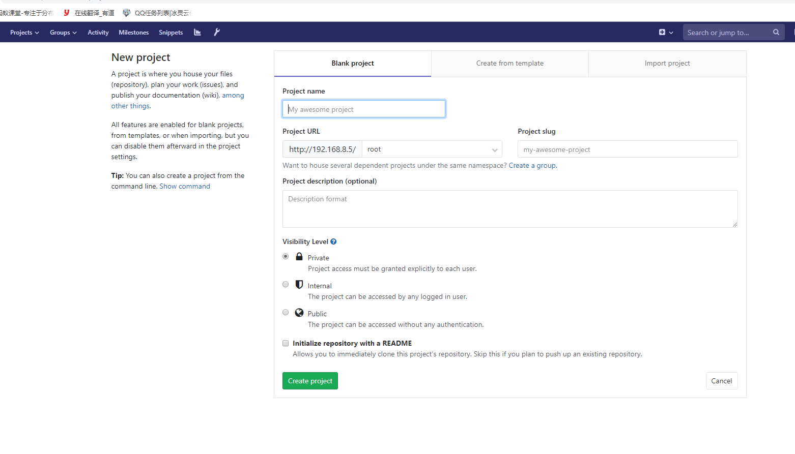
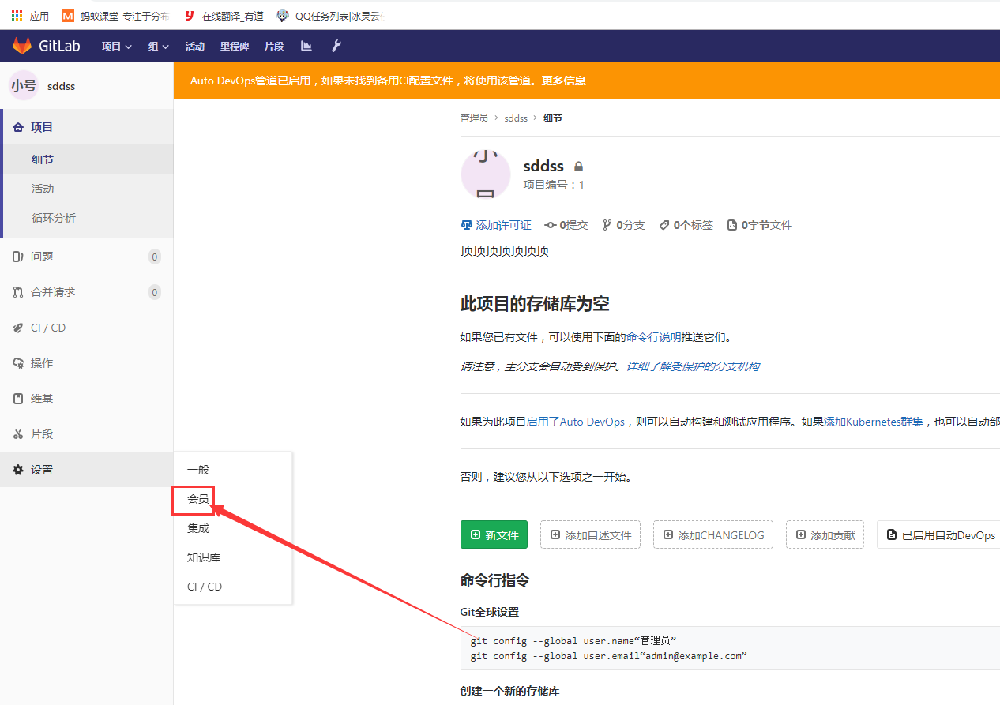
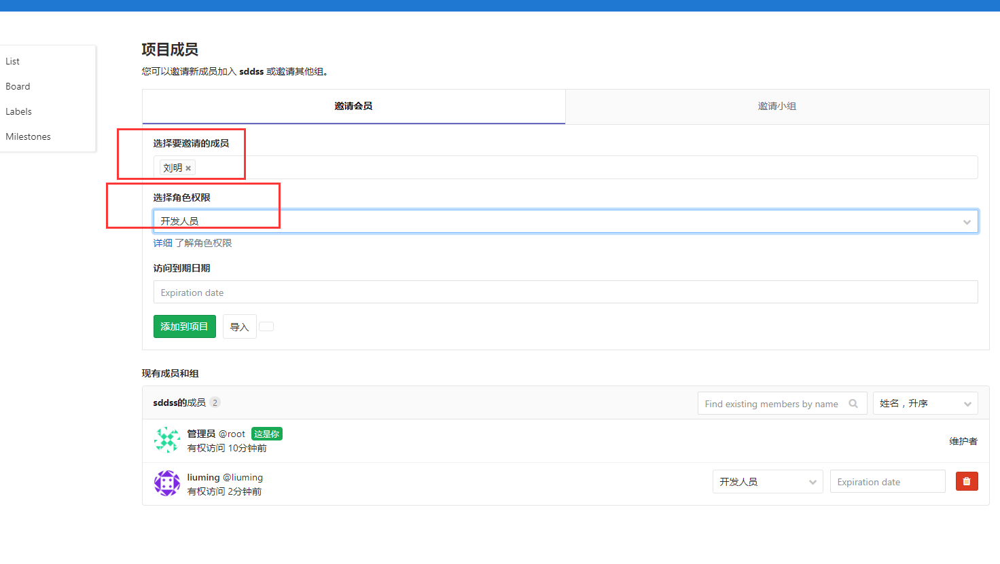
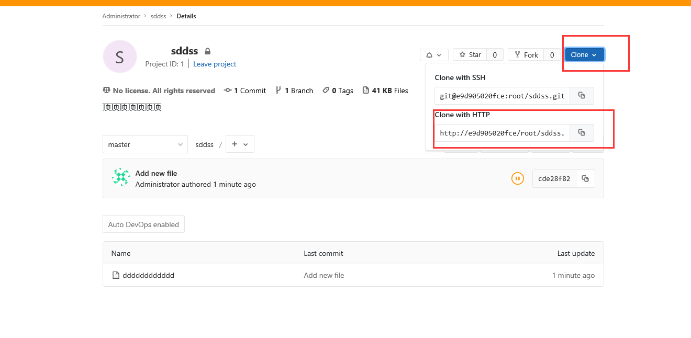

#
# Docker构建GitLab（至少内存2G以上建议4G）
# 1.下载镜像并启动
```
docker run --name='gitlab-ce' -d -p 10022:22 -p 80:80 --restart always --volume /opt/gitlab/config:/etc/gitlab --volume /opt/gitlab/logs:/var/log/gitlab --volume /opt/gitlab/data:/var/opt/gitlab/ gitlab/gitlab-ce
```
# 2.编辑gitlab.rb文件# 配置http协议所使用的访问地址external_url 'http://172.16.81.81' 这个ip地址改成你自己的

```
vi /opt/gitlab/config/gitlab.rb
```

  

# 3.编辑gitlab.yml
```
vi /opt/gitlab/data/gitlab-rails/etc/gitlab.yml
```

  

# 4.删除刚刚运行的gitlab容器
```
docker ps 查询容器id 

docker stop容器id 停止容器

docker rm 容器id 删除容器
重启docker服务  
sudo service docker restart


在启动
docker run --name='gitlab-ce' -d -p 10022:22 -p 80:80 --restart always --volume /opt/gitlab/config:/etc/gitlab --volume /opt/gitlab/logs:/var/log/gitlab --volume /opt/gitlab/data:/var/opt/gitlab/ gitlab/gitlab-ce

#查看执行日志  docker logs -f gitlab-ce
```

#### （等待一分钟左右）在浏览器中运行    192.168.8.5:80  设置新的密码在登陆下就可以了默认的用户名是root

  

# 5.测试 (创建一个空的项目用来测试)
  

#### 5.1.GitLab分配账号权限管理 
创建一个新的用户
  
#### 5.2.在打开一个浏览器登陆root用户在root用户下进行授权
  
  
  