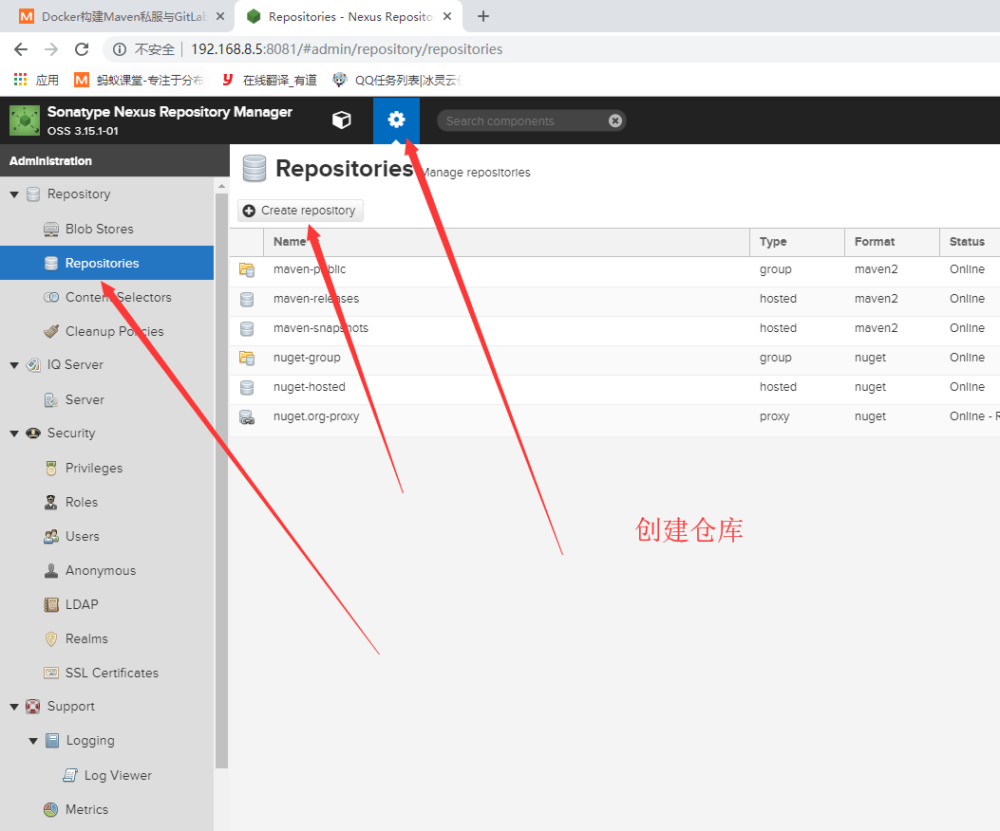
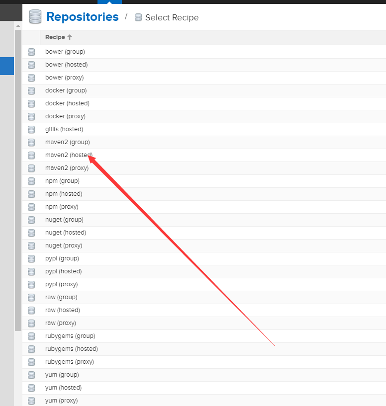
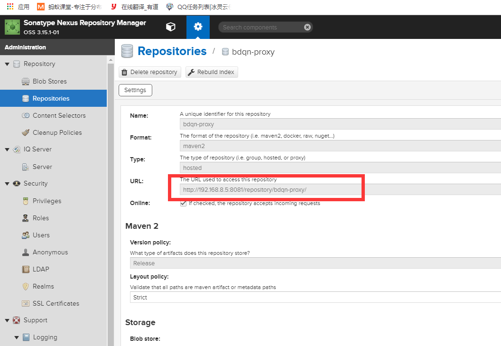
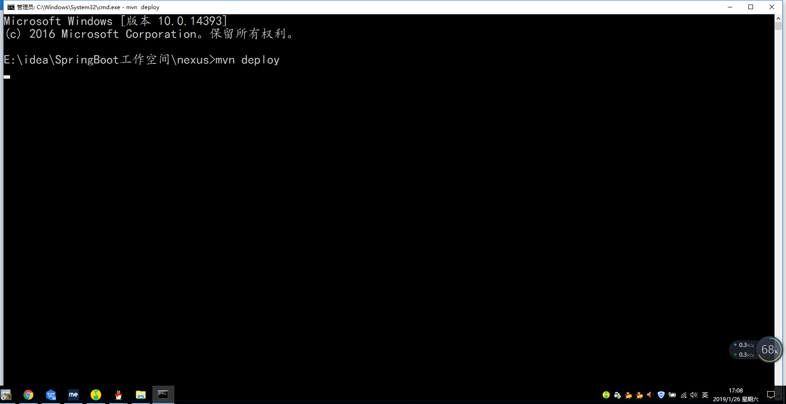
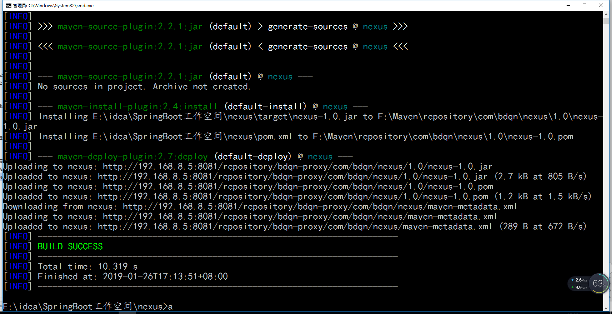
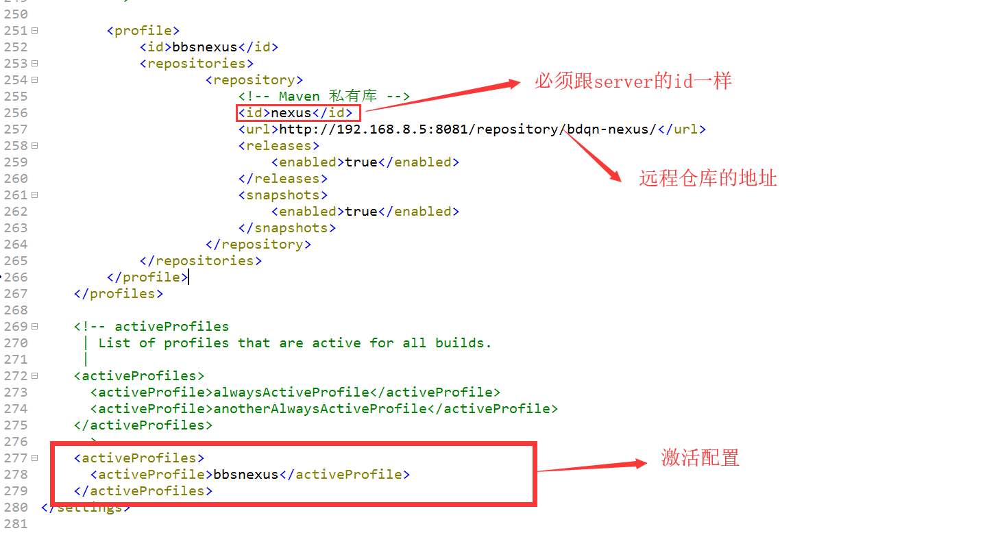

#
# 1.下载一个nexus3的镜像
```
docker pull sonatype/nexus3
```

# 2.将容器内部/var/nexus-data挂载到/root/nexus-data目录
```
docker run -d -p 8081:8081 --name nexus -v /root/nexus-data:/var/nexus-data --restart=always sonatype/nexus3
```
# 3.查看执行日志  docker logs -f nexus
如果一切成功的话，会显示如下日志信息。 
  
  
#### (大概需要等待1分钟左右)在访问http://你的ip地址:8081（默认密码是admin/admin123）
  

# 4.上传本地jar包到maven私服
####  4.1.创建仓库
  

  
  

####  4.2.创建用户并赋予权限 （权限你根据你自己的来）

  

####  4.3.配置C:\Users\Administrator\.m2下的settings.xml文件
```
    <server>
          <id>nexus</id>
          <username>root</username>
          <password>root</password>
    </server>
```
  

####  4.4.查看库的url
  

#### 4.5.配置你项目的pom.xml文件
```
<distributionManagement>
		<repository>
			<!-- id要跟settings里面配置的server的id一致 -->
			<id>nexus</id>
			<!-- maven私服仓库的url地址 -->
			<url>http://192.168.8.5:8081/repository/bdqn-proxy/</url>
		</repository>
	</distributionManagement>

	<build>
		<plugins>
		<!-- 发布代码jar插件 -->
			<plugin>
				<groupId>org.apache.maven.plugins</groupId>
				<artifactId>maven-deploy-plugin</artifactId>
				<version>2.7</version>
			</plugin>
			<!-- 发布源码插件 -->
			<plugin>
				<groupId>org.apache.maven.plugins</groupId>
				<artifactId>maven-source-plugin</artifactId>
				<version>2.2.1</version>
				<executions>
					<execution>
						<phase>package</phase>
						<goals>
							<goal>jar</goal>
						</goals>
					</execution>
				</executions>
			</plugin>
		</plugins>
	</build>
```

#### 注意事项 (注意问题版本不要有非法内容不然上传会失败)
  

#### `把杠改成.修改成这样或者<version>2.0</version>二个都试一下`

#### 4.6.打开项目的所在路径
  

#### 4.7.在项目下执行cmd运行     mvn deploy

  

##### 运行成功
  

#### 4.8.查看私服是否上传成功
  

# 5.全局配置setting.xml
```
<profile>
			<id>bbsnexus</id>
			<repositories>
					<repository>
						<!-- Maven 私有库 -->
						<id>nexus</id>
						<url>http://192.168.8.5:8081/repository/bdqn-nexus/</url>
						<releases>
							<enabled>true</enabled>
						</releases>
						<snapshots>
							<enabled>true</enabled>
						</snapshots>
					</repository>
			</repositories>
		</profile>


<activeProfiles>
      <activeProfile>bbsnexus</activeProfile>
</activeProfiles>
```

效果图

  

  pom.xml引入       把刚刚上传jar的项目删除，不然等下导入私服jar包的时候的时候会报错，一定要删除
  
  