#
## 1.Docker相关常用命令
```shell
systemctl stop firewalld.service  关闭防火墙
docker inspect 容器id  查询容器信息
docker stop 容器id  停止容器id
docker rm 容器id  删除容器id
systemctl restart  docker  重启docker容器
docker exec -it 容器ID /bin/bash 进入容器 
docker rm $(sudo docker ps -a -q) 删除所有未运行的容器
docker search elasticsearch 搜索镜像文件 
docker run 创建并启动一个容器，在run后面加上-d参数，则会创建一个守护式容器在后台运行。
docker ps -a 查看已经创建的容器
docker ps -s 查看已经启动的容器
docker start con_name 启动容器名为con_name的容器
docker stop con_name 停止容器名为con_name的容器
docker rm con_name 删除容器名为con_name的容器
docker rename old_name new_name 重命名一个容器
docker attach con_name 将终端附着到正在运行的容器名为con_name的容器的终端上面去，前提是创建该容器时指定了相应的sh
docker logs --tail="10" 容器名称   查询容器日志信息
```

## 2.Docker安装jenkins
#### 安装并运行jenkins
```shell
docker run -p 8080:8080 -p 50000:50000 -v jenkins_data:/var/jenkins_home jenkinsci/blueocean
```
#### 访问jenkins 8080
```shell
http://192.168.202.128:8080
```
#### 解锁Jenkins进入到内部容器
```shell
docker exec -it 容器ID /bin/bash 进入容器
```
#### 查询密钥
```shell
cat /var/jenkins_home/secrets/initialAdminPassword
```

  

  

  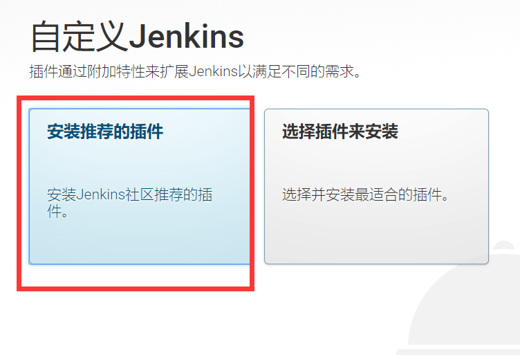

  

#### 配置SSH


#### 配置JDK和Maven环境

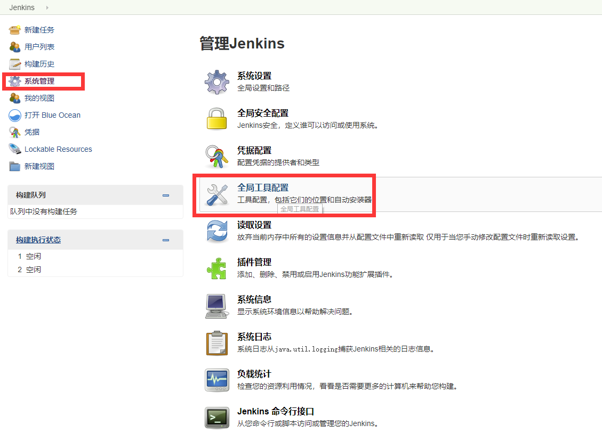

#### 进入到Jenkins容器中获取JDK地址  (一定要配置环境变量)
```java
echo $JAVA_HOME 
```
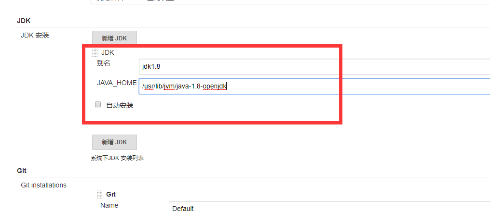

#### 安装Maven

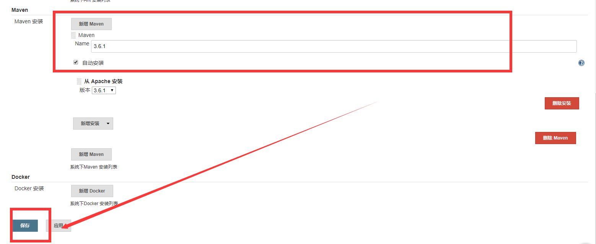

#### 安装Jenkins对应Maven插件Maven Integration

`找到系统管理-插件管理 点击 可选插件 找到如下maven插件的版本 插件名称为`

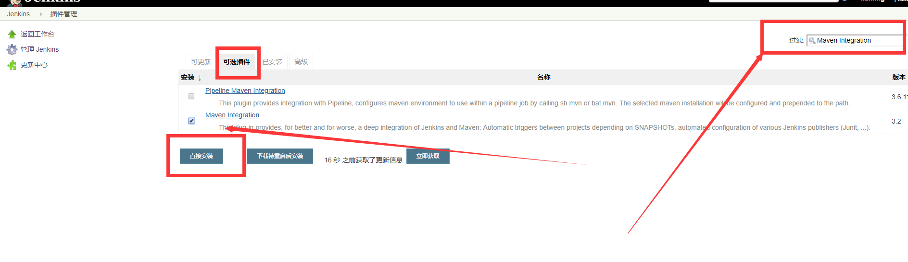

#### 新建任务


#### 安装主清单,在pom文件中新增（添加好了之后记得推送到码云）

```xml
	<build>
		<plugins>
			<plugin>
				<groupId>org.apache.maven.plugins</groupId>
				<artifactId>maven-compiler-plugin</artifactId>
				<configuration>
					<source>1.8</source>
					<target>1.8</target>
				</configuration>
			</plugin>
			<plugin>
				<groupId>org.springframework.boot</groupId>
				<artifactId>spring-boot-maven-plugin</artifactId>
				<configuration>
					<maimClass>com.itmayiedu.app.App</maimClass>
				</configuration>
				<executions>
					<execution>
						<goals>
							<goal>repackage</goal>
						</goals>
					</execution>
				</executions>
			</plugin>
		</plugins>
	</build>
```

  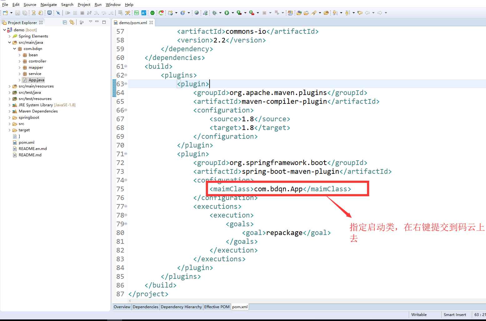

  #### 创建好任务之后如下操作


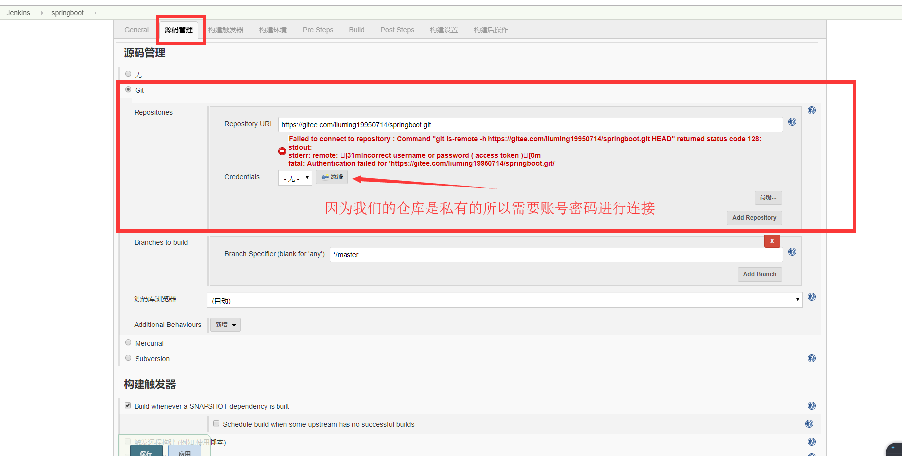

#### Git连接地址


#### 如果有父工程要先install父工程


#### 配置shell脚本


```shell
#!/bin/bash
#服务名称修改成你的任务名称就可以了
SERVER_NAME=springboot
#你打包后的jar名字可以根据以下的位置去查找
JAR_NAME=demo-0.0.1-SNAPSHOT
#源jar包的地址
JAR_PATH=/var/jenkins_home/workspace/springboot/target/
#二个一样的地址是包jar包移动到运行的jar目录
JAR_WORK_PATH=/var/jenkins_home/workspace/springboot/target/

echo "查询进程id-->$SERVER_NAME"
PID=`ps -ef | grep "$SERVER_NAME" | awk '{print $2}'`
echo "得到进程ID:$PID"
echo "结束进程"
for id in $PID
do
	kill -9 $id
	echo "killed $id"
done
echo "结束进程完成"

#复制jar包到执行目录
echo "复制jar到执行目录: cp $JAR_PATH/$JAR_NAME.jar $JAR_WORK_PATH"
cp $JAR_PATH/$JAR_NAME.jar $JAR_WORK_PATH
echo "复制jar包完成"
cd $JAR_WORK_PATH
#修改文件权限
chmod 755 $JAR_NAME.jar
java -jar $JAR_NAME.jar
```


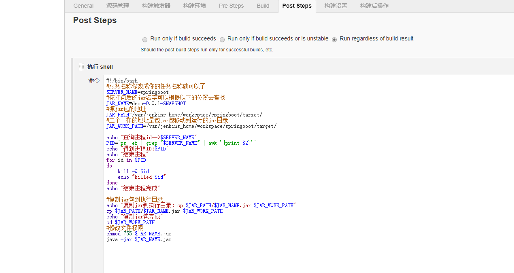

#### 执行完成后在点击立即构建这个时候需要进行容器映射，因为springboot的端口没有进行映射（结束程序重新启动）


#### 添加映射端口8088
```shell
docker run -p 8080:8080 -p 8088:8088 -p 50000:50000 -v jenkins_data:/var/jenkins_home jenkinsci/blueocean
```

#### 访问网页成功


#### 后台运行配置
`BUILD_ID=dontKillMe nohup java -jar $JAR_NAME.jar  &`


#### jenkins修改maven私服地址的settings.xml
进入到jenkins的docker的容器
```
路径地址:
cd  /var/jenkins_home/tools/hudson.tasks.Maven_MavenInstallation/3.6.1/conf
```


#### settings.xml配置
```xml
<?xml version="1.0" encoding="UTF-8"?>

<!--
Licensed to the Apache Software Foundation (ASF) under one
or more contributor license agreements.  See the NOTICE file
distributed with this work for additional information
regarding copyright ownership.  The ASF licenses this file
to you under the Apache License, Version 2.0 (the
"License"); you may not use this file except in compliance
with the License.  You may obtain a copy of the License at

    http://www.apache.org/licenses/LICENSE-2.0

Unless required by applicable law or agreed to in writing,
software distributed under the License is distributed on an
"AS IS" BASIS, WITHOUT WARRANTIES OR CONDITIONS OF ANY
KIND, either express or implied.  See the License for the
specific language governing permissions and limitations
under the License.
-->

<!--
 | This is the configuration file for Maven. It can be specified at two levels:
 |
 |  1. User Level. This settings.xml file provides configuration for a single user,
 |                 and is normally provided in ${user.home}/.m2/settings.xml.
 |
 |                 NOTE: This location can be overridden with the CLI option:
 |
 |                 -s /path/to/user/settings.xml
 |
 |  2. Global Level. This settings.xml file provides configuration for all Maven
 |                 users on a machine (assuming they're all using the same Maven
 |                 installation). It's normally provided in
 |                 ${maven.home}/conf/settings.xml.
 |
 |                 NOTE: This location can be overridden with the CLI option:
 |
 |                 -gs /path/to/global/settings.xml
 |
 | The sections in this sample file are intended to give you a running start at
 | getting the most out of your Maven installation. Where appropriate, the default
 | values (values used when the setting is not specified) are provided.
 |
 |-->
<settings xmlns="http://maven.apache.org/SETTINGS/1.0.0"
          xmlns:xsi="http://www.w3.org/2001/XMLSchema-instance"
          xsi:schemaLocation="http://maven.apache.org/SETTINGS/1.0.0 http://maven.apache.org/xsd/settings-1.0.0.xsd">
  <!-- localRepository
   | The path to the local repository maven will use to store artifacts.
   |
   | Default: ${user.home}/.m2/repository
  <localRepository>/path/to/local/repo</localRepository>
  -->
  <localRepository>E:\apache-maven-3.6.1\repository</localRepository>

  <!-- interactiveMode
   | This will determine whether maven prompts you when it needs input. If set to false,
   | maven will use a sensible default value, perhaps based on some other setting, for
   | the parameter in question.
   |
   | Default: true
  <interactiveMode>true</interactiveMode>
  -->

  <!-- offline
   | Determines whether maven should attempt to connect to the network when executing a build.
   | This will have an effect on artifact downloads, artifact deployment, and others.
   |
   | Default: false
  <offline>false</offline>
  -->

  <!-- pluginGroups
   | This is a list of additional group identifiers that will be searched when resolving plugins by their prefix, i.e.
   | when invoking a command line like "mvn prefix:goal". Maven will automatically add the group identifiers
   | "org.apache.maven.plugins" and "org.codehaus.mojo" if these are not already contained in the list.
   |-->
  <pluginGroups>
    <!-- pluginGroup
     | Specifies a further group identifier to use for plugin lookup.
    <pluginGroup>com.your.plugins</pluginGroup>
    -->
  </pluginGroups>

  <!-- proxies
   | This is a list of proxies which can be used on this machine to connect to the network.
   | Unless otherwise specified (by system property or command-line switch), the first proxy
   | specification in this list marked as active will be used.
   |-->
  <proxies>
    <!-- proxy
     | Specification for one proxy, to be used in connecting to the network.
     |
    <proxy>
      <id>optional</id>
      <active>true</active>
      <protocol>http</protocol>
      <username>proxyuser</username>
      <password>proxypass</password>
      <host>proxy.host.net</host>
      <port>80</port>
      <nonProxyHosts>local.net|some.host.com</nonProxyHosts>
    </proxy>
    -->
  </proxies>

  <!-- servers
   | This is a list of authentication profiles, keyed by the server-id used within the system.
   | Authentication profiles can be used whenever maven must make a connection to a remote server.
   |-->
  <servers>
  	<server>
	  <id>nexus-snapshots</id>
	  <username>admin</username>
	  <password>admin123</password>
	</server>
	<server>
	   <id>nexus-release</id>
	   <username>admin</username>
	   <password>admin123</password>
	</server>
    <!-- server
     | Specifies the authentication information to use when connecting to a particular server, identified by
     | a unique name within the system (referred to by the 'id' attribute below).
     |
     | NOTE: You should either specify username/password OR privateKey/passphrase, since these pairings are
     |       used together.
     |
    <server>
      <id>deploymentRepo</id>
      <username>repouser</username>
      <password>repopwd</password>
    </server>
    -->

    <!-- Another sample, using keys to authenticate.
    <server>
      <id>siteServer</id>
      <privateKey>/path/to/private/key</privateKey>
      <passphrase>optional; leave empty if not used.</passphrase>
    </server>
    -->
  </servers>

  <!-- mirrors
   | This is a list of mirrors to be used in downloading artifacts from remote repositories.
   |
   | It works like this: a POM may declare a repository to use in resolving certain artifacts.
   | However, this repository may have problems with heavy traffic at times, so people have mirrored
   | it to several places.
   |
   | That repository definition will have a unique id, so we can create a mirror reference for that
   | repository, to be used as an alternate download site. The mirror site will be the preferred
   | server for that repository.
   |-->
  <mirrors>
  	 <mirror>
	    <id>nexus</id>
		<name>nexus mirror</name>
		<mirrorOf>*</mirrorOf>
		<url>http://nexus.ratta.com.cn/nexus/content/groups/public/</url>
	 </mirror>
    <!-- mirror
     | Specifies a repository mirror site to use instead of a given repository. The repository that
     | this mirror serves has an ID that matches the mirrorOf element of this mirror. IDs are used
     | for inheritance and direct lookup purposes, and must be unique across the set of mirrors.
     |
    <mirror>
      <id>mirrorId</id>
      <mirrorOf>repositoryId</mirrorOf>
      <name>Human Readable Name for this Mirror.</name>
      <url>http://my.repository.com/repo/path</url>
    </mirror>
     
	 <mirror>  
      <id>repo2</id>  
      <mirrorOf>central</mirrorOf>  
      <name>Human Readable Name for this Mirror.</name>  
      <url>http://repo2.maven.org/maven2/</url>  
	</mirror>  
	<mirror>
		  <id>net-cn</id>  
		  <mirrorOf>central</mirrorOf>  
		  <name>Human Readable Name for this Mirror.</name>  
		  <url>http://maven.net.cn/content/groups/public/</url>   
	</mirror>  
	<mirror>  
		  <id>ui</id>  
		  <mirrorOf>central</mirrorOf>  
		  <name>Human Readable Name for this Mirror.</name>  
		 <url>http://uk.maven.org/maven2/</url>  
	</mirror>  
	<mirror>  
		  <id>ibiblio</id>  
		  <mirrorOf>central</mirrorOf>  
		  <name>Human Readable Name for this Mirror.</name>  
		 <url>http://mirrors.ibiblio.org/pub/mirrors/maven2/</url>  
	</mirror>  
	<mirror>  
		  <id>jboss-public-repository-group</id>  
		  <mirrorOf>central</mirrorOf>  
		  <name>JBoss Public Repository Group</name>  
		 <url>http://repository.jboss.org/nexus/content/groups/public</url>  
	</mirror>
	
	<mirror>
      <id>mirrorId</id>
      <mirrorOf>repositoryId</mirrorOf>
      <name>Human Readable Name for this Mirror.</name>
      <url>http://my.repository.com/repo/path</url>
    </mirror>
-->
  </mirrors>

  <!-- profiles
   | This is a list of profiles which can be activated in a variety of ways, and which can modify
   | the build process. Profiles provided in the settings.xml are intended to provide local machine-
   | specific paths and repository locations which allow the build to work in the local environment.
   |
   | For example, if you have an integration testing plugin - like cactus - that needs to know where
   | your Tomcat instance is installed, you can provide a variable here such that the variable is
   | dereferenced during the build process to configure the cactus plugin.
   |
   | As noted above, profiles can be activated in a variety of ways. One way - the activeProfiles
   | section of this document (settings.xml) - will be discussed later. Another way essentially
   | relies on the detection of a system property, either matching a particular value for the property,
   | or merely testing its existence. Profiles can also be activated by JDK version prefix, where a
   | value of '1.4' might activate a profile when the build is executed on a JDK version of '1.4.2_07'.
   | Finally, the list of active profiles can be specified directly from the command line.
   |
   | NOTE: For profiles defined in the settings.xml, you are restricted to specifying only artifact
   |       repositories, plugin repositories, and free-form properties to be used as configuration
   |       variables for plugins in the POM.
   |
   |-->
  <profiles>
   <profile>
	   <id>nexus</id>
	   <repositories>
	      <repository>
		     <id>nexus</id>
			 <name>nexus</name>
			 <url>http://nexus.ratta.com.cn/nexus/content/groups/public/</url>
			 <releases><enabled>true</enabled></releases>
			 <snapshots><enabled>true</enabled></snapshots>
		  </repository>
	   </repositories>
	   <pluginRepositories>
	     <pluginRepository>
		    <id>nexus</id>
			<name>nexus</name>
			<url>http://nexus.ratta.com.cn/nexus/content/groups/public/</url>
			<releases><enabled>true</enabled></releases>
			<snapshots><enabled>true</enabled></snapshots>
		 </pluginRepository>
	   </pluginRepositories>
	</profile>
    <!-- profile
     | Specifies a set of introductions to the build process, to be activated using one or more of the
     | mechanisms described above. For inheritance purposes, and to activate profiles via <activatedProfiles/>
     | or the command line, profiles have to have an ID that is unique.
     |
     | An encouraged best practice for profile identification is to use a consistent naming convention
     | for profiles, such as 'env-dev', 'env-test', 'env-production', 'user-jdcasey', 'user-brett', etc.
     | This will make it more intuitive to understand what the set of introduced profiles is attempting
     | to accomplish, particularly when you only have a list of profile id's for debug.
     |
     | This profile example uses the JDK version to trigger activation, and provides a JDK-specific repo.
    <profile>
      <id>jdk-1.4</id>

      <activation>
        <jdk>1.4</jdk>
      </activation>

      <repositories>
        <repository>
          <id>jdk14</id>
          <name>Repository for JDK 1.4 builds</name>
          <url>http://www.myhost.com/maven/jdk14</url>
          <layout>default</layout>
          <snapshotPolicy>always</snapshotPolicy>
        </repository>
      </repositories>
    </profile>
    -->

    <!--
     | Here is another profile, activated by the system property 'target-env' with a value of 'dev',
     | which provides a specific path to the Tomcat instance. To use this, your plugin configuration
     | might hypothetically look like:
     |
     | ...
     | <plugin>
     |   <groupId>org.myco.myplugins</groupId>
     |   <artifactId>myplugin</artifactId>
     |
     |   <configuration>
     |     <tomcatLocation>${tomcatPath}</tomcatLocation>
     |   </configuration>
     | </plugin>
     | ...
     |
     | NOTE: If you just wanted to inject this configuration whenever someone set 'target-env' to
     |       anything, you could just leave off the <value/> inside the activation-property.
     |
    <profile>
      <id>env-dev</id>

      <activation>
        <property>
          <name>target-env</name>
          <value>dev</value>
        </property>
      </activation>

      <properties>
        <tomcatPath>/path/to/tomcat/instance</tomcatPath>
      </properties>
    </profile>
    -->
  </profiles>
  <activeProfiles>
    <activeProfile>nexus</activeProfile>
  </activeProfiles>
  <!-- activeProfiles
   | List of profiles that are active for all builds.
   |
  <activeProfiles>
    <activeProfile>alwaysActiveProfile</activeProfile>
    <activeProfile>anotherAlwaysActiveProfile</activeProfile>
  </activeProfiles>
  -->
</settings>

```

#### 后端开发环境配置jenkins
  

  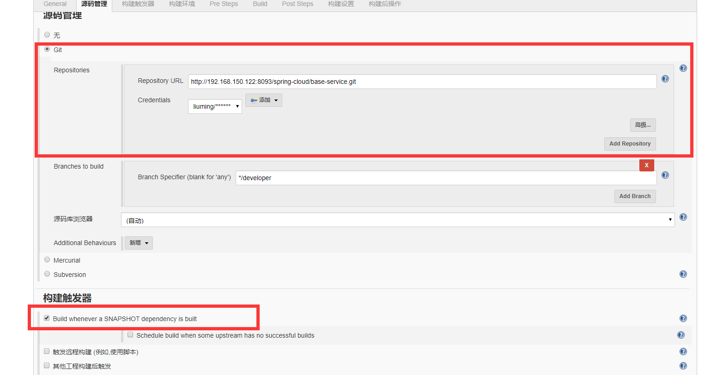

  

  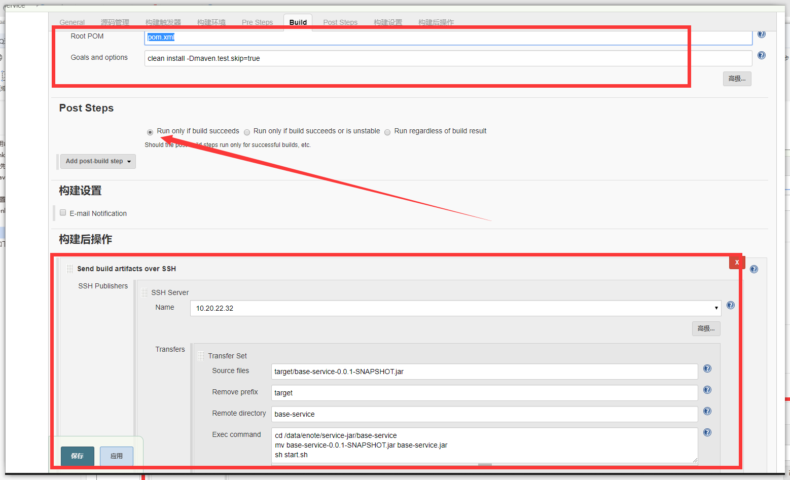

  `ERROR: Exception when publishing, exception message [Exec timed out or was interrupted after 120,000`

  `最近用jenkins打包时，用了Send build artifacts over SSH插件的项目，偶发性的会出现这个问题。查了很久原因。`

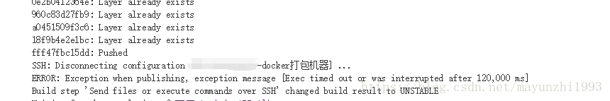

`最后发现是Exec timeout (ms)这个设置导致的。系统给设置了默认脚本执行的超时时间12000ms，因为我这段命令执行的是docker打包和上传等命令，因为网络的缘故，偶尔会执行超过2分钟。就会给我挂断。改大一些兼容时间过长的情况就好了。`

  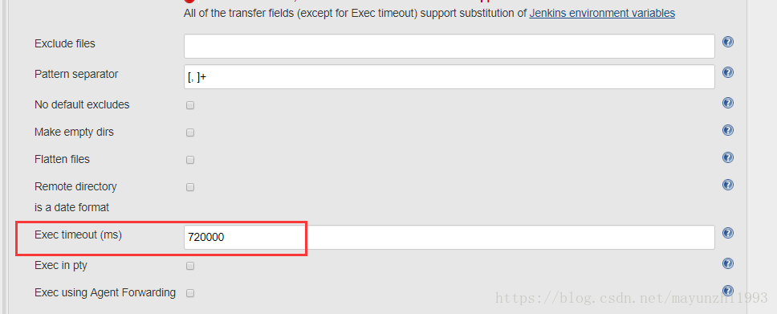

#### 环境下配置如下启动jar配置
  

  #### stop.sh
  ```shell
  #!/bin/bash
  ps -ef | grep system-base-service.jar |grep -v grep | awk '{print $2}'|xargs kill -9 &
  ```
  #### start.sh
  ```shell
  source /data/enote/.bash_profile
cd /data/enote/service-jar/system-base-service
nohup java -jar system-base-service.jar  -Xms=256m -Xmx=512m >/dev/null 2>/dev/null &

printf "\n start system-base-service，please wait..."
while [ 1 ] ; do
   num=`netstat -an  | grep -c 8074`
   if [ $num -ge 1 ]; then
      echo "OK!"
      exit 0;
   fi
   printf "."
   sleep 2
done

exit 0
  ```
  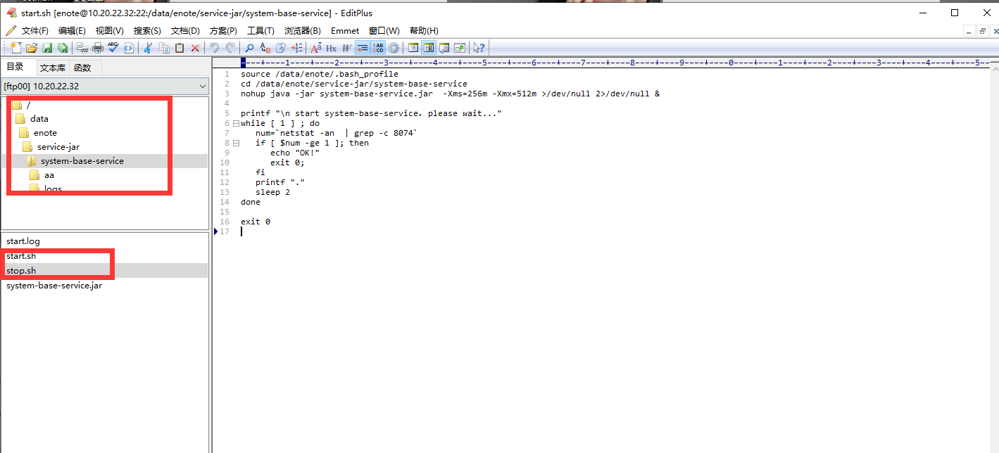

#### 前端开发环境配置jenkins
#### 配置git打包后的服务器地址
  

#### 选中自由风格的项目：
  

  

#### Git地址：
  

#### Shell脚本

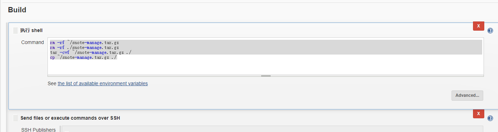

```shell
rm -rf ~/snote-manage.tar.gz
rm -rf ./snote-manage.tar.gz
tar -cvf ~/snote-manage.tar.gz ./
cp ~/snote-manage.tar.gz ./
```


#### 后面最关键你需要在  /data/enote/service-jar/web/  目录下创建一个config 你要复制前端配置接口地址的配置文件

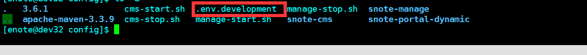

#### manage-stop.sh
```shell
#!/bin/bash
for pid in `ps -ef | grep snote-manage | grep -v grep | awk '{print $2}'`
do
   kill -9 $pid
done

  num=`netstat -an  | grep -w 9528 | grep -w  "LISTEN" | wc -l`
  if [ $num -ge 0 ]; then
       printf "\n stop snote-manage OK!"
     
   fi
#cd /data/enote/service-jar/web
#mv snote-manage snote-manage-bak
#mkdir snote-manage
#rm -rf snote-manage-bak
```
#### manage-start.sh
```shell
#!/bin/bash
cd /data/enote/service-jar/web/snote-manage

#stop
#./stop_cdclient.sh

#sleep 2
#mkdir -p config
#backup config
#mv .env.development config/

#update
tar -xvf snote-manage.tar.gz
#update config
cp -r /data/enote/service-jar/web/config/snote-manage/.env.development .

#start
source ~/.bash_profile
echo "begin install..."
npm install
echo "start.."
nohup npm run dev >/dev/null 2>./start.log &
printf "\n"

#check
printf "\n start snote-manage，please wait..."
while [ 1 ] ; do
   num=`netstat -an  | grep -w 9528 | grep -w  "LISTEN" | wc -l`
   # num=`ps -ef |grep supernotes-front-service| grep -v "grep" | wc -l`
   if [ $num -ge 1 ]; then
      echo "OK!"
      break;
   fi
   printf "please wait!"
   sleep 2
done

echo "clean cache"
rm -rf ./snote-manage.tar.gz
```
#### .env.development
```shell
# just a flag
ENV = 'development'

# base api
VUE_APP_BASE_API = 'http://2187mb1668.iask.in/'
#VUE_APP_BASE_API = 'http://192.168.120.179:9000/'
#VUE_APP_BASE_API = 'http://10.20.22.32:9000/'   

# vue-cli uses the VUE_CLI_BABEL_TRANSPILE_MODULES environment variable,
# to control whether the babel-plugin-dynamic-import-node plugin is enabled.
# It only does one thing by converting all import() to require().
# This configuration can significantly increase the speed of hot updates,
# when you have a large number of pages.
# Detail:  https://github.com/vuejs/vue-cli/blob/dev/packages/@vue/babel-preset-app/index.js

VUE_CLI_BABEL_TRANSPILE_MODULES = true
```

#### 在到web目录下你创建一个你项目的名字snote-manage 在到snote-manage目录下配置一个启动文件和一个停止文件

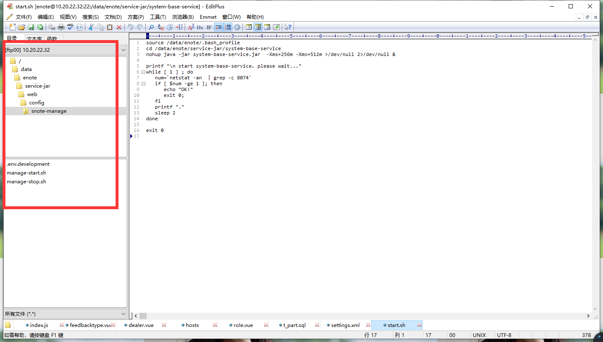

#### 前端开发环境配置jenkins 二（如果出现前端启动很慢可以采用以下配置方式）

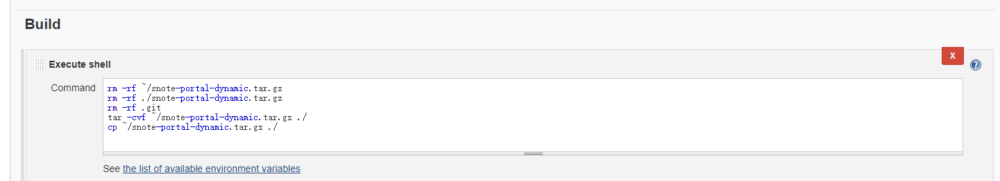


`配置文件与上面的不一致，所以这个配置文件也要加上`

#### start.sh
```shell
#!/bin/bash
cd /data/enote/service-jar/web/snote-portal-dynamic
tar -xvf snote-portal-dynamic.tar.gz
#cp -r config/app.js_bak config/app.js
#cp -r config/vue.config.js ./vue.config.js
source ~/.bash_profile
echo "begin start!"
#npm install
npm run serve >/dev/null 2>./start.log &
sleep 8
cat start.log | tail -300
echo "start end!"
```
#### stop.sh
```shell
#!/bin/bash
pid=$(ps -ef | grep snote-portal-dynamic | grep -v grep | awk '{print $2}')
kill -9 $pid
cd /data/enote/service-jar/web/snote-portal-dynamic
rm -rf snote-portal-dynamic.tar.gz
echo "stop end!"
```